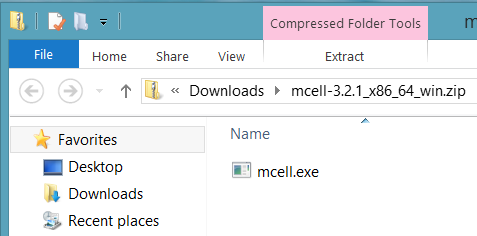
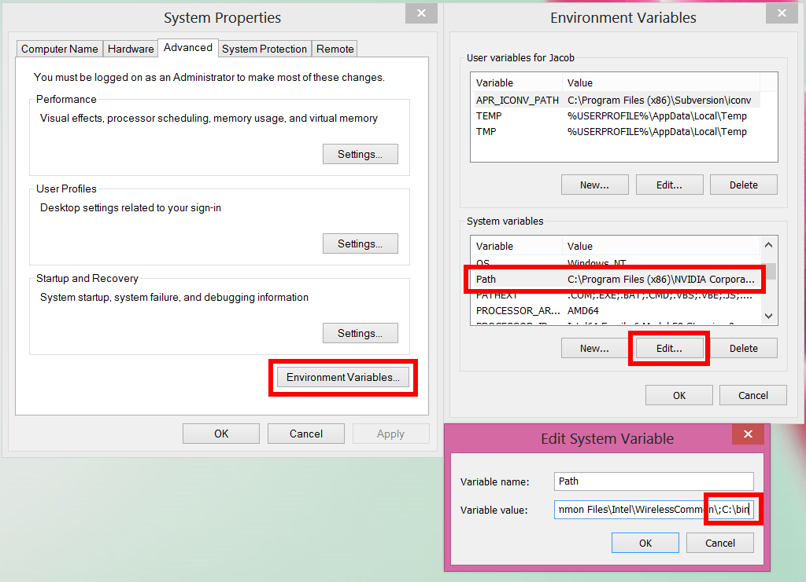

.. _install:

+++++++++++++++++++++++++++++++++++++++++++++
Installing MCell and CellBlender
+++++++++++++++++++++++++++++++++++++++++++++

.. _mcell_install:

*********************************************
MCell Installation
*********************************************

MCell Overview
---------------------------------------------

MCell is available for Linux, OS X, and Windows. In the past, MCell was run
exclusively from the command line. With the development of CellBlender, this is
no longer necessary (although it can still be very useful). MCell, by itself,
does not have a graphical user interface and cannot be run by double-clicking
an icon. Also, there is no installer unlike many Windows applications.

Download MCell (All Platforms)
---------------------------------------------

Download the desired binary file for your system (e.g., MCell v. |release| for
Linux x86) from the `MMBioS web site`_.

.. _MMBioS web site: http://mmbios.org/index.php/mcell-3-2-1-download

.. _mcell_install_windows:

Installing MCell (Windows)
---------------------------------------------

Extract MCell (Windows)
=============================================

Open the zipped Windows binary through the browser (shown here with Google
Chrome).

.. image:: ./images/install/download_mcell.png

Windows `File Explorer`_ should appear, displaying the MCell binary (mcell.exe)
within the zipped file.

.. _File Explorer: http://en.wikipedia.org/wiki/File_Explorer

Drag and drop the binary to a new folder. For this example, we will create a
new folder in the top level C directory called bin (i.e. C:\\bin). To create a
new directory, right click on the background in File Explorer, select
**New->Folder**, type the name of the folder (e.g. bin), and hit **Enter**.

.. image:: ./images/install/new_folder.png

Put MCell in a PATH Directory (Windows)
=============================================

This step is optional but is highly recommended if you will be running MCell
from the command line (i.e. without CellBlender). First, right click on
**Computer** and select **Properties**.

.. image:: ./images/install/computer_properties.png

In the new window, click the **Advanced system settings** button.

.. image:: ./images/install/advanced_settings.png

Then click the **Environment Variables** button in the **System Properties**
window. In the **Environment Variables** window, select the **Path** entry in
the list of **System Variables**, and hit the **Edit** button. At the end of
the list of **Variable values**, add ``;C:\bin\``. If you extracted MCell into
a directory besides "C:\\bin\\", use that instead. Also, be sure to use the
initial semicolon and the trailing backslash.

Test MCell (Windows)
=============================================

To run MCell in Windows without CellBlender, we are going to use `PowerShell`_,
which is included with Windows 7 and 8. Alternatively, you could use the
`Command Prompt`_, but we will not cover that here. To run PowerShell, hit the
Windows key, type **powershell**, and hit **Enter** (Windows 8 pictured below).

.. _PowerShell: http://en.wikipedia.org/wiki/Powershell

.. _Command Prompt: http://en.wikipedia.org/wiki/Command_Prompt

.. image:: ./images/install/power_shell_launch.png

Windows PowerShell will now appear on the screen. Type **mcell.exe** and hit
**Enter**. If you see the following text on your screen, you have set up your
PATH correctly.

.. image:: ./images/install/power_shell_use.png

.. _mcell_install_linux_osx:

Installing MCell (Linux/OS X)
---------------------------------------------

Extract MCell (Linux/OS X)
=============================================

The binary file that you download is a compressed file with a name that ends in
".gz". Open a terminal and navigate to where the file was downloaded (e.g. ``cd
/home/user/Downloads``). Alternatively, you can do this through a GUI file
manager like Nautilus in Ubuntu, but we won't show that here.

Now, unzip the file by typing the following at the command line::

    gunzip mcell-3.2.1_x86.gz

If this succeeds, the file will no longer have the ".gz" suffix.

Rename and Make Executable (Linux/OS X)
=============================================

Rename the file to something more convenient and make it executable, e.g.,

::

    mv mcell-3.2.1_x86 mcell
    chmod a+x mcell

Put MCell in a PATH Directory (Linux/OS X)
=============================================

Depending on your preferences, you may want to put the resulting executable
binary in an appropriate place for yourself or all the users of the machine
(e.g., ``sudo mv mcell /usr/local/bin`` if you have root privileges). If you do
not have root privileges, then you can put it in your home directory (e.g.
``mkdir /home/user/bin; mv mcell home/user/bin`` where **user** is your user
name). However, you need to make sure that the directory you put it in is
either in your PATH_ or that you add it to your PATH. You can add it to your
PATH by typing ``export PATH=$PATH:/home/user/bin`` (once again, **user**
should be your user name). To make this change permanent, add this command to
the **.bash_profile** file located in your home directory. If this file does
not exist, create it and add the line.

.. _PATH: https://en.wikipedia.org/wiki/PATH_%28variable%29

Test MCell (Linux/OS X)
=============================================

Verify that MCell is working by typing the following at the terminal::

    mcell

If you have successfully put MCell in your PATH, you should see a startup
message followed by an error that indicates no MDL (Model Description Language)
file has been specified.

.. _cellblender_install:

*********************************************
CellBlender Installation (All Platforms)
*********************************************

Installing CellBlender
---------------------------------------------

Startup Blender and go to the **File->User Preferences** menu. In the **User
Preferences** control panel choose the **Addons** tab. Click the **Install from
File** button at the bottom of the window. Navigate to the unextracted zip file
that you downloaded (cellblender_v1.0_RC.zip), select it, and click the
**Install from File** button near the upper-right hand corner.

.. note::

    If you need to install a newer version of CellBlender, the installation
    process is the same. The new version of CellBlender should cleanly install
    over the existing version.

Activating CellBlender in Blender
---------------------------------------------

Scroll down until you see **Cell Modeling: CellBlender** and select the
checkbox to enable it. Then, click **Save as Default** to enable the addon
permanently in Blender.
