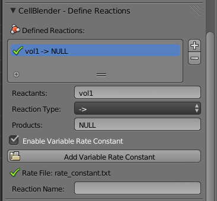

.. _variable_rxn_rates:

*********************************************
Variable Rate Constants
*********************************************

.. Git Repo SHA1 ID: 3520f8694d61c81424ff15ff9e7a432e42f0623f

.. note::

    The simulations and visualizations in this tutorial were generated using
    Blender 2.70a and CellBlender 1.0. It may or may not work with other
    versions.

In this tutorial, you will learn how to use a rate constant that varies with
respect to time.

Create Variable Rate Constant Text File
---------------------------------------------

Using any text editor, create a new file called **rate_constant.txt**. Add the
following text in the file::

    0      0
    5E-4   1E4

The first column is the time (seconds), and the second column is the rate
constant at that time. The units for the reaction rate are the same as used
earlier in the :ref:`reactions` section. 

The example shown above is a very simple case where the reaction only changes
once. You could just as well have it change every time step, like this::

    0      0
    1E-6   1.0E5
    2E-6   1.1E5
    3E-6   1.2E5
    ...

Save the file and quit.

Set Project Directory
---------------------------------------------

Now start Blender. Hit the **Scene** button in the **Properties Editor**. 

.. image:: ./images/scene_button.png

Let's save the file (and set the project directory) right now by hitting
**Ctrl-s**, typing **~/mcell_tutorial/var_rate_constant** (or
**C:\\mcell_tutorial\\var_rate_constant** on Windows) into the directory field,
**var_rate_constant.blend** into the file name field, and hit the **Save As
Blender File** button.

Set Project Parameters
---------------------------------------------

Set the following parameters:

* Set the **Iterations** to **1000**.
* Set the **Time Step** to **1e-6**.
* Add the default **Cube** to the **Model Objects** list.
* Create a volume molecule called **vol1** with a diffusion constant of
  **1e-6**.
* Create a release site with the following properties:

  * Set the **Site Name** to **vol1_rel**.
  * Set the **Molecule** to **vol1**.
  * Set the **Release/Shape** to **Object/Region**.
  * Set the **Object/Region** to **Cube**.
  * Set the **Quantity to Release** to **1000**.

* Set **Export All** under **Visualization Output Settings**.

Create Reaction with Variable Rate Constant
---------------------------------------------

Under the **Define Reactions**, hit the **+** button. Then set the following
parameters:

* Set **Reactants** to **vol1**.
* Set **Products** to **NULL**.
* Click the **Enable Variable Rate Constant** check box.
* Hit the **Add Variable Rate Constant** button.
* Navigate to the **rate_constant.txt** file and select it.

A green check mark should appear next to the file name if everything worked
correctly.

Run and Visualize the Simulation
---------------------------------------------

Under the **Run Simulation** panel, hit the **Run Simulation** button. Then hit
the **Read Viz Data** button under the **Visualize Simulation Results** button.
Hit **Alt-a** to begin playing the animation.

For the first 500 iterations of the simulation, the molecules will diffuse
around in the box undisturbed. After that point, they will begin to disappear.
By the end of the simulation, almost all of them will be gone.
