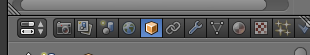
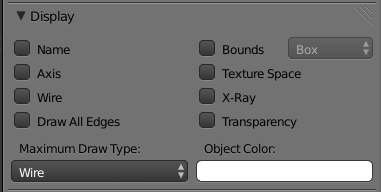
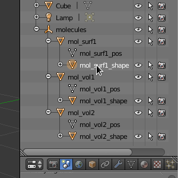
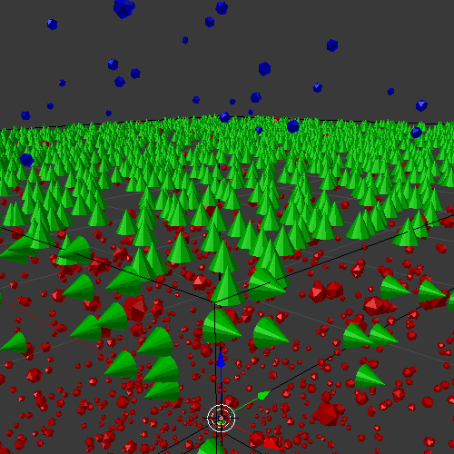

.. _examine_output:

*********************************************
Visualize and Plot the Output
*********************************************

.. Git Repo SHA1 ID: a1abdd291b75176d6581df41329781ae5d5e1b7d

.. note::

    The simulations and visualizations in this tutorial were generated using
    Blender 2.70a and CellBlender 1.0. It may or may not work with other
    versions.

At the end of the last section, we ran the MCell simulation from within
CellBlender. This generated visualization and reaction data (i.e. molecule
counts), which we will now examine using CellBlender and some plotting
software. 

.. _visualize_molecules:

Visualize the Molecules
=============================================

If you closed the **intro.blend** file that we generated in
:ref:`getting_started`, reopen it now (**blender intro.blend**). Then click the
**Scene** button in the **Properties Editor**. Expand the **Visualize
Simulation Results** panel and click the **Read Viz Data** button.

.. image:: ./images/visualize_plot/read_viz_data.png

You should now see a number of molecules populating the surface of the
**Cube**.

Let's change the **Cube** to a wireframe view so we can see inside of it.
First, be sure that the cube is selected (orange outline). Then click the
**Object** button on the **Properties Editor**.
 

Under the **Display** panel, change **Maximum Draw Type** to **Wire**.

Drag the green bar on the **Timeline Editor** back and forth to scrub through
the simulation. You can see the molecules diffusing in and on surface of the
cube, and new molecules being created outside the cube.

.. _custom_glyphs:

Customize Molecule Glyphs
=============================================

By default, every molecule just shows up as a sphere. This might be fine for
volume molecules, but you might want to be able to tell the orientation of your
surface molecules, which we can do by using an asymmetrical glyph.

Expand **molecules** in the **Outliner** by clicking the small **+** sign
beside it. This expands to reveal **mol_surf1**, **mol_vol1**, and
**mol_vol2**. These correspond to the molecules we created in our simulation:
**surf1**, **vol1**, and **vol2**. 

.. image:: ./images/vp_outliner1.png

If you click the plus beside each of these, you will see **mol_surf1_shape**,
**mol_vol1_shape**, and **mol_vol2_shape**. These are the actual glyph objects
that get mapped onto the molecule locations. Select **mol_surf1_shape** in the
**Outliner**.

The molecules are probably hard to see, so let's fix this problem. In the **3D
View Editor**, hit **s**, **3**, and **Enter** to increase the size of
**mol_surf1_shape** three times. Repeat this process for **mol_vol1_shape** and
**mol_vol2_shape**. Everything should be a little easier to see now.
Regardless, you may want to zoom in to get an even better view of them (roll
the middle mouse wheel up in the **3D View Editor**).

.. image:: ./images/vp_scaled_glyphs.png

Now let's get back to updating the glyph for **surf1**. Reselect,
**mol_surf1_shape** in the **Properties Editor**. Then click the **Material**
button and navigate down to **Molecule Shape**.

.. image:: ./images/vp_material.png

The shape should be set to **Cone** in the **Molecule Shape** drop down box. Click
**Set Molecule Shape** to apply the selection.

.. image:: ./images/vp_set_molecule_shape.png

All of the **surf1** molecule glyphs should now be changed to cones.

.. _graph_rxn_data:

Graph the Reaction Data inside Blender
=============================================

CellBlender allows users to plot reaction data (molecule and reaction counts)
from within Blender itself. This requires the installation of optional external
applications (currently matplotlib or xmgrace).

.. note::

   CellBlender will attempt to autodetect the presence of these by seeing if
   they are in your PATH (and that the required modules are accessible in the
   

You can see which plotting applications are currently installed by checking the
**Reaction Output Settings** panel shown here:

.. image:: ./images/visualize_plot/plot.png

In the lower half of that panel you will find buttons for each of the plotting
applications that CellBlender has found (see "Installing Plotting Plug-Ins" for
information on installing new plug-ins). In the panel above, it shows three
plotting options:

* matplotlib Plotter
* XmGrace Plotter
* Simple Plotter (also uses matplotlib)

Each of those will attempt to plot all of your reaction output data files
according to the specification options set above the buttons. In this example,
the plot layout setting is "One Page, Multiple Plots" so the data files will
all be plotted on one single page, but each data file will be in its own plot
within that page. Because the **Combine Seeds** option is checked, all files of
the same name but with different seeds will be combined on the same plot. Since
**Molecule Colors** is also selected, the color of the line will match the
color of the molecule's glyph.

..
  commented out until updated

  Plotting Modes
  =============================================

  The CellBlender plotting interface currently supports three modes:

  * One Page, One Plot
  * One Page, Multiple Plots
  * Separate Page for each Plot

  Additionally, the current interface includes a option to **Combine Seeds** or
  use **Molecule Colors**.

  Each plotting plug-in is responsible for interpreting the meaning of these
  modes and options. Some plug-ins may choose to honor a subset or even none of
  these options.

  Examples:
  ----------------
  The following examples were made using the matplotlib Plotter.

  One Page, One Plot mode with Combined Seeds unchecked:
  ~~~~~~~~~~~~~~~~~~~~~~~~~~~~~~~~~~~~~~~~~~~~~~~~~~~~~~~~~~~~~~~

  .. image:: ./images/plots_combined_off_5_seeds_800.png

  One Page, One Plot mode with Combined Seeds checked:
  ~~~~~~~~~~~~~~~~~~~~~~~~~~~~~~~~~~~~~~~~~~~~~~~~~~~~~~~~~~~~~~~

  .. image:: ./images/plots_combined_on_5_seeds_800.png

  Separate Page for each Plot mode with Combined Seeds checked:
  ~~~~~~~~~~~~~~~~~~~~~~~~~~~~~~~~~~~~~~~~~~~~~~~~~~~~~~~~~~~~~~~

  .. image:: ./images/plots_combined_on_5_seeds_paged_800.png

Advanced Plotting
============================================

.. warning::

   The following sections describe advanced features that are not intended for
   the average user.

Installing Plotting Plug-Ins
---------------------------------------------

CellBlender supports a variety of plotting plug-ins that may be installed in
the "data_plotters" folder under the cellblender addon folder (typically
something like:
*~/.config/blender/2.70/scripts/addons/cellblender/data_plotters*). Each
plotting plug-in will have its own folder in that directory, and within that
folder must (at least) be a file named **__init__.py**. As an example, the
xmgrace plug-in will be found at
*~/.config/blender/2.70/scripts/addons/cellblender/data_plotters/xmgrace*.
There may be other files required in that folder. For example, the Java Plotter
requires the file **PlotData.jar** to be there, and the matplotlib plotter
requires the files **mpl_plot.py** and **mpl_defaults.py**. The number and
purposes of these additional files depends completely on the plotting plug-in.

Installing a new plotting plug-in only requires the creation of a new directory
in the **data_plotters** directory (the name can be whatever you feel is
appropriate), and the installation of the associated files (which must include
an **__init__.py** file.

Here's an example of a simple plotting plug-in for xmgrace::

    import os
    import subprocess

    def find_in_path(program_name):
        for path in os.environ.get('PATH','').split(os.pathsep):
            full_name = os.path.join(path,program_name)
            if os.path.exists(full_name) and not os.path.isdir(full_name):
                return full_name
        return None

    def get_name():
        return ( "XmGrace Plotter" )

    def requirements_met():
        path = find_in_path ( "xmgrace" )
        if path == None:
            print ( "Required program \"xmgrace\" was not found" )
            return False
        else:
            return True

    def plot ( data_path, plot_spec ):
        program_path = os.path.dirname(__file__)
        
        # XmGrace expects plain file names so translate:
        
        plot_cmd = find_in_path ( "xmgrace" )
        
        for plot_param in plot_spec.split():
            if plot_param[0:2] == "f=":
                plot_cmd = plot_cmd + " " + plot_param[2:]
        
        pid = subprocess.Popen ( plot_cmd.split(), cwd=data_path )

.. warning:: 

    This plotting api is still being developed and changes are expected!

Writing Plotting Plug-Ins
---------------------------------------------

CellBlender's plotting plug-in API is still very immature, so drastic changes
may be anticipated. But for those who need to write their own plotting plug-in,
the current specification is as follows...

Each plotting plug-in must have an **__init__.py** file containing the following
functions:

* get_name()
* requirements_met()
* plot ( data_path, plot_spec )

These are described in separate sections below.

get_name()
-----------------------------------
The **get_name()** function simply returns the name of this plug-in in the form
of a normal python string. This is used for the user interface.

requirements_met()
-----------------------------------
The **requirements_met()** function is called to determine if the operating
environment meets the requirements for this plug-in to work. For example, if
the plug-in is written in Java, then the requirements_met function should
check to see that a suitable Java Virtual Machine is installed. This function
returns True if the requirements are met, and false otherwise.

plot ( data_path, plot_spec )
-----------------------------------
The **plot()** function actually performs the plot. The plot function takes
two parameters:

* data_path - a path to where the data files exist (added to each file)
* plot_spec - a list of files and modifiers that describe the plotting

The data_path is fairly self-explanatory, but the plot_spec requires a little
bit of explanation.

The fundamental plot specification is just a list of file names immediately
prefixed with "f=" and separated by spaces::

  f=mol1v1.dat f=mol1v2.dat f=mol1s1.dat f=mol2s1.dat

Every plotting plug-in should recognize the "f=" prefix as specifying the name
of a file where the file itself contains two columns of numbers (time and count)
in ASCII text format. As a minimum, the plug-in should be able to plot all such
files in a single plot.

At this point, all additional parameters are optional ... but certainly useful!

Among the optional parameters are the separators "page" and "plot". These are
inserted between file names to produce either a new page or a new plot. For
example, the previous specification could plot the volume and surface molecules
in two separate plots within the same page using this command::

  f=mol1v1.dat f=mol1v2.dat plot f=mol1s1.dat f=mol2s1.dat
  
Alternatively, the the following command will put each of those plots on their
own pages::

  f=mol1v1.dat f=mol1v2.dat page f=mol1s1.dat f=mol2s1.dat

This command creates two pages and creates 2 plots on each page::

  f=mol1v1.dat plot f=mol1v2.dat page f=mol1s1.dat plot f=mol2s1.dat

Finally, here is the current plotting plug-in API (**SUBJECT TO CHANGE**)

* defs=filename        ... Loads default parameters from a python file
* page                 ... Starts a new page (figure in matplotlib)
* plot                 ... Starts a new plot (subplot in matplotlib)
* color=#rrggbb        ... Selects a color via Red,Green,Blue values
* color=color_name     ... Selects a color via standard color names
* title=title_string   ... Sets the title for each plot
* pagetitle=string     ... Sets the title for each page
* xlabel=label_string  ... Sets the label for the x axis
* ylabel=label_string  ... Sets the label for the y axis
* legend=code          ... Adds a legend with code = 0..10 (-1=none)
* n=name               ... Name used to over-ride file name in legend
* f=filename           ... Plots the file with current settings

