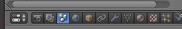
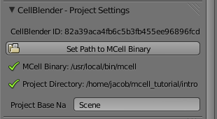
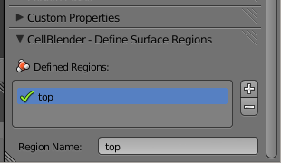
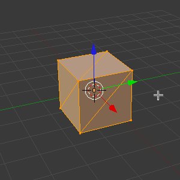
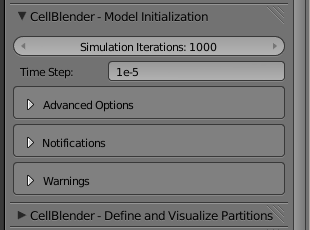
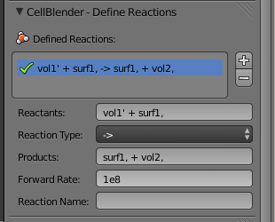
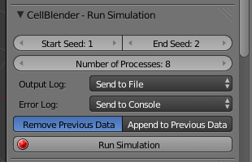

.. _getting_started:

*********************************************
Getting Started
*********************************************

.. Git Repo SHA1 ID: a1abdd291b75176d6581df41329781ae5d5e1b7d

.. note::

    The simulations and visualizations in this tutorial were generated using
    Blender 2.67 and CellBlender 1.0 RC. It may or may not work with other
    versions.

If you haven't already done so, install the required software listed in
:ref:`software`.

For this first example, we'll use Blender and the CellBlender plugin to set
some parameters and run an MCell simulation. This will generate visualization
and reaction data that we will view and analyze in later sections.

Note that most Blender actions can be accomplished with either key commands or
mouse clicks. But for speed, it is strongly advised that you learn the key
commands.

..
  comment video out until updated

  Tutorial Instructions
  ---------------------------------------------

  The majority of this tutorial can be easily accomplished by following the
  Tutorial Instructions below. However, sections that rely heavily on a GUI
  (like this one), might be better understood by watching a video tutorial
  either before following the instructions or instead of them.

  Tutorial Video
  ---------------------------------------------

  .. raw:: html

      <video id="my_video_1" class="video-js vjs-default-skin" controls
        preload="metadata" width="960" height="540" 
        data-setup='{"example_option":true}'>
        <source src="http://www.mcell.psc.edu/tutorials/videos/main/getting_started.ogg" type='video/ogg'/>
      </video>

  If you've followed along with this video, you can skip to the :ref:`annotate`
  section. If not, or if you'd like to go through it again, the following
  instructions should give you the same result.

.. _start_blender:

Starting Blender
---------------------------------------------

Start Blender. If working from the command line, you can do this by opening a
terminal and entering the following command::

    blender

After Blender starts, you should see a cube in the **3D View Editor**. We will
modify this object shortly, but first we need to set some project settings.

.. image:: ./images/gs_cube.png

.. _project_settings:

Set Project Settings
---------------------------------------------

Hit the **Scene** button in the **Properties Editor**. 

There may be many Scene panels which are open (triangles pointing downward). In
order to find things easily, take the time to collapse all of these panels by
clicking the triangles next to their names. (Alternatively, hit **a** while
hovering over them.)

Next, expand the **Project Settings** panel by clicking the small triangle next
to the name.

.. image:: ./images/gs_project_settings1.png

Hit the **Set Path to MCell Binary** button. Navigate to wherever you saved the
MCell binary (e.g. /usr/local/bin) and select **Set MCell Binary**. A green
checkmark should appear next to the file to indicate that it was successfully
set.

Now, hit **Ctrl-u** and select **Save Startup File**.
 
.. image:: ./images/gs_save_startup.png

The startup blend is the file that is loaded every time Blender is started. By
saving the startup blend after setting the MCell binary, you won't have to set
it the next time Blender starts.

The project directory is set to be wherever the current blend file is saved.
Let's save the file right now by hitting **Ctrl-s**, typing
**/home/user/mcell_tutorial/intro** (where **user** is your user name) into the
directory field and click **Create New Directory** when prompted. Type
**intro.blend** into the file name field and hit the **Save Blender File**
button.

.. _define_region:

Define a Surface Region
---------------------------------------------

Hit the **Object** button in the **Properties Editor** (little cube in the
right side panel).

.. image:: ./images/object_button.png

Scroll to the bottom of the Properties Editor panel (if needed). Expand the
**Define Surface Regions** panel (*note: you may have to scroll further if an
action expands the size of a panel, because new fields may appear beyond the
currently visible portion of the panel*). Hit the **+** button to add a new
region, which appears in the list with the name "**Region_0**".

.. image:: ./images/gs_new_region.png

Rename this new surface region to "**top**" by changing the **Region Name**
field from "**Region_0**" to "**top**" (*again, you may need to scroll the
panel to see all of the new fields created by the* **+** *button*).

.. _assign_region:

Assign a Surface Region
---------------------------------------------

Move the cursor to the **3D View Editor**. Hit **Tab** to change into **Edit
Mode** (or enter **Edit Mode** via the **Mode** selection control). Hit
**Ctrl-t** to triangulate the faces (or use **Mesh>Faces>Triangulate Faces**). 

Hit **Ctrl-Tab** and select **Face** (or click on the "**Face select**" button)
to enter face selection mode.

.. image:: ./images/gs_ctrl_tab.png

You can tell you're in **Face Select** mode (rather than **Vertex Select** or
**Edge Select** modes) when each face has a square dot near its center.

Hit **a** (or use menu option **Select>(De)select All**) to deselect everything
(edges turn black rather than orange). Then select just the top two triangular
faces by **holding Shift** while **right clicking** on each of the two top
faces to select them.

.. image:: ./images/gs_select_top.png

Under the **Define Surface Regions** panel, click the **Assign** button
(*remember that you might need to scroll down to see the new buttons added*).

.. image:: ./images/gs_assign.png

After clicking the **Assign** button, those top two faces will now have the
"**top**" surface region assigned to them. They won't look any different, but
they're now "tagged" with the name "**top**" which MCell can use to reference
them.

We're done editing individual faces, so switch back to object mode by placing
the cursor in the **3D View Editor** and hitting the **Tab** key (or switch
back to Object Mode via the **Mode** selection control below the **3D View
Editor**).

.. _set_parameters:

Set Simulation Parameters
---------------------------------------------

Return to the Scene context by hitting the **Scene** button in the **Properties
Editor**. 

Then find and expand just the **Model Objects** panel. With the **Cube** object
still selected, hit the **+** button. This will add **Cube** to the list of
mesh objects to be exported and initialized. A green check mark will appear by
the name to indicate that there are no problems with it.

.. image:: ./images/gs_model_objects.png

Now find and expand the **Model Initialization** panel. Change **Simulation
Iterations** to **1000**. Change **Simulation Time Step** to **1e-5**. The
units are in seconds.

.. _define_molecules:

Define Molecules
---------------------------------------------

We will now define three new molecule species. Expand the **Define Molecules**
panel and hit the **+** button three times. This will create three instances of
**Molecule** in the list of molecules (don't worry about the "Duplicate
molecule..." warnings because we'll be renaming each of these molecules next).

.. image:: ./images/gs_new_molecules.png

Left click on the first instance of **Molecule**. Change the **Molecule Name**
to **vol1**, the **Molecule Type** to **Volume Molecule**, and the **Diffusion
Constant** to **1e-6**. The units are cm\ :sup:`2`\ /second.

.. image:: ./images/gs_define_molecule_vol1.png

Repeat this process for the next molecule in the list, but call this one
**vol2**. It will also be a **Volume Molecule** with a **Diffusion Constant**
of **1e-6**.

.. image:: ./images/gs_define_molecule_vol2.png

Now, change the third entry to **surf1**. The **Molecule Type** should be set
to **Surface Molecule** and change the **Diffusion Constant** to **1e-7**.

.. image:: ./images/gs_define_molecule_surf1.png

.. _define_reactions:

Define Reactions
---------------------------------------------

In order to have our molecules interact with one another, we first need to
define some reactions. Expand the **Define Reactions** panel and hit the **+**
button. Change **Reactants** to **vol1' + surf1,**. Change **Products** to
**surf1, + vol2,**. Be sure to use the commas and apostrophes shown in these
examples.

.. warning::

    Be especially careful about the apostrophe character since there are
    different "flavors" of single quotes. In particular, if you copy text from
    a web site and paste it into CellBlender (or an MDL file), be sure that you
    get the normal (ASCII 0x27) version. If you get an MCell error about
    "orientation not specified", then you might want to double check (and even
    retype) the single quotes in your reactions.

The meaning of these symbols will be explained in the :ref:`rxn_dir` section.
Lastly, change **Forward Rate** to **1e8**. The units are M\ :sup:`-1`\ s\
:sup:`-1`\ .

.. _define_release_sites:

Create Release Sites
---------------------------------------------

We have defined molecules and reactions, but we still need to release some
molecules into our simulation.

Expand the **Molecule Release/Placement** panel and hit the **+** button twice.
This will create two instances of **Release Site** with errors because we
haven't defined any molecule names yet.

.. image:: ./images/gs_release_empty.png

Select the first instance (*you may need to scroll down to see the entire
panel*), and change **Site Name** to **vol1_rel**.

.. image:: ./images/gs_release_add_vol1_rel.png

Change **Molecule** to **vol1**.

.. image:: ./images/gs_release_add_vol1_rel_mol.png

Change **Release Shape** to **Object/Region**.

.. image:: ./images/gs_release_add_vol1_rel_shape.png

Change **Object/Region** to **Cube**.

.. image:: ./images/gs_release_add_vol1_rel_obj.png

Change **Quantity to Release** to **2000**. This will release 2000 **vol1**
molecules randomly throughout the interior of the **Cube** object.

.. image:: ./images/gs_vol1_rel.png

Now select the second release site. Change **Site Name** to **surf1_rel**.
Change **Molecule** to **surf1**. Change **Release Shape** to
**Object/Region**. Change **Object/Region** to **Cube[top]**. Change **Quantity
to Release** to **2000**. This will release **2000** molecules randomly on the
**top** surface region.

.. image:: ./images/gs_surf1_rel.png

.. _create_reaction_output:

Create Reaction Output
---------------------------------------------

Open the **Reaction Output Settings** panel. Click the **+** sign 3 times to
save reaction data for each of the 3 different molecule species. They will show
up as errors because they haven't been chosen yet, and there are no default
values.

.. image:: ./images/gs_rxn_viz_output_three_new.png

Select and highlight the first of the "Molecule name error" definitions and
change its molecule name to "**surf1**" as shown here:

.. image:: ./images/gs_rxn_viz_output_select_surf1.png

After clicking on "**surf1**", the top of that panel should look like this:

.. image:: ./images/gs_rxn_viz_output_surf1_selected.png

The description next to the check mark indicates that MCell will be counting
and saving the count (number) of surf1 molecules in the **World**.

Repeat this process for the other two "Molecule name error" entries assigning
them to **vol1** and **vol2** respectively to get this:

.. image:: ./images/gs_reaction_output2.png

.. _create_visualization_output:

Create Visualization Output
---------------------------------------------

Open the **Visualization Output Settings** panel (*be sure to scroll down to
see the whole panel*):

.. image:: ./images/gs_rxn_viz_output_empty.png

Then click the **Toggle All** button to export all molecules for visualization:

.. image:: ./images/gs_rxn_viz_output_all_selected.png

.. _run_sim:

Run Simulation
---------------------------------------------

Expand the **Run Simulation** panel and change the **End Seed** to **2** and
hit **Run Simulation**.

This will queue up two MCell simulations each with a different seed value. A
green check mark will appear when the simulations have completed.

.. image:: ./images/gs_run_simulation2.png

.. _save_project:

Save Your Project
---------------------------------------------

From the **File** menu, select the **Save** option (or hit **Ctrl-s**). This
will save any changes that you have made to the blend, including the
CellBlender specific settings (e.g. molecule definitions, release sites, etc).

.. _review:

Review
---------------------------------------------

* We set up some project settings, including our path to MCell.
* We started with Blender's default cube and divided it up into triangular faces.
* The top faces were defined to be a special region that we called **top**.
* We defined 3 different molecular species: **surf1**, **vol1**, and **vol2**.
* We defined reactions with the surface molecules that transformed **vol1**
  molecules inside the **Cube** into **vol2** molecules outside the **Cube**.
* We initialized the simulation by releasing specific numbers of molecules in
  (or on) specific regions of the physical model.
* We specified which data to export, and we ran the simulation.

