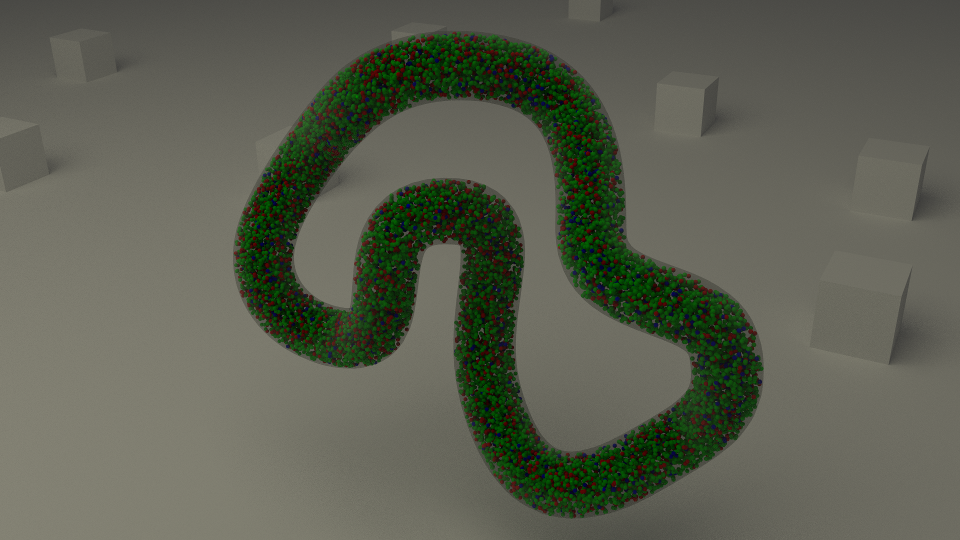

.. _lotka_volterra:

*********************************************
Lotka-Volterra in an Unconventional Space
*********************************************

.. Git Repo SHA1 ID: a1abdd291b75176d6581df41329781ae5d5e1b7d

.. note::

    The simulations and visualizations in this tutorial were generated using
    Blender 2.67 and CellBlender 1.0 RC. It may or may not work with other
    versions.

This tutorial uses the `Lotka-Volterra`_ oscillating system to demonstrate the
difference between a diffusion-limited reaction and a "physiologic" reaction.
The project files for the following two examples are available here_. After
downloading this file, unzip it anywhere on your computer. It contains two
blend files (**LV_diff_lim.blend** and **LV_phys.blend**) inside of a directory
called **LV**.

.. _Lotka-Volterra: https://en.wikipedia.org/wiki/Lotka%E2%80%93Volterra_equation

.. _here: http://mcell.org/tutorials/downloads/LV.zip

Diffusion-Limited Reaction
---------------------------------------------

After opening **LV_diff_lim.blend**, we need to tell CellBlender where MCell is
located. Under **Project Settings**, hit **Set Path to MCell Binary**, navigate
to where you have downloaded MCell, select it, and hit the **Set MCell Binary**
button. Next, hit the **Run Simulation** button. After the simulation has
completed, hit the **Read Viz Data** button. Hit **Alt-a** to play through the
visualization data. 

A diffusion-limited reaction is a reaction which occurs whenever the species
meet. In other words, the probability of reaction is 1 (or greater), and the
only parameter limiting the reactions occurrence is the availability of the
reactant species (and how often they meet). In CellBlender, this effect is
achieved by making the rate constant so high as to push the probability of
reaction to be greater than 1. Running with a small starting number of
molecules from a point allows this model to show a firework pattern of the two
oscillating species (B and C) as they move through the tube. If you look at the
reaction data, there are no smooth regular oscillations as seen in the
physiologic model.

.. image:: ./images/lv_diff_lim_sm.png

Physiologic Reaction
---------------------------------------------

After opening **LV_phys.blend**, we need to tell CellBlender where MCell is
located, like we did in the previous example. Under **Project Settings**, hit
**Set Path to MCell Binary**, navigate to where you have downloaded MCell,
select it, and hit the **Set MCell Binary** button. Next, hit the **Run
Simulation** button. After the simulation has completed, hit the **Read Viz
Data** button. Hit **Alt-a** to play through the visualization data. 

This is the same model as the diffusion-limited reaction except that it starts
from well mixed conditions and the probabilities for the reactions are not
greater than 1. Now, the visualization will show the molecules changing
throughout the entire system (the tube will slowly change from B to C and
back). In the reaction data the oscillations will be smooth and regular (and
will closely match an ODE model given that this reaction adheres to well mixed
conditions).

.. image:: ./images/lv_red_sm.png

