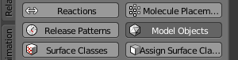
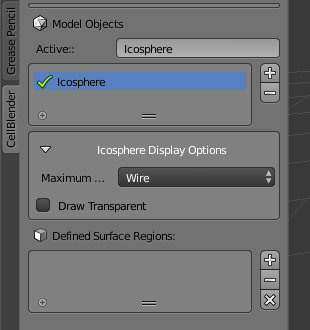
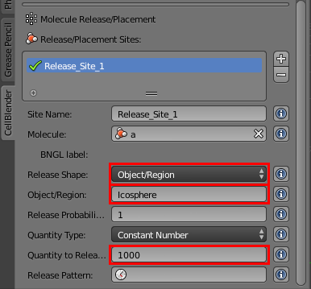

.. _add_meshgeom: 

*********************************************************
Add Simple Mesh Geometry
*********************************************************

Tutorial Overview
=================

In this tutorial, a sphere will be added to the simulation around the diffusing
molecules.

Initial Configuration
=====================

This tutorial builds upon what was done in :ref:`unimol_reactions`. Either
complete that tutorial yourself or use the `unimol_reactions.blend`_ file to
get started.

.. _unimol_reactions.blend: ./blends/unimol_reactions.blend

Save the File with a New Name in Your Working Directory
---------------------------------------------------------------

* Select **File** > **Save As...**
* Change **unimol_reactions.blend** to **add_meshgeom.blend**
* Click **Save As Blender File** button

Add Sphere
---------------------------------------------------------------

* Click the **Create** tab
* Hit the **Ico Sphere** button

.. image:: ./images/add_meshgeom/add_icosphere1.png

* The **Add Ico Sphere** options appear in the lower left corner
* Change **Subdivisions** to **3**
* Change **Size** to **0.5**
* Change each **Location** (**X**, **Y**, and **Z**) to **0.0** if it isn't set
  already.

.. image:: ./images/add_meshgeom/add_icosphere2.png

Add Sphere to Model Objects
---------------------------------------------------------------

* Click the **CellBlender** tab
* Click the **Model Objects** button

* Click the "plus" sign (**+**) to the right of the **Model Objects** box
* Expand the **Icosphere Display Options** panel
* Change **Maximum Draw Type** to **Wire**

Release Molecules inside Sphere
---------------------------------------------------------------

* Click the **Molecule Placement** button
* Select **Release_Site**
* Change **Release Shape** to **Object/Region**
* Type **Icosphere** in the **Object/Region** field
* Change **Quantity to Release** to **1000**

Simulate the Model
--------------------------

* Click the **Run Simulation** button

.. image:: ./images/single_molecule/run_sim_button.png

* Click the **Run** button

.. image:: ./images/single_molecule/run_sim.png

* Wait for the simulation to complete
* Press the "Reload Visualization Data" button to load the results of the
  simulation.

.. image:: ./images/single_molecule/reload_viz_data.png

View the Results
-------------------------

* Press the "Play" (|play|) button below the time line

.. image:: ./images/add_meshgeom/diffuse_in_sphere.png

.. |play| image:: ./images/single_molecule/play.png

Save Your File
-------------------------

* **File** > **Save**
