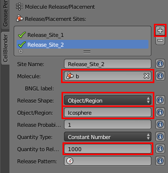
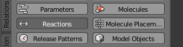

.. _bimol_reactions: 

*********************************************************
Bimolecular Reactions
*********************************************************

Tutorial Overview
=================

This tutorial will define a single bimolecular reaction.

Initial Configuration
=====================

This tutorial builds upon what was done in :ref:`add_meshgeom`. Either complete
that tutorial yourself or use the `add_meshgeom.blend`_ file to get started.

.. _add_meshgeom.blend: ./blends/add_meshgeom.blend

Save the File with a New Name in Your Working Directory
---------------------------------------------------------------

* Select **File** > **Save As...**
* Change **add_meshgeom.blend** to **bimol_reactions.blend**
* Click **Save As Blender File** button

Define a New Molecule Type
-----------------------------------

* Click the **Molecules** button

.. image:: ./images/single_molecule/molecules.png

* Click the "plus" sign (**+**) to the right of the **Defined Molecules** box
* Click in the **Molecule Name** field, type the letter **b** and press the
  Enter key
* Click in the **Diffusion Constant** box, type **1e-6** and press the Enter key

.. image:: ./images/bimol_reactions/define_b.png

Release "b" Molecules into the Simulation
-----------------------------------------------------

* Click the **Molecule Placement** button

.. image:: ./images/single_molecule/molecule_placement.png

* Click the "plus" sign (**+**) to the right of the **Release/Placement Sites** box
* Click in the **Molecule** field and select the **b** molecule type
* Change **Release Shape** to **Object/Region**
* Type **Icosphere** in the **Object/Region** field
* Click in the **Quantity to Release** field and set it to **1000**

Define a Bimolecular Reaction
-----------------------------------

* Click the **Reactions** button.

* Change the **Reactants** text field from **a** to **a + b**
* Type **1e8** in the **Forward Rates** text field

.. image:: ./images/bimol_reactions/change_reaction.png

Simulate the Model
--------------------------

* Click the **Run Simulation** button

.. image:: ./images/single_molecule/run_sim_button.png

* Change the **Time Step** to **1e-5**
* Click the **Run** button

.. image:: ./images/single_molecule/run_sim.png

* Wait for the simulation to complete
* Press the "Reload Visualization Data" button to load the results of the
  simulation.

.. image:: ./images/single_molecule/reload_viz_data.png

Change the Shape of "b"
--------------------------------------

* Click the **Molecules** button

.. image:: ./images/single_molecule/molecules.png

* Open the **Display Options** subpanel if it isn't already
* Change the **Sphere_1** to **Cube**
* Change the **Scale** to **2.5**
* Change the color to a bright red

View the Results
-------------------------

* Press the "Play" (|play|) button below the time line

.. |play| image:: ./images/single_molecule/play.png

Save Your File
-------------------------

* **File** > **Save**
