*********************************************************
A Spatially Realistic Model of Cell Regulatory Processes
*********************************************************

Required software
=================

This tutorial requires `BioNetGen 2.2.5`_, RuleBender_, MATLAB2013a_,
`CellOrganizer 2.1`_, `Blender 2.70a`_, `CellBlender 1.0 RC3`_, and `MCell
3.2.1`_.

.. _BioNetGen 2.2.5: http://bionetgen.org/index.php/BioNetGen_Distributions 
.. _RuleBender: https://code.google.com/p/rulebender/downloads/list
.. _MATLAB2013a: http://www.mathworks.com
.. _CellOrganizer 2.1: http://cellorganizer.org/Downloads/v2.0/
.. _Blender 2.70a: http://www.blender.org/download/
.. _CellBlender 1.0 RC3: http://mmbios.org/index.php/cellblender-all/cellblender-cellblender-1-0_rc3
.. _MCell 3.2.1: http://mmbios.org/index.php/mcell-3-2-1
.. _Python 2.7: https://www.python.org/downloads/
.. _LibSBML 5.10: http://sbml.org/Software/libSBML/Downloading_libSBML
.. _Repository CellBlender: http://code.google.com/p/cellblender/source/checkout

.. note:: The CellOrganizer section of this tutorial is not supported on the Windows operating system. If you wish to use the Import SBML functionality in MacOSX or Windows you need to use the `Repository Cellblender`_ version, `Python 2.7`_ and `LibSBML 5.10`_.

Tutorial overview
=================

Part 1: Spatial Modeling with CellBlender
------------------------------------------------------

In part one, you will receive an introduction to working with spatial modeling.
Using CellBlender 1.0 RC3 and MCell 3.2.1, you will create and run a simple
biochemical system and geometries. Lastly you will learn to import the
geometries from SBML-spatial and check that these meshes are manifold and
watertight. You will be using these complex geometries later.

Part 2: Reaction Network Modeling with RuleBender
------------------------------------------------------

Using BioNetGen 2.2.5 (BNG), you will learn to model biochemical systems using
rule based modeling. You will use powerful modeling paradigm to create and
analyze ODE simulations of signal transduction. You will then learn how to
export biochemistry from BNG to Systems Biology Markup Language (SBML) and
import it into CellBlender to create a simulation using the complex geometries
you worked on in the previous section.

Part 3: Defining Complex Geometries with CellOrganizer
------------------------------------------------------

Using CellOrganizer 2.1 you will learn to train generative models of cellular
organization from fluorescence microscopy images. Next you will learn to sample
the parameter space of your cellular models to create geometries specific to
your interests. You will then synthesize *in silico* instances of cellular
organization using these models. Lastly we will demonstrate how to import an
SBML file into CellOrganizer to automatically determine what models are
required for the biochemical system within the SBML file and synthesize
instances from those models that are exported to SBML-spatial. Lastly we will
return to your CellBlender simulations you started the in part two to analyze
the results of these spatially realistic simulations and the impact of spatial
organization on these simulations.

A Brief Introduction to CellBlender
===================================

Required Software
-----------------

Blender 2.70a, CellBlender, MCell

Installation
------------

.. note:: You may have already done this next step if you've followed along with
   earlier tutorials.

First download and install `Blender 2.70a`_. Next download `CellBlender 1.0
RC3`_. Open Blender. Click on **File->User Preferences**. In the "Add Ons" tab
select "Install from file" and select the cellblender.zip you downloaded
previously. If you then search the list of Add Ons for CellBlender you will now
see a CellBlender add on that can be activated by clicking the box on the right
hand side of the list. To save this as your default click "Save User Settings"
before exiting this window. You should now see several "CellBlender-" sections
in the options on the right panel particularly in the "Scene" tab.

Related Files
^^^^^^^^^^^^^

simpleGeometry.mdl_

.. _simpleGeometry.mdl: https://dl.dropboxusercontent.com/u/7096948/simpleGeometry.mdl

Model Description
-----------------

Harris et al.  present in [#f1]_ a model of receptor-mediated signaling
coupled with nuclear transport and transcriptional gene regulation. The full
model is shown in :num:`Fig. #cbngfull`

Throughtout this tutorial we will show the user how to implement this model
using CellBlender and various external tools. During this first section, we
will implement the reduced version shown in :num:`Fig. #cbngreduced` which
includes ligand-receptor binding, ligand binding, ligand-receptor dimerization
and TF-receptor binding.

.. _cbngfull:

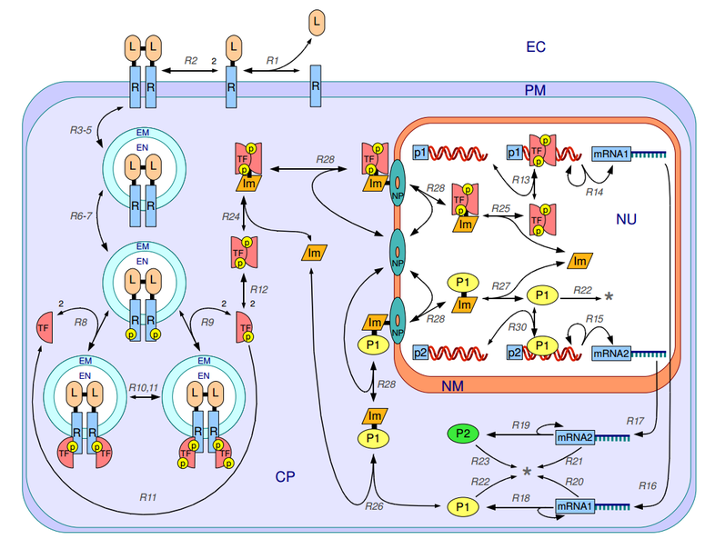

   Full Model Diagram

.. _cbngreduced:

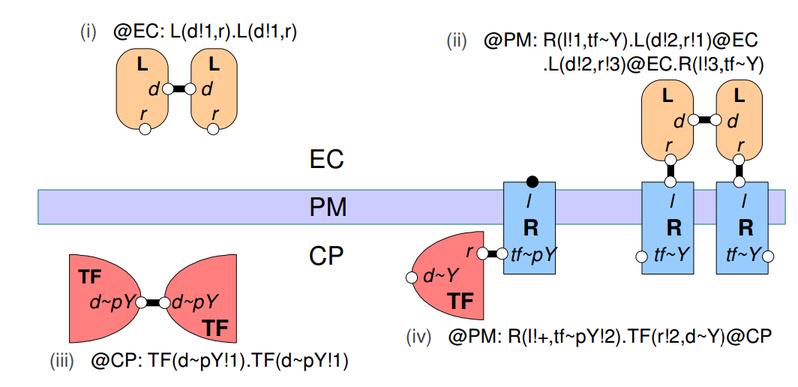

   Reduced Model

Defining our System
-------------------

Our basic system is composed of an extracellular matrix a cytoplasm and its
membrane. For this example model we will use a basic geometry composed of an
icosphere enveloped by a cube in CellBlender (:num:`Fig. #simple`) Name the
sphere **CP** (for cytoplasm) and the bounding box **EC** (for extracellular
matrix). Alternatively you can use the MDL import feature and use a premade geometry
(simpleGeometry.mdl_).

.. _simple:

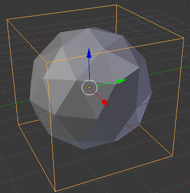

   Simple Geometry

Add the following reaction network:

::

    L + R <->  L_R  kp_LR,km_LR
    L + L  <->  L_L  kp_LL,km_LL
    TF + TF <-> TF_TF kp_TF_TF, km_TF_TF
    R + TF <-> R_TF kp_R_TF,km_R_TF

And the following parameters:

::

      NaV 6.022e8
      kp_LR 0.1*NaV 
      km_LR 1
      kp_LL 0.1*NaV 
      km_LL 1 
      kp_TF_TF 0.1*NaV
      km_TF_TF 1
      kp_R_TF 0.1*NaV
      km_R_TF 0.1

With molecules:

::

    L (3D) diffusion: 8.52e-7
    R (2D) diffusion: 3.32e-7
    TF (3D) diffusion:8.52e-7

And the following release sites:

::

    Molecule: L
    Object: EC[ALL] - CP[ALL] 
    Quantity type: Concentration/Density
    Quantity: 1000 / (NaV * 27)

    Molecule: R
    Object: CP[ALL]
    Quantity type: Concentration/Density
    Quantity: 200/ 24
    
    Molecule: TF
    Object: CP[ALL]
    Quantity type: Concentration/Density
    Quantity: 200/ (NaV *8)

Simulating your System
----------------------

Under model initialization select 1000 iterations. Save your project and run
the simulation!

Final Thoughts for Part 1
-------------------------

The reaction network we have implemented is a highly minimalistic version when
compared to the full reaction network.  In this exercise we have attempted to
show you the difficulty of simulating highly complex biological systems. We
have developed a tool that we will present to you in the following sections
detailing a procedure for defining complex reaction networks and using
realistic geometries in a structured way.

Introduction to Compartmental Rule-Based Modeling with BioNetGen and RuleBender
===============================================================================

Required Software
-----------------

BioNetGen 2.2.5, RuleBender 2.0, JavaSE 6.

Installation
------------

RuleBender is a graphical user interface for BioNetGen. It includes several
features like an integrated development, analysis and simulation environment
that you will learn to use during this tutorial. You can get the latest version
of RuleBender (which includes a copy of BioNetGen) from
http://www.rulebender.org.

A Basic Model: Ligand Receptor Binding
--------------------------------------

Glossary
~~~~~~~~

This section introduces the following concepts:

-  Molecule: BioNetGen’s basic simulation unit. It is a structured object
   containing compartments that can be modified or bind to each other

-  Species: A complex containing one or more molecules

-  Rule: Rules are the generators of species in a BioNetGen model. Through the
   use of patterns and wildcards, a single rule can correspond to several
   reactions describing the same chemical process occurring under different
   biological contexts.

Procedure
~~~~~~~~~

Related Files
^^^^^^^^^^^^^

template.bngl, lr.bngl (within bngFiles.zip_)

.. _bngFiles.zip: http://www.mcell.org/tutorials/project_files/bngFiles.zip

Objectives
^^^^^^^^^^

To teach the student the basics of how to set up a basic BioNetGen file with
parameters, molecule and reaction definitions and observables.

Open the template file we provided in RuleBender. A BioNetGen file is comprised
of a model definition followed by actions. To begin the model definition block
we start with the line

::

    begin model

The model definition is comprised of five required blocks and two optional
ones. The required blocks are ``parameters``, ``molecule types``, ``species``,
``observables``, and ``reaction rules``. The optional blocks, which will be
covered later, are ``compartments`` and ``functions``.

The first step is to define the parameters we will use in the definition of our
model. These parameters can take on any numerical value, although parameters
used to define concentrations or rate constants should be non-negative. The
syntax is the following:

::

    begin parameters
      L0 1000 # Initial number of L molecules
      R0 20   # Initial number of R molecules
      kp1 1   # Bimolecular rate constant for L-R binding (1/# 1/s) 
      km1 1   # Unimolecular rate constant for L-R unbinding (1/s) 
    end parameters

Note that it is possible to define parameters using expressions involving
previously defined parameters. This is convenient for documenting how unit
conversions were performed.

The next step is to establish the set of molecules we will use in our system.
In this case, it is sufficient to define a ligand molecule (L) and a receptor
(R), each with a cognate binding site, r and l respectively:

::

    begin molecule types
      L(r,d)
      R(l)
    end molecule types

The next step is to specify the species that are initially present in the
system along with their intial concentrations, which is done in the ``species``
block:

::

    begin species
      L(r,d) L0
      R(l) R0
    end species

Here, the two species initially present are *free ligand*, an L molecule with
its ``r`` and ``d`` sites unbound, and *free receptor*, an R molecules with its *l* site
unbound. Their initial concentrations are set to ``R0`` and ``L0``
respectively.

Next we define the outputs of the models, which are called *observables*.
Observables are defined as sums over the concentrations of species selected by
a particular specified pattern or set of patterns. Patterns can be thought of
as search terms that require the matched species to have a particular set of
properties. An example ``observables`` block is:

::

    begin observables
      Molecules L_tot   L()
      Molecules L_free  L(r)
      Molecules L_bound L(r!1).R(l!1)
    end observables

The first observable, ``L_tot``, computes the total number of L molecules in
the system. It does this by matching every occurence of an L molecule
regardless of the state of its r component. This illustrates the ‘don’t write
don’t care’ principle in BioNetGen, which means that what we don’t include in a
pattern doesn’t affect the match. Here, the pattern matches an L but doesn’t
add any requirements on the component states, so all L molecules are matched by
the pattern. The second observable, ``L_free``, uses a pattern that lists a
component a single component, r, and by so doing requires that the matching L
molecules has an r component that is unbound. The third observable,
``L_bound``, counts the number of L molecules that are bound to an R molecule
using a more complicated pattern that illustrates the syntax used to specify
bonds. The ’!’ after a component is used to refer the binding state, and the
numerical index that follows is used to tag the endpoints of a particular bond.
Here, the bond with index 1 links the r component of L to the l component of R.
Each bond should have exactly two enpoints.  Different indices are used to
refer to different bonds. The scope of the bond indices in BNG is always a
single pattern.

Rules are the central component of a BNG model, as they define what reactions
can take place in the system. In this simple model, the reversible binding of L
and R is specified as

::

    begin reaction rules
      L(r) + R(l) <-> L(r!1).R(l!1) kp1, km1
    end reaction rules

The left hand side of the rule (the part before the arrow) defines the
reactants and the right hand side defines the products. Reactants and products
are each selected by patterns that may match many different species in the
systems, and thus each rule may generate many reactions.  The arrow for a rule
may be either unidirectional (``->``) or bidirectional (``<->``). The rate of
each generated reaction is determined by the rate constant expression
(unidirectional) or pair of rate constant expressions (bidirectional) that are
listed following the patterns. For the models we will use in this tutorials,
all reactions will follow elementary reaction kinetics meaning that the rate is
simply the product of a rate constant, given by the specified parameter, and
the reactant species concentrations. This is the only type of reaction rate law
that is currently allowed in a model that will be imported into MCell.

Specifying the reaction rules completes our description of the model, which we
now terminate with the line

::

    end model

The remaining lines of the BNGL (BioNetGen language) file specify *actions*
that are to performed on the model. If the model is to be simulated using
either ODEs or the SSA, the first action that needs to be performed is to
generate the reaction network starting from the defined species (see
``species`` block above) and the reaction rules, by issuing the following
command:

::

    generate_network({overwrite=>1})}

Here, we have used the ``overwrite`` option to ensure that any previously
generated network with the same base name will be overwritten (not necessary if
you are using RuleBender). More details about options that can be passed to
BioNetGen action commands can be found `here
<http://docs.google.com/a/cornell.edu/spreadsheet/ccc?key=0Avcdx-KzjXH4dGhLZWlZZ1VGSmYzb0ZvRG0za3RYaWc#gid=0>`__.

The second action we want to perform is a simulation of the model using ODEs,
which we specify using

::

    simulate({method=>"ode",t_end=>5,n_steps=>120})

This generates a single trajectory by solving the ODEs defined by the rate
equations for the generated reaction network on the time interval [0,5],
sampled at 120 points (not including the starting point). :num:`Fig. #plot1`
shows this trajectory. We can see how ``Lig\_Bound`` initially increases until the
system reaches equilibrium between the forward and backward reactions.

.. _plot1:

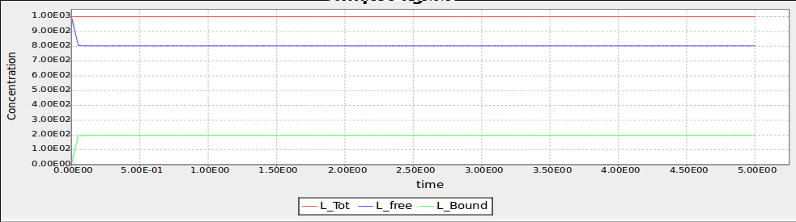

   Time Trajectory of a Ligand-Receptor Model

Component States
----------------

A second way to make use of components in BNG is through the use of internal
states. A modeler can use these, for example, to represent post-translational
modifications at a particular site or conformational states of a particular
domain. For example, we can add a phosphorylation site to the receptor molecule
in our previous example by modifying the molecule type declaration:

::

    begin molecule types
      L(r)
      R(l,Y~0~P)
    end molecule types

where we have indicated on the second line that the molecule R contains an
additional component Y (representing a tyrosine residue) that can be in either
the state ``0`` (representing unphosphorylated) or the state ``P``
(representing phosphorylated).

To model a phosphorylation reaction, we add the rule

::

    begin parameters
    p1 1
    d1 0.1
    end parameters
    begin reaction rules
      ...
      R(l!+,Y~0) -> R(l!+,Y~P) p1
    end reaction rules

In this rule component ``T`` transitions from state ``0`` to state ``P``. We
are also introducing some new concepts with component ``R(l!+)``. Fist, the
``!+`` symbol is used to indicate that we are requiring component ``R(l)`` to
be bound to some molecule without specifying which. Separately, in this rule
the pattern ``R(l!+)`` is being used as *context* for the rule (a
precondition). In other words, for molecule ``R`` to become phosporylated it is
necessary for its component ``R(l)`` to be bound to something.

The phosporylation rule was unidirectional, so we also need to define a
dephosphorylation reaction. We will assume that dephosphorylation doesn’t have
a contextual requirement - here it doesn’t require binding of the ligand
molecule, so we have

::

    begin reaction rules
      ...
      R(Y~P) -> R(Y~0) d1
    end reaction rules

In order to define an observable that tracks the number of phosporylated
tyrosine residues we use the following pattern syntax.

::

    begin observables
      Molecules R_Phospo_unbound R(Y~P)
      Molecules R_Phospo  R(Y~P!?)
    end observables

The ``R(Y~P)!?`` syntax is used to indicate that we wish to count all
``R`` molecules with a phoporylated ``Y`` component regardless of its bound state. 
In contrast, the ``R(Y~P)`` is used to indicate that we strictly wish to
count the cases were ``Y`` is unbound. In this particular example it bears no
difference since we have not specified any rule that defines Y to also be a
binding site.

Comparmental BioNetGen
----------------------

Compartments in BioNetGen (cBNGL) allow us to explicitly model the
compartmental organization of a cell. Consider our example model we referred to
in the previous section. :num:`Fig. #compartment` shows an abstract view of the
hierchical structure of the model. cBNGL syntax allows us to directly use this
hierarchy inside our model as such:

::

    begin parameters
      
      vol_EC          20.0   
      vol_CP          4.0
      vol_EN          0.5

      sa_PM           0.4
      sa_EM           0.05
     
      width           1
    end parameters
    begin compartments
      EC  3  vol_EC 
      PM  2  sa_PM*width    EC
      CP  3  vol_CP         PM
      EM  2  sa_EM*width    CP
      EN  3  vol_EN         EM
    end compartments

Where a compartment definition syntax is composed of name, dimensions, size and
parent compartment. For the purposes of this tutorial it is important to
remember that MCell and CellBlender use units of :math:`\mu m^3`

.. _compartment:

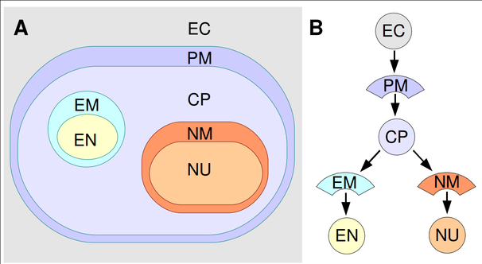

   Hierarchichal View of the Compartments in the Example Model

Once we have defined our compartments, it is possible to define any pattern
that refers to them using one of the two following syntax:
``@compartment:species``.

For example, let us define the following additional rules to the example model
we have been working on:

::

    begin parameters
      k_r_endo 1
      k_recycle 0.1
      kp_LL 0.1
      km_LL 1
    end parameters
    begin reaction rules
      ...
      L(d) + L(d)  <->  L(d!1).L(d!1) kp_LL,km_LL
      @PM:R().R() ->  @EM:R().R()  k_r_endo     
      @EM:R()  ->  @PM:R()   k_recycle
    reaction rules

The first rule is a standard rule that specifies that two ligands can bind into
a single complex. In cBNGL, rules that do not contain any compartment
information imply that they can take place in any compartment where two ligands
can be found (following BioNetGen’s don’t show-don’t care principle).

The second rule specifies that whenever it finds two receptors in the plasma
membrane, bound together in some non-specified way, they will be transported to
the endosomal membrane at a ``k_r_endo`` rate. Likewise, we specify a
reciclying reaction whereas any kind of receptors can go back to the plasma
membrane. Observables are defined in a similar fashion.

::

    begin observables
      Species    R_Dimers_PM   @PM:R.R
      Species    R_Dimers_EM   @EM:R.R
    end observables

In this block we are introducing the ``Species`` keyword. This means that, as
we described earlier, instead of counting the number of molecules where a given
pattern appears, it will count the total number of complexes (or species) and
report that to the user.

Let us simulate the system as we have defined it so far: Ligand-receptor
binding, ligand-ligand dimerization, receptor phosporylation and receptor
transport. Change the simulation so that it runs ten seconds.

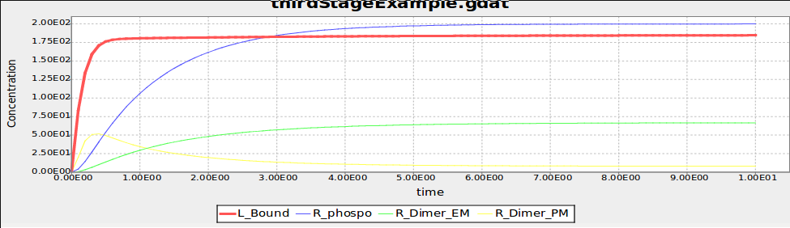

   Time series of the example model after including compartment information

As we can appreciate, all elements of this simple cascade are being activated
and equilibrated (the most downstream element, endosomal receptor, reaches
equilibrum at about 8 seconds).

Importing External Models into CellBlender
==========================================

Required Material
-----------------

-  A pre-generated spatial geometry and reaction networks encoded in the
   SBML format. It is possible to generate SBML files from BNGL models using
   the writeSBML() action at the end of your model. If you add this command after
   a simulate action the resulting SBML model's initial conditions will correspond to the 
   state of your model after the simulation finishes.

-  CellBlender

-  `Plotting software`_

-  full\_lr.bngl (Linux) lr\_full.blend (MacOSX, Win) (within bngFiles.zip_)

.. _Plotting software: https://dl.dropboxusercontent.com/u/7096948/blenderPlotter.py 

Systems Biology Markup Language (SBML)
--------------------------------------

SBML is a modeling exchange standard used to encode modeling information in an
XML-compliant format. Multiple modeling applications support exporting
information as an SBML model (including BioNetGen). Moreover, recent extensions
to the SBML standard like SBML-spatial support the definition of 3D geometries.
We will make use of these capabilities to define a model in CellBlender

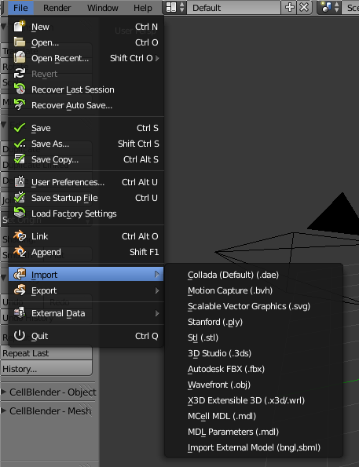

   External model import menu

To export an SBML from a BioNetGen file, it is sufficient to add the
``writeSBML()`` action to the bottom of your BioNetGen file.

Importing SBML
--------------

To import an SBML and SBML-spatial files open Blender and click File,
Import, Import External Model. For the purposes of this tutorial you can also use one
of the two geometries provided in bngFiles.zip_. (icogeometry.mdl and cubicgeometry.mdl) Depending on the size of
your model this may take a minute to load. Once loaded you will see imported
geometries. The "CellBlender-" sections in the Scene tab on the right Blender
panel have also been automatically filled in. As of the time of this tutorial
this capability is only supported in Linux.

Checking your meshes
--------------------

Before you can simulate the biochemical system you must check that your
geometries have consistent normals, are manifold and watertight. Refer to `this
tutorial <http://www.mcell.org/tutorials/mesh_repair.html>`__ for more
information on how to make sure your geometry is MCell compliant

Utilizing partitioning
----------------------

Although it is now possible to run your biochemical spatial simulation, you
probably want to first set up partitions. These can increase simulation speed
by greater than a thousand times! Set your partitions to be 0.1 wide.

Running CellBlender
-------------------

The last step before running our simulation is to define the number of
iterations our simulation will run for. In the Model Initialization panel
increase the number of iterations to 10000.

Save your project to a new ``blend`` project file. The model’s reaction output
data will be saved to a folder called ``projectName_files`` inside the
directory where the ``*.blend`` file is located.

Now we are ready to simulate our file. Click on the run simulation panel and
start the simulation.

Visualizing and Plotting Data
-----------------------------

In order to visualize your data from inside Blender it is sufficient to check
the ’Visualize all’ option in the corresponding CellBlender panel.  However,
given the number of molecules in the example system it is unfeasible to
visually store more than a few thousands of iterations. Of more interest is to
analyze the behavior of the time series produced by the system; we will explain
how to do this in the following section.

Plotting Reaction Data
~~~~~~~~~~~~~~~~~~~~~~

It is possible to use any plotting software to visualize the time series
generated by MCell/CellBlender, including CellBlender own plugins if you so
desire. We have provided a small Python script that satisfies our needs.
Running it in the directory where your react\_data is located will generate an
image for each file found in the directory.

Modeling Cellular Organization (CellOrganizer/SBML-spatial)
===========================================================

**Goal:** Be able to generate synthetic geometries and SBML-spatial files from
using models learned from fluorescence microscopy images.

Required Software
-----------------

MATLAB2013a, CellOrganizer 2.1

Installation
------------

Download MATLAB2013a_ or later and activate it using the installation wizard.

Download and unzip the latest stable release of `CellOrganizer 2.1`_.

Open MATLAB and add navigate to the folder containing the cellorganizer source
code by clicking the magnifying glass on the right of the screen.  Once in this
folder the cellorganizer directory will be visible on the left of the screen in
the "CurrentFolder" block. Type :math:`\tt{setup}` in the Command Window.

Download and extract the SampleData_ zip file. This folder contains abreviated
datasets for the puroposes of demonstration. Place this folder in the same
directory as the "cellorganizer" parent folder. Add the "SampleData" to your
path by right clicking it and selecting "Add to Path"–>"Selected Folders and
Subfolders".

.. _SampleData: http://www.mcell.org/tutorials/project_files/SampleData.zip

Training generative models
--------------------------

**Related CellOrganizer demos:** Train, demo2D01, demo3D11, demo3D12, demo3D18,
demo3D20

**Objectives:** To teach the basics of how to train generative models from
fluorescence microscopy data.

**Procedure:** For this tutorial we are going to train a model using 2D images
of HeLa cells. These cells have been tagged with a DNA marker, a cytoplasmic
marker, and a LAMP2 marker which localizes in lysosomes as seen in :num:`Fig.
#sampleimg` below.

.. _sampleimg:

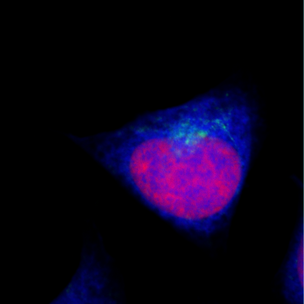

   LAMP2 tagged HeLa cell

Open the template **Train.m** by typing "edit Train" in the Command Window
block. A file will open and you will see the following

::

    function Train(
    dnapath,cellpath,protpath,croppath,resolution,filename,dimensionality)

There are clearly several inputs to fill out before you can train a model so
let’s go through them in turn.

The first thing you need to do is tell CellOrganizer where your images are. To
  do this specify the paths as strings like the examples below:

::

    >> dnapath = ['./myDNAimgs/cell*.tif'];
    >> cellpath = ['./myCELLimgs/cell*.tif'];
    >> protpath = ['.myPROTimgs/cell*.tif'];

These paths point to the DNA, cytoplasmic, and lysosomal images respectively
for a set of cells. The ’\*’ wildcard allows you to specify paths with partial
patterns. 

.. warning:: If you do not have consistent file names between folders/patterns
   you may want to list out each file.  This will prevent files from becoming
   mismatched. To do this list the paths in a cell array.

::

    >>dnapath = {'./myDNAimgs/cell1.tif',...
               './myDNAimgs/cell2.tif',...
               './myDNAimgs/cell3.tif'};

It is often useful to specify a cropped region of an image on which to train to
avoid noise, artifacts or other cells in different parts of an image that you
are not interested in such as the partial cells visible in the bottom of
:num:`Fig. #sampleimg`. To do this you will need to specify the croppath that
points to a binary mask of your region of interest as well.

::

    >>croppath = ['./crop/cell*.tif'];
    (If you do not have a mask image, simply enter croppath = [])

You must next specify the resolution at which these images were taken.  This is
a key part of the model when we want to combine models learned at different
resolutions. For the dataset provided in the tutorial, the

::

    resolution = [0.05,0.05]} microns/pixel.

The filename input is a string pointing to where you wish to save the model for
example:

::

    >>filename = './tutorialModel';

For the purposes of this tutorial you will be training a 2D generative model on
three cells due to time constraints, so set ``dimensionality = '2D'``. In the
future, to perform 3D training simply set ``{dimensionality = '3D'}`` and
change the filepaths to a 3D dataset(see demo3D11).

You are now ready to train a generative model. Use the command

::

    >>Train( dnapath,cellpath,protpath,croppath,resolution,filename,dimensionality)

Additonally a diffeomorphic model may be trained with the inclusion of a
boolean variable

::

    >>Train( dnapath,cellpath,protpath,croppath,resolution,filename,dimensionality, isdiffeomorphic)

If you are using the data provided the training should take about an hour.

.. note:: Larger datasets and 3D data may take hours to train a model so
   running on a cluster is recommended.**

Additonal training options
~~~~~~~~~~~~~~~~~~~~~~~~~~

Once you have started training your model, you may want to explore some of the
other training options available in CellOrganizer. Below are a few of the more
commonly modified options available. If you modify the template file for your
specific uses it is recommended that you save a new version of the file for
your specific case.

The following options are editable via the param structure in CellOrganizer.
**downsampling** - This is a 1xD vector where D is the number of dimensions (2
or 3). These numbers are the number of times smaller your images will be for
training. This comes at the cost of accuracy for small objects, but can vastly
speed up the training process. The default values are [1,1] and [5,5,1] for 2
and 3D training respectively.\ **cytonuclearflag** - This is a string flag that
may be assigned to ’cyto’,’nuc’,or ’all’ and determines where the vesicular
objects are allowed to exist. This parameter is defaulted to ’cyto’ and is
crucial to change when working with nuclear proteins.\ **train.flag** - This
parameter is again a string assigned to ’nuclear’,’framework’, or ’all’. If set
to ’nuclear’, only the nuclear model will be trained.  Framework will train the
nuclear and cell model and ’all’ will train the framework plus a vesicular
model.

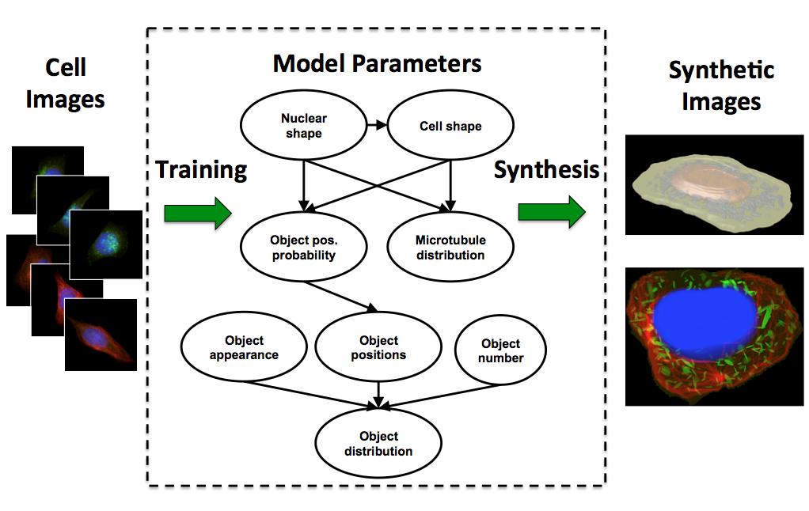

   CellOrganizer dependency structure

Synthesizing From Generative Models
-----------------------------------

**Related CellOrganizer demos:** Synthesis, demo2D00, demo3D01, demo3D05,
demo3D15, demo3DMultiresSynth, demo3DObjectAvoidance, demo3DDiffeoSynth\_gmm,
demo3DDiffeoSynth\_grid, demo3DDiffeoSynth\_grid\_pick,
demo3DDiffeoSynth\_uniform.

**Objectives** To teach the basics of to synthesize images from generative
instances from models learned from imaging data.

**Procedure**\ Using the model created in the previous section you will now
synthesize *in silico* cells. To do this you will use the Synthesis template.
Enter ``edit Synthesis`` into the Command Window to open the template. The file
will read as follows

::

    function Synthesis(modelPath,savePath,numSynthImgs)

If you are using the model created in the previous section set the modelpath
input to:

::

    >>modelpath = {'./tutorialModel.mat'};

Next, set the location you would like to save the results. Again, this is just
a string for example ``savepath = '.';`` will save the resulting instances in
the current directory.

Lastly you must set the number of images you would like to sample from the
model. To start you may want to set ``numSynthImgs = 1;``.

Now you are ready to generate an instance from your generative model.  Type:

::

    >>Synthesis(modelPath,savePath,numSynthImgs);

This should take a minute or two and generate an image from your model that is
saved in the location you specified. This should produce a set of 3D tif images
that resemble the slice in figure :num:`Fig. #slice` below.

.. _slice:

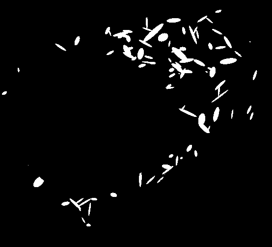

   Single slice from generated LAMP2 pattern

Synthesizing multiple models
~~~~~~~~~~~~~~~~~~~~~~~~~~~~

To create an instance containing multiple protein patterns we will simply
assign multiple models to the modelpath. For example:

::

     modelpath = {'./models/model1.mat','../models/model2.mat'};

.. note:: The synthesized models will use the cell and nuclear models contained
   in the first model in the model list.**

Synthesizing from diffeomorphic models
~~~~~~~~~~~~~~~~~~~~~~~~~~~~~~~~~~~~~~

By default, instances from diffeomorphic models are sampled according to the
approximate probability density of the cells and can be synthesized with the
above ``Synthesis(...)`` command. In addition to the implicit non-parametric
density sampling, CellOrganizer offers demos to illustrate other sampling
methods, each of which demonstrate different methods of representing the shape
space.

::

    >>demo3DDiffeoSynth_gmm

Marginalizes out the all but the first two dimensions of the shape space
and learns a gaussian mixture model over the positions of training
images and samples points from this parametric representation.

::

    >>demo3DDiffeoSynth_grid

Synthesizes images from a grid over the first three dimensions of the shape
space.

::

    >>demo3DDiffeoSynth_grid_pick

Displays to the user a two-dimensional representation of the shape space and
allows the user to select a points to be synthesized.

::

    >>demo3DDiffeoSynth_uniform

Selects a point uniformly at random from the complete shape space.

Additional synthesis options
~~~~~~~~~~~~~~~~~~~~~~~~~~~~

Once you have started synthesizing your model, you may want to explore some of
the other synthesis options available in CellOrganizer. Below are a few of the
more commonly modified options available. If you modify the template file for
your specific uses it is recommended that you save a new version of the file
for your specific case.

The following options are editable via the param structure in CellOrganizer.
**synthesis** - This parameter is string assigned to ’nuclear’,’framework’, or
’all’. If set to ’nuclear’, only the nuclear model will be trained. Framework
will train the nuclear and cell model and ’all’ will train the framework plus a
vesicular model.\ **output** - This is a structure that contains several flags
for different types of outputs including ’SBML’,’tifimages’,and ’indexedimage’.

Reading SBML and creating SBML-spatial models
---------------------------------------------

**Related CellOrganizer demos:** demo3DSBML, demo3DPrimitives, demo3D13,

**Objectives** To learn how to use an SBML file to automatically generate the
necessary geometries for a realistic cellular simulation.

**Procedure**\ To create a SBML-spatial biochemical system for the SBML file
generated during part two, you will use demo3DSBMLTutorial. Open this file by
typing ``edit demo3DSBMLTutorial`` in the Command Window and you will see:

.. _gmmdemo:

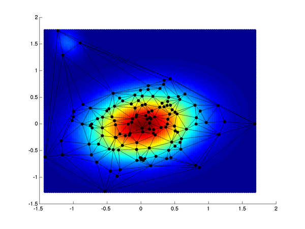

   Diffeomorphic shape space with implicit distribution modeled as a gaussian
   mixture model with 2 components. Color indicates relative probability
   density, black circles indicate training images in the shape space. In the
   non-parametric density representation, each simplex (triangle) contains the
   probability mass.

::

    demo3DSBMLTutorial(SBMLpath,coreSTD,renderSTD).

This demo will read in an SBML file like the one you created in the previous
section, attempt to find models that correspond to the compartments in the SBML
file, and synthesize images from the appropriate models. This is a modified
version of the demo3DSBML file included in the CellOrganizer release. It has
been modified to allow you to run the model in a reasonable time.

To use this demo, set the

::

    SBMLpath = './SampleData/motivating_example/Motivating_example_cBNGL2_sbml.xml';

The other two parameters determine how much overlap you will allow the objects
to have and how big they will be respectively. If the coreSTD is set equal to
the renderSTD the objects will not overlap at all, but synthesis will be
dramatically slowed. For demonstration purposes set the ``coreSTD = 0.5;`` and
the ``{renderSTD = 1;`` to allow the simulation to run quickly. To ensure no
overlap at all, set ``coreSTD = renderSTD;``.

To automatically select the models and generate an SBML-spatial+SBML instance.
Enter:

::

      demo3DSBMLTutorial(SBMLpath,coreSTD,renderSTD)

.. note:: The standard demo3DSBML synthesis will take much longer since it
   synthesizes high resolution 3D images with no object overlapping allowed.

Creating SBML-spatial files from previously synthesized geometries
~~~~~~~~~~~~~~~~~~~~~~~~~~~~~~~~~~~~~~~~~~~~~~~~~~~~~~~~~~~~~~~~~~

Sometimes it is very useful to create an SBML-spatial file of just a
pre-synthesized geometry. For example, you may want to use the synthesized
geometries in the provided ``SampleData`` folder to create framework meshes. To
do this you will use ``demo3DImg2SBML``. This demo takes in a cell array of
images you wish to create SBML-spatial meshes for. It also takes a resolution
at which the images were synthesized at.

Analyzing spatially realistic simulations
-----------------------------------------

**Objectives** Now that you’ve become familier with all the tools used to
create your simulations run during Part 2, we will analyze the results of these
data.

Plotting time series reactions
~~~~~~~~~~~~~~~~~~~~~~~~~~~~~~

To plot the results of your MCell simulations we will use the ``{plotMCell}``
function. This function takes only one argument ``{datapath}`` which is a
string pointing to the ’react\_data/seed\*/’ folder created by MCell. Where
"seed\*" is whatever seed you wish to analyze(e.g. seed\_00001). This function will find all the reaction data you have written out from MCell for the
selected seed, create and save a count vs time plot for each species. These
plots will look like :num:`Fig. #lboundem` below.

.. _lboundem:

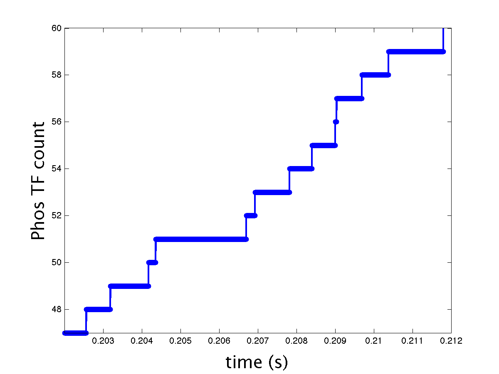

   MCell output of the number of phosphorilated transcription factors vs time
   (s)

Analyzing cellular organization
-------------------------------

To compare multiple MCell simulations for a specific species, assuming that the simulations have the same outputs (as in the case of this tutorial) use the ``plotMCellCompare`` function. This function takes three arguments. The first ``datapath`` is similar to the plotMCell function but is a cell array of strings pointing to the paths you wish to compare. For example here we may wish to specify ``\{datapath = 'cell1/react\_data/seed0001\/','cell2/react\_data/seed0001\/'\}``. The second argument here is the species you wish to compare as a number in the file list. For example, in this tutorial Phos_TF would be file number ``19``. The resulting figure is a plot of the requested species for all the cells requested as seen in :num: `Fig. #phosTFcomp` below.

.. _phosTFcomp:

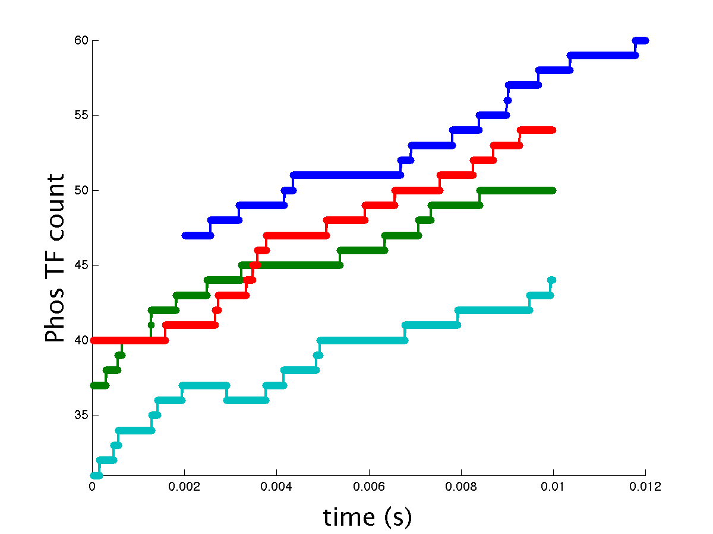

    Comparison of the phosphorilation of transcription factors for four cells from throughout a shape-space of HeLa cells.

To visualize these results with respect to their location in shape-space you can use the function ``showCurrentCells(positionpath,imgpath,currcells)``. Here ``positionpath`` specifies the path to the 'selectedPositions.mat' file generated by ``demo3DDiffeoSynth_grid_pick``. Similarly, ``imgpath`` is the path to the output images from this demo using a wildcard string for example: './demo3DDiffeoSynth_grid_pick*'. Lastly, ``currcells`` specifies the cell numbers you currently have data for or that you plotted using ``plotMCellCompare``. Here you should take care to specify these cells in the same order as you did in ``plotMCellCompare`` to ensure the colors across the graphs line up. The resulting figure is a shapespace of the original cells in grey, the specified cells in the color corresponding to their result from ``plotMCellCompare`` and the remaining synthetic cells for which you are currently not comparing data in yellow as seen in :num: `Fig. #shapeSpaceComp` below. 

.. _shapeSpacecomp:

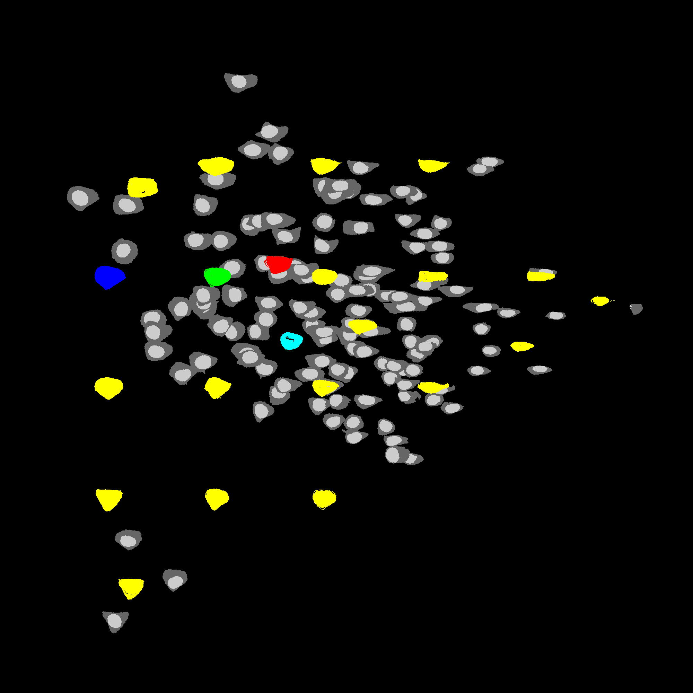

   Cells corresponding to the simulated cells in :num: `Fig #phosTFcomp` allow easy comparison for trends in cellular response across the shape-space.

.. [#f1] Harris, Leonard A., Justin S. Hogg, and James R. Faeder.
   "Compartmental rule-based modeling of biochemical systems." Winter
   Simulation Conference. Winter Simulation Conference, 2009.

.. [#f2] T. Peng, Wei Wang, G. K. Rohde1, R. F. Murphy (2009) Instance-Based
   Generative Biological Shape Modeling. Proceedings of the 2009 IEEE
   International Symposium on Biomedical Imaging (ISBI 2009), pp. 690-693.

.. [#f3] T. Peng and R.F. Murphy (2011) Image-derived, Three-dimensional
   Generative Models of Cellular Organization. Cytometry Part A 79A:383-391.
