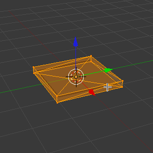
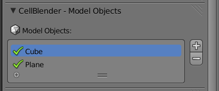
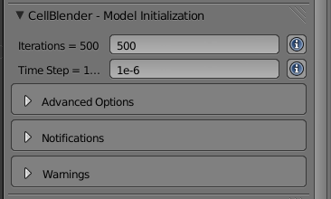
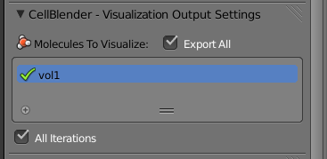

.. _clamp:

.. index::
   single: CLAMP_CONC

*********************************************
Clamp Concentration
*********************************************

.. Git Repo SHA1 ID: 3520f8694d61c81424ff15ff9e7a432e42f0623f

.. note::

    The simulations and visualizations in this tutorial were generated using
    Blender 2.70a and CellBlender 1.0. It may or may not work with other
    versions.

A concentration clamp lets you maintain a constant concentration of a molecule
at a surface. This is done by creating and destroying molecules at the surface.
Clamp concentrations are created and applied like all the other surface classes
(e.g. absorptive, transparent).

To create this model, we'll begin by making two meshes, one which will have the
concentration clamp applied (plane) and the other will prevent molecules from
diffusing away from the surface (thin cube).

Start New Project
---------------------------------------------

Start Blender. Hit the **Scene** button in the **Properties Editor**. 

.. image:: ./images/scene_button.png

The project directory is set to be wherever the current blend file is saved.
Let's save the file right now by hitting **Ctrl-s**, typing
**~/mcell_tutorial/clamp** (or **C:\\mcell_tutorial\\clamp** on Windows) into the
directory field, **clamp.blend** into the file name field, and hit the **Save
As Blender File** button.

Modify Cube and Create Plane
---------------------------------------------

Hit **z** to switch to wireframe mode. With the **Cube** selected, hit **s**,
**z**, **0.1**, and **Enter**.
 
.. image:: ./images/clamp/scale_cube.png

Hit **Tab** to change into **Edit Mode**. Hit **Ctrl-t** to triangulate the
faces of the **Cube**.

Hit **Tab** to switch back into **Object Mode**.

Hit **Shift-a**, select **Mesh>Plane**. Hit **s**, **0.9**, and **Enter**.

.. image:: ./images/clamp/plane.png

Define and Assign a Surface Region
---------------------------------------------

Hit the **Object** button in the **Properties Editor** (little cube in the
right side panel).

.. image:: ./images/object_button.png

Expand the **Define Surface Regions** panel. Hit the **+** button to create a
new region. Change the text field which reads **Region_0** to **clamp_sr**. 

.. image:: ./images/clamp/clamp_sr.png

Move the cursor to the **3D View Editor**. Hit **Tab** to change into **Edit
Mode**. Hit **Ctrl-t** to triangulate the faces.

.. image:: ./images/clamp/triangulate_plane.png

Under the **Define Surface Regions** panel, click **Assign**. Hit **Tab** to
change back into **Object Mode**. Hit the **Scene** button in the **Properties
Editor**.

.. image:: ./images/scene_button.png

Add Plane and Cube to Model Objects List
---------------------------------------------

The **Plane** should still be selected, but we also want to select the
**Cube**. Hold **Shift** and **right click** on the **Cube**.

.. image:: ./images/clamp/select_both.png

Expand the **Model Objects** panel and hit the **+** button. This will add the
**Cube** and the **Plane** to the list of mesh objects to be included in the
MCell simulation.

Set Model Parameters and Define Molecule
---------------------------------------------

Expand the **Model Initialization** panel.

* Change **Iterations** to **500**.
* Change **Time Step** to **1e-6**.

Expand the **Define Molecules** panel, hit the **+** button, and make the
following changes:

* Change the **Molecule Name** to **vol1**.
* Change the **Molecule Type** to **Volume Molecule**.
* Change the **Diffusion Constant** to **1e-6**.

.. image:: ./images/clamp/vol1.png

Add the Surface Class
---------------------------------------------

Expand the **Define Surface Classes** panel. Then, hit the **+** button to
create a new surface class called **Surface_Class**. Rename it to
**clamp_sc**.

Hit the **+** button beside the empty **clamp_sc Properties** list. Set the
following properties:

* Select **vol1** from the **Molecule Name** field.
* Change the **Orientation** drop-down box to **Ignore**.
* Set **Type** to **Clamp Concentration**. 
* Set **Value** to **1e-5**.

.. image:: ./images/clamp/clamp_sc.png

Modify the Surface Regions
---------------------------------------------

Now that we have created our surface class, we need to assign it to our mesh.
Expand the **Modify Surface Regions** panel. Hit the **+** to begin modifying a
surface region.

* In the **Surface Class Name** field, select **clamp_sc**.
* Under **Object Name**, select the newly created **Plane** object.
* For **Region Name**, select **clamp_sr**.

.. image:: ./images/clamp/mod_surf_reg.png

Create Reaction Output
---------------------------------------------

Expand the **Reaction Output Settings** panel and hit the **+** button.  Select
**vol1** in the **Molecule** drop-down search box.

.. image:: ./images/clamp/count_vol1.png

Create Visualization Output
---------------------------------------------

Expand the **Visualization Output Settings** panel and hit the **Export All**
button.

Examine the MDLs (Optional)
---------------------------------------------

Open the file called **Scene.surface_classes.mdl**, and you should see the
following:

.. code-block:: mdl
    :emphasize-lines: 3

    DEFINE_SURFACE_CLASSES 
    {
        clamp_sc {CLAMP_CONC vol1 = 1E-5}
    }

Notice, this is similar to how we defined surface classes previously, except we
are also specifiying a concentration in addition to a surface class type and
molecule species.

Now, open the filed called **Scene.mod_surf_regions.mdl**, and you should
see the following:

.. code-block:: mdl
    :emphasize-lines: 5

    MODIFY_SURFACE_REGIONS 
    {
        Plane[clamp_sr] 
        {
            SURFACE_CLASS = clamp_sc
        }
    }

Assigning a concentration clamp to a region works the same as it does for any
other surface class.

Annotate the MDLs (Optional)
---------------------------------------------

Finally, open the file called **Scene.rxn_output.mdl** and *add* the
highlighted line that contains the **ESTIMATE_CONC** command:

.. code-block:: mdl
    :emphasize-lines: 4

    REACTION_DATA_OUTPUT 
    {
        STEP=time_step
        {COUNT[vol1,World.Plane,ESTIMATE_CONC]}=> "./react_data/vol1.dat"
    }

The only new commands used in this section and the last are **CLAMP_CONC** and
**ESTIMATE_CONC**.  **CLAMP_CONC** is applied like any other surface class,
except that the molarity of a certain molecule is specified. **ESTIMATE_CONC**
is used in a count statement after an object or region, and (unsurprisingly)
estimates the concentration at that location. 

.. note::

    The units for these two commands are different; CLAMP_CONC is M and
    ESTIMATE_CONC is uM.

Run the Simulation
---------------------------------------------

If you didn't annotate the MDLs, then you can run the simulation as you
normally would from within CellBlender.

Otherwise, run the simulation at the command line by typing::

    mcell Scene.main.mdl

.. note::

   You can also run this from within Blender, but you have to decouple
   exporting and running the simulation under the CellBlender Preferences
   panel. Otherwise, you will write over the changes you just made to
   Scene.reaction_output.mdl

Visualize the Results
---------------------------------------------

Once the simulation has finished running, hit **Read Viz Data** under the
**Visualize Simulation Results** panel. Hit **Alt-a** to play the animation.
You may also want to plot the results under the **Reaction Output Settings**
panel.

In this example, we clamped the concentration of **vol1** at a molarity of
**1E-5** M. If you annotated the MDL in the previous example, then when you
plot or visualize the results, you'll notice that the concentration of
molecules increases for a period of time and then reaches a steady state near
10 uM, which is what we would expect given what we asked for in the
**CLAMP_CONC** command. 

