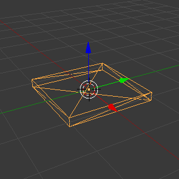
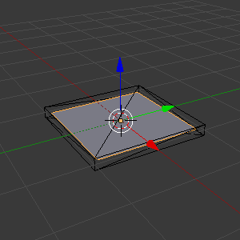
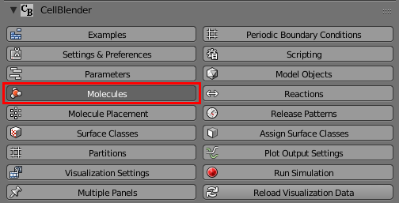
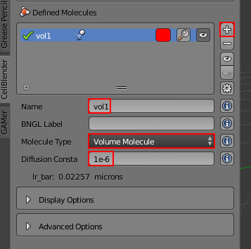
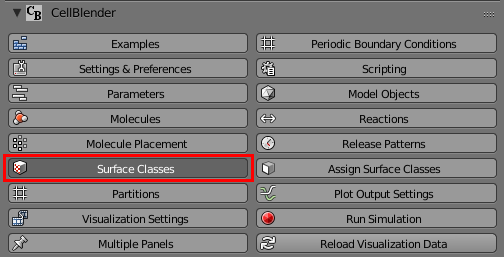
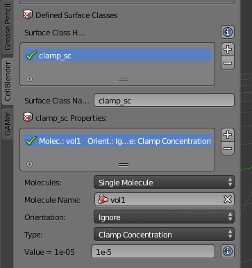
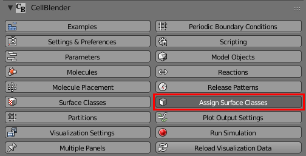
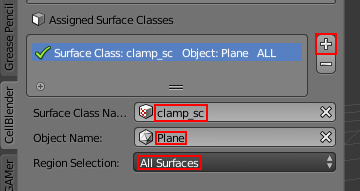
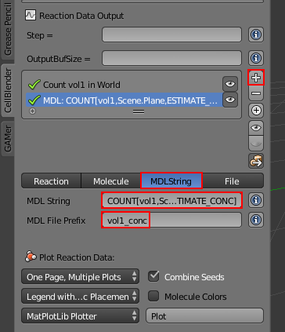

.. _clamp:

.. index::
   single: CLAMP_CONC

*********************************************
Clamp Concentration
*********************************************

A concentration clamp lets you maintain a constant concentration of a molecule
at a surface. This is done by creating and destroying molecules at the surface.
Clamp concentrations are created and applied like all the other surface classes
(e.g. absorptive, transparent).

To create this model, we'll begin by making two meshes, one which will have the
concentration clamp applied (plane) and the other will prevent molecules from
diffusing away from the surface (thin cube).

Start New Project
---------------------------------------------

After you start Blender, save the file (and set the project directory) by
hitting **Ctrl-s**, typing **~/mcell_tutorial/clamp** (or
**C:\\mcell_tutorial\\clamp** on Windows) into the directory field,
**clamp.blend** into the file name field, and hit the **Save As Blender File**
button.

Create Cube and Plane
---------------------------------------------

* Hit the **Model Objects** button.

  .. image:: ./images/shared/button_panels/objects_panel_h.png

* Hit the cube button
* Hit the **+** button to add the cube to the **Model Objects** list.
* Expand the **Cube Object Options** sub-panel.
* Change the draw type from **Solid** to **Wire**.
* In the 3D View Window, with the **Cube** selected, hit **s**, **z**, **0.1**,
  and **Enter**.
 

* Hit the plane button.
* Hit the **+** button to add the plane to the **Model Objects** list.
* In the 3D View Window, with the plane selected, hit **s**, **0.9**, and
  **Enter**.

* Hit the **Molecules** button.

* Hit the **+** button to create a new molecule.
* Change the **Molecule Name** to **vol1**.
* Change the **Molecule Type** to **Volume Molecule**.
* Change the **Diffusion Constant** to **1e-6**.

Add the Surface Class
---------------------------------------------

* Hit the **Surface Classes** button.

* Hit the **+** button to create a new surface class called **Surface_Class**.
* Rename it to **clamp_sc**.
* Hit the **+** button beside the empty **clamp_sc Properties** list. Set the
  following properties:

  * Select **Single Molecule** from the **Molecules** field.
  * Select **vol1** from the **Molecule Name** field.
  * Change the **Orientation** drop-down box to **Ignore**.
  * Set **Type** to **Clamp Concentration**. 
  * Set **Value** to **1e-5**.

Assign the Surface Class
---------------------------------------------

Now that we have created our surface class, we need to assign it to our mesh.

* Hit the **Assign Surface Classes** button.

* Hit the **+** to begin adding a new surface class.
* In the **Surface Class Name** field, select **clamp_sc**.
* Under **Object Name**, select the newly created **Plane** object.
* Leave **All Surfaces** set for **Region Selection**.

Create Reaction Output
---------------------------------------------

* Hit the **Plot Output Settings** button.
* Hit the **+** button with a circle around it. This button will add a count
  statement for every molecule defined, which is just **vol1** in this
  instance.

* Hit the regular **+** button.
* Select **MDLString**.
* In the **MDL String** field, put the following:
  **COUNT[vol1,Scene.Plane,ESTIMATE_CONC]**
* In the **MDL File Prefix** field, type **vol1_conc**.

Examine the MDLs (Optional)
---------------------------------------------

Open the file called **Scene.surface_classes.mdl**, and you should see the
following:

.. code-block:: mdl
    :emphasize-lines: 3

    DEFINE_SURFACE_CLASSES 
    {
        clamp_sc {CLAMP_CONC vol1 = 1E-5}
    }

Notice, this is similar to how we defined surface classes previously, except we
are also specifiying a concentration in addition to a surface class type and
molecule species.

Now, open the filed called **Scene.mod_surf_regions.mdl**, and you should
see the following:

.. code-block:: mdl
    :emphasize-lines: 5

    MODIFY_SURFACE_REGIONS 
    {
        Plane[clamp_sr] 
        {
            SURFACE_CLASS = clamp_sc
        }
    }

Assigning a concentration clamp to a region works the same as it does for any
other surface class.

Finally, open the file called **Scene.rxn_output.mdl** and note the highlighted
line that contains the **ESTIMATE_CONC** command:

.. code-block:: mdl
    :emphasize-lines: 5

    REACTION_DATA_OUTPUT
    {
      STEP=1e-6
      {COUNT[vol1,WORLD]}=> "./react_data/seed_" & seed & "/vol1.World.dat"
      {COUNT[vol1,Scene.Plane,ESTIMATE_CONC]} =>  "./react_data/seed_" & seed & "/vol1_conc_MDLString.dat"
    }

The only new commands used in this section and the last are **CLAMP_CONC** and
**ESTIMATE_CONC**. **CLAMP_CONC** is applied like any other surface class,
except that the molarity of a certain molecule is specified. **ESTIMATE_CONC**
is used in a count statement after an object or region, and (unsurprisingly)
estimates the concentration at that location. 

.. note::

    The units for these two commands are different; CLAMP_CONC is M and
    ESTIMATE_CONC is uM.

Run the Simulation
---------------------------------------------

* Save the Blender file (**Ctrl-s**).
* Hit the **Run Simulation** button.
* Change the number of iterations to **500**.
* Lastly, hit the **Export & Run** button.

Visualize the Results
---------------------------------------------

Once the simulation has finished running, hit **Reload Visualization Data**.
Hit **Alt-a** to play back the animation.

In this example, we clamped the concentration of **vol1** at a molarity of
**1E-5** M. If you annotated the MDL in the previous example, then when you
plot or visualize the results, you'll notice that the concentration of
molecules increases for a period of time and then reaches a steady state near
10 uM, which is what we would expect given what we asked for in the
**CLAMP_CONC** command. 

