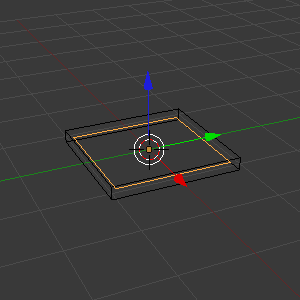
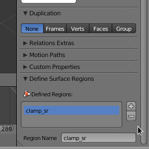
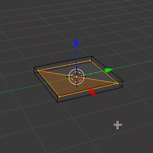
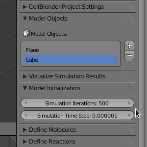
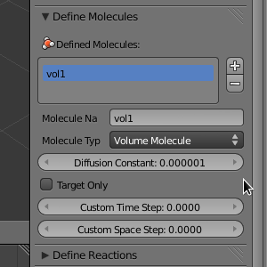

.. _clamp:

.. index::
   single: CLAMP_CONC

*********************************************
Clamp Concentration
*********************************************

.. CellBlender Source ID = 55f468aa7b71e044b3b199786f5af1d83bb3cab8
   Git Repo SHA1 ID: 76c4b2c18c851facefad7398f3f9c86a0abb8cdc

.. note::
    The simulations and visualizations in this tutorial were generated using
    Blender 2.67 and CellBlender 0.1.57. It may or may not work with other
    versions.

Clamp concentration lets you maintain a constant concentration of a molecule at
a surface. This is done by creating and destroying molecules at the surface.
**CLAMP_CONC** is created and applied like other surface classes (e.g.
**ABSORPTIVE**). We'll begin by making two meshes, one which will have the
**CLAMP_CONC** applied and the other will prevent molecules from diffusing away
from the surface.

Set Project Settings
---------------------------------------------

Start Blender. Hit the **Scene** button in the **Properties Editor**. 

.. image:: ./images/scene_button.png

If you haven't saved the path to the MCell binary in your startup file, you'll
need to set it under the **Project Settings** panel. For more detailed
instructions, see :ref:`getting_started`.

The project directory is set to be wherever the current blend file is saved.
Let's save the file right now by hitting **Ctrl-s**, typing
**/home/user/mcell_tutorial/clamp** (where **user** is your user name) into the
directory field, **intro.blend** into the file name field, and hit the **Save
As Blender File** button.

Creating the Model with Blender
---------------------------------------------

Hit **z** to switch to wireframe mode.  With the **Cube** selected, hit **s**,
**z**, **0.1**, and **Enter**.
 
.. image:: ./images/clamp_scale_cube.png

Hit **Tab** to change into **Edit Mode**. Hit **Ctrl-t** to triangulate the
faces of the **Cube**.

.. image:: ./images/clamp_triangulate_cube.png

Hit **Tab** to switch back into **Object Mode**.

Hit **Shift-a**, select **Mesh>Plane**. Hit **s**, **0.9**, and **Enter**.

Hit the **Object** button in the **Properties Editor** (little cube in the
right side panel).

.. image:: ./images/object_button.png

Expand the **Define Surface Regions** panel. Hit the **+** button and **New
Region** should appear in the list of regions. Change the text field which
reads **New Region** to **clamp_sr**. 

Move the cursor to the **3D View Editor**. Hit **Tab** to change into **Edit
Mode**. Hit **Ctrl-t** to triangulate the faces.

Under the **Define Surface Regions** panel, click **Assign**. Hit **Tab** to
change back into **Object Mode**. Hit the **Scene** button in the **Properties
Editor**.

.. image:: ./images/scene_button.png

The **Plane** should still be selected, but we also want to select the
**Cube**. Hold **Shift** and **right click** on the **Cube**.

.. image:: ./images/clamp_select_both.png

Expand the **Model Objects** panel and hit the **+** button. This will add the
**Cube** and the **Plane** to the list of mesh objects to be exported and
initialized. Expand the **Model Initialization** panel. Change **Simulation
Iterations** to **500**. Change **Simulation Time Step** to **1e-6**.

Expand the **Define Molecules** panel and hit the **+** button. Change the
**Molecule Name** to **vol1**, the **Molecule Type** to **Volume Molecule**,
and the **Diffusion Constant** to **1e-6**.

Add the Surface Class
---------------------------------------------

Expand the **Define Surface Classes** panel. Then, hit the **+** button to
create a new surface class called **Surface_Class**. Rename it to
**clamp_sc**.

Hit the **+** button beside the empty **clamp_sc Properties** list. Select
**vol1** from the **Molecule Name** field.  Change the **Orientation**
drop-down box to **Ignore**. Leave **Type** set to **Absorptive**. 

.. image:: ./images/clamp_sc.png

Modify the Surface Regions
---------------------------------------------

Now that we have created our surface class, we need to assign it to our mesh.
Expand the **Modify Surface Regions** panel. Hit the **+** to begin modifying a
surface region. In the **Surface Class Name** field, select **clamp_sc**.
Under object name, select the newly created **Plane** object. For **Region
Name**, select **clamp_sr**.

.. image:: ./images/clamp_mod_sr.png

.. _surf_class_run_vis:

Create Reaction Output
---------------------------------------------

Expand the **Reaction Output Settings** panel and hit the **+** button times.
Select **vol1** in the **Molecule** drop-down search box.

.. image:: ./images/clamp_reaction_output.png

Create Visualization Output
---------------------------------------------

Expand the **Visualization Output Settings** panel and hit the **Toggle All**
button. This will ensure that every molecule is included in the visualization
output data.

.. image:: ./images/clamp_viz.png

Examine and Annotate the MDLs
---------------------------------------------

Open the file called **Scene.surface_classes.mdl**, and you should see the
following:

.. code-block:: none
    :emphasize-lines: 3

    DEFINE_SURFACE_CLASSES 
    {
        clamp_sc {CLAMP_CONC vol1 = 1E-5}
    }

Notice, this is similar to how we defined surface classes previously, except we
are also specifiying a concentration in addition to a surface class type and
molecule species.

Now, open the filed called **Scene.mod_surf_regions.mdl**, and you should
see the following:

.. code-block:: none
    :emphasize-lines: 5

    MODIFY_SURFACE_REGIONS 
    {
        Plane[clamp_sr] 
        {
            SURFACE_CLASS = clamp_sc
        }
    }

Assigning a concentration clamp to a region works the same as it does for any
other surface class.

Finally, open the file called **Scene.rxn_output.mdl** and *add* the
highlighted line that contains the **ESTIMATE_CONC** command:

.. code-block:: none
    :emphasize-lines: 4

    REACTION_DATA_OUTPUT 
    {
        STEP=time_step
        {COUNT[vol1,World.Plane,ESTIMATE_CONC]}=> "./react_data/vol1.dat"
    }

The only new commands here are **CLAMP_CONC** and **ESTIMATE_CONC**.
**CLAMP_CONC** is applied like any other surface class, except that the
molarity of a certain molecule is specified. **ESTIMATE_CONC** is used in a
count statement after an object or region, and (unsurprisingly) estimates the
concentration at that location. *Note:* The units for these two commands are
different; **CLAMP_CONC** is M and **ESTIMATE_CONC** is uM.

Run the Simulation and Visualize the Results
---------------------------------------------

Run the mdl by entering the following command::

    mcell Scene.main.mdl

.. note::
   You can run this from within Blender, but you have to decouple exporting and
   running the simulation under the CellBlender Preferences panel. Otherwise,
   you will write over the changes you just made to Scene.reaction_output.mdl

Once the simulation has finished running, hit **Read Viz Data** under the
**Visualize Simulation Results** panel. Hit **Ctrl-a** to play the animation.
You may also want to plot the results under the **Reaction Output Settings**
panel. In this example, we clamp the concentration of **vol1** at a molarity of
**1E-5** M. When you plot or visualize the results, you'll notice that the
concentration of molecules increases for a period of time and then reaches a
steady state near 10 uM, which is what we would expect given what we asked for
in the **CLAMP_CONC** command. 

