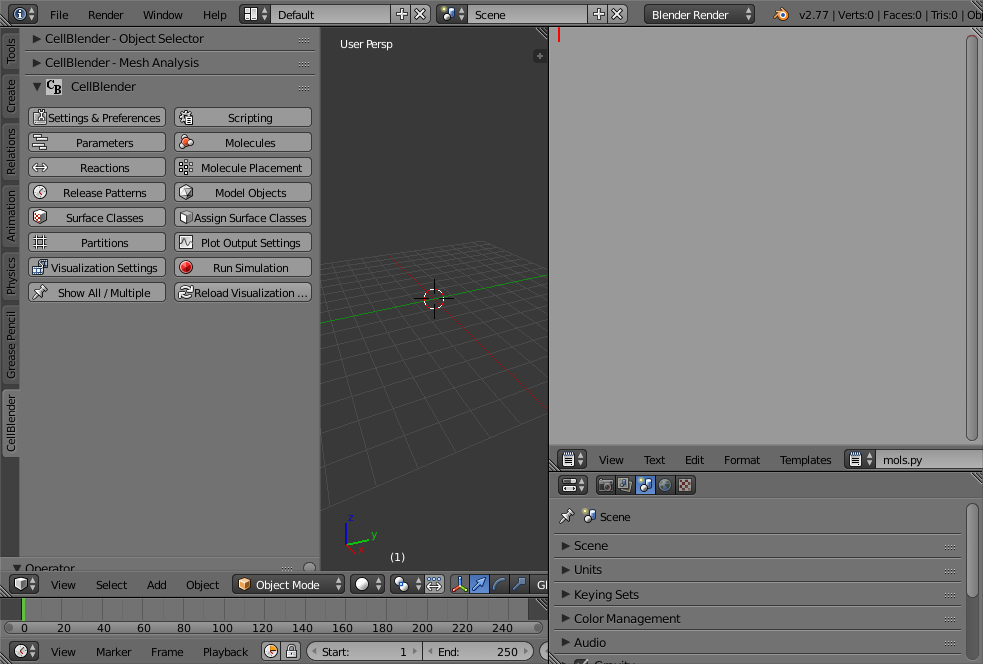
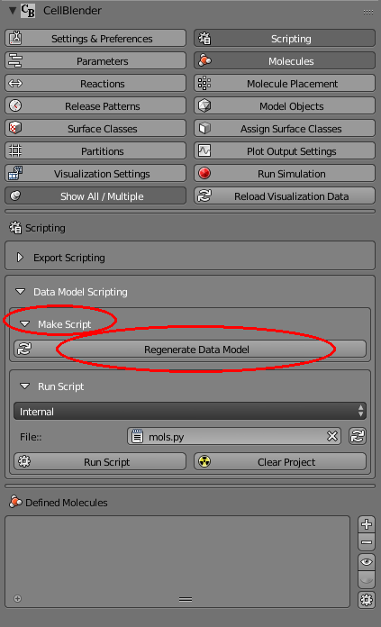
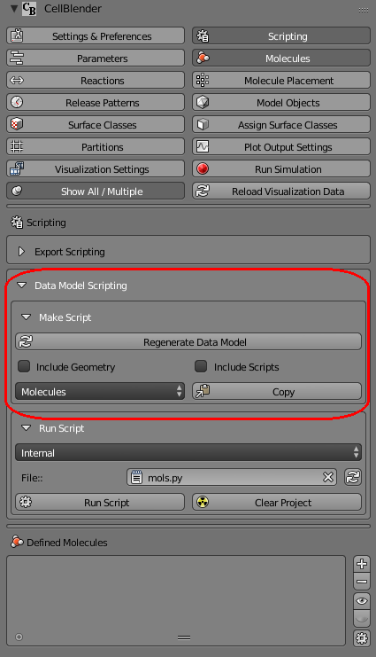
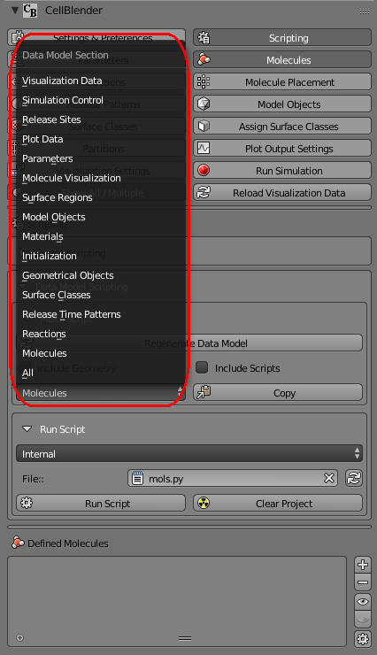
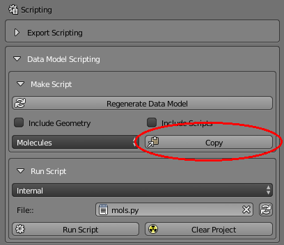
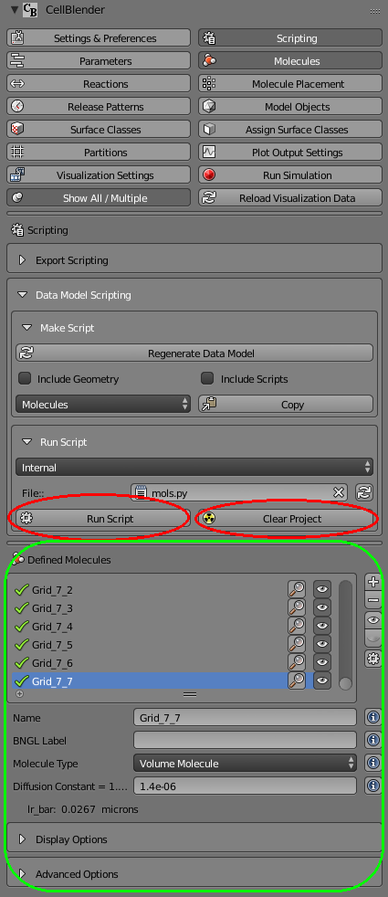
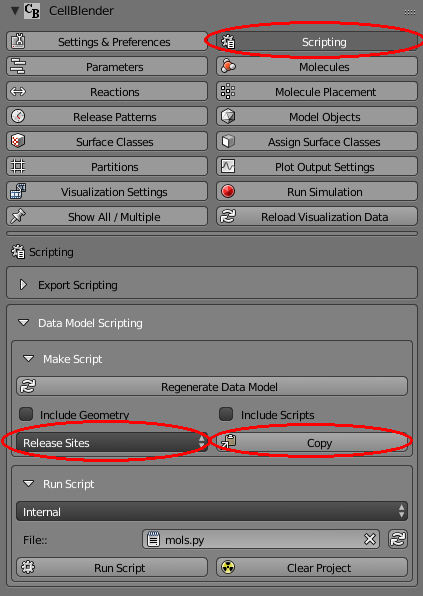

.. _data_model_scripting:

*********************************************
Data Model Scripting
*********************************************

.. Git Repo SHA1 ID: 3520f8694d61c81424ff15ff9e7a432e42f0623f

This tutorial guides you through building a simple script to create
a grid of molecules with different diffusion constants and released at
different locations in the x-y plane. This tutorial assumes that you are
already familiar with building a model using CellBlender, and that you have
some (minimal) Python programming experience. It also assumes some
familiarity with using Blender (resizing window panels, creating new
window panels, and using the Blender text editor).

.. note::

   The scripting interface is very new and subject to change.

You should start out with a newly initialized CellBlender model with
nothing defined (no molecules, reactions, objects, etc). Your screen
should look something like this:

.. image:: ./images/scripting/standard_startup_screen.png

The first thing you should do is reconfigure the Blender windows to
give yourself a good sized text editor. In this example, the normal
"outliner" in the upper right corner has been resized and changed to
a text editor containing a new file named "mols.py" (use the "+" button
to add the new file, then rename it to "mols.py" as shown below):

It's a good idea to name your scripting files to end with ".py" so they
can be found in the scripting window for running.

Now enter the following text (discussed below) into that text editing
window:

::

    import cellblender as cb
    dm = cb.get_data_model()
    mcell = dm['mcell']
    mols = mcell['define_molecules']
    mlist = mols['molecule_list']
    new_mol = {
      'mol_name':"vm",
      'mol_type':"3D",
      'diffusion_constant':"1e-8" }
    mlist.append ( new_mol )
    cb.replace_data_model ( dm )

It should look something like this:

.. image:: ./images/scripting/simple_one_mol_script.png

The first line in that script imports "cellblender" using the local
alias "cb". The *cellblender* module contains 4 handy functions for
data model scripting. By importing "cellblender" as "cb", these 4
functions will be available as "cb._______" as shown below:

 | *Handy Functions for Data Model Scripting:*

  +---------------------------+--------------------------------------------------------------------------------------+
  | **Function**              | **Description**                                                                      |
  +===========================+======================================================================================+
  | cb.get_data_model()       | Returns a copy of the current CellBlender Data Model                                 |
  +---------------------------+--------------------------------------------------------------------------------------+
  | cb.replace_data_model(dm) | Replaces the current CellBlender Data Model with dm                                  |
  +---------------------------+--------------------------------------------------------------------------------------+
  | cb.cd_to_project()        | Changes process directory path to project location (returns previous directory path) |
  +---------------------------+--------------------------------------------------------------------------------------+
  | cb.cd_to_location(loc)    | Changes process directory path to location passed in by "loc"                        |
  +---------------------------+--------------------------------------------------------------------------------------+

The second line of the script uses the "get_data_model" function to
get a copy of the current data model from CellBlender. This will be
a complete representation of the various data fields that define the
current CellBlender model. You can print the data model to the console
with **print(str(dm))** if you want to see all of its fields (more on
this later). For this first example, we won't use any of the information
in the existing data model, but we will add to it.

The 3rd, 4th, and 5th lines assign convenience variables
("mcell", "mols", and "mlist") to various subparts of the data model.
This isn't necessary, but makes the code easier to read.

The 6th through 9th lines define the new molecule as a dictionary
with keys for "mol_name", "mol_type", and "diffusion_constant". At
this point, you simply have to know that these are the proper key
strings, but later, we'll see how you can obtain them from an
existing data model.

The 10th line simply appends the newly created molecule dictionary
to the molecule list from line 5. Finally, the last line replaces the
CellBlender data model with the modified version named "dm". This
will repopulate all of the Blender/CellBlender properties throughout
the CellBlender user interface.

Note that this entire program could reasonably be written in 5 lines like this:

::

    import cellblender as cb
    dm = cb.get_data_model()
    new_mol = { 'mol_name':"vm", 'mol_type':"3D", 'diffusion_constant':"1e-8" }
    dm['mcell']['define_molecules']['molecule_list'].append ( new_mol )
    cb.replace_data_model ( dm )

The choice of creating convenience variables (as in the earlier example)
or not is mostly a matter of programming style.

You'll notice that there's a "Run Script" button in the header below the
text editing window. This can be used to run a data model script, but we
will use the "Run Script" button in the scripting panel. Start by opening
the Scripting Panel as shown here:

.. image:: ./images/scripting/show_scripting_panel_closed.png

Then expand (open) the "Data Model Scripting" and "Run Script" subpanels,
and click on the "refresh" button (to reload the File selector):

.. image:: ./images/scripting/show_scripting_panel_dm_open.png

Then click on the "File" selector and choose the "mols.py" file:

.. image:: ./images/scripting/selecting_mols_py_file.png

Before running the script, let's show both the molecules panel AND the
scripting panel at the same time. You can do this by clicking the
"Show All/Multiple" push pin button and then selecting both the Scripting
and Molecules buttons:

.. image:: ./images/scripting/single_mol_before_running_first.png

You'll notice that the "Defined Molecules" section is empty (No Molecules)
before you run the script. Then when you click the "Run Script" button, the
new molecule ("vm") should be added with all the settings you've given it:

.. image:: ./images/scripting/single_mol_after_running_first.png

Congratulations, you've just written and executed your first data model script!

Data Model Fields
---------------------------------------------

When we created our script, we had to "know" the names of the various
fields in the Data Model. We had to know that there was an "mcell" field
containing a "define_molecules" dictionary containing a "molecule_list"
holding the individual molecules. We also had to know the fields inside
the molecule ('mol_name', 'mol_type', and 'diffusion_constant'). We also
had to "know" the types of values that they took. Where is all of that
information documented?

The easy answer is that it's documented in the Data Model itself. We can
build whatever we want through CellBlender's normal panels (define molecules,
reactions, release sites, etc) and then examine their data model representations
to build our script.

Start by pressing the "Clear Project" button. This button will completely
remove all parts of your model (molecules, reactions, surface classes, etc):

.. image:: ./images/scripting/single_mol_clear_project.png

Now let's build a simple model that we can explore through the data model.
Our simple model will have one molecule type (named "A") with a diffusion
constant of 1e-7 and we will release 10 of them at the origin. Your panel
should look like this (with the "Molecules" panel and "Molecule Placement"
panel showing the settings):

.. image:: ./images/scripting/simple_model_definition.png

Then close the "Molecule Placement" panel and reopen the "Scripting" panel.
Open the "Make Script" subpanel (inside "Data Model Scripting") and click the 
"Regenerate Data Model" button:

That panel should then be showing a few new controls including a data model
section selector (typically defaults to showing "Molecules"):

If you click on the "Molecules" control, you'll see a pop up menu of all the
different data model sections in your current model.

Select the "Molecules" section because that's what we'd like to explore. Then
click the "Copy" button. This will copy the entire "Molecules" section of the
data model onto the clipboard.

Now go back to the text editing window and position your cursor at the end
(bottom) of the file (you might add a few carriage returns for spacing). Then
paste (Control-V or Edit/Paste) the clipboard data into the text editor.
You should see new text added (shown highlighted) in the text window:

.. image:: ./images/scripting/data_model_molecules_added.png

Here's the new code that was added:

::

    dm['mcell']['define_molecules'] = {
      'data_model_version' : "DM_2014_10_24_1638",
      'molecule_list' : [
        {
          'custom_space_step' : "",
          'custom_time_step' : "",
          'data_model_version' : "DM_2016_01_13_1930",
          'diffusion_constant' : "1e-7",
          'display' : {
            'color' : [0.800000011920929, 0.800000011920929, 0.800000011920929],
            'emit' : 0.0,
            'glyph' : "Cone",
            'scale' : 1.0
          },
          'export_viz' : False,
          'maximum_step_length' : "",
          'mol_bngl_label' : "",
          'mol_name' : "A",
          'mol_type' : "3D",
          'target_only' : False
        }
      ]
    }

You'll notice that it contains the same structure as before (an "mcell"
dictionary containing a "define_molecules" dictionary containing a 
"molecule_list" list). And inside the molecule, you'll see the familiar
fields: 'mol_name' and 'diffusion_constant'. But you'll also see all of
the other fields that were defined when you created your "A" molecule
within the CellBlender interface. This provides an easy way to see how
to program all of the settings within the CellBlender interface.

For our purposes in this tutorial, we want to create a script that will
generate a grid of molecules with different diffusion constants in the
x-y plane. For simplicity, we'll set the diffusion constant proportional
to the sum of the x and y coordinates. We'll name each molecule according
to its x and y locations. Assuming an 8x8 grid the outline of our code
would look like this:

::

    for x in range(8):
      for y in range(8):
        mol_name = "Grid_" + str(x) + "_" + str(y)
        diffusion_constant = 1e-7 * (x + y)
        # Create a molecule here

So what goes in the "Create a molecule here" section? It's exactly
what we got from the data model with the substitution of our
calculated molecule names and diffusion constants.

Here's what that code looks like:

::

    import cellblender as cb
    dm = cb.get_data_model()

    mcell = dm['mcell']
    mols = mcell['define_molecules']
    mlist = mols['molecule_list']

    for x in range(8):
      for y in range(8):

        mol_name = "Grid_" + str(x) + "_" + str(y)
        diffusion_constant = 1e-7 * (x + y)

        # Create a molecule here

        new_mol = {
          'custom_space_step' : "",
          'custom_time_step' : "",
          'data_model_version' : "DM_2016_01_13_1930",
          'diffusion_constant' : str(diffusion_constant),
          'display' : {
            'color' : [0.8, 0.8, 0.8],
            'emit' : 0.0,
            'glyph' : "Cube",
            'scale' : 1.0
          },
          'export_viz' : False,
          'maximum_step_length' : "",
          'mol_bngl_label' : "",
          'mol_name' : mol_name,
          'mol_type' : "3D",
          'target_only' : False
        }
        mlist.append ( new_mol )

    cb.replace_data_model ( dm )

You'll notice that we rounded the colors from 0.80000... down to 0.8,
and changed the glyph from the default "Cone" to "Cube". We also
substituted "mol_name" where we previously used "A", and we
replaced our fixed diffusion constant of "1e-7" with a string version
of the diffusion constant that we calculated. We could tell it had to
be a string because it was already a string in the data model that we
copied from CellBlender.

We also moved the "cb.replace_data_model(dm)" call to the end (where
it belongs). This gives us the general flow from top to bottom:

::

    1. Import cellblender
    2. Get the data model
    3. Create convenience variables
    4. Modify the data model lists and dictionaries
    5. Replace the data model

Now we can clear the project, and run the script:

As shown, you should see a bunch of molecules that have been created
with names ranging from "Grid_0_0" to "Grid_7_7". If you browse
through them, you'll see diffusion constants ranging from 0.0 up to
1.4e-6.

Note that if you run the script a second time without pressing the
"Clear Project" button, you will be attempting to create duplicate
molecules, and you'll see lots of "Duplicate Molecule" errors (try
it and see). If that happens, just clear the project and run the
script again. If this script was intended to add on to an existing
model, it could check the data model first to see which molecules
already existed before recreating them or build a dictionary of
existing names and generate new names not in the dictionary. In
our case, we're not trying to add to an existing model, so we can
just clear the existing project every time we run.

Now that we've defined all of our molecules, we need to release
them at the coordinates of our grid. How do we find out how to
script release sites? Just as with the molecules, we can create
one in CellBlender, and then copy it to the clipboard and paste
it into our script. Then we can modify it as needed.

Our panels are getting a little crowded, so release the "Show All / Multiple"
push pin and open just the "Molecule Placement" panel. Then click the "+"
button to add a new molecule release site:

.. image:: ./images/scripting/data_model_empty_molecule_placement.png

Change it to release molecule "Grid_0_0" and set the Quantity to 10:

.. image:: ./images/scripting/data_model_molecule_release_settings.png

Now let's copy the data model definitions from our new release site to
the clipboard by opening the Scripting panel and choosing the "Release Sites"
selection. Then click the copy button to make a copy on the clipboard:

Then we can go to the bottom of our script and paste these release
site definitions into our code (it's good to add a few blank lines
to separate the new section of text). Here's what that looks like in
the text editor with the new code highlighted:

.. image:: ./images/scripting/data_model_release_sites_selected.png

Here's the new code that was just pasted:

::

    dm['mcell']['release_sites'] = {
      'data_model_version' : "DM_2014_10_24_1638",
      'release_site_list' : [
        {
          'data_model_version' : "DM_2015_11_11_1717",
          'location_x' : "0",
          'location_y' : "0",
          'location_z' : "0",
          'molecule' : "Grid_0_0",
          'name' : "Release_Site_1",
          'object_expr' : "",
          'orient' : "'",
          'pattern' : "",
          'points_list' : [],
          'quantity' : "10",
          'quantity_type' : "NUMBER_TO_RELEASE",
          'release_probability' : "1",
          'shape' : "CUBIC",
          'site_diameter' : "0",
          'stddev' : "0"
        }
      ]
    }

There are a number of ways to integrate this into our existing code. We could
integrate it into the existing loop or add a second loop. In this case, we'll
integrate it into the existing loop. Here's the code:

::

    import cellblender as cb
    dm = cb.get_data_model()

    mcell = dm['mcell']

    mols = mcell['define_molecules']
    mlist = mols['molecule_list']

    rels = mcell['release_sites']
    rlist = rels['release_site_list']

    for x in range(8):
      for y in range(8):

        mol_name = "Grid_" + str(x) + "_" + str(y)
        diffusion_constant = 1e-7 * (x + y)

        # Create a molecule here

        new_mol = {
          'custom_space_step' : "",
          'custom_time_step' : "",
          'data_model_version' : "DM_2016_01_13_1930",
          'diffusion_constant' : str(diffusion_constant),
          'display' : {
            'color' : [0.8, 0.8, 0.8],
            'emit' : 0.0,
            'glyph' : "Cube",
            'scale' : 1.0
          },
          'export_viz' : False,
          'maximum_step_length' : "",
          'mol_bngl_label' : "",
          'mol_name' : mol_name,
          'mol_type' : "3D",
          'target_only' : False
        }
        mlist.append ( new_mol )
        
        # Create a release site here

        new_rel = {
          'data_model_version' : "DM_2015_11_11_1717",
          'location_x' : str(x),
          'location_y' : str(y),
          'location_z' : "0",
          'molecule' : mol_name,
          'name' : "Rel_" + mol_name,
          'object_expr' : "",
          'orient' : "'",
          'pattern' : "",
          'points_list' : [],
          'quantity' : "10",
          'quantity_type' : "NUMBER_TO_RELEASE",
          'release_probability' : "1",
          'shape' : "CUBIC",
          'site_diameter' : "0",
          'stddev' : "0"
        }
        rlist.append ( new_rel )

    cb.replace_data_model ( dm )

As before, we can clear the project and run the script. We can also run the simulation
and refresh the molecule display. Here's what that looks like so far:

.. image:: ./images/scripting/data_model_8x8_grid_small.png

At this scale, the molecules are very small and virtually invisible. Let's make them
larger by going to the "Molecules" panel, and opening the "Display Options" for
molecule "Grid_7_7", and changing its Scale Factor from 1.0 to 10.0:

.. image:: ./images/scripting/data_model_resize_new_mols.png

That makes them nice and visible:

.. image:: ./images/scripting/data_model_larger_Grid_7_7.png

Now we can go back to our script and change the scale to 10:

.. image:: ./images/scripting/data_model_script_scale_to_10.png

Clear the Project, then re-run the script (no need to re-reun the simulation). 
Refresh the molecules and it should look something like this:

.. image:: ./images/scripting/data_model_grid_large_gray_mols.png

For a "finishing touch" experiment with color by increasing the emit value, and
changing the molecule color line to something like this:

::

    'color' : [ (x+y)%3, (x%2), -((y%2)-1) ],
    'emit'  : 1.0,

.. image:: ./images/scripting/data_model_color_mols.png

Here's the final script:

::

    import cellblender as cb
    dm = cb.get_data_model()

    mcell = dm['mcell']

    mols = mcell['define_molecules']
    mlist = mols['molecule_list']

    rels = mcell['release_sites']
    rlist = rels['release_site_list']

    for x in range(8):
      for y in range(8):

        mol_name = "Grid_" + str(x) + "_" + str(y)
        diffusion_constant = 1e-7 * (x + y)

        # Create a molecule here

        new_mol = {
          'custom_space_step' : "",
          'custom_time_step' : "",
          'data_model_version' : "DM_2016_01_13_1930",
          'diffusion_constant' : str(diffusion_constant),
          'display' : {
            'color' : [(x+y)%3, (x%2), -((y%2)-1)],
            'emit' : 1.0,
            'glyph' : "Cube",
            'scale' : 10.0
          },
          'export_viz' : False,
          'maximum_step_length' : "",
          'mol_bngl_label' : "",
          'mol_name' : mol_name,
          'mol_type' : "3D",
          'target_only' : False
        }
        mlist.append ( new_mol )

        # Create a release site here

        new_rel = {
          'data_model_version' : "DM_2015_11_11_1717",
          'location_x' : str(x),
          'location_y' : str(y),
          'location_z' : "0",
          'molecule' : mol_name,
          'name' : "Rel_" + mol_name,
          'object_expr' : "",
          'orient' : "'",
          'pattern' : "",
          'points_list' : [],
          'quantity' : "10",
          'quantity_type' : "NUMBER_TO_RELEASE",
          'release_probability' : "1",
          'shape' : "CUBIC",
          'site_diameter' : "0",
          'stddev' : "0"
        }
        rlist.append ( new_rel )

    cb.replace_data_model ( dm )

Fick's Law Scripting
---------------------------------------------

MCell and CellBlender can be used to demonstrate various aspects of Fick's 1st and 2nd laws.
The :ref:`advanced_models` section contains a tutorial on constructing such a model in 
CellBlender by hand. The following Data Model Script constructs an entire Fick's demonstration
model in Python.

As shown in the animation below, the script constructs a long semi-transparent blue box which will
contain the molecules in the simulation. It then constructs a series of tan counting boxes along the
length to count the molecules. It also constructs a series of light blue counting planes to measure
the flux. Molecules are released at the center of the box at t=0 and diffuse during the simulation.

.. image:: ./images/scripting/ficks/ficks_scripted.gif

The following plot series (animation) compares the average of 50 MCell runs (Start Seed=1, End Seed=50)
to a plot of the expected theoretical result.

.. image:: ./images/scripting/ficks/plot_ideal_mcell_both_crop.gif

Finally, these are the scripts used. The first script builds the simulation, and the second
script generates the plots show above. Both were run with the development branch of CellBlender
as of March 31st, 2016.

Fick's Law Construction Script
---------------------------------------------

::

    # Import cellblender to get the data model and project directory functions

    import cellblender as cb

    # Get a copy of the data model and change directories to the project directory for any file I/O

    dm = cb.get_data_model()
    old_location = cb.cd_to_project()

    # Print some information about the data model

    print ( "###############################################################" )

    print ( "Data Model Top Level Keys = " + str(dm.keys()) )
    print ( "MCell Keys = " + str(dm['mcell'].keys()) )

    print ( "###############################################################" )

    # Define parameters and set default values (these will also be available as local variables in this script)
    #  The format for each parameter is:   Name, Value, Units, Description
    #    All values are given as strings!!!

    pars = [
      # These control the geometry of the model
      ['n',    "40",    '',     'Number of segments to sample along the x dimension'],
      ['lx',   "2.0",   'um',   'Length x = Total length of sample box in x dimension'],
      ['ly',   "0.2",   'um',   'Length y = Total length of sample box in y dimension'],
      ['lz',   "0.2",   'um',   'Length z = Total length of sample box in z dimension'],
      ['ext',  "0.02",  'um',   'Extended length for counting boxes and counting planes'],
      ['tol',  "0.995", 'um',   'Scale factor of sampling boxes to avoid coincident faces (0.995 works well)'],
      ['rtol', "0.001", 'um',   'Release plane tolerance - smaller is closer to ideal (0.001 works well)'],
      # These control the instrumentation of the model
      ['plot_segment_counts',   "1",  '',   'Plot count of vm molecules in each segment when non-zero'],
      ['plot_front_crossings',  "1",  '',   'Plot front crossings of vm molecules when non-zero'],
      # These describe the behavior of the model
      ['dc',    "5e-6",   'cm^2/sec',    'Diffusion Constant of Molecules'],
      ['nrel',  "1000",   'Count',       'Number of molecules to release'],
      ['cl',    "2e-5",   'Molar',       'Clamp concentration value'],
      # These control the simulation itself
      ['iters', "600",   '',      'Number of iterations to run'],
      ['dt',    "1e-6",  'sec',   'Time step for each iteration of the simulation'],
     ]

    # Update local parameter list values from the existing data model with user-modified settings BEFORE regenerating it

    dm_par_list = dm['mcell']['parameter_system']['model_parameters']
    for dm_par in dm_par_list:
        print ( "Data Model Parameter " + dm_par['par_name'] + " = " + dm_par['par_expression'] )
        for p in pars:
            if dm_par['par_name'] == p[0]:
                # Update the local expression based on the parameter found in the incoming data model
                p[1] = dm_par['par_expression']
                p[2] = dm_par['par_units']
                p[3] = dm_par['par_description']

    # Create the local variables from the updated values to use in this script
    for p in pars:
        locals()[p[0]] = eval(p[1])

    # Create the new mcell data model inside the existing data model (this deletes the previous mcell data model)

    dm['mcell'] = { 'data_model_version' : "DM_2014_10_24_1638" }

    # Restore the parameters that were either initialized from scratch or preserved from the previous data model

    dm['mcell']['parameter_system'] = { 'model_parameters':[] }   # Parameters are currently unversioned
    for p in pars:
        dm['mcell']['parameter_system']['model_parameters'].append ( { 'par_name':p[0], 'par_expression':p[1], 'par_units':p[2], 'par_description':p[3] } )

    # Define a function to make either a plane or a box from its center and lengths in each dimension (one zero dimension gives a plane)

    def make_obj ( center_x, center_y, center_z, len_x, len_y, len_z ):
        obj = {}
        obj['vertex_list'] = []
        obj['element_connections'] = []

        if len_x == 0:
          # Make a plane perpendicular to the x axis
          obj['vertex_list'].append ( [ center_x, center_y-(len_y/2.0), center_z-(len_z/2.0) ] )
          obj['vertex_list'].append ( [ center_x, center_y-(len_y/2.0), center_z+(len_z/2.0) ] )
          obj['vertex_list'].append ( [ center_x, center_y+(len_y/2.0), center_z+(len_z/2.0) ] )
          obj['vertex_list'].append ( [ center_x, center_y+(len_y/2.0), center_z-(len_z/2.0) ] )
          obj['element_connections'].append ( [ 0, 2, 1 ] )
          obj['element_connections'].append ( [ 0, 3, 2 ] )
        elif len_y == 0:
          # Make a plane perpendicular to the y axis
          obj['vertex_list'].append ( [ center_x-(len_x/2.0), center_y, center_z-(len_z/2.0) ] )
          obj['vertex_list'].append ( [ center_x-(len_x/2.0), center_y, center_z+(len_z/2.0) ] )
          obj['vertex_list'].append ( [ center_x+(len_x/2.0), center_y, center_z+(len_z/2.0) ] )
          obj['vertex_list'].append ( [ center_x+(len_x/2.0), center_y, center_z-(len_z/2.0) ] )
          obj['element_connections'].append ( [ 0, 2, 1 ] )
          obj['element_connections'].append ( [ 0, 3, 2 ] )
        elif len_z == 0:
          # Make a plane perpendicular to the z axis
          obj['vertex_list'].append ( [ center_x-(len_x/2.0), center_y-(len_y/2.0), center_z ] )
          obj['vertex_list'].append ( [ center_x-(len_x/2.0), center_y+(len_y/2.0), center_z ] )
          obj['vertex_list'].append ( [ center_x+(len_x/2.0), center_y+(len_y/2.0), center_z ] )
          obj['vertex_list'].append ( [ center_x+(len_x/2.0), center_y-(len_y/2.0), center_z ] )
          obj['element_connections'].append ( [ 0, 2, 1 ] )
          obj['element_connections'].append ( [ 0, 3, 2 ] )
        else:
          # Make a box
          obj['vertex_list'].append ( [ center_x+(len_x/2.0), center_y+(len_y/2.0), center_z-(len_z/2.0) ] )
          obj['vertex_list'].append ( [ center_x+(len_x/2.0), center_y-(len_y/2.0), center_z-(len_z/2.0) ] )
          obj['vertex_list'].append ( [ center_x-(len_x/2.0), center_y-(len_y/2.0), center_z-(len_z/2.0) ] )
          obj['vertex_list'].append ( [ center_x-(len_x/2.0), center_y+(len_y/2.0), center_z-(len_z/2.0) ] )
          obj['vertex_list'].append ( [ center_x+(len_x/2.0), center_y+(len_y/2.0), center_z+(len_z/2.0) ] )
          obj['vertex_list'].append ( [ center_x+(len_x/2.0), center_y-(len_y/2.0), center_z+(len_z/2.0) ] )
          obj['vertex_list'].append ( [ center_x-(len_x/2.0), center_y-(len_y/2.0), center_z+(len_z/2.0) ] )
          obj['vertex_list'].append ( [ center_x-(len_x/2.0), center_y+(len_y/2.0), center_z+(len_z/2.0) ] )
          obj['element_connections'].append ( [ 1, 2, 3 ] )
          obj['element_connections'].append ( [ 7, 6, 5 ] )
          obj['element_connections'].append ( [ 4, 5, 1 ] ) # Right end
          obj['element_connections'].append ( [ 5, 6, 2 ] )
          obj['element_connections'].append ( [ 2, 6, 7 ] ) # Left end
          obj['element_connections'].append ( [ 0, 3, 7 ] )
          obj['element_connections'].append ( [ 0, 1, 3 ] )
          obj['element_connections'].append ( [ 4, 7, 5 ] )
          obj['element_connections'].append ( [ 0, 4, 1 ] ) # Right end
          obj['element_connections'].append ( [ 1, 5, 2 ] )
          obj['element_connections'].append ( [ 3, 2, 7 ] ) # Left end
          obj['element_connections'].append ( [ 4, 0, 7 ] )

        return obj

    # Add materials for the objects

    dm['mcell']['materials'] = { 'material_dict' : {} }   # Materials are currently unversioned
    dm['mcell']['materials']['material_dict']['box_color']   = { 'diffuse_color' : {'a':0.3, 'r':0.2, 'g':0.4, 'b':1.0} }
    dm['mcell']['materials']['material_dict']['rel_color']   = { 'diffuse_color' : {'a':0.2, 'r':0.9, 'g':0.7, 'b':0.5} }
    dm['mcell']['materials']['material_dict']['vol_color']   = { 'diffuse_color' : {'a':0.1, 'r':0.9, 'g':0.7, 'b':0.5} }
    dm['mcell']['materials']['material_dict']['plane_color'] = { 'diffuse_color' : {'a':0.7, 'r':0.5, 'g':0.7, 'b':1.0} }

    # Create container objects for geometrical objects and model objects

    dm['mcell']['geometrical_objects'] = {}   # Geometrical objects are currently unversioned
    dm['mcell']['model_objects'] = { 'data_model_version':"DM_2014_10_24_1638" }

    # Each container also includes a list

    dm['mcell']['geometrical_objects']['object_list'] = []
    dm['mcell']['model_objects']['model_object_list'] = []

    # Add objects to the lists

    # Make the main box for diffusing the molecules

    box = make_obj ( 0, 0, 0, 10*lx, ly, lz ) # Make the box much longer to reduce boundary effects from absorptive ends
    box['name'] = 'box'
    box['material_names'] = [ 'box_color' ]

    # Make the thin box for releasing the molecules

    rel = make_obj ( 0, 0, 0, rtol, ly-rtol, lz-rtol )
    rel['name'] = 'rel'
    rel['material_names'] = [ 'rel_color' ]

    # Make the surface regions for the two ends (left will be a clamp, right will absorb)
    box['define_surface_regions'] = []
    box['define_surface_regions'].append ( { 'name':"left_end", 'include_elements':[ 4, 10 ] } )
    box['define_surface_regions'].append ( { 'name':"right_end", 'include_elements':[ 2, 8 ] } )

    # Add the box to the geometrical objects and the model objects
    dm['mcell']['geometrical_objects']['object_list'].append ( box )
    dm['mcell']['model_objects']['model_object_list'].append ( { 'name':box['name'] } )

    dm['mcell']['geometrical_objects']['object_list'].append ( rel )
    dm['mcell']['model_objects']['model_object_list'].append ( { 'name':rel['name'] } )

    # Make the counting boxes and planes as requested by the parameter flags
    for i in range(n):

        x = (i - ((n-1)/2.0)) / (n/lx)

        if plot_segment_counts != 0:
          box = make_obj ( x, 0, 0, tol*(lx/n), ly+ext, lz+ext )
          box['name'] = 'vol_%03d' % i
          box['material_names'] = [ 'vol_color' ]
          dm['mcell']['geometrical_objects']['object_list'].append ( box )
          dm['mcell']['model_objects']['model_object_list'].append ( { 'name':box['name'] } )

        if (plot_front_crossings != 0) and (i > 0):
          plane = make_obj ( x-(lx/(2*n)), 0, 0, 0.0, ly+ext+ext, lz+ext+ext )
          plane['name'] = 'plane_%03d' % i
          plane['material_names'] = [ 'plane_color' ]
          dm['mcell']['geometrical_objects']['object_list'].append ( plane )
          dm['mcell']['model_objects']['model_object_list'].append ( { 'name':plane['name'] } )

    # Create a molecule list and create a "vm" molecule along with its display properties in that list

    dm['mcell']['define_molecules'] = { 'data_model_version' : "DM_2014_10_24_1638" }
    mol = { 'mol_name':"vm", 'mol_type':"3D", 'diffusion_constant':"dc", 'data_model_version':"DM_2016_01_13_1930" }
    mol['display'] = {'color':[0.0,1.0,0.0], 'emit':1.0, 'glyph':"Cube", 'scale':0.5 }
    dm['mcell']['define_molecules']['molecule_list'] = [ mol ]

    # Create a release site

    rel_site = {
                  'name' : "center_rel",
                  'molecule' : "vm",
                  'quantity' : "nrel",
                  'quantity_type' : "NUMBER_TO_RELEASE",
                  'release_probability' : "1",
                  'shape' : "OBJECT",
                  'object_expr' : "rel",
                  'orient' : ";",
                  'pattern' : "",
                  'location_x' : "0",
                  'location_y' : "0",
                  'location_z' : "0",
                  'site_diameter' : "0",
                  'stddev' : "0",
                  'data_model_version' : "DM_2015_11_11_1717"
               }

    dm['mcell']['release_sites'] = { 'release_site_list':[ rel_site ], 'data_model_version':"DM_2014_10_24_1638" }

    # Define surface classes

    dm['mcell']['define_surface_classes'] = { 'surface_class_list':[], 'data_model_version':"DM_2014_10_24_1638" }

    # Use a table to construct the various classes with associated properties

    surf_classes = [
      [ 'transp', 'vm_transp', ';', "TRANSPARENT",         "0" ],
      [ 'absorb', 'vm_absorb', ';', "ABSORPTIVE",          "0" ],
      [ 'clamp',  'vm_clamp',  ',', "CLAMP_CONCENTRATION", "cl" ] ]

    # Loop through the table and add each class to the data model

    for c in surf_classes:
      sc_prop = { 'data_model_version':"DM_2015_11_08_1756",
                  'name':c[1],
                  'affected_mols':"SINGLE",
                  'molecule':"vm",
                  'surf_class_orient':c[2],
                  'surf_class_type':c[3],
                  'clamp_value':c[4]
                }

      sc_entry = { 'data_model_version':"DM_2014_10_24_1638",
                   'name':c[0],
                   'surface_class_prop_list':[ sc_prop ]
                 }

      dm['mcell']['define_surface_classes']['surface_class_list'].append ( sc_entry )

    # Assign the surface classes with the "modify_surface_regions" key

    dm['mcell']['modify_surface_regions'] = { 'modify_surface_regions_list':[], 'data_model_version': "DM_2014_10_24_1638" }

    # Modify the left end to be absorptive

    dm['mcell']['modify_surface_regions']['modify_surface_regions_list'].append (
        {
          'name':"absorb left",
          'object_name':"box",
          'region_name':"left_end",
          'surf_class_name':"absorb",
          'region_selection':"SEL",
          'data_model_version':"DM_2015_11_06_1732"
        } )

    # Modify the right end to be absorptive

    dm['mcell']['modify_surface_regions']['modify_surface_regions_list'].append (
        {
          'name':"absorb right",
          'object_name':"box",
          'region_name':"right_end",
          'surf_class_name':"absorb",
          'region_selection':"SEL",
          'data_model_version':"DM_2015_11_06_1732" } )

    # Modify the release box, all counting boxes, and counting planes (if any) to be transparent

    dm['mcell']['modify_surface_regions']['modify_surface_regions_list'].append (
      {
        'name':"transp rel",
        'object_name':"rel",
        'region_name':"",
        'surf_class_name':"transp",
        'region_selection':"ALL",
        'data_model_version':"DM_2015_11_06_1732"
      } )

    for i in range(n):

        if plot_segment_counts != 0:
          name = 'vol_%03d' % i
          dm['mcell']['modify_surface_regions']['modify_surface_regions_list'].append (
            {
              'name':"transp "+name,
              'object_name':name,
              'region_name':"",
              'surf_class_name':"transp",
              'region_selection':"ALL",
              'data_model_version':"DM_2015_11_06_1732"
            } )

        if (plot_front_crossings != 0) and (i > 0):
          name = 'plane_%03d' % i
          dm['mcell']['modify_surface_regions']['modify_surface_regions_list'].append (
            {
              'name':"transp "+name,
              'object_name':name,
              'region_name':"",
              'surf_class_name':"transp",
              'region_selection':"ALL",
              'data_model_version':"DM_2015_11_06_1732"
            } )

    # Define the counting output

    dm['mcell']['reaction_data_output'] = {
        'data_model_version':"DM_2014_10_24_1638",
        'reaction_output_list':[],
        'rxn_step':"10*dt",
        'combine_seeds':False,
        'mol_colors':True,
        'plot_layout':" plot ",
        'plot_legend':"x",
        'mol_colors':False
        }

    dm['mcell']['reaction_data_output']['reaction_output_list'].append (
        {
          'data_model_version':"DM_2015_10_07_1500",
           'name':"vm in box",
           'rxn_or_mol':"Molecule",
           'mdl_string':"",
           'mdl_file_prefix':"",
           'count_location':"Object",
           'object_name':"box",
           'region_name':"",
           'reaction_name':"",
           'molecule_name':"vm"
        } )

    # Create the counting structures for the counting object as requested

    for i in range(n):
        if plot_segment_counts != 0:
            name = 'vol_%03d' % i
            if plot_segment_counts != 0:
              dm['mcell']['reaction_data_output']['reaction_output_list'].append (
                {
                  'data_model_version':"DM_2015_10_07_1500",
                  'name':"vm in "+name,
                  'rxn_or_mol':"Molecule",
                  'mdl_string':"",
                  'mdl_file_prefix':"",
                  'count_location':"Object",
                  'object_name':name,
                  'region_name':"",
                  'reaction_name':"",
                  'molecule_name':"vm"
                } )
        if (plot_front_crossings != 0) and (i > 0):
          name = 'plane_%03d' % i
          mdl_string = "COUNT[vm,Scene."+name+",FRONT_CROSSINGS]"
          dm['mcell']['reaction_data_output']['reaction_output_list'].append (
            {
              'data_model_version':"DM_2015_10_07_1500",
              'name':"MDL: "+mdl_string,
              'rxn_or_mol':"MDLString",
              'mdl_file_prefix':name+"_front_cross",
              'mdl_string':mdl_string,
              'count_location':"World",
              'object_name':"",
              'region_name':"",
              'reaction_name':"",
              'molecule_name':""
            } )

    # Set up the simulation running parameters

    dm['mcell']['initialization'] = { 'data_model_version':"DM_2014_10_24_1638" }
    dm['mcell']['initialization']['iterations'] = "iters"
    dm['mcell']['initialization']['time_step'] = "dt"

    # Return to the previous directory and replace the existing data model with this modified version

    cb.cd_to_location ( old_location )
    cb.replace_data_model ( dm )

Fick's Law Plotting Script
---------------------------------------------

::

    import math
    import os
    from numpy import fromfile

    import cellblender as cb

    dm = cb.get_data_model()
    old_location = cb.cd_to_project()

    pars = [
      # These control the geometry of the model
      ['n',    "40",    '',     'Number of segments to sample along the x dimension'],
      ['lx',   "2.0",   'um',   'Length x = Total length of sample box in x dimension'],
      ['ly',   "0.2",   'um',   'Length y = Total length of sample box in y dimension'],
      ['lz',   "0.2",   'um',   'Length z = Total length of sample box in z dimension'],
      ['ext',  "0.02",  'um',   'Extended length for counting boxes and counting planes'],
      ['tol',  "0.995", 'um',   'Scale factor of sampling boxes to avoid coincident faces (0.995 works well)'],
      ['rtol', "0.001", 'um',   'Release plane tolerance - smaller is closer to ideal (0.001 works well)'],
      # These control the instrumentation of the model
      ['plot_segment_counts',   "1",  '',   'Plot count of vm molecules in each segment when non-zero'],
      ['plot_front_crossings',  "0",  '',   'Plot front crossings of vm molecules when non-zero'],
      # These describe the behavior of the model
      ['dc',    "5e-6",   'cm^2/sec',    'Diffusion Constant of Molecules'],
      ['nrel',  "1000",   'Count',       'Number of molecules to release'],
      ['cl',    "2e-5",   'Molar',       'Clamp concentration value'],
      # These control the simulation itself
      ['iters', "500",   '',      'Number of iterations to run'],
      ['dt',    "1e-6",  'sec',   'Time step for each iteration of the simulation'],
     ]

    # Update local parameter list values from the existing data model with user-modified settings BEFORE generating plot data

    dm_par_list = dm['mcell']['parameter_system']['model_parameters']
    for dm_par in dm_par_list:
        print ( "Data Model Parameter " + dm_par['par_name'] + " = " + dm_par['par_expression'] )
        for p in pars:
            if dm_par['par_name'] == p[0]:
                # Update the local expression based on the parameter found in the incoming data model
                p[1] = dm_par['par_expression']
                p[2] = dm_par['par_units']
                p[3] = dm_par['par_description']

    # Create the local variables from the updated values to use in this script
    for p in pars:
        locals()[p[0]] = eval(p[1])

    plot_iters = [ 10, 25, 50, 100, 200, 300, 400, 600 ]
    start_seed = 1
    end_seed = 50
    start_vol = 0
    end_vol = n - 1
    num_vols = 1 + end_vol - start_vol

    # Note: Neither 'iterations' nor 'time_step' can use CellBlender parameters!!
    iters = eval(dm['mcell']['initialization']['iterations'])
    dt = eval(dm['mcell']['initialization']['time_step'])

    react_files_dir = "mcell" + os.sep + "react_data"
    react_files_seeds = os.listdir(react_files_dir)

    print ( "files: " + str(react_files_seeds) )

    parent_dir = os.getcwd().split(os.sep)[-1]

    # Remove all plots from the data model so they're not cumulative when this script is re-run

    dm['mcell']['reaction_data_output']['reaction_output_list'] = []  # Comment this line to NOT remove previous plots

    def make_file_plot ( file_name ):
      blender_relative_name = "//" + parent_dir + os.sep + fname
      reaction_out = { 'data_model_version':"DM_2016_03_15_1800" }
      reaction_out['rxn_or_mol'] = "File"
      reaction_out['molecule_name'] = ""
      reaction_out['reaction_name'] = ""
      reaction_out['object_name'] = ""
      reaction_out['region_name'] = ""
      reaction_out['mdl_file_prefix'] = ""
      reaction_out['mdl_string'] = ""
      reaction_out['count_location'] = "World"
      reaction_out['plotting_enabled'] = True
      reaction_out['data_file_name'] = blender_relative_name
      reaction_out['name'] = "FILE:" + blender_relative_name
      return reaction_out

    area = ly * lz

    # Generate the MCell plots

    for plot_iter in plot_iters:
      print ( "Generating concentration curve for " + str(plot_iter) )

      fname = "concentration_%d.txt" % plot_iter
      f = open ( fname, "w" )
      dm['mcell']['reaction_data_output']['reaction_output_list'].append ( make_file_plot(fname) )

      points = []
      for vol in range(start_vol,1+end_vol):

          count = 0.0
          sx0 = (1+end_vol-start_vol)/2
          sx = (vol - sx0)
          vx = sx * lx / n
          for seed in range(start_seed,1+end_seed):
              file_name = react_files_dir + os.sep + ("seed_%05d" % seed) + os.sep + ("vm.vol_%03d.dat" % vol)
              data = fromfile ( file_name, sep=' ' )
              x = data[0::2]
              y = data[1::2]
              count = count + y[plot_iter]
          averaged_count = count/(1+end_seed-start_seed)
          conc = averaged_count / ((lx*tol/n))         # This should be molecules per micron (length)

          f.write ( str(vx+(lx/(2.0*n))) + "  " + str(conc) + "\n" )
      f.close()

    # Generate the analytic plots

    for plot_iter in plot_iters:
      print ( "Generating analytic curve for " + str(plot_iter) )

      fname = "concentration_ideal_%d.txt" % plot_iter
      f = open ( fname, "w" )
      dm['mcell']['reaction_data_output']['reaction_output_list'].append ( make_file_plot(fname) )

      t = plot_iter * dt

      for vol in range(start_vol,1+end_vol):
          sx0 = (1+end_vol-start_vol)/2
          sx = (vol - sx0)
          x = sx * lx / n
          N = nrel * math.exp(-(x*x/(4*dc*1e8*t))) / (2 * math.sqrt(math.pi*dc*1e8*t))
          f.write ( str(x) + "  " + str(N) + "\n" )
      f.close()

    cb.cd_to_location ( old_location )
    cb.replace_data_model ( dm )

