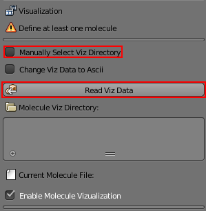
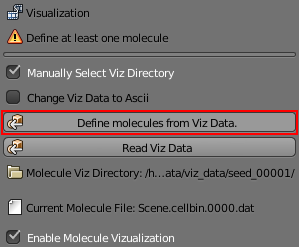
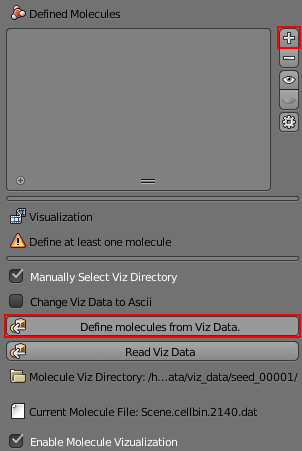
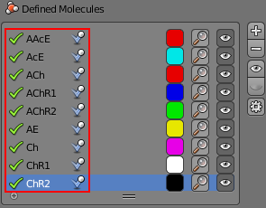
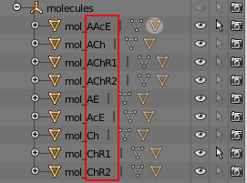

.. _def_viz: 

Define molecules from viz data
------------------------------------------

* Have **Manually select Viz Directory** checked and then use the **Read Viz Data** 
  to import your Viz Data.

* Once the Viz Data is read in the **Define molecules from Viz Data** button should
  become visible.

* Define the molecules from the **Molecule object list**.

    * Have the **Define molecules from viz data** selected.
    * Then press the **Add molecule** button to list the molecules.

* The **Defined molecules** should have the **same** molecules as the **Molecule object list**.

