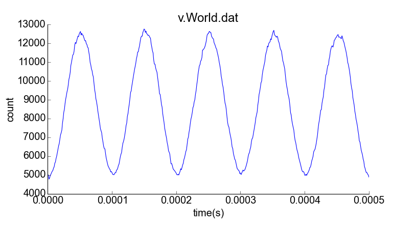
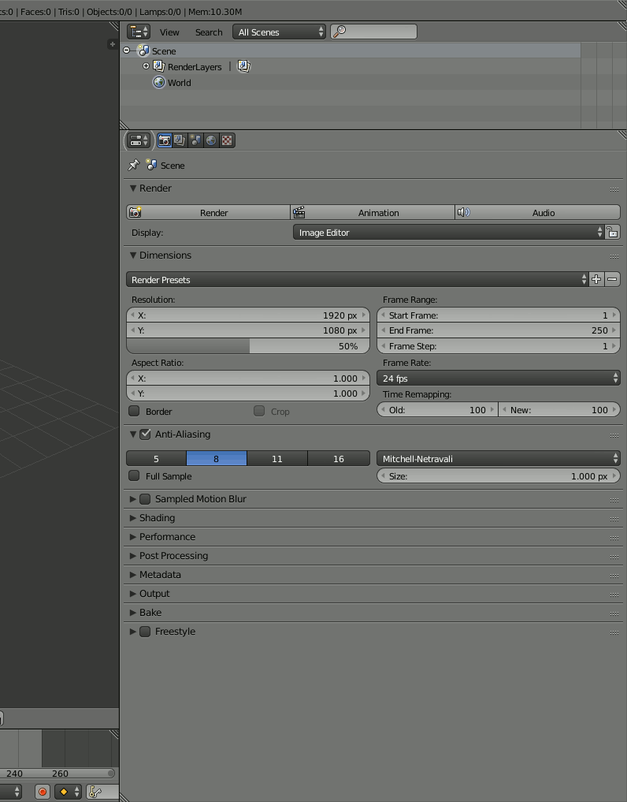

.. _dynamic_geometry_overview:

*********************************************
Dynamic Geometry
*********************************************

.. warning::

   The dynamic geometry interface is very new and subject to change. It is
   currently only available in an `experimental branch`_ of the MCell code.

   .. _experimental branch: https://github.com/mcellteam/mcell/tree/dynamic_meshes

Dynamic Geometry Overview
---------------------------------------------

The dynamic geometry additions to CellBlender support generation of MCell-compatible
dynamic geometry MDL. These additions allow CellBlender users to do the following:

    * Use Blender's shape keys to define dynamic geometry inside CellBlender
    * Run a Python script defining geometry as a function of iteration/time step inside CellBlender

Dynamic Geometry with Blender Shape Keys
---------------------------------------------

.. image:: ./images/dynamic_geometry_shape_keys.gif

Dynamic Geometry with Python Scripting
---------------------------------------------

.. image:: ./images/dynamic_geometry_scripted.gif

A dynamic geometry Python script is responsible for generating a Python description of
an object's geometry given the current iteration (frame number) and time_step. CellBlender
will call your script to generate the MDL required for an MCell simulation, and it will also
either use that MDL for display or it may optionally call your script for the display. For
these reasons, your script should be as efficient as you can make it to speed up both runs
and display.

The following script was used to generate the dynamic tapered cube / pyramid shown above:

::

    # This script gets both its inputs and outputs from the environment:
    #
    #  frame_number is the frame number indexed from the start of the simulation
    #  time_step is the amount of time between each frame (same as CellBlender's time_step)
    #  points[] is a list of points where each point is a list of 3 doubles: x, y, z
    #  faces[] is a list of faces where each face is a list of 3 integer indexes of points (0 based)
    #
    # This script must fill out the points and faces lists for the time given by frame_number and time_step.
    # CellBlender will call this function repeatedly to create the dynamic MDL and possibly during display.

    import math

    points.clear()
    faces.clear()

    min_length = 0.5
    max_length = 2.0
    period_frames = 200

    sx = min_length + ( (max_length-min_length) * ( (1 - math.cos ( 2 * math.pi * frame_number / period_frames )) / 2 ) )
    sy = min_length + ( (max_length-min_length) * ( (1 - math.cos ( 2 * math.pi * frame_number / period_frames )) / 2 ) )
    sz = min_length + ( (max_length-min_length) * ( (1 - math.sin ( 2 * math.pi * frame_number / period_frames )) / 2 ) )
    sz = 2 * sz

    # These define the coordinates of the rectangular box
    points.append ( [  sx,  sy, -sz ] )
    points.append ( [  sx, -sy, -sz ] )
    points.append ( [ -sx, -sy, -sz ] )
    points.append ( [ -sx,  sy, -sz ] )
    points.append ( [  sx,  sy,  sz ] )
    points.append ( [  sx, -sy,  sz ] )
    points.append ( [ -sx, -sy,  sz ] )
    points.append ( [ -sx,  sy,  sz ] )

    # These define the faces of the rectangular box
    faces.append ( [ 1, 2, 3 ] )
    faces.append ( [ 7, 6, 5 ] )
    faces.append ( [ 4, 5, 1 ] )
    faces.append ( [ 5, 6, 2 ] )
    faces.append ( [ 2, 6, 7 ] )
    faces.append ( [ 0, 3, 7 ] )
    faces.append ( [ 0, 1, 3 ] )
    faces.append ( [ 4, 7, 5 ] )
    faces.append ( [ 0, 4, 1 ] )
    faces.append ( [ 1, 5, 2 ] )
    faces.append ( [ 3, 2, 7 ] )
    faces.append ( [ 4, 0, 7 ] )

    # Taper the box to get a different shape
    for i in range(len(points)):
        if points[i][2] > 0:
            # z coordinate is greater than 0 so shrink x and y coordinates
            points[i][0] = points[i][0] * 0.2
            points[i][1] = points[i][1] * 0.2
        else:
            # z coordinate is less than or equal to 0 so expand x and y coordinates
            points[i][0] = points[i][0] * 2
            points[i][1] = points[i][1] * 2

This preliminary version gets frame_number, time_step, points[], and faces[] from the local environment.
This is likely to change in the near future.

Plotting Dynamic Geometry Volume via Clamp Concentration
--------------------------------------------------------

.. image:: ./images/dynamic_vol_conc_clamp.gif

**This example uses MCell's Clamp Concentration to plot a proportional estimate of a dynamic object's
volume. Follow the steps below to construct the model (this tutorial assumes some familiarity with building CellBlender models).**

* Start with CellBlender initialized and with an empty scene.

* Open the "**Model Objects**" panel and add a cube object. Click the "plus" button to add it to your model.

* Open the "**Cube Object Options**" panel (directly below the list of model objects) and set it's display type to "**Bounds**" (it is probably defaulted to "Solid"). Zoom in so it nearly fills the window.

* Open the "**Molecules**" panel and add a *volume molecule* named "**v**" with a high diffusion constant (maybe **1e-3**). Give it a nice bright color if you like (light blue in this example), and increase the "Scale" Factor (in "Display Options") to about **5**.

* Open the "**Molecule Placement**" panel and add a new Release Site ("plus" button). Release **5000** of your "**v**" molecules into the **Object/Region** named "**Cube**".

* Open the "**Plot Output Settings**" panel and add a new Count with the "plus" button. Select the "**v**" molecule and count the number in the World (default). Check the "*Molecule Colors*" box if you like.

* Use the "**File/Save As...**" menu to save this Blender (.blend) file to a folder for this project.

* Open the "**Run Simulation**" panel and set the Iterations to **500** and leave the Time Step at **1e-6**. **Export and run the model**.

* After the run completes, refresh the display with "**Reload Visualization Data**". You should see a cube full of molecules. You can play the simulation to see them moving around.

* Open the "**Plot Output Settings**" panel again and plot the results with your favorite plotter. It should be relatively uninteresting (a straight line showing 5000 molecules).

* Open the "**Surface Classes**" panel to add a concentration clamp. Click the "plus" button to add a new surface class. That will open up the "**Surface Class Properties**" list below the class name. Click "plus" there as well to add a new Surface Class property. Select "**Single Molecule**", and choose your "**v**" molecule. Set the **Orientation** to "**Bottom/Back**", and change the "**Type**" from the default of "Transparent" to "**Clamp Concentration**". Set the value of the clamp to **1e-6**.

* Open the "**Assign Surface Classes**" panel, and click the "plus" button to begin assigning your new surface class to the Cube. Set the "**Surface Class Name**" to be the surface class created above (most likely "**Surface Class**"). Set the object to get the class to "**Cube**", and leave the Region Selection set to "**All Surfaces**".

* Open the "**Run Simulation**" panel and again **export and run** the model.

* **Reload the Visualization**. It should look pretty much the same as before.

* Open the "**Plot Output Settings**" panel and plot the count again. It should be roughly around 5000 but varying as MCell works to keep the concentration at the requested value.

Now it's time to vary the size of the cube and watch MCell add and remove molecules to maintain the requested concentration. We will do this with a **Python script** that will change our Cube object for each frame of the simulation.

* Open a Blender "**Text Editor**" panel to copy and paste the script below as shown here (directions below animation):

* Use the "**+ New**" button near the bottom to create a new text file inside Blender. Change the name from "Text" to a file ending in ".py" (something like "**dyn_geo.py**" is fine).

* Type (or copy) the following script into the text panel:

::

    #  time_step is the amount of time between each frame (same as CellBlender's time_step)
    #  points[] is a list of points where each point is a list of 3 doubles: x, y, z
    #  faces[] is a list of faces where each face is a list of 3 integer indexes of points (0 based)
    #  origin[] contains the x, y, and z values for the center of the object (points are relative to this).
    #
    # This script must fill out the points and faces lists for the time given by frame_number and time_step.
    # CellBlender will call this function repeatedly to create the dynamic MDL and possibly during display.

    import math

    points.clear()
    faces.clear()

    min_ztop = 1.0
    max_ztop = 4.0
    period_frames = 100

    sx = sy = sz = 1.0
    h = ( 1 + math.sin ( math.pi * ((2*frame_number/period_frames) - 0.5) ) ) / 2

    zt = min_ztop + ( (max_ztop-min_ztop) * h )

    # These define the coordinates of the rectangular box
    points.append ( [  sx,  sy, -sz ] )
    points.append ( [  sx, -sy, -sz ] )
    points.append ( [ -sx, -sy, -sz ] )
    points.append ( [ -sx,  sy, -sz ] )
    points.append ( [  sx,  sy,  zt ] )
    points.append ( [  sx, -sy,  zt ] )
    points.append ( [ -sx, -sy,  zt ] )
    points.append ( [ -sx,  sy,  zt ] )

    # These define the faces of the rectangular box
    faces.append ( [ 1, 2, 3 ] )
    faces.append ( [ 7, 6, 5 ] )
    faces.append ( [ 4, 5, 1 ] )
    faces.append ( [ 5, 6, 2 ] )
    faces.append ( [ 2, 6, 7 ] )
    faces.append ( [ 0, 3, 7 ] )
    faces.append ( [ 0, 1, 3 ] )
    faces.append ( [ 4, 7, 5 ] )
    faces.append ( [ 0, 4, 1 ] )
    faces.append ( [ 1, 5, 2 ] )
    faces.append ( [ 3, 2, 7 ] )
    faces.append ( [ 4, 0, 7 ] )

This is the function that will generate your dynamic geometry as a function of frame number.
It creates a cube (very much like the one you've already created) but it varies the location of the top by
changing the local variable named "**zt**" as a function of the frame number (via the variable "**h**").
This code will be explained in greater detail below. Note that clicking the "Syntax highlight for scripting" 
button will add syntax highlighting to your Python code (as shown in the animation).

* Open the "**Model Objects** " panel. The "Cube" should be selected. Open the "**Cube Object Options**" panel (if it isn't open already) and check the "**Dynamic**" box. This is the check box that lets CellBlender know that it must generate dynamic geometry for this object. When you click "**Dynamic**", the "**Script**" option will appear directly to its right. If the script is left empty, then CellBlender assumes that your Dynamic Geometry will be generated using Blender's built-in keying system. But we want to use our script, so click the **refresh button** beside the "Script" box to reload the available scripts. Then click in the "**Script**" box and select "**dyn_geo.py**" (or whatever you named your script). This tells CellBlender to use that script to generate geometry for this object. There may also be another check box near the top of the "**Model Objects**" panel named "**Show Dynamic MDL**". That button can enable or disable the reading and displaying of dynamic data. It's there because very large models can be slow to load. This Cube model is small, so check that box to see the dynamic geometry in Blender's 3D view window.

* Open the "**Run Simulation**" panel and again **export and run the model**.

* When the simulation completes, scroll through the time line to see the dynamic geometry change (it may help to change the zoom and perspective to see the entire cube as it stretches). You'll notice that the density of the molecules remains about the same due to the **Concentration Clamp** applied to this object. It should resemble this animation:

.. image:: ./images/dynamic_vol_conc_clamp.gif

* Open the "**Plot Output Settings**" panel again and plot the results one more time. You should see a sinusoidal plot indicating that the number of molecules is varying ... up and down. Remember that the concentration remains constant, but the *volume* is changing. So the total number of molecules will be proportional to the volume. That's exactly what this plot shows.

Understanding the Script
........................

This preliminary version of dynamic geometry scripting uses the following variables from the local environment:

* **time_step** is the amount of time between each frame (same as CellBlender's time_step)
* **frame_number** is an integer number representing the number of **time steps** that have passed to this point
* **points[]** is a list of points where each point is a list of 3 doubles: x, y, z (relative to the **origin** below)
* **faces[]** is a list of faces where each face is a list of 3 integer indexes of points (0 based)
* **origin[]** contains the x, y, and z values for the center of the object (**points** are relative to this).

These five variables are set to defaults before your script is called. Their values will be used to create the actual CellBlender object after your script has completed. Since points and faces are both lists, they are cleared before using them:

::

    points.clear()
    faces.clear()

Since we are trying to build a cube with a top that grows up and down, the only thing we'll vary is the z coordinate of the top of the box. So we set variables for the minimum and maximum values for the top of the box:

::

    min_ztop = 1.0
    max_ztop = 4.0

We also want to control how many frames are in a complete periodic cycle. The cube will grow from small to large and then back to small in one period:

::

    period_frames = 100

With this setting, the box size will complete a full period in 100 frames.

We set all of the initial dimensions to 1.0:

::

    sx = sy = sz = 1.0

Then we calculate a normalized height value based on the frame number and the number of frames in one complete period:

::

    h = ( 1 + math.sin ( math.pi * ((2*frame_number/period_frames) - 0.5) ) ) / 2

The normalized height is then scaled and added to the minimum z-top to get the current z-top (**zt**):

::

    zt = min_ztop + ( (max_ztop-min_ztop) * h )

Then we can define the 8 vertices of the cube as a function of these computed values. Note that **zt** is used for the 4 top corners. These vertices are appended as lists to the **points** list that we inherited from the local environment:

::

    # These define the coordinates of the rectangular box
    points.append ( [  sx,  sy, -sz ] )
    points.append ( [  sx, -sy, -sz ] )
    points.append ( [ -sx, -sy, -sz ] )
    points.append ( [ -sx,  sy, -sz ] )
    points.append ( [  sx,  sy,  zt ] )
    points.append ( [  sx, -sy,  zt ] )
    points.append ( [ -sx, -sy,  zt ] )
    points.append ( [ -sx,  sy,  zt ] )

Finally, the faces of each triangle are created by appending a list of vertex indices to the faces list. Note that each face is a triangle with outward facing normals (using the "right hand rule").

::

    # These define the faces of the rectangular box
    faces.append ( [ 1, 2, 3 ] )
    faces.append ( [ 7, 6, 5 ] )
    faces.append ( [ 4, 5, 1 ] )
    faces.append ( [ 5, 6, 2 ] )
    faces.append ( [ 2, 6, 7 ] )
    faces.append ( [ 0, 3, 7 ] )
    faces.append ( [ 0, 1, 3 ] )
    faces.append ( [ 4, 7, 5 ] )
    faces.append ( [ 0, 4, 1 ] )
    faces.append ( [ 1, 5, 2 ] )
    faces.append ( [ 3, 2, 7 ] )
    faces.append ( [ 4, 0, 7 ] )

When CellBlender is generating the dynamic geometry for each object, it will call the function associated with that object with differing values of **frame_number**. The function is responsible for setting the **points**, **faces**, and **origin** as appropriate for that frame number given the time step (also passed in).

Conclusion
..........

This example is very simple, but the power of the Python language can be used to construct almost any kind of geometry. In addition to computing geometry (as we've done here), the Python code could also read geometrical objects from files or any other data source.

Note that this preliminary version gets frame_number, time_step, points[], faces[], and origin from the local environment.
This is likely to change in the near future.

