.. _fick:

+++++++++++++++++++++++++++++++++++++++++++++++
Fick's 1st and 2nd Laws
+++++++++++++++++++++++++++++++++++++++++++++++

Our goal in this tutorial is to evaluate Fick’s 1st and 2nd Laws using 
simulations of discrete diffusing particles. To do so, we design the 
simulation geometry and input conditions so that we obtain a concentration 
gradient and net flux along one dimension only. We will compare the 
simulation results to our expectations based on the expressions for Fick’s 
Laws, in particular Fick’s 2nd Law:

:math:`\frac{dc}{dt}=D\frac{d^2c}{dx^2}=D\frac{d}{dx}(\frac{dc}{dx})`

where D is the diffusion coefficient used for the particles in the simulation.
We begin by designing the 3-D geometry as illustrated below:

Using a cylindrical geometry, we wish to introduce diffusing particles such that:

#. There will be a concentration gradient along the x-axis only.
#. After some elapsed time, the system will reach a steady state with an 
   unchanging concentration gradient along the x-axis (e.g., a 10-fold 
   difference along the length of the cylinder).

How can we do this with MCell and CellBlender? Hint: Consider the concentration clamp
command introduced previously. 

We will conduct this tutorial in 2 sections. The first section will build
and run the entire simulation. It turns out this will be the easy part.

The second part of the tutorial will involve building the "instrumentation"
required to measure the concentration along the cylinder. This will be much
more tedious.

Before getting started, you might find it helpful to watch the following video.
This video walks you through the entire process of building, instrumenting, and
running the simulation. However, the video was made with an earlier version of
CellBlender and is not completely accurate when used with the current CellBlender.
However, it does provide a good overview of the entire process. Additionally most
of the Blender geometry manipulation hasn't changed much, so you might be able to
follow those sections directly.

.. warning::

   This video was made with older versions of both Blender and CellBlender.
   Much of the mesh manipulation is the same but the interface may look different.
   Additionally, as noted above, the cylinder is built along the "x" axis in the
   current verion of this tutorial while it was built along the "y" axis in the video.

.. raw:: html

    <video id="my_video_1" class="video-js vjs-default-skin" controls
      preload="metadata" width="960" height="540" 
      data-setup='{"example_option":true}'>
      <source src="https://mcell.org/tutorials/videos/ficks_laws.ogg" type='video/ogg'/>
    </video>

.. _blend file: https://www.mcell.org/tutorials/downloads/ficks_law.blend

*****************************************************
Part 1: Building the Model and Running the Simulation
*****************************************************

Begin by starting Blender with CellBlender enabled.

Delete everything in your scene by first selecting everything with the **a** ("all")
key until all objects - Cube, lamp, camera - are highlighted (orange outline).
Then hit the **x** key and click **Delete** to delete the default Cube, lamp, 
camera, and anything else in your scene.

.. _fick_create_mesh: 

Create the Cylinder Geometry
---------------------------------------------

Create a cylinder by hitting **Shift-a**, and selecting
**Mesh>Cylinder**. Hit **s**, **Shift-z**, **0.2**, and **Enter** to confirm.
Hit **r**, **y**, **90**, and **Enter** to rotate it 90 degrees around the
y-axis (aligns cylinder along the x axis). This will be the main cylinder through
which the molecules diffuse. You may want to rotate and zoom to get a better
view. It should looks something like this:

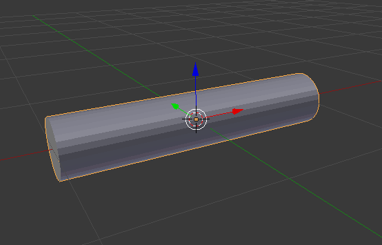

Be sure that the red arrow (x axis) is facing generally to the right so our
definitions of "left" and "right" will be consistent with your view.

In the CellBlender panel, open the "Model Objects" subpanel. With your new
cylinder selected, click the "**+**" button to add the Cylinder to the list
of objects in your CellBlender model.

.. image:: ./images/ficks_law/CellBlender_model_objects_panel_cyl.png
.. image:: ./images/ficks_law/CellBlender_model_objects_panel_cyl_added.png

The name "Cylinder" should appear in the box with a green check mark beside it.
Below that box is another box titled "Cylinder Display Options". Click the
small triangle which expands the features in that box. You should see a drop down
control with the label "Maximum Draw Type" and it is likely showing "Solid" or
"Textured". Click on the control and change it to "Wire" so you can see through the Cylinder.

.. image:: ./images/ficks_law/Ficks_cylinder_wire.png

Then click the triangle again to close the "Cylinder Display Options" box.

Create two surface regions (below the Cylinder Display Options box) by clicking 
the **+** button twice and name them **left_end** and **right_end**. 

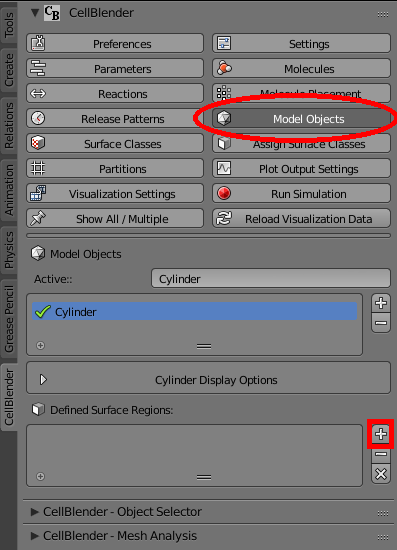
.. image:: ./images/ficks_law/CellBlender_model_objects_panel_regions_added.png

Then, enter **Edit Mode** by hitting **Tab** (with mouse cursor in 3D window).

In order to select all vertices on both sides of an object (what we want),
you should disable the "Limit selection to visible" button by clicking
it into the "lighter gray" state as shown here:

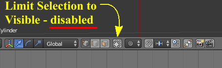

Hit **a** once or twice (or more) until everything is unselected (black).

Hit **b** to start the Border Select mode.

Select the left end of the cylinder by clicking with the left mouse button and 
dragging around it.

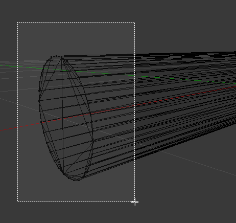

.. image:: ./images/ficks_law/Ficks_Box_Selected_Left.png

Go back to the Model Objects subpanel and select the "**left_end**" region that you
created earlier. Then click the "**Assign**" button to tag those selected faces to the
"left_end" surface region of your Cylinder.

.. image:: ./images/ficks_law/Ficks_Assign_Button.png

Hit **a** to deselect everything in the mesh. Then repeat the process for the
right end of your cylinder (assign the faces on the right end to the "right_end"
region).

Deselect everything with the "**a**" key and switch back to **Object Mode** by hitting **Tab**.

For objective viewing, switch to the top view with either the "**7**" key on your keypad
(not the top row number keys) or by choosing "**View**" and "**Top**" from the view menu 
below the 3D viewport. Similarly, select orthographic mode with keypad "**5**" or by choosing
"**View**" and "**View Persp/Ortho**" so that the words "Top Ortho" appear in the
upper left corner of the 3D viewport.

Finally, hit the "**a**" key one (or more) times until the object is unselected (black).
This will make it easier to see our molecules as they're added. Your view should look
about like this:

.. image:: ./images/ficks_law/Ficks_ortho_view_cyl.png

Define Constants for the Simulation
---------------------------------------------

Click the "**Parameters**" button to open the "Model Parameters" subpanel.

Click the "**+**" button to define a new parameter. By default it will be "P1" with a value of 0.

Change the name to "**iters**" and give it a value of **5000** as shown in the table below. Repeat
this process of adding and editing to define all of the model parameters in this table (note that
the Units and Description are optional and not needed for the simulation):

 | *Model Parameters:*

  +------------------------+-----------------+-------------+--------------------------------------+
  | **Parameter Name**     | **Expression**  |  **Units**  | **Description**                      |
  +========================+=================+=============+======================================+
  | iters                  |      5000       |             |  Number of iterations to run         |
  +------------------------+-----------------+-------------+--------------------------------------+
  | dt                     |        1e-6     |  seconds    |  Time step for each iteration        |
  +------------------------+-----------------+-------------+--------------------------------------+
  | Na                     |   6.0221415e23  |             |    Avogardros Number                 |
  +------------------------+-----------------+-------------+--------------------------------------+
  | area                   |   1.2441e-11    |   cm^2      | Cross-sectional area of cylinder     |
  +------------------------+-----------------+-------------+--------------------------------------+
  | dx                     |       5e-7      |    cm       | Width of sampling volumes 20 plus 21 |
  +------------------------+-----------------+-------------+--------------------------------------+
  | dc                     |       5e-6      | cm^2 / sec  | Diffusion Constant                   |
  +------------------------+-----------------+-------------+--------------------------------------+
  | cl                     |       2e-5      |  Molar      | Concentration on left end            |
  +------------------------+-----------------+-------------+--------------------------------------+

When you're done, your Parameters panel should look like this:

.. image:: ./images/ficks_law/Ficks_Parameters_Panel.png

Define a Molecule Species
---------------------------------------------

Click on the "**Molecules**" panel button to show the Defined Molecules subpanel.

Click the "**+**" button to define a new molecule species.

Change the **Name** to "**vm**" (representing a "volume molecule").

Leave the **Molecule Type** as "**VolumeMolecule**".

Set the **Diffusion Constant** to "**dc**" (the diffusion constant
we defined in the parameters panel eariler).

When you're finished, it should look like this:

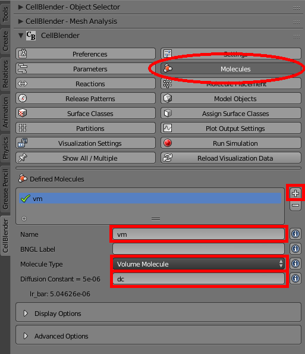

Define a Clamp Concentration Surface Class
---------------------------------------------

Click on the "**Surface Classes**" panel button to show the Defined Surface Classes subpanel.

Click the "**+**" button to define a new surface class.

Change the **Surface Class Name** to "**clamp**".

Click the "**+**" button beside the "clamp Properties" box (below the Surface Class Name)
to define a new property for the "clamp" surface class.

Set the **Molecule Name** to "**vm**".

Set the **Orientation** to "**Bottom/Back**".

Set the **Type** to "**Clamp Concentration**".

Set the **Value** to "**cl**" (the concentration we defined in the parameters panel eariler).

When you're finished, it should look like this:

.. image:: ./images/ficks_law/Ficks_surf_clamp_vm.png

Assign the Clamp Concentration Surface Class to the Left end of the Cylinder
------------------------------------------------------------------------------------

Click on the "**Assign Surface Classes**" panel button to show the Assigned Surface Classes subpanel.

Click the "**+**" button to define a new surface class (it will show an "Undefined surface class" error).

Change the **Surface Class Name** to "**clamp**".

Change the **Object Name** to "**Cylinder**".

Uncheck the **All Faces** checkbox.

Change the **Region Name** to "**left_end**".

When you're finished, it should look like this:

.. image:: ./images/ficks_law/Ficks_left_class.png

Define an Absorptive Surface Class
---------------------------------------------

Click on the "**Surface Classes**" panel button to show the Defined Surface Classes subpanel.

Click the "**+**" button to define a new surface class.

Change the **Surface Class Name** to "**absorb**".

Click the "**+**" button beside the "absorb Properties" box (below the Surface Class Name)
to define a new property for the "absorb" surface class.

Set the **Molecule Name** to "**vm**".

Set the **Orientation** to "**Ignore**".

Set the **Type** to "**Absorptive**".

When you're finished, it should look like this:

.. image:: ./images/ficks_law/Ficks_surf_absorb_vm.png

Assign the Absorptive Surface Class to the Right end of the Cylinder
------------------------------------------------------------------------------------

Click on the "**Assign Surface Classes**" panel button to show the Assigned Surface Classes subpanel.

Click the "**+**" button to define a new surface class (it will show an "Undefined surface class" error).

Change the **Surface Class Name** to "**absorb**".

Change the **Object Name** to "**Cylinder**".

Uncheck the **All Faces** checkbox.

Change the **Region Name** to "**right_end**".

.. image:: ./images/ficks_law/Ficks_right_class.png

First Simulation
---------------------------------------------

Click on the "**Run Simulation**" panel button to show the Run Simulation subpanel.

Change the **Iterations** to "**iters / 10**" ("iters" was defined as 5000, but we don't need
to run that long while we're testing).

Change the **Time Step** to "**dt**" (defined in the parameters panel earlier).

This is a good time to save with "**File / Save**" in the top menu bar.

Click the **Export & Run** button to start the simulation.

The simulation should run quickly (only 500 iterations), and you should see a green
check mark beside the completed run (you may have to hover your cursor over it to
get it to update):

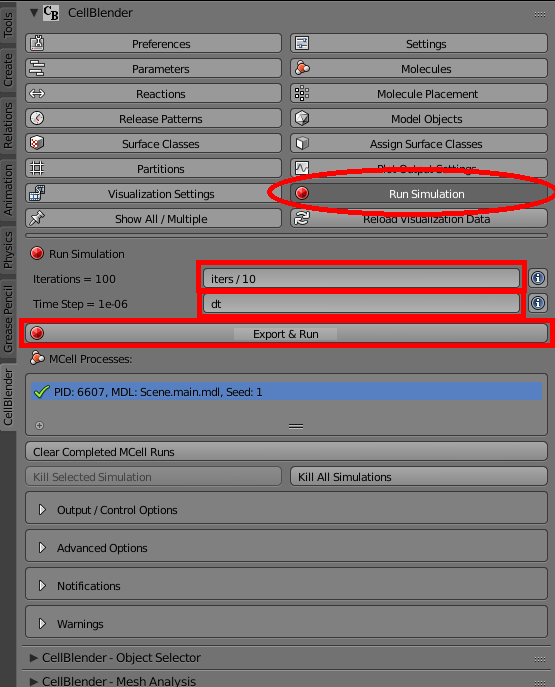

  
Next click the "**Reload Visualization Data**" button to load all of the molecules.

.. image:: ./images/ficks_law/Ficks_Reload_Viz_Button.png

You can click and drag in the time line window to watch the molecules diffusing
from the left side (source) to the right side over time.

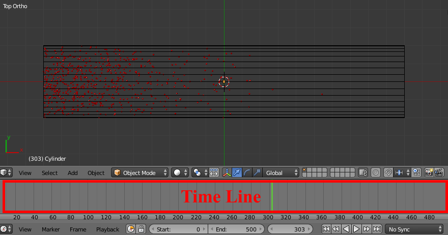

If this is not working properly, now is the time to go back and correct any problems.

Specify Plotting Data
---------------------------------------------

Now let's define some data for MCell to collect from the simulation for us to plot.

Click on the "**Plot Output Settings**" button to begin specifying what to collect.
You should see an initially empty panel with the title of "Reaction Data Output".
Click the small plus sign one time to add the first output specification. You may
see a "Name error" warning letting you know that you haven't selected a molecule
or reaction to count yet. Click on the "Molecule" selector and select the "**vm**"
molecule that we have in this simulation. That should clear the error and show a
green check mark next to the specification of "Count vm in World". That's exactly
what we want. Your Plot Output Settings panel should look like this:

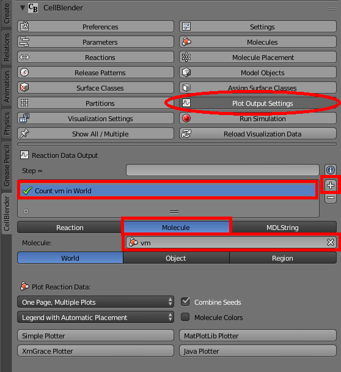

Full Length Simulation
---------------------------------------------

If everything has gone as expected, try running for the entire time length of 5000 iterations.

Open the "**Run Simulation**" panel again and change the **Iterations** from to "**iters / 10**"
back to "**iters**" and run again.

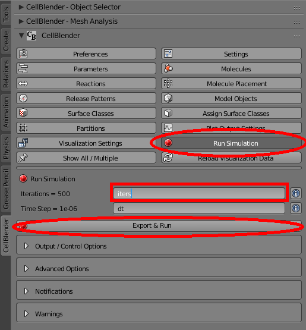

  
That may take some time to run, but when it's done you can click the "**Reload Visualization Data**"
button and then press Blender's play button. 

.. image:: ./images/ficks_law/Ficks_Reload_Viz_Data.png
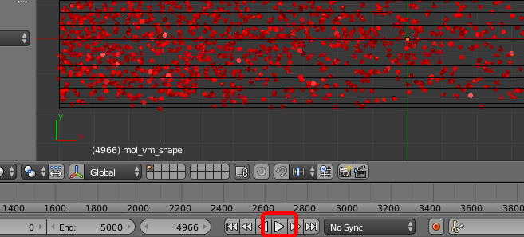

You should see something like the
following animation (although this one is sampled in non-linear time):

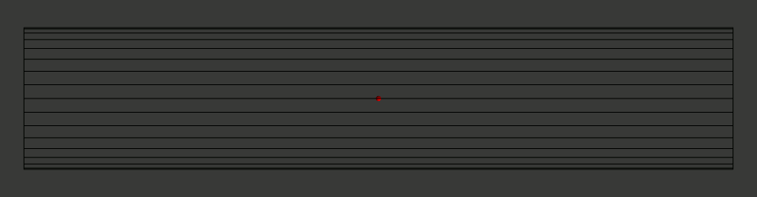

Plotting the Results
---------------------------------------------

CellBlender can work with a number of different plotting packages and these are
automatically detected every time CellBlender is restarted. These packages include
xmGrace and Python's MatPlotLib. The system requirements for each plotting package
are also detected when CellBlender is restarted, and CellBlender will only display
buttons for the packages that are supported by the software on your system. For that
reason, you may have different buttons than the ones shown in the following pictures.
For this tutorial, you may use whichever plotting packages are available, and you're
encouraged to try them all to explore the different advantages and limitations of
each.

Again click on the "**Plot Output Settings**" button to see the different plotting
packages available on your system. Click one (or more) to see the time history of
the number of **vm** molecules in your simulation.

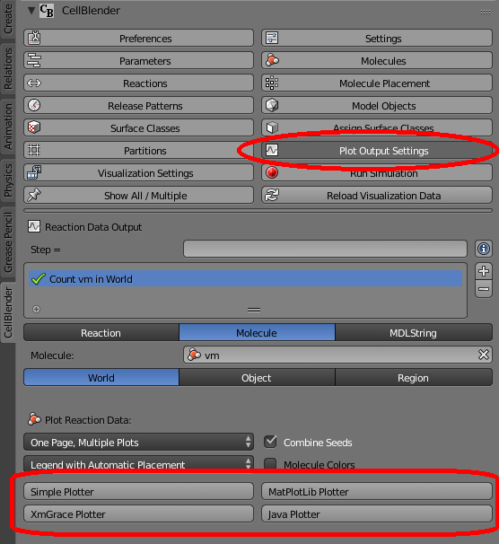

The following pictures show the output produced by each of the buttons shown above.

**Simple Plotter Output**

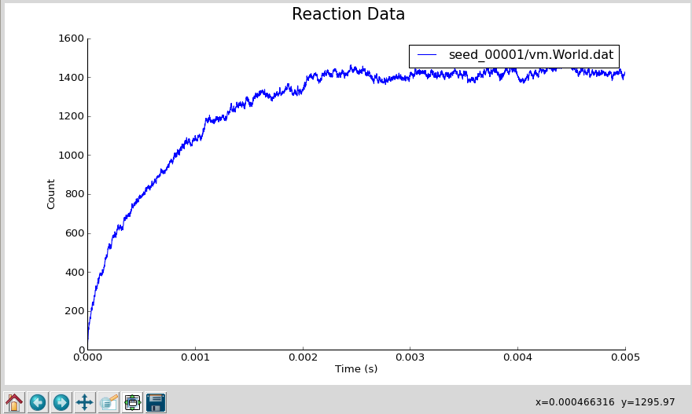

**MatPlotLib Plotter Output**

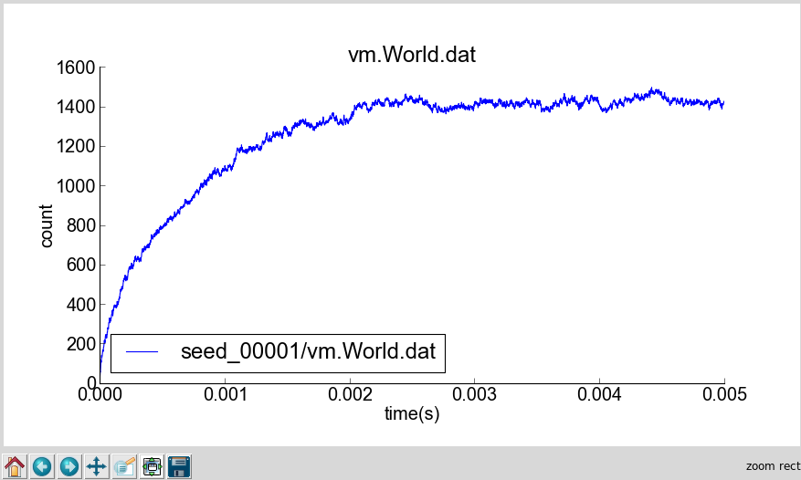

**XmGrace Plotter Output**

.. image:: ./images/ficks_law/Ficks_Plot_1_xmgrace.png

**Java Plotter Output**

.. image:: ./images/ficks_law/Ficks_Plot_1_Java.png

.. note::

  Since plotting requirements vary (along with individual tastes), the CellBlender
  plotting system may be extended fairly easily to work with many other plotting
  packages. This is done by adding your own "interface" files to the CellBlender
  addon folder to communicate with your favorite plotting software. The "Simple"
  plotter, for example, only contains about 100 lines of Python code and is a good
  starting template for anyone wishing to write code for their own favorite software.

Regardless of which plotter you use, you'll notice that the total number of **vm** 
molecules starts at zero and grows rapidly during the early part of the simulation. 
But as time goes on, the total count of **vm** molecules appears to stabilize at an 
equilibrium. This might be verified and quantified with additional runs and averaging 
of the data over many runs and over longer periods of time.

*****************************************************
Part 2: Instrumentation and Measurements
*****************************************************

The model built and run in the previous section is complete, and we will not
be modifying it in this section. We will, however, add some "instrumentation"
which will help us make measurements so we can quantify the results obtained
from that simulation.

Our "instrumentation" will consist of a series of disks and very short cylinder
volumes which divide the test cylinder along its length to facilitate counting of
the molecules by MCell. In this tutorial we will divide the cylinder into 40 segments.
That will require 40 small cylinders and 39 small circular disks between those 40
cylinders. This can be done manually (segment by segment) or it can be automated.
We will show some aspects of each approach.

 - To create the raw geometry, we will demonstrate Blender's built-in array capability.

 - To add the MCell features we will generate some of it within CellBlender and then
   show how to use the CellBlender-generated MDL as a template for automating the
   process through a text editor or any number of programming languages.

As with plotting, it's often a matter of preference as to which approach is best.
Clearly for very small models, it's easy to do everything manually within CellBlender.
Larger models, on the other hand, benefit much more from automation of any kind.
The model we're using here is somewhere in between. It's managable to do it all
by hand, but it can also benefit from automation if you have the skills to do so.

.. warning::

   Note that any MDL modified by hand cannot currently be imported back into
   CellBlender. This might influence your decision on which approach to use.
   Be sure to back up any MDL that you edit by hand since CellBlender will
   overwrite those files when exporting for a new run.

Preparation
---------------------------------------------

Before getting started, let's hide the molecules that we've been simulating
so they don't get in the way of our mesh building operations. In the upper
right corner of the standard Blender screen layout you will find a panel known
as the "Outliner" (shown below). The outliner can be used to show and explore
all of the objects in the Blender scene (and more). For our purposes here, we
just want to be able to show and hide the molecules that have been created by
the simulation. These are all contained under the "molecules" object, so click
the small plus sign next to the name "molecules" and that will display one line
for each type of molecule ("species") that's been created in our simulation.

.. image:: ./images/ficks_law/Ficks_outliner_panel.png

In this case, we've only defined one molecule type that we've called "vm",
so we only see the entry "mol_vm" in the list. If you click on the "eye" symbol
on that line it will toggle the display of the molecules. Click it a few
times to hide and show the molecules. You'll notice that you can do the same
for the Cylinder (or any other object in the scene). For this next step, we
want to show the Cylinder but hide the molecules. Be sure to leave the outliner
in that state before proceding. The next step also assumes that your 3D cursor
is at the origin. You can ensure this with "**Shift-S**" and then clicking on
"**Cursor to Center**".

.. note:: Blender uses the right mouse button for most selection, but this runs
   counter to the common "left click" used by common software. In Blender, the
   left click moves the 3D cursor - which is where new objects are placed. For
   this reason, it's handy to remember that the 3D cursor can be reset back to
   the origin with the "**Shift-S**" / "**Cursor to Center**" sequence.

Strategy and Blender's Layers
---------------------------------------------

Because we're dealing with 80 objects, we don't want to have to do a lot of
individual selecting. That's both tedious and error prone. It's even worse
in this case because many of the objects will be occupying the same space.
So we will use Blender's concept of "Layers" to isolate each group of objects
as we create them. So far, our main Cylinder and all of our molecules are
(by default) on Layer 1. We'll leave them there and we'll create the small
measuring cylinders on Layer 2 and the small disks on Layer 3. For this to
work, be sure that you select the proper layer before each of these steps.

.. note:: There are other mechanisms for dealing with large numbers of objects.
   For example, the CellBlender addon contains a built-in Object Selector which
   allows selection by regular expressions. This particular tutorial uses Blender's
   "Layers" feature, but there are other tools that could have been used as well.

Building Sampling Cylinders
---------------------------------------------

We begin our "instrumentation" by creating a series of short sampling cylinders
inside the long one ... but on **Layer 2**. Switch to Layer 2 by clicking the
second small box in the layer panel as shown here:

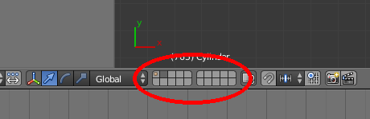

When you click that box, everything will "disappear" because you're now looking
at a new and empty layer. Your cylinder and molecules are still on Layer 1, but
now they won't interfere with building the smaller sampling cylinders and disks.
You can switch back and forth between layers by just clicking the little buttons
shown above (try it). You can also view multiple layers simultaneously by 
shift-clicking them. For now we just want to work on Layer 2, so be sure that's
the one selected (showing an empty window).

To begin building the small sampling cylinders, hit **Shift-a** (Add) and once again
select **Mesh>Cylinder**. We will make these sampling cylinders slightly smaller 
than the main cylinder to avoid coincident meshes: Hit **s**, **Shift-z**, **0.199**, 
and **Enter**. Hit **r**, **y**, **90**, and **Enter**. Next, hit **s**, **x**, 
**0.024875**, and **Enter**. Hit **g**, **x**, and **-0.975** followed by **Enter** 
to move it very close to the left end of the end of larger cylinder back on Layer 1
(they don't touch though).

Triangulate this small cylinder by entering Edit mode with **Tab**, then pressing
**Control-T**, then exiting Edit mode with **Tab**.

Using the outliner, rename this smaller cylinder from **Cylinder.001** to **C**
by double clicking on the **Cylinder.001** and typing **C** followed by the
**Enter** key.

Now, we will use Blender's (very useful) **Array** modifier to replicate this
sampling cylinder 40 times. To do so, hit the **Object Modifiers** button (small
wrench), and from the **Add Modifier** drop-down box, select **Array**. Change 
**Count** to **40**. Deselect **Relative Offset** and select **Constant Offset**.
Then change the third field under **Constant Offset** (Z axis of the cylinder)
to **2.01005**. 

.. image:: ./images/ficks_law/ficks_array.png

Now we need to make each cylinder a unique object. To do this, first hit the
**Apply** button under the **Array** modifier. Then enter **Edit Mode** (with
**Tab** key), hit **p**, and select **By loose parts** in the **Separate** menu.
This will split each discontinuous mesh into a unique object.

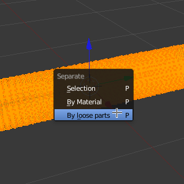

They will be named **C**, **C.001**, **C.002**, etc. The first cylinder in the
list will be named **C**. Rename it to **C.040**. This will make things
cleaner when we want to count molecules in MCell later. Hit **Tab** to enter
**Object Mode** and hit **a** until nothing is selected (nothing outlined in
orange).

.. image:: ./images/ficks_law/ficks_c040.png

At this point, you can switch between the two layers (1 and 2) to see the original
cylinder (wire outline with molecules) and the new measuring cylinders (solid).
They should appear to be in the same exact place. If not, then retrace the steps
to fix it.

Building Sampling Disks
---------------------------------------------

Finally, we will create a series of circular sampling planes that lie between
each of these cylinders. We will put them on **Layer 3**, so click on the third
small "layer" box:

.. image:: ./images/ficks_law/Layer_3_Selected.png

As before, you will see a blank screen because you're looking at a new layer.
You may notice that the first two layer boxes have a small 'dot' in them. That's
a quick way of letting you know that there are objects in those layers. All the
other layers should be solid (without that dot).

With layer 3 selected, create a circle by hitting **Shift-a**, and selecting
**Mesh>Circle**. Open the **Tool Shelf** if needed (hit **t** to toggle it), and
look for the "Add Circle" panel. You may need to scroll down to find it below the
CellBlender panels. Change the "**Fill Type**" to "**Triangle Fan**". Hit **s**, **0.199**, and
**Enter**. Hit **r**, **y**, **90**, and **Enter**. Hit **g**, **x**, and **-0.95**
and **Enter** to move it to the left of our window but very close to the right side
of our smaller cylinder (which is on the left side of our larger cylinder).

Triangulate this small circle by entering Edit mode with **Tab**, then pressing
**Control-T**, then exiting Edit mode with **Tab**.

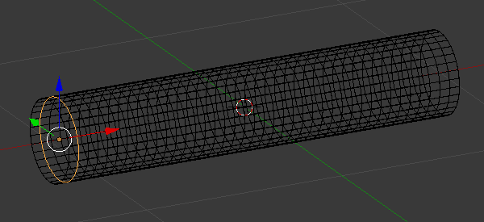

Next, we will replicate this plane by adding an **Array** modifier similar to
what we did previously with the cylinders. Click the **Add Modifier** button and
select **Array**. Set **Count** to **39**, disable **Relative Offset**, enable 
**Constant Offset** and set the **Z** value of the **Constant Offset** to be 
**0.251255**.

.. image:: ./images/ficks_law/Ficks_disk_array_modifier.png

Then click **Apply** to apply the modifier.

.. image:: ./images/ficks_law/ficks_circles.png

As before, separate the disks by entering edit mode (**Tab**) and use the "**p**"
key to separate the object **By loose parts** in the same way you did with the small
cylinders.

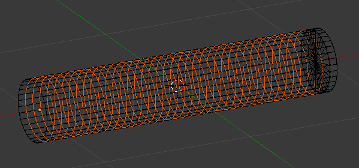

Exit edit mode with the **Tab** key, and then rename the final plane from **Circle** to **Circle.039**.

We need every objects' origin to be centered at the global origin. Even though our objects
are on 3  different layers, we can easily view them all by shift clicking on the
additional layers until they are all dark (selected). Do that now so that the first 3
layer boxes are selected (dark gray). Then select every mesh
object by pressing the **a** key until everything is highlighted orange. Then hit 
**Ctrl-a** and select **Location**. Then hit **Ctrl-a** again and select **Rotation**.

.. image:: ./images/ficks_law/ficks_ctrl_a.png

At this point we have a total of 80 non-molecule objects in our model:

* 1 long cylinder named **Cylinder**
* 40 short cylinders named **C.001** to **C.040**
* 39 circular disks named **Circle.001** to **Circle.039**

You should be in "Object" mode, and you should be able to click on each object's
name in the Outliner panel and see the object be selected in the 3D view. When
you're done verifying this, deselect everything by pressing the **a** key until
everything is unselected (black).

Add Cylinders and Circles as Model Objects
---------------------------------------------

In order for MCell to use the small cylinders and circles they need to be added
to our CellBlender model. A CellBlender scene can contain all kinds of objects
(cameras, lights, text, backplanes, etc). Many of these are helpful in creating
a visual image or movie, but they're not really part of the simulation itself.
We let CellBlender know which objects are actually part of the simulation by
selecting them and adding them to the model objects list. In our case, we've
made things easy by deleting the camera, lights and everything else. So everything
in our simulation is intended to be part of our model objects list, and we can
just add it all.

Click on the "Model Objects" button to show the Model Objects panel. Then use
the "**a**" key to select "all". Toggle it until everything turns orange. Then
click the small "**+**" button to the right of the model objects list to add all
of those objects to our CellBlender model. You should see a long list of objects
named C.xxx and Circle.xxx in the model objects window.

We could run the simulation now, but we'd find a problem. We'd find that there
were very few molecules this time because all of our cylinders and disks are
acting as "plugs" along the longer cylinder. With nowhere to go, the molecule
density near the clamp will be very high since the molecules can't diffuse away.

Making Sampling Cylinders Transparent to vm Molecules
-------------------------------------------------------

In order for molecules to "flow" through all of these smaller cylinders and
circles, we will need to make them transparent to any molecules that we want to
flow through them. In our case, the only molecule we have is "vm" so we'll need
to create a transparent surface class to apply to all of those objects.

Click on the "Surface Classes" button to show the Surface Classes panel. You
should see the two classes ("clamp" and "absorb") that we defined earlier.
Click the "**+**" button beside those two classes to add a third and name it
"transp". Then click the "**+**" beside the "transp Properties" box one time
to specify which molecule can pass through the "transparent" surface. Select
the "**vm**" molecule for the "Molecule Name" field, set the Orientation to
"**Ignore**", and set the "Type" to "**Transparent**".

The previous step has created a new "class" or "type" of surface which is
transparent to vm molecules in both directions. But we haven't assigned that
class to any of our surfaces yet. In order for our molecules to flow through
all of those 40 cylinders and 39 disks, we need to assign our new "transp"
class to each one of them. We will start by assigning the new "transp" class
to the first 3 small cylinders and the first 3 small disks. After doing that
for 6 of our 79 objects, you can decide if you'd like to continue doing that
one by one for the remaining 73 objects or if you'd prefer to use a more
automated method. There are tradeoffs in both cases.

'd rathWe will start by assigning it to the firsta

In order for molecules to "flow" through all of these smaller cylinders

***********************************************
More work to be done ...
***********************************************

.. _fick_export: 

Exporting the Project
-----------------------

We will now export these mdls. Under **CellBlender Project Settings**, set the
**Project Base Name** to **ficks_law**. Then hit **Export CellBlender
Project**, select a directory to save your project to (e.g.
``/home/user/mcell_tutorial/ficks_law/``), and hit **Export MCell MDL**.

Also, make sure to save your project as a **.blend** project file via
**File->Save As** and giving it a meaningful name.

.. _fick_annotate: 

Annotating the MDL
---------------------------------------------

We will now edit several of the exported MDL files and also add new ones to set
up our simulations. First at the top of **ficks_law.main.mdl** add the
following MDL commands (you will have to change the existing **ITERATION** and
**TIME_STEP** statements):

.. code-block:: mdl

    iterations = 1 
    dt = 1e-06
    ITERATIONS = iterations
    TIME_STEP = dt

    area = <insert from Blender>  /* area of sampling volumes in dm^2 */
    dx   = <insert from Blender>  /* length of sampling volumes in dm */
    samplingVol = dx * area       /* volume of sampling volume in dm^3 = l*/
    dc = 5e-6 /* diffusion coefficient [cm^2/sec] */
    Na = 6.0221415e23  /* Avogardros Number */
    
    PARTITION_X = [[-0.1 TO 2.1 STEP .05]]
    PARTITION_Y = [[-0.3 TO 0.3 STEP .05]]
    PARTITION_Z = [[-0.3 TO 0.3 STEP .05]]

You can get the value of **area** and **dx** by using the `Measure Panel`_
script. Make sure you understand what these variables and MDL commands mean.
Can you guess why we introduce separate **iterations** and **dt** variables?
Also, since we do not have any reactions in our model comment out the line
which includes the reactions (**ficks_law.reactions.mdl**).  Next, open the
file **ficks_law.molecules.mdl** and change the diffusion coefficient of our
**vm** molecule to **dc**:

.. code-block:: mdl

    DEFINE_MOLECULES {
            vm {DIFFUSION_CONSTANT_3D = dc} 
    }

.. _Measure Panel: http://wiki.blender.org/index.php/Extensions:2.6/Py/Scripts/3D_interaction/Panel_Measure

So far so good. Now we have to think about how we can establish a concentration
gradient between the left and right end of the big cylinder. As already hinted
above, we can use MCell's surface clamp to clamp the left end of the cylinder
at a certain value and make sure molecules get absorbed at the right end
(why?). To this end, create the file **ficks_law.surface_classes.mdl** and
enter a **DEFINE_SURFACE_CLASSES** block. You will have to complete the
template given below yourself:

.. code-block:: mdl

    DEFINE_SURFACE_CLASSES {
        transp {TRANSPARENT = vm }

        /* define a clamp which release molecule at a concentration
           of 1E-5 toward the inside of the cylinder */
           
        /* define a surface class absorptive to vm */
    }

Now, we need to do some serious modifications to our existing geometry.  Both
the sampling cylinders and sampling planes need to be made transparent to
**vm** (why?). Also, we need to install the surface clamp at the left end of
the big cylinder and make sure molecules are absorbed at the right. Below is a
template for a **MODIFY_SURFACE_REGIONS** block that you will have to complete
yourself (possibly with a script or a macro). Create the file
**ficks_law.mod_surf_regions.mdl** and start editing:

.. code-block:: mdl

    MODIFY_SURFACE_REGIONS {
        
        /* Hint: You need to add statements here to add 
           a concentration clamps at the left end of the cylinder
           and absorb molecules at the right. Remember the surface
           regions you created for this purposes when setting up the
           mesh in Blender */

       C.001[ALL] {
           SURFACE_CLASS = transp
       }
       
       C.002[ALL] {
           SURFACE_CLASS = transp
       }

       /* add statements for the remaining cylinders */

       Circle.001[ALL] {
           SURFACE_CLASS = transp
       }
       Circle.002[ALL] {
           SURFACE_CLASS = transp
       }

       /* add statements for the remaining planes */
    }

Next, we will add a reaction data output block. Again, you will need to add
additional statements to output the data needed to work on the problems below.
Create a file **ficks_law.rxn_output.mdl** and enter:

.. code-block:: mdl

    sprintf(seed,"%03g", SEED)

    REACTION_DATA_OUTPUT {
        STEP = 1*dt
        /* Hint: These are examples.  You will need to add more to determine dC/dt. */
        {COUNT[vm,Scene.Cylinder]}=>"./react_data/"&seed&"_vm_Cylinder.dat"
        {COUNT[vm,Scene.C.001]}=>"./react_data/"&seed&"_vm_C.001.dat"
        {COUNT[vm,Scene.Circle.001,FRONT_CROSSINGS]}=>"./react_data/"&seed&"_vm_Circle.001_front.dat"
        /* more statements needed for Exercises 1 - 4 */
    }

Finally, we add a visualization data block so we can check our simulation
visually in CellBlender. Luckily, nothing needs to be added here and you are
good to go! Create the file **ficks_law.viz_output.mdl** and enter:

.. code-block:: mdl

    VIZ_OUTPUT {
        MODE = CELLBLENDER
        FILENAME = "viz_data/ficksSecondLaw"
        MOLECULES {
          NAME_LIST {ALL_MOLECULES}
          ITERATION_NUMBERS {ALL_DATA @ ALL_ITERATIONS}
        }
    }

This concludes our initial setup. Now let's run the simulation and see if
everything checks out (the run will be quick since we are only simulating for a
single iteration during the setup phase)::

    mcell ficks_law.main.mdl

Congratulations, if everything went well. If you encountered errors try to
understand MCell's complaints and fix your errors.

Next, we need to figure out how long to simulate. We would like to reach a
steady state where the concentration gradient in the cylinder remains constant
(How would you determine if you reached steady state?). Start with 1000
iterations initially and see if this is enough. At this point it is **crucial**
(as always really) to load your model into blender and make sure everything
looks fine.  You can use **gnuplot** for plotting: On the command line type
``gnuplot`` and enter::

    gnuplot> plot "react_data/001_vm_Cylinder.dat"

to view the total number of molecules in the large cylinder.

Once you're confident you have a model with a proper concentration gradient we
can finally tackle our examination of Fick's law.

.. _fick_gen_comments: 

General Comments
----------------

As the concentration gradient is evolving along x, we wish to determine the
rate of change in concentration (:math:`dC/dt`) at each time point for the
central sampling volume composed of the two subvolumes numbered 20 and 21.  To
see this clearly, you will probably want to run a series of simulations using
different random number seeds, so you can average your results. 

If you have done the :ref:`seed` section, then you can use the script created
there by copying the file **run_seeds.py** into your current directory::

    cp /home/user/mcell_tutorial/seed/run_seeds.py /home/user/mcell_tutorial/ficks_law/

Otherwise, create the **run_seeds.py** now. 
        
Along with the data you’ll need for Exercises 1 – 3 below, make sure that you
output counts for molecules in subvolumes 1 and 40 (Exercise 4).  Using MCell’s
reaction data output, determination of the time course of dC/dt can be done in
three ways which will explore now.

**Note:** Once you have verified your simulation it may be useful to turn
visualization output off to speed up your simulations.

.. _fick_exercise1: 

Exercise 1
----------

The most direct method is simply to count the number of molecules in subvolumes
20 and 21 at each timestep, convert the sum to concentration, export the
concentration values for each timestep, and then differentiate to obtain the
time course of :math:`\Delta C/ \Delta t \approx dC/dt`. 

Use MCell’s COUNT statements to output the concentration in subvolume 20 and 21
directly. Then use the below sample python script to do the averaging,
smoothing and differentiation. Examine the output and make sure you understand
what is going on. You may need to increase the number of seeds you average over
if the data is too noisy. The script allows you to plot different quantities by
commenting/uncommenting certain lines - take a look:

.. code-block:: python

    #!/usr/bin/env python

    import numpy as np
    import matplotlib.pyplot as plt

    # name of files to average, smooth and differentiate
    name = "vm_conc_20_21"
    #name = "vm_conc_crossings"
    #name = "vm_conc_ficks_law"

    # number of seeds
    numSeeds = 50

    # this function does window smoothing
    # from <http://www.scipy.org/Cookbook/SignalSmooth>
    def smooth(x, window_len=11, window='hanning'):
        if x.ndim != 1:
            raise ValueError, "smooth only accepts 1 dimension arrays."
        if x.size < window_len:
            raise ValueError, "Input vector needs to be bigger than window size."
        if window_len<3:
            return x
        if not window in ['flat', 'hanning', 'hamming', 'bartlett', 'blackman']:
            raise ValueError, ("Window is on of 'flat', 'hanning', 'hamming', \
                    'bartlett', 'blackman'")
        s=np.r_[2*x[0]-x[window_len-1::-1],x,2*x[-1]-x[-1:-window_len:-1]]
        if window == 'flat': #moving average
            w=np.ones(window_len,'d')
        else:  
            w=eval('np.'+window+'(window_len)')
        y=np.convolve(w/w.sum(),s,mode='same')
        return y[window_len:-window_len+1]

    # read data 
    mol_conc = None
    for seed in range(1,numSeeds):

        data = np.genfromtxt("./react_data/%03d_%s.dat" % 
                        (name, seed), dtype=float)
        timePoints = data[:, 0]
        rxn_data = data[:,1]

        if mol_conc is None:
            mol_conc = rxn_data
        else:
            # built up 2d array of molecule counts (one col/seed)
            mol_conc = np.column_stack((mol_conc, rxn_data))

    # compute the mean
    mol_conc = mol_conc.mean(axis=1)

    # smooth
    smoothed_conc = smooth(mol_conc, window_len=200)

    # differentiate data
    diff_conc = np.diff(smoothed_conc)

    # plot different results
    plt.plot(timePoints, mol_conc, 'b') 
    #plt.plot(timePoints[0:len(timePoints)-1], diff_conc, 'b') 

    plt.title("dC/dt in subvolumes 19 and 20")
    plt.show()                          

.. _fick_exercise2: 

Exercise 2
-----------

The next method is based on determination of the net fluxes into and out of the
combined subvolumes 20 and 21. Again using MCell’s **COUNT** statements (Hint:
specify **FRONT_CROSSINGS** and **BACK_CROSSINGS**), determine the net flux
into the space across plane 19, as well as the net flux out of the space across
plane 21. Use these results to compute the final net number of molecules in
subvolumes 20 and 21 at each timestep, convert to concentration, and then
output the result. Again use the above python script to differentiate and
smooth, and compare your result to what you obtained for Exercise 1.

.. _fick_exercise3: 

Exercise 3
-----------

Now we wish to calculate :math:`dC/dt` based on Fick’s 2nd Law (make sure you
understand how). For this we need to estimate the value of :math:`d^2C/dx^2`
across the sampling volume, i.e., across subvolumes 20 and 21. Hence, you will
need to determine :math:`dC/dx` at plane 19, as well as dC/dx at plane 21, and
then find the difference to obtain :math:`d^2C/dx^2`. To do this you will need
to determine the concentration in subvolumes 19 and 22, as well as in
subvolumes 20 and 21.  Finally multiply by the diffusion coefficient D.  Once
you have calculated :math:`d^2C/dx^2` using COUNT statements, you can output
the result, and again use the python script from above for averaging, smoothing
and differentiating. 

When considering the methods used to compute :math:`dC/dt` in Exercises 1, 2
and 3 which final result do you expect to show the most noise? Why?  Do you
results reflect this.

.. _fick_exercise4: 

Exercise 4
-----------

Finally, plot the ratio of variance to mean number of molecules for subvolumes
1, 20, 21, and 40. What do you observe and why? 

You can use the following python script to do the analysis::

    #!/usr/bin/env python

    import numpy as np
    import matplotlib.pyplot as plt
    import os

    startOfFileToAverage = "vm_C01"   # beginning of filenames to average
                                      # over

    mol_counts = None
    files = os.listdir('react_data')   # build a list of reaction data file names
    files.sort()                       # sort that list alphabetically

    for f in files:                    # iterate over the list of file names
        if f.startswith(startOfFileToAverage):
            rxn_data = np.genfromtxt("./react_data/%s" % f, dtype=float)
            rxn_data = rxn_data[:, 1]  # take the second column
            if mol_counts is None:
                mol_counts = rxn_data
            else:
                # built up 2d array of molecule counts (one col/seed)
                mol_counts = np.column_stack((mol_counts, rxn_data))
        else:
            pass

    mol_mean = mol_counts.mean(axis=1)  # take the mean of the rows
    mol_var = mol_counts.var(axis=1)    # compute the variance of the rows
    plt.plot(mol_mean/mol_var, 'g')     # plot ratio of mean and variance
    plt.show()

