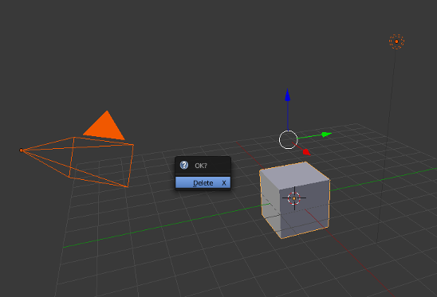
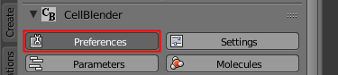
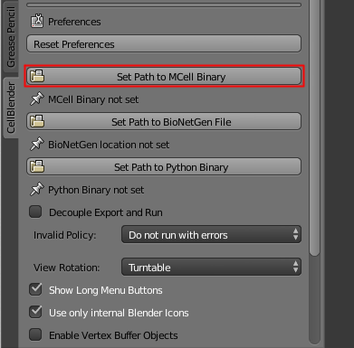

.. _first_time:

First Time Running CellBlender
-----------------------------------------

.. note::

    If you are using the CellBlender bundle (linux_, windows_), you do not need
    to follow this tutorial. It only applies to people installing CellBlender
    from scratch.

.. _linux: http://mcell.org/download/files/cellblender1.1_bundle_linux.zip
.. _osx: http://mcell.org/download/files/cellblender1.1_bundle_osx.zip
.. _windows: http://mcell.org/download/files/cellblender1.1_bundle_windows.zip

If you have just installed Blender and CellBlender, you should perform the
following steps. If you do it correctly, you should only need to do it once.

.. _delete_all_first_time:

Delete All Objects to Start Clean
-----------------------------------------

* Hover your mouse over the **3D View** window
* Pressing the **a** key will toggle the selection of all objects
* Hit **a** until all the objects are selected (highlighted in orange)
* Press **x** key to delete and confirm by clicking **Delete** in the popup
  window

.. _set_mcell_path_first_time:

Set the Path to the MCell Executable File
-------------------------------------------------

* Click the **Preferences** button in the upper left corner

* Click the **Set Path to MCell Binary** button

* Use the file navigator to find your MCell executable (binary) file
* Select the MCell executable and click **Set MCell Binary** button in the
  upper right
* Click the **Preferences** button in the upper left corner again to close the
  panel

Save the Startup File
-------------------------------------------------

* **File** > **Save Startup File**
* Confirm **Save Startup File**
