.. _getting_started:

*********************************************
Getting Started
*********************************************

If you haven't already done so, install the required software listed in
:ref:`software`.

For this first example, we'll use Blender 2.66a and the CellBlender plugin to
set some parameters and run an MCell simulation. This will generate
visualization and reaction data that we will view and analyze in later
sections.

Note that most Blender actions can be accomplished with either key commands or
mouse clicks. But for speed, it is strongly advised that you learn the key
commands.

..
  comment video out until updated

  Tutorial Instructions
  ---------------------------------------------

  The majority of this tutorial can be easily accomplished by following the
  Tutorial Instructions below. However, sections that rely heavily on a GUI
  (like this one), might be better understood by watching a video tutorial
  either before following the instructions or instead of them.

  Tutorial Video
  ---------------------------------------------

  .. raw:: html

      <video id="my_video_1" class="video-js vjs-default-skin" controls
        preload="metadata" width="960" height="540" 
        data-setup='{"example_option":true}'>
        <source src="http://www.mcell.psc.edu/tutorials/videos/main/getting_started.ogg" type='video/ogg'/>
      </video>

  If you've followed along with this video, you can skip to the :ref:`annotate`
  section. If not, or if you'd like to go through it again, the following
  instructions should give you the same result.

.. _gen_mesh:

Starting Blender
---------------------------------------------

Start Blender. If working from the command line, you can do this by opening a
terminal and entering the following command::

    blender

After Blender starts, you should see a cube in the **3D View Editor**. We will
modify this object shortly, but first we need to set some project settings.

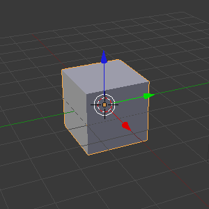

.. _define_region:

Set Project Settings
---------------------------------------------

Hit the **Scene** button in the **Properties Editor**. 

.. image:: ./images/scene_button.png

There may be many Scene panels which are open (triangles pointing downward). In
order to find things easily, take the time to collapse all of these panels by
clicking the triangles next to their names. (Alternatively, hit **a** while
hovering over them.)

Next, expand the **Project Settings** panel by clicking the small triangle next
to the name.

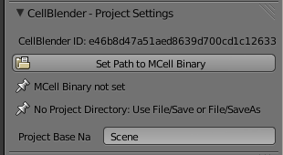

Hit the **Set Path to MCell Binary** button. Navigate to wherever you saved the
MCell binary (e.g. /usr/local/bin) and select **Set MCell Binary**. A green
checkmark should appear next to the file to indicate that it was successfully
set.

Now, hit **Ctrl-u** and select **Save Startup File**.
 
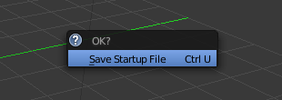

The startup blend is the file that is loaded every time Blender is started. By
saving the startup blend after setting the MCell binary, you won't have to set
it the next time Blender starts.

The project directory is set to be wherever the current blend file is saved.
Let's save the file right now by hitting **Ctrl-s**, typing
**/home/user/mcell_tutorial/intro** (where **user** is your user name) into
the directory field, **intro.blend** into the file name field, and hit the
**Save As Blender File** button.

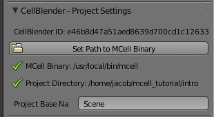

Define a Surface Region
---------------------------------------------

Hit the **Object** button in the **Properties Editor** (little cube in the
right side panel).

.. image:: ./images/object_button.png

Scroll to the bottom of the Properties Editor panel (if needed). Expand the
**Define Surface Regions** panel (*note: you may have to scroll further if an
action expands the size of a panel, because new fields may appear beyond the
currently visible portion of the panel*). Hit the **+** button to add a new
region, which appears in the list with the name "**Region**".

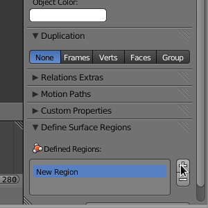

Rename this new surface region to "**top**" by changing the **Region Name**
field from "**Region**" to "**top**" (*again, you may need to scroll the panel
to see all of the new fields created by the* **+** *button*).

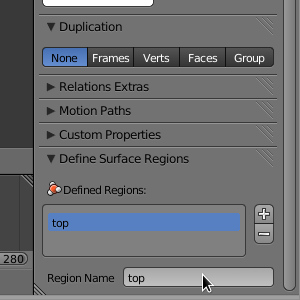

.. _assign_region:

Assign a Surface Region
---------------------------------------------

Move the cursor to the **3D View Editor**. Hit **Tab** to change into **Edit
Mode** (or enter **Edit Mode** via the **Mode** selection control). Hit
**Ctrl-t** to triangulate the faces (or use **Mesh>Faces>Triangulate Faces**). 

.. image:: ./images/gs_triangulate.png

Hit **Ctrl-Tab** and select **Face** (or click on the "**Face select**" button)
to enter face selection mode.

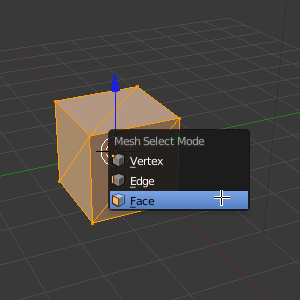

You can tell you're in **Face Select** mode (rather than **Vertex Select** or
**Edge Select** modes) when each face has a round dot near its center.

Hit **a** (or use menu option **Select>(De)select All**) to deselect everything
(edges turn black rather than orange). Then select just the top two triangular
faces by **holding Shift** while **right clicking** on each of the two top
faces to select them.

.. image:: ./images/gs_select_top.png

Under the **Define Surface Regions** panel, click the **Assign** button
(*remember that you might need to scroll down to see the new buttons added*).

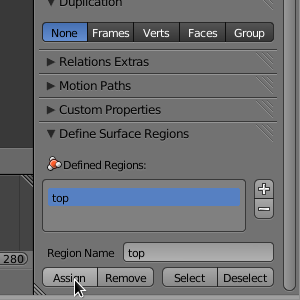

After clicking the **Assign** button, those top two faces will now have the
"**top**" surface region assigned to them. They won't look any different, but
they're now "tagged" with the name "**top**" which MCell can use to reference
them.

We're done editing individual faces, so switch back to object mode by placing
the cursor in **3D View Editor** and hitting the **Tab** key (or switch back to
Object Mode via the **Mode** selection control below the **3D View Editor**).

.. _set_parameters:

Set Simulation Parameters
---------------------------------------------

Return to the Scene context by hitting the **Scene** button in the **Properties
Editor**. 

.. image:: ./images/scene_button.png

Then find and expand just the **Model Objects** panel. With the **Cube** object
still selected, hit the **+** button. This will add **Cube** to the list of
mesh objects to be exported and initialized. A green check mark will appear by
the name to indicate that there are no problems with it.

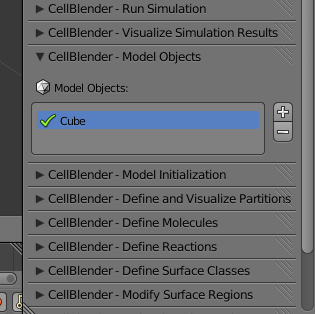

Now find and expand the **Model Initialization** panel. Change **Simulation
Iterations** to **1000**. Change **Simulation Time Step** to **5e-6**. The
units are in seconds.

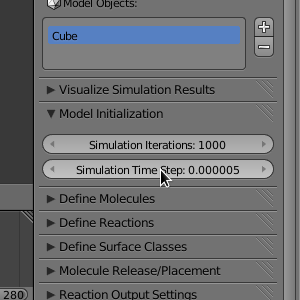

Define Molecules
---------------------------------------------

We will now define three new molecule species. Expand the **Define Molecules**
panel and hit the **+** button three times. This will create three instances of
**Molecule** in the list of molecules (don't worry about the "Duplicate
molecule..." warning because we'll be renaming each of these molecules next).

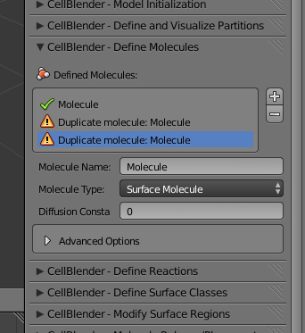

..
  pictures are updated now.
  .. warning::

      Some images may be from older versions and need to be updated.

Left click on the first instance of **Molecule**. Change the **Molecule
Name** to **vol1**, the **Molecule Type** to **Volume Molecule**, and the
**Diffusion Constant** to **1e-6**. Repeat this process for the next molecule
in the list, but call this one **vol2**. Now, change the third entry to
**surf1**. The **Molecule Type** should be set to **Surface Molecule** and
change the **Diffusion Constant** to **1e-7**.

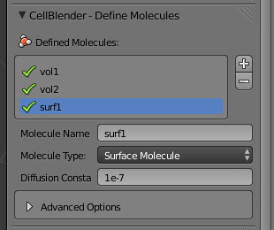

Define Reactions
---------------------------------------------

In order to have our molecules interact with one another, we first need to
define some reactions. Expand the **Define Reactions** panel and hit the **+**
button. Change **Reactants** to **vol1' + surf1,**. Change **Products** to
**surf1, + vol2,**. Be sure to use the commas and apostrophes shown in these
examples.

.. warning::

    Be especially careful about the apostrophe character since there are
    different "flavors" of single quotes. In particular, if you copy text from
    a web site and paste it into CellBlender (or an MDL file), be sure that you
    get the normal (ASCII 0x27) version. If you get an MCell error about
    "orientation not specified", then you might want to double check (and even
    retype) the single quotes in your reactions.

The meaning of these symbols will be explained in the :ref:`rxn_dir`
section. Lastly, change **Forward Rate** to **1e8**.

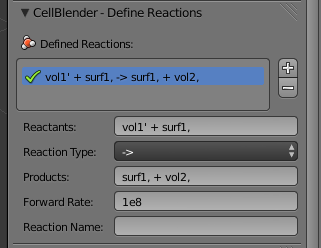

Create Release Sites
---------------------------------------------

We have defined molecules and reactions, but we still need to release some
molecules into our simulation.

Expand the **Molecule Release/Placement** panel and hit the **+** button, which
will create a new release site (*you may need to scroll down to see the entire
panel*). Change **Site Name** to **vol1_rel**.  Change **Molecule** to
**vol1**. Change **Release Shape** to **Object/Region**.  Change
**Object/Region** to **Cube**. Change **Quantity to Release** to **2000**. This
will release 2000 **vol1** molecules randomly throughout the interior of the
**Cube** object.

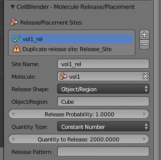

Now, hit the **+** button again to create a second release site. Change **Site
Name** to **surf1_rel**. Change **Molecule** to **surf1'**. Change **Release
Shape** to **Object/Region**. Change **Object/Region** to **Cube[top]**. Change
**Quantity to Release** to **2000**. This will release **2000** molecules
randonmly on the **top** surface region.

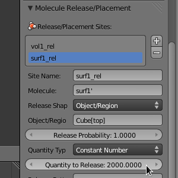

Create Reaction Output
---------------------------------------------

Expand the **Reaction Output Settings** panel and hit the **+** button three
times.

.. image:: ./images/gs_reaction_output1.png

Select the first entry in the **Reaction Data Output** list and select
**surf1** in the **Molecule** drop-down search box. This will count every
**surf1** molecule in the whole simulation (**World**) at every time step.
Repeat this process for the second and third entries in the list but select
**vol1** and **vol2** respectively when choosing the molecule.

.. image:: ./images/gs_reaction_output2.png

Create Visualization Output
---------------------------------------------

Expand the **Reaction Output Settings** panel and hit the **Toggle All**
button. This will ensure that every molecule is included in the visualization
output data.

.. image:: ./images/gs_visualization_output.png

.. _export_mdls:

Run Simulation
---------------------------------------------

Under **Run Simulation**, change **End Seed** to **2** and hit **Run
Simulation**. This will queue up two MCell simulations each with a different
seed value. A green check mark will appear when the simulations have completed.

Save Your Project
---------------------------------------------

From the **File** menu, select the **Save** option. This will save any changes
that you have made to the blend, including the CellBlender specific settings
(e.g. molecule definitions, release sites, etc).
