.. _getting_started:

*********************************************
Getting Started
*********************************************

.. Git Repo SHA1 ID: 52a7079817d83d4e073043f1ebe40c2e1b04d5e2

.. note::

    The simulations and visualizations in this tutorial were generated using
    Blender 2.70a and CellBlender 1.0. It may or may not work with other
    versions.

In order to quickly show what can be done with MCell and CellBlender, we'll
create a simple model with a cube that has diffusing surface and volume
molecules that react with each other to create new molecules. In the next
section, we will visualize the molecules and plot the reaction data from within
CellBlender.

Much of the theory will be skipped over, as it's available elsewhere_. For a
more detailed explanation of any given topic, please see the quick reference
guide (pdf_, html_). 

.. _elsewhere: https://www.mcell.psc.edu/publications.html

.. _pdf: http://mcell.org/documentation/mcell3_qrg.pdf

.. _html: http://mcell.org/documentation/mcell3_qrg.xhtml

If you haven't already done so, install the required software listed in
:ref:`software`.

.. _start_blender:

Starting Blender
---------------------------------------------

Start Blender. If working from the command line, you can do this by opening a
terminal and entering the following command::

    blender

After Blender starts, you should see a cube in the **3D View Editor**. We will
modify this object shortly, but first we need to organize our layout and set
some project settings.

.. image:: ./images/getting_started/cube.png

.. _organize_panels:

Organize Panels (Optional)
---------------------------------------------

Hit the **Scene** button at the top of the  **Properties Editor**. 

.. image:: ./images/scene_button.png

There may be many Scene panels which are open (triangles pointing downward). In
order to find things easily, take the time to collapse all of these panels by
clicking the triangles next to their names. Alternatively, hit **a** while
hovering over them.

.. note::

    Most Blender actions can be accomplished with either key commands or mouse
    clicks. But for speed, it is strongly advised that you learn the key
    commands.

A panel can also be moved around by clicking on the upper-right most portion of
a panel (three diagonal lines) and dragging it around.

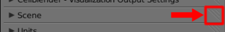

Let's move all the default Blender panels (**Scene**, **Units**, **Keying
Sets**, etc.) down below the CellBlender panels. This will make finding
everything much easier. When you're done, it should look like this:

.. image:: ./images/getting_started/scene_panels.png

We will also be working in the **Object** Context, so you may also want to
follow the same procedure for it (collapsing default panels and moving
CellBlender panels to the top). To navigate there, hit the cube button at the
top of **Properties Editor**.

.. image:: ./images/getting_started/object_panels.png

When you are done, switch back to the **Scene** context.

.. image:: ./images/scene_button.png

Once you are finished organizing the panels, hit **File>Save Startup File**.
This will save your changes, so that every time you start a new blender
project, it will already have this layout.

.. _preferences:

Set Preferences
---------------------------------------------

Next, expand the **Preferences** panel by clicking the small triangle next to
the name.

.. image:: ./images/getting_started/mcell_not_set.png

Hit the **Set Path to MCell Binary** button. Navigate to wherever you saved the
MCell binary (e.g. /usr/local/bin/mcell on Linux) and select **Set MCell
Binary**.

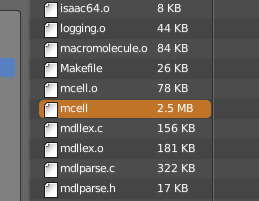

.. image:: ./images/getting_started/mcell_set_button.png

A green checkmark should appear next to the file to indicate that it
was successfully set.

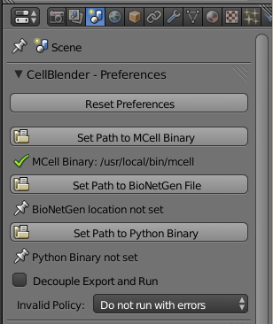

Whenever you set this (or anything in **Preferences**), it will automatically
be saved in a configuration file. Now, regardless of whether you are starting a
new blend file or opening an existing one, it will already be set. You
shouldn't have to change it again (unless you need to use a new version of
MCell or Blender).

.. _set_project_dir:

Set Project Directory
---------------------------------------------

The project directory is set to be wherever the current blend file is saved.
Let's save the file right now by hitting **Ctrl-s**, typing
**/home/user/mcell_tutorial/intro** (where **user** is your user name) into the
directory field and click **Create New Directory** when prompted. Type
**intro.blend** into the file name field and hit the **Save Blender File**
button.

.. _define_region:

Define a Surface Region
---------------------------------------------

Now, we are going to create a surface region on the default Cube object, onto
which we will later release molecules.

Hit the **Object** button at the top of the **Properties Editor**.

.. image:: ./images/object_button.png

If you didn't organize your Object panels as suggested in
:ref:`organize_panels`, you'll need to scroll to the bottom of the **Properties
Editor** panel. Expand the **Define Surface Regions** panel now.

.. note::

    You may have to scroll further if an action expands the size of a panel,
    because new fields may appear beyond the currently visible portion of the
    panel.

Hit the **+** button to add a new region, which appears in the list with the
name "**Region_0**".

.. image:: ./images/getting_started/region_before.png

Rename this new surface region to "**top**" by changing the **Region Name**
field from "**Region_0**" to "**top**" (again, you may need to scroll the
panel to see all of the new fields created by the **+** button).

.. image:: ./images/getting_started/region_after.png

.. _assign_region:

Assign a Surface Region
---------------------------------------------

Move the cursor to the **3D View Editor**. Hit **Tab** to change into **Edit
Mode** (or enter **Edit Mode** via the **Mode** selection control). Hit
**Ctrl-t** to triangulate the faces (or use **Mesh>Faces>Triangulate Faces**). 

.. image:: ./images/triangulate.png

Hit **Ctrl-Tab** and select **Face** (or click on the "**Face select**" button)
to enter face selection mode.

.. image:: ./images/ctrl_tab.png

You can tell you're in **Face Select** mode (rather than **Vertex Select** or
**Edge Select** modes) when each face has a square dot near its center.

Hit **a** (or use menu option **Select>(De)select All**) to deselect everything
(edges turn black rather than orange). Then select just the top two triangular
faces by **holding Shift** while **right clicking** on each of the two top
faces to select them.

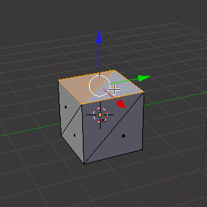

Under the **Define Surface Regions** panel, click the **Assign** button
(*remember that you might need to scroll down to see the new buttons added*).

.. image:: ./images/getting_started/region_assign.png

After clicking the **Assign** button, those top two faces will now have the
"**top**" surface region assigned to them. They won't look any different, but
they're now "tagged" with the name "**top**" which MCell can use to reference
them.

We're done editing individual faces, so switch back to object mode by placing
the cursor in the **3D View Editor** and hitting the **Tab** key (or switch
back to Object Mode via the **Mode** selection control below the **3D View
Editor**).

.. _add_cube:

Adding to Model Objects List
---------------------------------------------

Return to the Scene context by hitting the **Scene** button in the **Properties
Editor**. 

.. image:: ./images/scene_button.png

Then expand the **Model Objects** panel. With the **Cube** object still
selected, hit the **+** button. This will add **Cube** to the list of mesh
objects to be included in the MCell simulation. A green check mark will appear
by the name to indicate that there are no problems with it.

.. image:: ./images/getting_started/model_objects.png

.. _set_parameters:

Set Simulation Parameters
---------------------------------------------

Find and expand the **General Parameters** panel. This is where we will define
several parameters to be used throughout the project. Hit the **+** button six
times, which will create six parameters named **P1**, **P2**, **P3**, **P4**,
**P5**, and **P6** each of which have 0 assigned to them by default.

.. image:: ./images/getting_started/parameters_before.png

Rename **P1** to **iters** and put **1000** in the **Expression** field. We
will do similar renamings and expression assignments to the other parameters.

* Change **P2** to **dt** and assign it **1e-5**.
* Change **P3** to **dc1** and assign it **1e-6**.
* Change **P4** to **dc2** and assign it **dc1/10**.
* Change **P5** to **fwd_rc** and assign it **1e8**.
* Change **P6** to **num_rel** and assign it **2000**.

.. image:: ./images/getting_started/parameters_after.png

.. note::

    Parameters can make use of basic mathematical operators using infix
    notation (e.g. P1+P2, P1/P2), certain keywords representing other
    mathematical operations (e.g. SQRT(P1), EXP(P1)), or be defined in terms of
    any previously defined parameter.

Now find and expand the **Model Initialization** panel. Change **Iterations**
to **iters**, which we just defined in **General Parameters**. Change **Time
Step** to **dt**. The units are in seconds.

.. image:: ./images/getting_started/model_init.png

Now, you might be wondering why you shouldn't directly assign numerical value
here. You certainly could. However, it is generally good practice to define
them as **General Parameters**, since it will be easier to update them if a
given parameter appears in more than one location.

.. _define_molecules:

Define Molecules
---------------------------------------------

We will now define three new molecule species. Expand the **Define Molecules**
panel and hit the **+** button three times. This will create **Molecule_1**,
**Molecule_2**, and **Molecule_3**.

.. image:: ./images/getting_started/define_molecs_before.png

Left click **Molecule_1**. Change the **Molecule Name** to **vol1**, the
**Molecule Type** to **Volume Molecule**, and the **Diffusion Constant** to
**dc1**. The units are cm\ :sup:`2`\ /second.

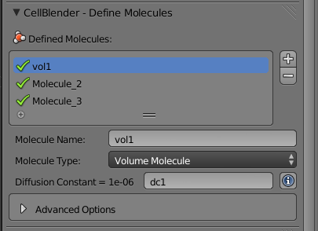

Repeat this process for the next molecule in the list, but call this one
**vol2**. It will also be a **Volume Molecule** with a **Diffusion Constant**
of **dc1**.

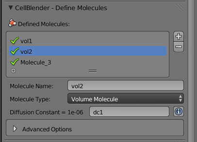

Now, change the third entry to **surf1**. The **Molecule Type** should be set
to **Surface Molecule** and change the **Diffusion Constant** to **dc2**.

.. image:: ./images/getting_started/define_molecs_surf1.png

.. _define_reactions:

Define Reactions
---------------------------------------------

In order to have our molecules interact with one another, we first need to
define some reactions. Expand the **Define Reactions** panel and hit the **+**
button. Change **Reactants** to **vol1' + surf1,**. Change **Products** to
**surf1, + vol2,**. Be sure to use the commas and apostrophes shown in these
examples.

.. warning::

    Be especially careful about the apostrophe character since there are
    different "flavors" of single quotes. In particular, if you copy text from
    a web site and paste it into CellBlender (or an MDL file), be sure that you
    get the normal (ASCII 0x27) version. If you get an MCell error about
    "orientation not specified", then you might want to double check (and even
    retype) the single quotes in your reactions.

The meaning of these symbols will be explained in the :ref:`rxn_dir` section.
Lastly, change **Forward Rate** to **fwd_rc**. The units are M\ :sup:`-1`\ s\
:sup:`-1`\ .

.. image:: ./images/getting_started/define_reaction.png

.. _define_release_sites:

Create Release Sites
---------------------------------------------

We have defined molecules and reactions, but we still need to release some
molecules into our simulation.

Expand the **Molecule Release/Placement** panel and hit the **+** button twice.
This will create two instances of a release site. Currently, they both have
errors because we haven't assigned which type of molecule is going to be
released.

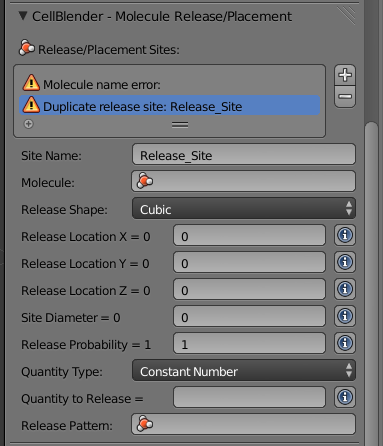

Select the first instance (*you may need to scroll down to see the entire
panel*), and change **Site Name** from **Release_Site** to **vol1_rel**.

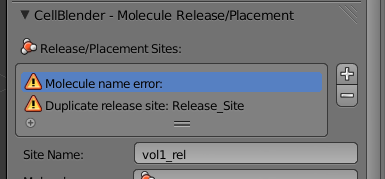

Change **Molecule** to **vol1**.

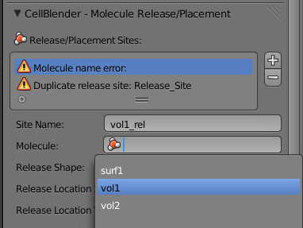

Change **Release Shape** to **Object/Region**.

.. image:: ./images/getting_started/molec_rel_vol1_shape.png

Change **Object/Region** to **Cube**.

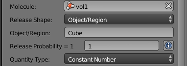

Change **Quantity to Release** to **num_rel**. This will release 2000 **vol1**
molecules randomly throughout the interior of the **Cube** object.

.. image:: ./images/getting_started/molec_rel_vol1_number.png

Now select the second release site and make the following changes.

* Change **Site Name** to **surf1_rel**.
* Change **Molecule** to **surf1**.
* Change **Release Shape** to **Object/Region**.
* Change **Object/Region** to **Cube[top]**.
* Change **Quantity to Release** to **num_rel**.

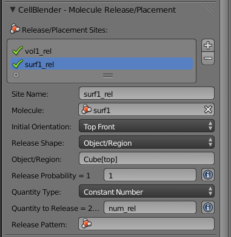

This will release **2000** **surf1** molecules randomly on the **top** surface
region.

.. _create_reaction_output:

Create Reaction Output
---------------------------------------------

Open the **Reaction Output Settings** panel. Click the **+** sign three times
to save reaction data for each of the three different molecule species. They
will show up as errors because they haven't been chosen yet, and there are no
default values.

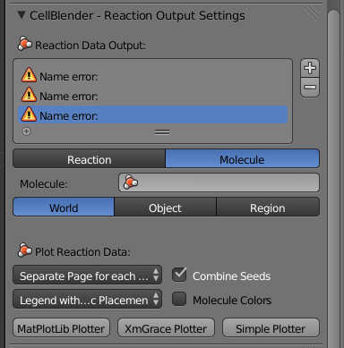

Select and highlight the first of the "Molecule name error" definitions and
change its molecule name to "**surf1**" as shown here:

.. image:: ./images/getting_started/reaction_output_surf1_select.png

After clicking on "**surf1**", the top of that panel should look like this:

.. image:: ./images/getting_started/reaction_output_surf1.png

The description next to the check mark indicates that MCell will be counting
and saving the count (number) of surf1 molecules in the **World**.

Repeat this process for the other two "Molecule name error" entries assigning
them to **vol1** and **vol2** respectively to get this:

.. image:: ./images/getting_started/reaction_output_after.png

.. _create_visualization_output:

Create Visualization Output
---------------------------------------------

Open the **Visualization Output Settings** panel (*be sure to scroll down to
see the whole panel*):

.. image:: ./images/getting_started/viz_before.png

Then click the **Export All** button to export all molecules for visualization:

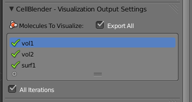

.. _run_sim:

Run Simulation
---------------------------------------------

Expand the **Run Simulation** panel and change the **End Seed** to **2** and
hit **Run Simulation**.

.. image:: ./images/getting_started/run_simulation.png

This will queue up two MCell simulations each with a different seed value. A
green check mark will appear when the simulations have completed.

.. image:: ./images/getting_started/run_simulation2.png

.. warning::

   If you encounter any errors, you may need to check the command line for
   error messages. Windows users will have to select "Window>Toggle System
   Console".

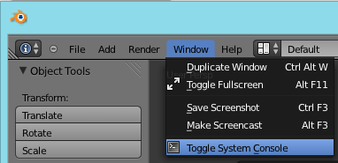

.. _save_project:

Save Your Project
---------------------------------------------

From the **File** menu, select the **Save** option (or hit **Ctrl-s**). This
will save any changes that you have made to the blend, including the
CellBlender specific settings (e.g. molecule definitions, release sites, etc).

.. _review:

Review
---------------------------------------------

* We set up some project settings, including our path to MCell.
* We started with Blender's default cube and divided it up into triangular faces.
* The top faces were defined to be a special region that we called **top**.
* We defined 3 different molecular species: **surf1**, **vol1**, and **vol2**.
* We defined reactions with the surface molecules that transformed **vol1**
  molecules inside the **Cube** into **vol2** molecules outside the **Cube**.
* We initialized the simulation by releasing specific numbers of molecules in
  (or on) specific regions of the physical model.
* We specified which data to export, and we ran the simulation.
