.. _getting_started:

*********************************************
Getting Started
*********************************************

For this first example, we'll use Blender and the CellBlender plugin to set
some simulation parameters. We'll export this into the MDL file format which MCell
can parse. Then we will run these MDL files with MCell to generate visualization
data, which will be used in the next section.

Note that most blender actions can be accomplished with either key commands or
mouse menu/button clicks. But for speed, it is strongly advised that you learn
the key commands.

.. _gen_mesh:

Starting Blender
---------------------------------------------

The majority of this tutorial can be easily accomplished by following the
Tutorial Instructions below. However, sections that rely heavily on a GUI
(like this one), might be better understood by watching a video tutorial
either before following the instructions or instead of them.

Tutorial Video
---------------------------------------------

.. raw:: html

    <video id="my_video_1" class="video-js vjs-default-skin" controls
      preload="metadata" width="960" height="540" 
      data-setup='{"example_option":true}'>
      <source src="http://www.mcell.psc.edu/tutorials/videos/main/getting_started.ogg" type='video/ogg'/>
    </video>

If you've followed along with this video, you can skip to the :ref:`annotate` section.
If not, or if you'd like to go through it again, the following instructions should give
you the same result.

Tutorial Instructions
---------------------------------------------

Open up a terminal and enter the command::

    blender

You should see a cube in the **3D View Editor**.

.. image:: ./images/gs_cube.png

.. _define_region:

Define a Surface Region
---------------------------------------------

Hit the **Object** button in the **Properties Editor** (little cube in the right side panel).

.. image:: ./images/gs_object_button.png

Scroll to the bottom of the Properties Editor panel (if needed). Expand the **CellBlender - Define Surface Regions** 
panel by clicking the small triangle next to the name (*note that you may have to scroll
further after actions which expand the sizes of panels because new fields may appear beyond
the currently visible portion of the panel*). Hit the **+** button and new region named "**Region_0**"
should appear in the list of regions, indicating that a new surface region was created.

.. image:: ./images/gs_new_region.png

Rename this new surface region to "**top**" by changing the **Region Name** field from "**Region**"
to "**top**" (*again, you may need to scroll the panel to see all of the new fields created by
the* **+** *button*).

.. image:: ./images/gs_top.png

.. _assign_region:

Assign a Surface Region
---------------------------------------------

Move the cursor to the **3D View Editor**. Hit **Tab** to change into **Edit
Mode** (or enter **Edit Mode** via the "Mode" selection control). Hit **Ctrl-t** to triangulate 
the faces (or use **Mesh/Faces/TriangulateFaces**). 

.. image:: ./images/gs_triangulate.png

Hit **Ctrl-Tab** and select **Face** (or click on the "**Face select**" button) to enter face
selection mode.

.. image:: ./images/gs_ctrl_tab.png

You can tell you're in **Face Select** mode (rather than **Vertex Select** or **Edge Select**
modes) when each face has a round dot near its center.

Hit **a** (or use menu option **Select/(De)select All**) to deselect everything (edges turn black
rather than orange). Then select just the top two triangular faces by **holding Shift** while
**right clicking** on each of the two top faces to select them.

.. image:: ./images/gs_select_top.png

Under the **CellBlender - Define Surface Regions** panel, click the **Assign** button (*remember that
you might need to scroll down to see the new buttons added*).

.. image:: ./images/gs_assign.png

After clicking the **Assign** button, those top two faces will now have the "**top**" surface
region assigned to them. They won't look any different, but they're now "tagged" with the name
"top" which MCell can use to reference them.

We're done editing individual faces, so switch back to object mode by placing the cursor in
**3D View Editor** and hitting the **Tab** key (or switch back to Object Mode via the "Mode"
selection control below the 3D View Editor).

.. _set_parameters:

Set Simulation Parameters
---------------------------------------------

Hit the **Scene** button in the **Properties Editor**. 

.. image:: ./images/gs_scene_button.png

There may be many Scene panels which are open (triangles pointing downward). In order to
find things easily, take the time to close all of these panels by clicking the triangles
to collapse them down to one line each. All of the Scene panels installed by CellBlender
will start with the name "CellBlender", to make them easier to find. Now find and expand
just the **CellBlender - Model Objects** panel.
With the **Cube** object still selected, hit the **+** button. This will add **Cube** to the
list of mesh objects to be exported and initialized.

.. image:: ./images/gs_model_objects.png

Now find and expand the **CellBlender - Model Initialization** panel. Change **Simulation Iterations** to
**1000**. Change the Simulation **Time Step** to **5e-6**. The units are in seconds.

.. image:: ./images/gs_model_init.png

Define Molecules
---------------------------------------------

We will now define three new molecule species. Expand the **CellBlender - Define Molecules**
panel and hit the **+** button three times. This will create three instances of
**Molecule** in the list of molecules (don't worry about the "Duplicate molecule..."
warnings because we'll be renaming each of these molecules next).

.. image:: ./images/gs_new_molecules.png

Left click on the first instance of **Molecule**. Change the **Molecule
Name** to **vol1**, the **Molecule Type** to **Volume Molecule**, and the
**Diffusion Constant** to **1e-6**. 

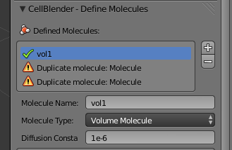

Repeat this process for the next molecule
in the list, but call this one **vol2**. It will also be a **Volume Molecule** with a **Diffusion Constant** of **1e-6**.

.. image:: ./images/gs_define_molecule_vol2.png

Now, change the third entry to
**surf1**. The **Molecule Type** should be set to **Surface Molecule** and
change the **Diffusion Constant** to **1e-7**.

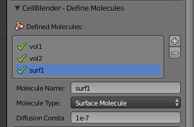

Define Reactions
---------------------------------------------

In order to have our molecules interact with one another, we first need to
define some reactions. Expand the **CellBlender - Define Reactions** panel and hit the **+**
button. Initially you may get a "Product error:" because nothing is defined yet:

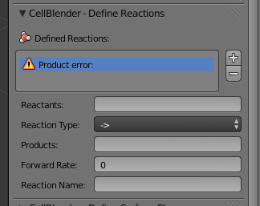

Change **Reactants** to **vol1' + surf1,**. Change **Products** to
**surf1, + vol2,**. Be sure to use the commas and apostrophes shown in these
examples.

.. warning::

    Be especially careful about the apostrophe character since there are
    different "flavors" of single quotes. In particular, if you copy text from
    a web site and paste it into CellBlender (or an MDL file), be sure that you
    get the normal (ASCII 0x27) version. If you get an MCell error about
    "orientation not specified", then you might want to double check (and even
    retype) the single quotes in your reactions.

The meaning of these symbols will be explained in the :ref:`rxn_dir`
section. Lastly, change **Forward Rate** to **1e8**.

.. image:: ./images/gs_define_reactions.png

Create Release Sites
---------------------------------------------

We have defined molecules and reactions, but we still need to release some
molecules into our simulation.

Expand the **CellBlender - Molecule Release/Placement** panel and hit the **+** button twice.
This will create two instances of **Release Site** with errors because we haven't defined
any molecule names yet.

.. image:: ./images/gs_release_empty.png

Select the first instance
(*you may need to scroll down to see the entire panel*), and change **Site Name** 
to **vol1_rel**.

.. image:: ./images/gs_release_add_vol1_rel.png

Change **Molecule** to **vol1**.

.. image:: ./images/gs_release_add_vol1_rel_mol.png

Change **Release Shape** to **Object/Region**.

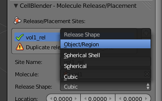

Change **Object/Region** to **Cube**.

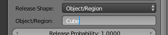

Change **Quantity to Release** 
to **2000**. This will release 2000 **vol1** molecules randomly throughout the interior 
of the **Cube** object.

.. image:: ./images/gs_vol1_rel.png

Now select the second release site. Change **Site Name** to **surf1_rel**.
Change **Molecule** to **surf1**. Change **Release Shape** to
**Object/Region**. Change **Object/Region** to **Cube[top]**. Change **Quantity
to Release** to **2000**. This will release **2000** molecules randonmly on the
**top** surface region.

.. image:: ./images/gs_surf1_rel.png

Open the **CellBlender - Reaction Output Settings** panel.

.. image:: ./images/gs_rxn_viz_output_empty.png

Click the "plus" sign 3 times to save reaction data for each of 3 different molecule species.
They will show up as errors because they haven't been chosen yet, and there are no default values.

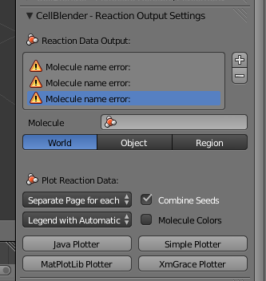

Select and highlight the first of the "Molecule name error" definitions and change its molecule name to "**surf1**" as shown here:

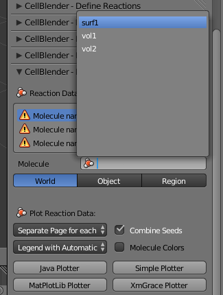

After clicking on "**surf1**", the top of that panel should look like this:

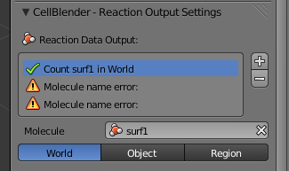

The description next to the check box indicates that MCell will be counting and saving the count (number) of surf1 molecules in the "World".

Repeat this process for the other two "Molecule name error" entries assigning them to vol1 and vol2 respectively to get this:

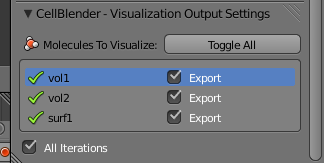

Open the **CellBlender - Visualization Output Settings** panel (*be sure to scroll down to see the whole panel*):

.. image:: ./images/gs_rxn_viz_output_empty.png

Then click the **Toggle All** button to export all molecules for visualization:

Prepare to Run the Model
---------------------------------------------

Open the **CellBlender - Project Settings** panel:

.. image:: ./images/gs_project_settings_new.png

If you've never run MCell from this version of CellBlender, you will find that the push-pin for the MCell Binary is unset. Click the 
"**Set Path to MCell Binary**" button and navigate to the location of your MCell binary.

.. image:: ./images/gs_project_settings_mcell_binary.png

Complete the selection by clicking the "**Set MCell Binary**" button in the upper right corner of the file selection panel:

.. image:: ./images/gs_project_settings_mcell_binary_set.png

You should now see a check next to the "MCell Binary" followed by the full path you've chosen (you may need to widen the panel to see the full path).

.. image:: ./images/gs_project_settings_mcell_binary_checked.png

The last step before running is to save your Blender project file to a folder in your directory structure. Use the "**File / Save As**" menu item:

.. image:: ./images/gs_project_file_save_as.png

Then type in a project name as the file name ("getting_started.blend" for example):

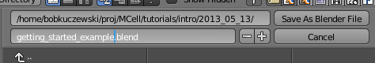

Then click the "**Save As Blender File**" button. Afterward, the Project Directory should also be checked:

.. image:: ./images/gs_project_file_saved.png

Now you're ready to run the MCell Simulation.

Run the MCell Simulation
---------------------------------------------

Open the **CellBlender - Run Simulation** panel:

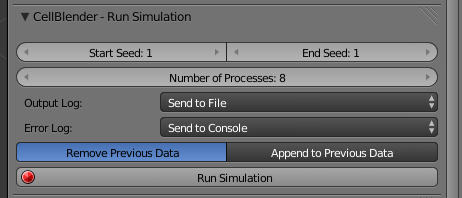

Change the **End Seed** to 3 for three trials. If you started Blender from a console, you might also 
select "**Send to Console**" for the Output Log setting.

.. image:: ./images/gs_run_seed3_out_to_console.png

Finally, click the "**Run Simulation**" button to start the MCell run. CellBlender will display the
Process ID information for the runs:

.. image:: ./images/gs_run_process_ids.png

The Console will show a lot of information ... hopefully concluding with something like this:

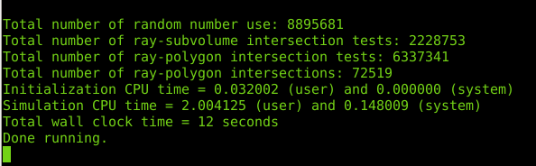

Visualize the Molecules within the Model
---------------------------------------------

.. warning::

    For some reason, the viz data is not being loaded automatically.
    
To view the molecules over time, open the "**CellBlender - Visualize Simulation Results**" panel
and click the "**Read Viz Data**" button:

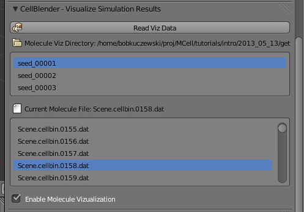

This will load all of the molecule position information into Blender and it will adjust the time line
to match the amount of simulation time. So you may need to use a combination of rolling your mouse wheel
(to zoom the time line) and clicking and dragging with the mouse wheel (to move the timeline) until you
are able to see the entire simulation time span in the time line (light gray with dark gray on each end):

.. image:: ./images/gs_viz_timeline_scaled.png

Now you can drag the green timeline cursor to show the molecules at different times from 0 to 1000:

.. image:: ./images/gs_viz_timeline_scene_805.png

Because the cube defaults to being opaque, you cannot initially see the molecules inside of it.
To change this, first right click on the cube itself. This should add an orange highlight to the
outline of the entire cube as shown below. If your right click happens to land on a molecule, you
may find that the molecules are highlighted orange rather than the cube. Just try clicking again
until you can select just the cube as shown here:

.. image:: ./images/gs_viz_cube_selected.png

With the cube selected, move from the Scene panel to the Object panel by clicking the small cube in
the panel selector menu:

.. image:: ./images/gs_viz_Object_panel.png

In the "Display" panel, you'll find a "Type:" selector which is most likely set to "Textured":

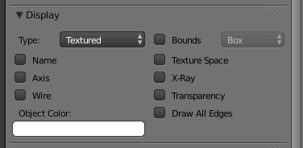

Change that selector to "Wire":

.. image:: ./images/gs_viz_display_wire.png

You should now be able to see all of your molecules:

.. image:: ./images/gs_viz_display_all.png

This would be a good time to experiment a little bit with scrolling the mouse wheel to zoom in and out,
and clicking and dragging the mouse wheel to change viewing angle.

Review
---------------------------------------------

This tutorial started with Blender's default cube and divided it up into triangular faces.

The top faces were defined to be a special region that we called "top".

We defined 3 different molecular species: surf1, vol1, and vol2.

We defined reactions with the surface molecules that transformed vol1 molecules inside the box into vol2 molecules outside the box.

We initialized the simulation by releasing specific numbers of molecules in (or on) specific regions of the physical model.

We specified which data to export, we set up our path to MCell, and we ran the simulation.

Finally, we used Blender to view the spatial history of our simulation over time.

