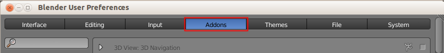
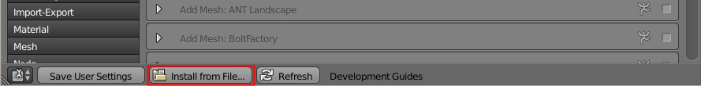
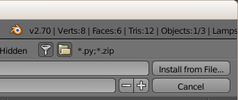
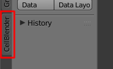
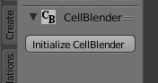

.. _cellblender_install:

*********************************************
CellBlender Installation
*********************************************

Download CellBlender
---------------------------------------------

Download `CellBlender 1.0`_.

.. _CellBlender 1.0: http://mcell.org/workshop2015/cellblender.zip

Installing CellBlender
---------------------------------------------

* Start Blender
* Select **File->User Preferences**

.. image:: ./images/install/user_prefs.png

* In the **User Preferences** control panel choose the **Addons** tab

* Click the **Install from File** button at the bottom of the window.

* Navigate to the unextracted zip file that you downloaded
  (cellblender_v1.0.zip) and select it
* Click the **Install from File** button near the upper-right hand corner.

.. note::

    If you need to install a newer version of CellBlender, the installation
    process is the same. The new version of CellBlender should cleanly install
    over the existing version.

Activating CellBlender in Blender
---------------------------------------------

* Select the **Cell Modeling** category button on left side of window
* Check the box for **Cell Modeling: CellBlender** (may take a few seconds)

.. image:: ./images/install/enable_cellblender.png

* Click **Save User Settings** to enable the addon permanently in Blender.
* Close the **Blender User Preferences** window
* Click **CellBlender** tab on left edge of window

* Click **Initialize CellBlender** button

