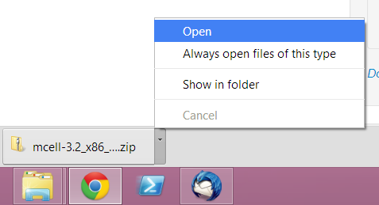
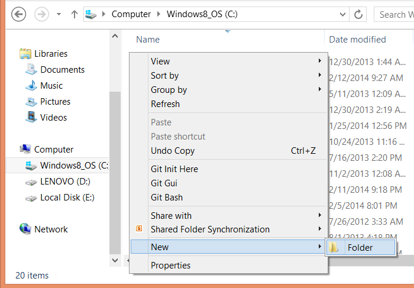
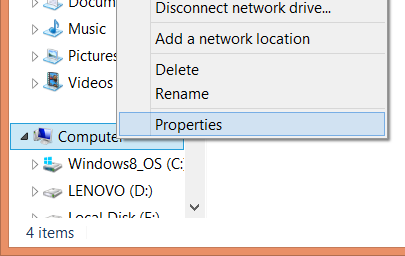
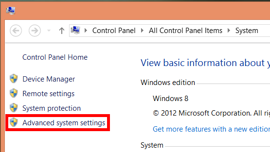
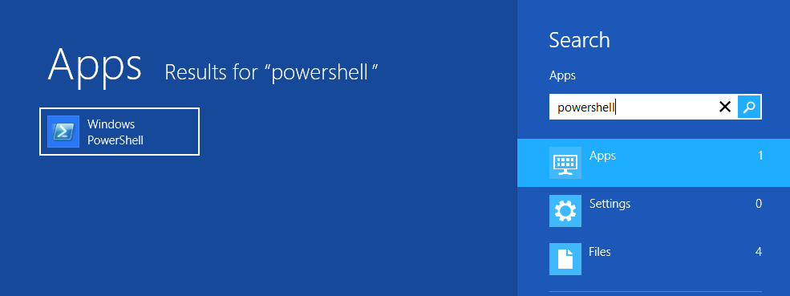
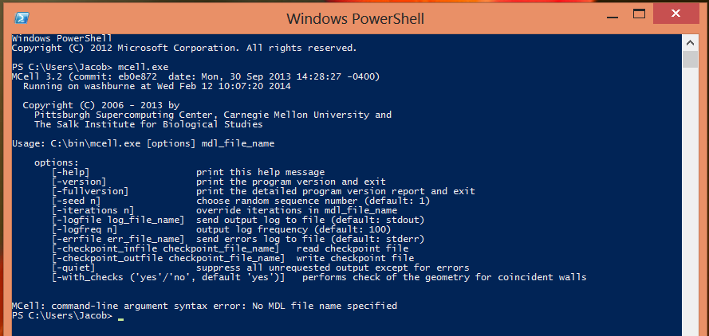

.. _mcell_install_windows:

*********************************************
Installing MCell (Windows)
*********************************************

.. note::

    MCell is included in the CellBlender 1.1 bundle (linux_, windows_). You
    only need to install MCell separately if you would like to run it outside
    of CellBlender or if you are setting up CellBlender from scratch.

.. _linux: http://mcell.org/download/files/cellblender1.1_bundle_linux.zip
.. _osx: http://mcell.org/download/files/cellblender1.1_bundle_osx.zip
.. _windows: http://mcell.org/download/files/cellblender1.1_bundle_windows.zip

Extract MCell
---------------------------------------------

Open the zipped Windows binary through the browser (shown here with Google
Chrome).

Windows `File Explorer`_ should appear, displaying the MCell binary (mcell.exe)
within the zipped file.

.. _File Explorer: http://en.wikipedia.org/wiki/File_Explorer

.. image:: ./images/install/mcell_zip.png

Drag and drop the binary to a new folder. For this example, we will create a
new folder in the top level C directory called bin (i.e. C:\\bin). To create a
new directory, right click on the background in File Explorer, select
**New->Folder**, type the name of the folder (e.g. bin), and hit **Enter**.

Put MCell in a PATH Directory
---------------------------------------------

This step is optional but is highly recommended if you will be running MCell
from the command line (i.e. without CellBlender). First, right click on
**Computer** and select **Properties**.

In the new window, click the **Advanced system settings** button.

Then click the **Environment Variables** button in the **System Properties**
window. In the **Environment Variables** window, select the **Path** entry in
the list of **System Variables**, and hit the **Edit** button. At the end of
the list of **Variable values**, add ``;C:\bin\``. If you extracted MCell into
a directory besides "C:\\bin\\", use that instead. Also, be sure to use the
initial semicolon and the trailing backslash.

.. image:: ./images/install/edit_path.png

Test MCell
---------------------------------------------

To run MCell in Windows without CellBlender, we are going to use `PowerShell`_,
which is included with Windows 7 and 8. Alternatively, you could use the
`Command Prompt`_, but we will not cover that here. To run PowerShell, hit the
Windows key, type **powershell**, and hit **Enter** (Windows 8 pictured below).

.. _PowerShell: http://en.wikipedia.org/wiki/Powershell

.. _Command Prompt: http://en.wikipedia.org/wiki/Command_Prompt

Windows PowerShell will now appear on the screen. Type **mcell.exe** and hit
**Enter**. If you see the following text on your screen, you have set up your
PATH correctly.

