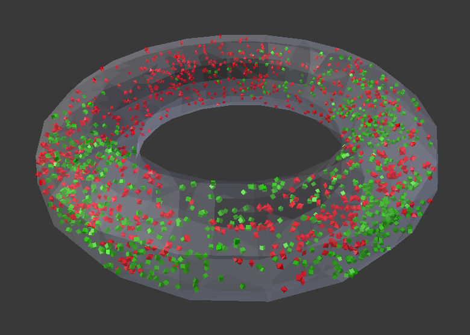
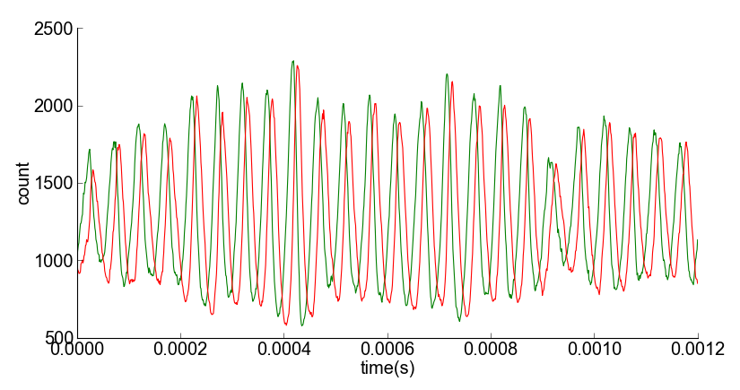
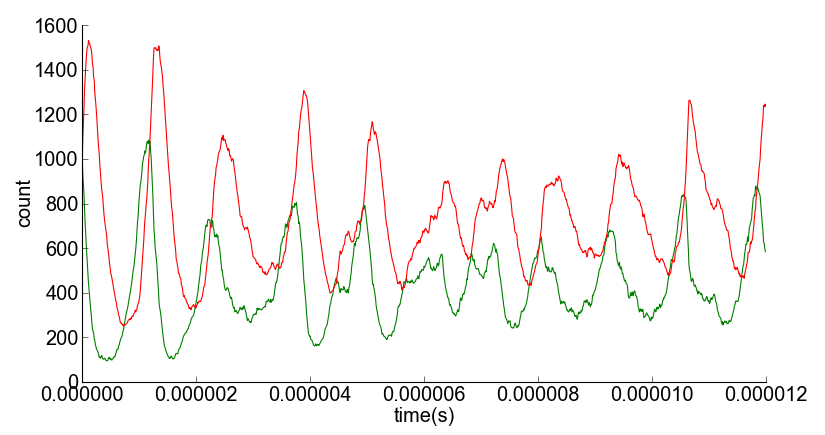

.. 
    Comment:
    This version contains "check marks" because they show up properly in HTML.
    However, they cause problems generating LaTeX / PDF output.
    Note that these "check marks" are actually square roots:  unicode e2889a.
    Unicode does have an actual "check mark" as e29c93, but it hasn't been tested.

..  _lotka_volterra_torus:

*************************
Lotka-Volterra in a Torus
*************************

.. Git Repo SHA1 ID: a1abdd291b75176d6581df41329781ae5d5e1b7d

.. raw:: html

	  
	  
	  
	  
	  

.. role:: menu
.. role:: button
.. role:: key

Lotka Volterra System Description
---------------------------------

This tutorial uses the `Lotka-Volterra`_ oscillating system to demonstrate a
simple but dynamic CellBlender model. This model can also be used to show the
difference between a diffusion-limited reaction and a "physiologic" reaction.

The Lotka-Volterra system is also known as a "predator-prey" system and that's
the terminology that we'll be using in this tutorial.

The "**prey**" represents a species whose population grows exponentially when not
constrained. In our CellBlender model we can represent this "reproductive" behavior
with the simple reaction:

  | **prey -> prey + prey**

The "**predator**" represents a species whose population grows by consuming prey.
In our CellBlender model, we can represent this "predatory" behavior with the
simple reaction:

  | **predator + prey -> predator + predator**

Finally, with those equations alone there would be no end to the predators,
so we can represent a predator "death" behavior with this reaction:

  | **predator -> NULL**

The rest of this tutorial will guide you through the process of:

  * Constructing an "arena" for the system
  * Defining the molecules to represent the predators and prey
  * Defining the reactions between the predators and the prey
  * Visualizing the result
  * Plotting the populations over time
  * Experimenting with System Parameters to observe different behaviors

Specifications of the Model
---------------------------

For those familiar with building CellBlender models, here's the short-hand version:

 | *Geometry:*

  +------------------------+--------------------------+
  | **Torus Feature**      | **Setting**              |
  +========================+==========================+
  | Name                   | arena                    |
  +------------------------+--------------------------+
  | Major Segments         | 20                       |
  +------------------------+--------------------------+
  | Minor Segments         | 10                       |
  +------------------------+--------------------------+
  | Major Radius           | 0.1                      |
  +------------------------+--------------------------+
  | Minor Radius           | 0.03                     |
  +------------------------+--------------------------+
  | Transparency           | Yes                      |
  +------------------------+--------------------------+
  | Alpha                  | 0.3                      |
  +------------------------+--------------------------+

 | *Molecules:*

  +--------------------+--------------------------+------------------------------+-------------+-------+------+
  | **Species Name**   | **Diffusion Constant**   | **Initial Release in Arena** | Glyph       | Color | Size |
  +====================+==========================+==============================+=============+=======+======+
  | prey               | 6e-6                     | 1000 in prey_rel             | Cube        | Green | 0.2  | 
  +--------------------+--------------------------+------------------------------+-------------+-------+------+
  | predator           | 6e-6                     | 1000 in predator_rel         | Octahedron  | Red   | 0.3  |
  +--------------------+--------------------------+------------------------------+-------------+-------+------+

 | *Reactions:*

  +-------------------------+--------------------------+-------------------------+
  | **Reactants**           | **Products**             | **Forward Rate**        |
  +=========================+==========================+=========================+
  | prey                    | prey + prey              | 129e3                   |
  +-------------------------+--------------------------+-------------------------+
  | predator + prey         | predator + predator      | 1e8                     |
  +-------------------------+--------------------------+-------------------------+
  | predator                | NULL                     | 130e3                   |
  +-------------------------+--------------------------+-------------------------+

 | *Plots:*

  +-------------------------+--------------------------+--------------------+
  | **Count Type**          | **Molecule**             | **Location**       |
  +=========================+==========================+====================+
  | Molecule                | prey                     | World              |
  +-------------------------+--------------------------+--------------------+
  | Molecule                | predator                 | World              |
  +-------------------------+--------------------------+--------------------+

Step by step instructions for building the model
------------------------------------------------

.. note::

    This tutorial was generated with Blender 2.74 and CellBlender 1.0.

      **Fonts and colors used below:**

        | Descriptive Text

        | :menu:`Menu Items` (click these with mouse)

        | :button:`Buttons` (click these with mouse)

        | :key:`K` eyboard keys and typing (type these characters)

Reset Blender and initialize CellBlender.
.........................................
1. :menu:`File / Load Factory Settings` :button:`Load Factory Settings`
#. Select All Objects (camera, light, cube) with :key:`a` :key:`a` (until everything is highlighted)
#. Delete All Selected Objects (camera, light, cube) with: :key:`x`  :button:`Delete`
#. :menu:`File / Save Startup File`  :button:`Save Startup File`
#. :menu:`File / User Preferences...`  :button:`Save User Settings`  :button:`x` to close window

#. :menu:`File / User Preferences...`  :button:`Add-ons`  :button:`Cell Modeling`
#. Cell Modeling: CellBlender :button:`√` (Check the box to enable CellBlender)
#. :button:`Save User Settings`  :button:`x` to close window
#. Click :button:`CellBlender` Tab (on left side of window)
#. :button:`Initialize CellBlender` (should show CellBlender Panel and Buttons)
#. Enlarge the CellBlender panel (make it wider and taller so all buttons show)
#. CellBlender Panel: :button:`Preferences` (Open the CellBlender “Preferences” Panel)
#. :button:`Set Path to MCell Binary` (find MCell binary - depends on where MCell was installed)   
	  *Example:   /home/user/mcell/bin/mcell*
#. Click :button:`Set MCell Binary`  to select it (this closes the file navigation window)
#. :menu:`File / Save Startup File`  :button:`Save Startup File`
#. :menu:`File / User Preferences...`  :button:`Save User Settings`  :button:`x` to close window
#. :menu:`File / Save As...`   :key:`/home/user/mcell/models/lv.blend`    :button:`Save As Blender File`

This section constructs a semi-transparent torus named "arena" to contain our model.
....................................................................................
18. Drag the divider below the CellBlender panel to about 1/2 the window height to make room for other tools below it.
#. Drag the divider on the right side of the 3D view to the left a bit to make room for all of the Property Buttons.
#. In 3D View menu: :menu:`Object / Snap / Cursor to Center`  (ensures that objects are placed at the origin)
#. In 3D View menu: :menu:`Add / Mesh / Torus`  (look for "Add Torus" settings in lower half of left panel).
#. Use the mouse wheel to zoom in to get a better view of the new Torus object.
#. In the lower left panel, leave the Location and Rotation settings at all zeros.
#. Change the "Major Segments" of the Torus to :key:`20` followed by :key:`Enter`.
#. Change the "Minor Segments" of the Torus to :key:`10` followed by :key:`Enter`.
#. Change the "Major Radius" of the Torus to :key:`0.1` followed by :key:`Enter`.
#. Change the "Minor Radius" of the Torus to :key:`0.03` followed by :key:`Enter`.
#. Use the mouse wheel to zoom in again until the Torus object fills the 3D View.
#. Double-Click the word :button:`Torus` in the Outliner to select it for editing (upper right panel).
#. Type the new name for the torus to be :key:`arena` followed by :key:`Enter`.
#. Open the :button:`Object Properties` panel by clicking the small orange cube (upper right).
#. Check :button:`√` the "Transparency" box to enable the transparency feature for the arena object
#. Open the :button:`Material Properties` panel by clicking the small round icon button (to right of triangle mesh).
#. Click the :button:`New` button to create a new material for the arena.
#. Check :button:`√` the "Transparency" box to enable transparency for this material
#. Click the :button:`Alpha` button and type :key:`0.3` followed by :key:`Enter` to make the "arena" semi-transparent.
#. Drag the divider below the CellBlender panel down toward the bottom to make more room for the CellBlender panels we'll use to define the rest of the model.
#. :menu:`File / Save`
 

Blender objects must be "Model Objects" to be seen by MCell. Add the "arena" to MCell's Model Objects.
......................................................................................................
39. CellBlender Panel: :button:`Model Objects`
#. Be sure the newly created "arena" is selected (should show "arena" near coordinate axis in lower left). Right-click the arena itself or left-click its name in the Outliner as needed.
#. Click the :button:`+` button next to "Model Objects".
#. The "arena" should be in the Model Objects box with a green check mark.
#. :menu:`File / Save`

This section defines the molecule types (or "species") we'll need for our model.
................................................................................

 +----------+-------------------------------------------------+
 | Species  | Type of Molecule and Diffusion Constant         |
 +==========+=================================================+
 | prey     | Volume Molecule with diffusion constant of 6e-6 |
 +----------+-------------------------------------------------+
 | predator | Volume Molecule with diffusion constant of 6e-6 |
 +----------+-------------------------------------------------+

44. CellBlender Panel: :button:`Molecules`

#. Define a new Molecule Species with: :button:`+`
#. Change the “Molecule Name” to :key:`prey` followed by :key:`Enter`
#. Change the “Molecule Type” to :button:`Volume Molecule` if needed (should be the default)
#. Change the “Diffusion Constant” to :key:`6e-6` followed by :key:`Enter`

#. Add a second Molecule Species with: :button:`+`
#. Change the “Molecule Name” to :key:`predator` followed by :key:`Enter`
#. Change the “Molecule Type” to :button:`Volume Molecule` if needed (should be the default)
#. Change the “Diffusion Constant” to :key:`6e-6` followed by :key:`Enter`

#. :menu:`File / Save`

 
This section creates sites to release actual molecules into the model.
......................................................................

 +---------------+-----------------------------------------------------------+
 | Release Site  | Number of each Molecule Species to release in Location    |
 +===============+===========================================================+
 | prey_rel      | Releases 1000 "prey" molecules in the "arena" object      |
 +---------------+-----------------------------------------------------------+
 | predator_rel  | Releases 1000 "predator" molecules in the "arena" object  |
 +---------------+-----------------------------------------------------------+
      
54. CellBlender Panel: :button:`Molecule Placement`
#. Define a new Molecule Placement Site with: :button:`+`
#. Change the “Site Name” to :key:`prey_rel` followed by :key:`Enter`
#. Select the “prey” molecule with :button:`prey`
#. Set the “Release Shape” to  :button:`Object/Region`
#. In the Object/Region box, type: :key:`arena` followed by :key:`Enter`
#. Set the “Quantity to Release” to :key:`1000` followed by :key:`Enter`
#. Define a second Molecule Placement Site with: :button:`+`
#. Change the “Site Name” to :key:`predator_rel` followed by :key:`Enter`
#. Select the “predator” molecule with :button:`predator`
#. Set the “Release Shape” to  :button:`Object/Region`
#. In the Object/Region box, type: :key:`arena` followed by :key:`Enter`
#. Set the “Quantity to Release” to :key:`1000` followed by :key:`Enter`
#. :menu:`File / Save`

 
This model may run slow, so we'll only run it for 100 iterations while building our model.
..........................................................................................
68. CellBlender Panel: :button:`Run Simulation`
#. Set the "Iterations" to :key:`100`
#. Start the simulation: :button:`Run`
#. Wait for the simulation to complete running.
#. CellBlender Panel: :button:`Reload Visualization Data`
#. Click in the Timeline and drag right and left to see molecule motion.
#. Click and hold mouse wheel while dragging in 3D window to change viewing angle.
#. :menu:`File / Save`

 
The default molecules are too large for this model. Let's change their size, color, and glyph.
..............................................................................................

76. CellBlender Panel: :button:`Molecules`

#. Select the "prey" molecules: :button:`prey`
#. Open the :button:`Display Options` panel (within the "Molecules" panel)
#. Change the Molecule glyph from :button:`Cone` to :button:`Cube`
#. Change the Molecule color (:button:`gray box below glyph`) to a bright green.
#. Change the scale to :key:`0.2` followed by :key:`Enter`.

#. Select the "predator" molecules: :button:`predator`
#. Change the Molecule glyph from :button:`Cone` to :button:`Octahedron`
#. Change the Molecule color (:button:`gray box below glyph`) to a bright red.
#. Change the scale to :key:`0.3` followed by :key:`Enter`.

#. Again experiment with zooming, changing viewing angle, and moving in time.

#. :menu:`File / Save`
 

Define the Reactions for the Lotka-Volterra Predator/Prey model:
................................................................

 +------------------------------------------+---------------------------------------------------------------+
 | Reactants -> Products                    |  Description and Forward Reaction Rate                        |
 +==========================================+===============================================================+
 | prey -> prey + prey                      |  Simulates breeding of prey at rate = 129,000 or 129e3        |
 +------------------------------------------+---------------------------------------------------------------+
 | prey + predator -> predator + predator   |  Simulates predation at rate = 100,000,000 or 1e8             |
 +------------------------------------------+---------------------------------------------------------------+
 | predator -> NULL                         |  Simulates natural predator death at rate = 130,000 or 130e3  |
 +------------------------------------------+---------------------------------------------------------------+

88. CellBlender Panel: :button:`Reactions`
#. Create the Prey Breeding Reaction with: :button:`+`
#. In the Reactants box type: :key:`prey` followed by :key:`Enter`
#. In the Products box type: :key:`prey + prey` followed by :key:`Enter`
#. Set the "Forward Rate" to :key:`129e3` followed by :key:`Enter`

#. Create the Predation Reaction with: :button:`+`
#. In the Reactants box type: :key:`prey + predator` followed by :key:`Enter`
#. In the Products box type: :key:`predator + predator` followed by :key:`Enter`
#. Set the "Forward Rate" to :key:`1e8` followed by :key:`Enter`

#. Create the Predator Death Reaction with: :button:`+`
#. In the Reactants box type: :key:`predator` followed by :key:`Enter`
#. In the Products box type: :key:`NULL` followed by :key:`Enter`
#. Set the "Forward Rate" to :key:`130e3` followed by :key:`Enter`

#. :menu:`File / Save`

Test the system with another short run:
.......................................
102. CellBlender Panel: :button:`Run Simulation`
#. Start the simulation: :button:`Run`
#. Wait for the simulation to complete running.
#. CellBlender Panel: :button:`Reload Visualization Data`
#. Click in the Timeline and drag right and left to see molecule motion and reactions.
#. :menu:`File / Save`

 
Set up the items to be plotted in the final run:
................................................
108. CellBlender Panel: :button:`Plot Output Settings`
#. Define two Molecules to track by pressing “+” 2 times: :button:`+` :button:`+`
#. Click on the first “Name error:” and change the Molecule to :button:`prey`
#. Click on the second “Name error:” and change the Molecule to :button:`predator`
#. :menu:`File / Save`
 

Make the final run:
...................
113. CellBlender Panel: :button:`Run Simulation`
#. Set the "Iterations" to :key:`1200` followed by :key:`Enter`
#. Start the simulation: :button:`Run`
#. Wait for the simulation to complete running. This may take some time.
#. CellBlender Panel: :button:`Reload Visualization Data` (Timeline should show 0 to 1200).
#. Use the "VCR" controls to "rewind" and "play" the simulation. Watch for oscillations of predator and prey populations. Stop when done.
#. :menu:`File / Save`

 

Plot the Predator/Prey populations over time:
.............................................
120. CellBlender Panel: :button:`Plot Output Settings`
#. Set the Page/Plot selector to: :button:`One Page, One Plot`
#. Check :button:`√` the "Molecule Colors" box to use the molecule colors for the plot.
#. Click one of the :button:`plotter buttons` available on your machine.
#. Expand the plot window to determine which population "leads" the other.
#. :menu:`File / Save`

.. _Lotka-Volterra: https://en.wikipedia.org/wiki/Lotka%E2%80%93Volterra_equation

.. _here: http://mcell.org/tutorials/downloads/LV.zip

Diffusion-Limited / Physiologic Reactions
-----------------------------------------

Try experimenting with the system by changing these values:

 | *System Parameters:*

  +-----------------------------------+--------------------------+-------------------------+
  | **Parameter Name**                | **Current Value**        | **New Value**           |
  +===================================+==========================+=========================+
  | Prey Birth Rate (Reactions)       | 129,000                  | 8.6e6                   |
  +-----------------------------------+--------------------------+-------------------------+
  | Predation Rate (Reactions)        | 1e8                      | 1e12                    |
  +-----------------------------------+--------------------------+-------------------------+
  | Predator Death Rate (Reactions)   | 130,000                  | 5e6                     |
  +-----------------------------------+--------------------------+-------------------------+
  | Interaction Radius (Run/Adv)      | (blank)                  | 0.003                   |
  +-----------------------------------+--------------------------+-------------------------+
  | Time Step (Run)                   | 1e-6                     | 1e-8                    |
  +-----------------------------------+--------------------------+-------------------------+

Predator / Prey Populations over time with different System Parameters
......................................................................

