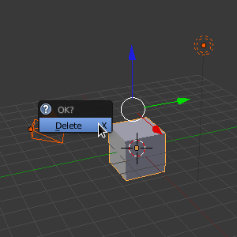
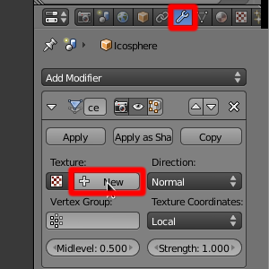
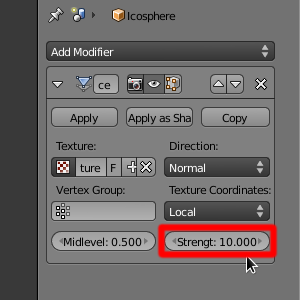
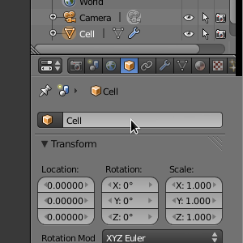
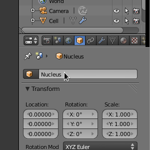
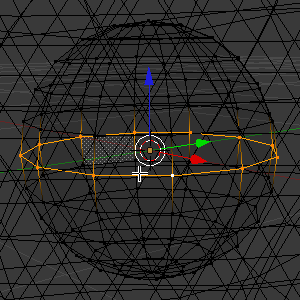
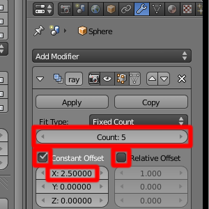
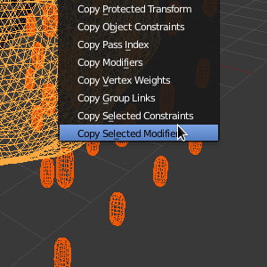
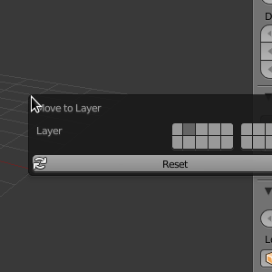
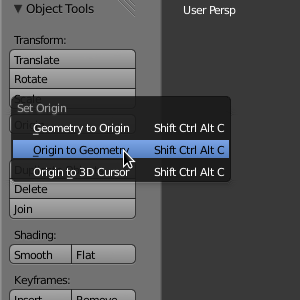

.. _mapk:

*********************************************
The MAPK Signaling Cascade
*********************************************

Up until now, many of the tutorials have used simple geometry and reaction
pathways. The goal of this tutorial is to give you a better idea of what is
possible with MCell by creating a more complicated and realistic model. Based
on the work of `Huang (1996)`_, we will create an MCell model of the MAPK
signalling cascade. Modifications were made in adapting the ODE model for both
practical and illustrative purposes.

.. _Huang (1996): http://www.ncbi.nlm.nih.gov/pubmed/8816754

.. _mapk_create_mesh: 

Creating the Mesh
---------------------------------------------

If you would rather skip the mesh creation portion of this tutorial, you can
download the `blend file`_ and advance to the :ref:`mapk_annotate` section.
Otherwise you should watch the video or follow along with the instructions
immediately after the video.

.. raw:: html

    <video id="my_video_1" class="video-js vjs-default-skin" controls
      preload="metadata" width="960" height="540" 
      data-setup='{"example_option":true}'>
      <source src="http://www.mcell.psc.edu/tutorials/videos/main/mapk.ogg" type='video/ogg'/>
    </video>

.. _blend file: https://www.mcell.org/tutorials/downloads/mapk.blend

After starting up Blender, we need to enable an addon that we'll use later.

.. image:: ./images/mapk/mapk_user_preferences.png

.. image:: ./images/mapk/mapk_copy_attributes.png

Click **File>User Preferences**, select **Addons** near the top middle, and
then click **3D View** under the list of **Categories**. Select **3D View: Copy
Attributes Menu**. This will allow us to copy properties (like **Modifiers**)
from one object to another. Optional: Hit **Save As Default** if you would like
to use this Addon every time Blender is started.

Hit **a** twice so that everything (**Cube**, **Camera**, **Lamp**) in the
**Scene** is selected. Hit **x** and click **Delete** to delete these objects.

.. _mapk_create_cell: 

Creating the Cell
+++++++++++++++++++++++++++++++++++++++++++++

.. image:: ./images/mapk/mapk_add_icosphere.png

.. image:: ./images/mapk/mapk_cell_subd_size.png

Next add a sphere by hitting **Shift-a** and selecting **Mesh>Icosphere**.
Change **Subdivisions** to **5** and **Size** to **5.0**. This will be the cell
membrane.

Select the **Modifiers** button in the **Properties** window. Select
**Displace** from the **Add Modifier** drop-down menu. Hit the **New** button
by the **Texture** drop-down menu. Change **Strength** to **10**. This will add
some procedural randomness to our model, so it is not perfectly round. 

.. image:: ./images/mapk/mapk_smooth_factor_repeat.png

Next, select **Smooth** from the **Add Modifier** drop-down menu. Change
**Factor** to **1** and **Repeat** to **10**. This will smooth out the rough
edges that we introduced with the **Displace** modifier.

We should give our mesh a name. Hit the **Object** button and change
**IcoSphere** to **Cell**.

.. image:: ./images/mapk/mapk_cell_wireframe.png

Hit **z** to switch to a wireframe view of our model so that we can see inside
of it.

.. _mapk_create_nucleus: 

Creating the Nucleus
+++++++++++++++++++++++++++++++++++++++++++++

.. image:: ./images/mapk/mapk_add_icosphere.png

.. image:: ./images/mapk/mapk_cell_subd_size2.png

We will now add the **Nucleus** which will be very similar to our **Cell** but
smaller. Hit **Shift-a** and select **Mesh>Icosphere**. Change **Subdivisions**
to **3** and **Size** to **2.0**.

.. image:: ./images/mapk/mapk_copy_mods.png

We want to add in the randomness like we did before, but let's save ourselves
some steps by using the **Copy Attributes** addon that we enabled earlier.
Select the inner sphere first by left clicking on it. Then while holding
**Shift**, select the outer sphere. Hit **Ctrl-c** and select **Copy
Modifiers**.

Once again, let's rename our mesh. Right click on the nucleus, so only it is
selected. Hit the **Object** button and change **IcoSphere** to **Nucleus**.

.. _mapk_create_mito: 

Creating the Mitochondria
+++++++++++++++++++++++++++++++++++++++++++++

Now, we are going to create some mitochondria. But, first, we have to create a
template version which we will then duplicate many times using the **Array
Modifier**.

.. image:: ./images/mapk/mapk_add_uvsphere.png

.. image:: ./images/mapk/mapk_uvsphere_seg_ring_size.png

Hit **Shift-a** and select **Mesh>UV Sphere**. Change **Segments** to **12**,
**Rings** to **12**, and **Size** to **0.5**. Hit **Tab** to change into **Edit
Mode** and **a** to deselect everything. Hit **o** to change into
**Proportional Editing** mode. 

.. image:: ./images/mapk/mapk_xy_scale.png

Hold **Shift-Alt** and **right click** on the ring around the middle of the
circle to select the entire ring. This is what is called a **Edge/Vertex Loop
Select**. Next hit **s** to scale and **Shift-z** to constrain the scaling to
xy-plane. Roll the mouse wheel down until the **Proportional size** is listed
as **1.46**. Type **0.4** and hit **Enter**. Hit **Tab** to switch back into
**Object Mode**.

.. image:: ./images/mapk/mapk_mito_location.png

Hit **n** to open up the **Properties** panel display. Under the **Transform**
section, change **X**, **Y**, and **Z** to **-5.0**.

Adding Modifiers
_____________________________________________

Now we are going to begin duplicating the mitochondria. Hit the **Modifier**
button. Select **Array** from the drop-down menu. Change **Count** to 5.
Deselect **Relative Offset** and select **Constant Offset**. Change **X** to
**2.5**. Add two more **Array** modifiers with similar settings, except one has
**Y** set to **2.5** and the other has **Z** set to **2.5**. You should now
have a cuboidal array of mitochondria extending through the cell. 

.. image:: ./images/mapk/mapk_mito_displace_smooth.png

We want to add the same variability to the meshes that we did for the cell and
the nucleus. With the mitochondria selected, hold **Shift** and **right click**
on the cell. Hit **Ctrl-c** and pick **Copy Select Modifiers**. Select
**Displace** and **Smooth** and hit **OK**. Right click on the mitochondria so
only they are selected. Change the **Strength** of **Displace** to **0.5**.
Change the **Factor** of **Smooth** to **0.5**.

.. image:: ./images/mapk/mapk_mitochondrion_name.png

Like we did before, let's name our mesh. Hit the **Object** button and change
**Sphere** to **Mitochondrion**.

Move the mitochondria to the second layer by hitting **m** and **2**. Then hit
**2** again to switch to layer 2. 

.. image:: ./images/mapk/mapk_apply_mod.png

Now, we want to add some randomness to their positions and rotations. First,
apply all of the modifiers by hitting the **Apply** underneath each modifier's
name. Hit **Tab** to change into **Edit Mode**. 

.. image:: ./images/mapk/mapk_by_loose_parts.png

Hit **p** and select **By loose parts** to separate each discontinuous section
of the mesh into a unique object. Hit **Tab** to change into **Object Mode**.
Select all of them by hitting **a** twice. 

Under **Object Tools**, hit the **Origin** button and select **Origin to
Geometry**. 

Randomizing Mitochondria Placement
_____________________________________________

.. image:: ./images/mapk/mapk_scripting.png

.. image:: ./images/mapk/mapk_new_script.png

In the Screen layout drop-down menu, which should currently say **Default**,
select **Scripting**. This should change the types and positioning of the
**Editors**. On the left, is a **Text Editor**. Hit the **New** button and
paste the following text into the editor:

.. code-block:: python
    :emphasize-lines: 1,2,7-15

    import bpy, math, random
    from mathutils import Euler, Vector

    def main(context):
        for ob in context.scene.objects:
            if ob.select == True: 
                x_loc = ob.location[0]+random.uniform(-1,1)
                y_loc = ob.location[1]+random.uniform(-1,1)
                z_loc = ob.location[2]+random.uniform(-1,1)
                x_rot = random.uniform(0,2)*math.pi
                y_rot = random.uniform(0,2)*math.pi
                z_rot = random.uniform(0,2)*math.pi
                ob.location = Vector((x_loc,y_loc,z_loc))
                ob.rotation_euler = Euler((x_rot,y_rot,z_rot))

    class SimpleOperator(bpy.types.Operator):
        '''Tooltip'''
        bl_idname = "object.simple_operator"
        bl_label = "Simple Object Operator"

        @classmethod
        def poll(cls, context):
            return context.active_object != None

        def execute(self, context):
            main(context)
            return {'FINISHED'}

    def register():
        bpy.utils.register_class(SimpleOperator)

    def unregister():
        bpy.utils.unregister_class(SimpleOperator)

    if __name__ == "__main__":
        register()

        # test call
        bpy.ops.object.simple_operator()

Note: This is merely the **Operator Simple Template** with several new lines
added, which have been highlighted for emphasis.

.. image:: ./images/mapk/mapk_run_script.png

Hit the **Run Script** button and all the mitochondrion should be randomly
rotated and shifted around. You should now switch back to the **Default**
screen layout. Next, we want to remove any mitochondria that might be outside
of the **Cell** or inside of the **Nucleus**. Hold **Shift** and hit **1** so
that layer 1 and 2 are both showing. You may want to hit **z** to turn off
wireframe mode.

Remove Extra Mitochondria
_____________________________________________

.. image:: ./images/mapk/mapk_delete_extra_mitos.png

We cannot give exact instructions for this next section, because the
positioning of your mitochondria will be different. Nevertheless, it shouldn't
be too hard to remove the extras. Hit **c** to do bring up a circle select.
**Left click and drag** around the mitochondria that are outside of the cell
being careful not to select the cell itself. You can adjust the size of the
circle selector by rolling the **mouse wheel up or down**. Some that are very
close or overlapping with the cell may need to be removed using the normal
method of selecting **right click**. Once you have a group of them selected,
hit **x** and click **Delete**.  Don't forget to check all sides of the cell by
holding down the middle mouse button and dragging around. 

.. image:: ./images/mapk/mapk_delete_nucleus_mitos.png

Next you will want to delete any mitochondria that might be inside the nucleus.
The best way to do this is by selecting and hiding everything outside of it
first. Select the **Cell** and hit **h** to hide it. Then begin circle selecting
every mitochondria outside of the nucleus and hit **h** again. Once you have
done that, you can hide the nucleus itself and delete (hit **x**) anything
inside of it.

The numbering of the mitochondria's names will almost certainly have breaks in
it. If you'd like to fix this, change to layer two. Select all the mitochodria
and hit **Ctrl-j** to join them all together. Hit the **Object** button and
change them name from **Mitochondrion.0##** to **Mitochondrion**. Hit **Tab**
to change into **Edit Mode**. Hit **p** and select **By loose parts**. Select
all of them by hitting **a** twice. Under **Object Tools**, hit the **Origin**
button and select **Origin to Geometry**. Now the numbering of the names should
be fixed.

We need to make one final set of changes to our **Cell** and **Nucleus**. Apply
the **Displace** and **Smooth** modifiers like you did for the mitochondria.

.. _mapk_cellblender_params: 

Setting CellBlender Parameters and Exporting
---------------------------------------------

Select both layers again.

.. image:: ./images/mapk/mapk_model_obj_init.png

In the **3D View Editor**, hit **a** twice to select everything. Hit the
**Scene** button. Expand the **Model Objects** panel. Hit the **+** button. The
list should fill with all the objects names. Expand **Model Initialization**.
Change **Simulation Iterations** to **30000**.

.. image:: ./images/mapk/mapk_viz_rxn.png

Under **Reaction Output Settings**, enable **Include Reaction Output**. Next,
enable **Include Viz Output** under **Visualization Output Settings**.

Let's export what we have right now and fill in the missing pieces with a text
editor and the command line. Although we could certainly annotate this fully in
CellBlender, it might be quicker to hand edit the files. Expand **CellBlender
Project Settings** and hit **Set CellBlender Project Directory**. Navigate to
**/home/user/mcell_tutorial/mapk** (where user is your user name) and hit **Set
Project Directory**. Next hit **Export CellBlender Project** and **Export MCell
MDL**.

.. _mapk_annotate:

Annotating the Model
---------------------------------------------

Molecules
+++++++++++++++++++++++++++++++++++++++++++++

Open **mapk.molecules.mdl** and put the following into::

    DEFINE_MOLECULES
    {
        e1 {DIFFUSION_CONSTANT_3D = 6e-6}
        e2 {DIFFUSION_CONSTANT_3D = 6e-6}
        mapkkk {DIFFUSION_CONSTANT_3D = 6e-6}
        mapkkkp {DIFFUSION_CONSTANT_3D = 6e-6}
        mapkk {DIFFUSION_CONSTANT_3D = 6e-6}
        mapkkp {DIFFUSION_CONSTANT_3D = 6e-6}
        mapkkpp {DIFFUSION_CONSTANT_3D = 6e-6}
        mapkkpase {DIFFUSION_CONSTANT_3D = 6e-6}
        mapk {DIFFUSION_CONSTANT_3D = 6e-6}
        mapkp {DIFFUSION_CONSTANT_3D = 6e-6}
        mapkpp {DIFFUSION_CONSTANT_3D = 6e-6}
        mapkpase {DIFFUSION_CONSTANT_3D = 6e-6}

        e1_mapkkk {DIFFUSION_CONSTANT_3D = 6E-6}
        e2_mapkkkp {DIFFUSION_CONSTANT_3D = 6E-6}

        mapkkkp_mapkk {DIFFUSION_CONSTANT_3D = 6E-6}

        mapkkkp_mapkkp {DIFFUSION_CONSTANT_3D = 6E-6}

        mapkkpase_mapkkp {DIFFUSION_CONSTANT_3D = 6E-6}
        mapkkpase_mapkkpp {DIFFUSION_CONSTANT_3D = 6E-6}
        mapkkpp_mapk {DIFFUSION_CONSTANT_3D = 6E-6}
        mapkpase_mapkp {DIFFUSION_CONSTANT_3D = 6E-6}
        mapkkpp_mapkp {DIFFUSION_CONSTANT_3D = 6E-6}
        mapkpase_mapkpp {DIFFUSION_CONSTANT_3D = 6E-6}
    }

Reactions
+++++++++++++++++++++++++++++++++++++++++++++

Save and quit. Next open mapk.reactions.mdl and put the following into it::

    k1 = 1e8 
    k2 = 10
    k3 = 1e3 

    DEFINE_REACTIONS
    {
        e1 + mapkkk -> e1_mapkkk [k1]
        e1_mapkkk -> e1 + mapkkk [k2]
        e1_mapkkk -> e1 + mapkkkp [k3]

        e2 + mapkkkp -> e2_mapkkkp [k1]
        e2_mapkkkp -> e2 + mapkkkp [k2]
        e2_mapkkkp -> e2 + mapkkk [k3]

        mapkkkp + mapkk -> mapkkkp_mapkk [k1]
        mapkkkp_mapkk -> mapkkkp + mapkk [k2]
        mapkkkp_mapkk -> mapkkkp + mapkkp [k3]

        mapkkpase + mapkkp -> mapkkpase_mapkkp [k1]
        mapkkpase_mapkkp -> mapkkpase + mapkkp [k2]
        mapkkpase_mapkkp -> mapkkpase + mapkk [k3]

        mapkkkp + mapkkp -> mapkkkp_mapkkp [k1]
        mapkkkp_mapkkp -> mapkkkp + mapkkp [k2]
        mapkkkp_mapkkp -> mapkkkp + mapkkpp [k3]

        mapkkpase + mapkkpp -> mapkkpase_mapkkpp [k1]
        mapkkpase_mapkkpp -> mapkkpase + mapkkpp [k2]
        mapkkpase_mapkkpp -> mapkkpase + mapkkp [k3]

        mapkkpp + mapk -> mapkkpp_mapk [k1]
        mapkkpp_mapk -> mapkkpp + mapk [k2]
        mapkkpp_mapk -> mapkkpp + mapkp [k3]

        mapkpase + mapkp -> mapkpase_mapkp [k1]
        mapkpase_mapkp -> mapkpase + mapkp [k2]
        mapkpase_mapkp -> mapkpase + mapk [k3]

        mapkkpp + mapkp -> mapkkpp_mapkp [k1]
        mapkkpp_mapkp -> mapkkpp + mapkp [k2]
        mapkkpp_mapkp -> mapkkpp + mapkpp [k3]

        mapkpase + mapkpp -> mapkpase_mapkpp [k1]
        mapkpase_mapkpp -> mapkpase + mapkpp [k2]
        mapkpase_mapkpp -> mapkpase + mapkp [k3]
    }

Surface Regions
+++++++++++++++++++++++++++++++++++++++++++++

Next we need to add in the surface regions for the meshes. Run the following
command::

    sed -n '1h;1!H;${;g;s/  \}\n\}/  \}\n  DEFINE_SURFACE_REGIONS\n  \{\n    all\{ELEMENT_LIST = [ALL_ELEMENTS]\}\n  \}\n\}/g;p;}' mapk.geometry.mdl > test.mdl

If you are unfamiliar with **sed**, this command might look strange and
intimidating to you. However, we are merely searching for every instance of
this::

      }
    }

And replacing it with this::

      }
      DEFINE_SURFACE_REGIONS
      {
        all{ELEMENT_LIST = [ALL_ELEMENTS]}
      }
    }

This command will create a surface region called **all** for every object with
every element assigned to it.

Partitions and Release Sites
+++++++++++++++++++++++++++++++++++++++++++++

Next, open **mapk.main.mdl** and add the following text to the beginning::

    e1_conc = 1e-5
    e2_conc = 1e-5
    mapkkk_conc = 1e-5
    mapkk_conc = 1e-5
    mapk_conc = 1e-5
    mapkkpase_conc = 1e-8
    mapkpase_conc = 1e-8

    half_length = 1.1
    partition_step = 0.1
    PARTITION_X = [[-half_length TO half_length STEP partition_step]]
    PARTITION_Y = [[-half_length TO half_length STEP partition_step]]
    PARTITION_Z = [[-half_length TO half_length STEP partition_step]]

In the **INSTANTIATE** section after the last object, add the following::

    e1_release RELEASE_SITE {
        SHAPE = Scene.Cell[all]-Scene.Nucleus[all]-Scene.Mitochondrion[all]-Scene.Mitochondrion.001[all]-Scene.Mitochondrion.002[all]-Scene.Mitochondrion.003[all]-Scene.Mitochondrion.004[all]-Scene.Mitochondrion.005[all]-Scene.Mitochondrion.006[all]-Scene.Mitochondrion.007[all]-Scene.Mitochondrion.008[all]-Scene.Mitochondrion.009[all]-Scene.Mitochondrion.010[all]-Scene.Mitochondrion.011[all]-Scene.Mitochondrion.012[all]-Scene.Mitochondrion.013[all]-Scene.Mitochondrion.014[all]-Scene.Mitochondrion.015[all]-Scene.Mitochondrion.016[all]-Scene.Mitochondrion.017[all]-Scene.Mitochondrion.018[all]-Scene.Mitochondrion.019[all]-Scene.Mitochondrion.020[all]-Scene.Mitochondrion.021[all]-Scene.Mitochondrion.022[all]-Scene.Mitochondrion.023[all]
        MOLECULE = e1
        CONCENTRATION = e1_conc
    }

    e2_release RELEASE_SITE {
        SHAPE = Scene.Cell[all]-Scene.Nucleus[all]-Scene.Mitochondrion[all]-Scene.Mitochondrion.001[all]-Scene.Mitochondrion.002[all]-Scene.Mitochondrion.003[all]-Scene.Mitochondrion.004[all]-Scene.Mitochondrion.005[all]-Scene.Mitochondrion.006[all]-Scene.Mitochondrion.007[all]-Scene.Mitochondrion.008[all]-Scene.Mitochondrion.009[all]-Scene.Mitochondrion.010[all]-Scene.Mitochondrion.011[all]-Scene.Mitochondrion.012[all]-Scene.Mitochondrion.013[all]-Scene.Mitochondrion.014[all]-Scene.Mitochondrion.015[all]-Scene.Mitochondrion.016[all]-Scene.Mitochondrion.017[all]-Scene.Mitochondrion.018[all]-Scene.Mitochondrion.019[all]-Scene.Mitochondrion.020[all]-Scene.Mitochondrion.021[all]-Scene.Mitochondrion.022[all]-Scene.Mitochondrion.023[all]
        MOLECULE = e2
        CONCENTRATION = e2_conc
    }

    mapkkk_release RELEASE_SITE {
        SHAPE = Scene.Cell[all]-Scene.Nucleus[all]-Scene.Mitochondrion[all]-Scene.Mitochondrion.001[all]-Scene.Mitochondrion.002[all]-Scene.Mitochondrion.003[all]-Scene.Mitochondrion.004[all]-Scene.Mitochondrion.005[all]-Scene.Mitochondrion.006[all]-Scene.Mitochondrion.007[all]-Scene.Mitochondrion.008[all]-Scene.Mitochondrion.009[all]-Scene.Mitochondrion.010[all]-Scene.Mitochondrion.011[all]-Scene.Mitochondrion.012[all]-Scene.Mitochondrion.013[all]-Scene.Mitochondrion.014[all]-Scene.Mitochondrion.015[all]-Scene.Mitochondrion.016[all]-Scene.Mitochondrion.017[all]-Scene.Mitochondrion.018[all]-Scene.Mitochondrion.019[all]-Scene.Mitochondrion.020[all]-Scene.Mitochondrion.021[all]
        MOLECULE = mapkkk
        CONCENTRATION = mapkkk_conc
    }

    mapkk_release RELEASE_SITE {
        SHAPE = Scene.Cell[all]-Scene.Nucleus[all]-Scene.Mitochondrion[all]-Scene.Mitochondrion.001[all]-Scene.Mitochondrion.002[all]-Scene.Mitochondrion.003[all]-Scene.Mitochondrion.004[all]-Scene.Mitochondrion.005[all]-Scene.Mitochondrion.006[all]-Scene.Mitochondrion.007[all]-Scene.Mitochondrion.008[all]-Scene.Mitochondrion.009[all]-Scene.Mitochondrion.010[all]-Scene.Mitochondrion.011[all]-Scene.Mitochondrion.012[all]-Scene.Mitochondrion.013[all]-Scene.Mitochondrion.014[all]-Scene.Mitochondrion.015[all]-Scene.Mitochondrion.016[all]-Scene.Mitochondrion.017[all]-Scene.Mitochondrion.018[all]-Scene.Mitochondrion.019[all]-Scene.Mitochondrion.020[all]-Scene.Mitochondrion.021[all]
        MOLECULE = mapkk
        CONCENTRATION = mapkk_conc
    }

    mapk_release RELEASE_SITE {
        SHAPE = Scene.Cell[all]-Scene.Nucleus[all]-Scene.Mitochondrion[all]-Scene.Mitochondrion.001[all]-Scene.Mitochondrion.002[all]-Scene.Mitochondrion.003[all]-Scene.Mitochondrion.004[all]-Scene.Mitochondrion.005[all]-Scene.Mitochondrion.006[all]-Scene.Mitochondrion.007[all]-Scene.Mitochondrion.008[all]-Scene.Mitochondrion.009[all]-Scene.Mitochondrion.010[all]-Scene.Mitochondrion.011[all]-Scene.Mitochondrion.012[all]-Scene.Mitochondrion.013[all]-Scene.Mitochondrion.014[all]-Scene.Mitochondrion.015[all]-Scene.Mitochondrion.016[all]-Scene.Mitochondrion.017[all]-Scene.Mitochondrion.018[all]-Scene.Mitochondrion.019[all]-Scene.Mitochondrion.020[all]-Scene.Mitochondrion.021[all]
        MOLECULE = mapk
        CONCENTRATION = mapk_conc
    }

    mapkkpase_release RELEASE_SITE {
        SHAPE = Scene.Cell[all]-Scene.Nucleus[all]-Scene.Mitochondrion[all]-Scene.Mitochondrion.001[all]-Scene.Mitochondrion.002[all]-Scene.Mitochondrion.003[all]-Scene.Mitochondrion.004[all]-Scene.Mitochondrion.005[all]-Scene.Mitochondrion.006[all]-Scene.Mitochondrion.007[all]-Scene.Mitochondrion.008[all]-Scene.Mitochondrion.009[all]-Scene.Mitochondrion.010[all]-Scene.Mitochondrion.011[all]-Scene.Mitochondrion.012[all]-Scene.Mitochondrion.013[all]-Scene.Mitochondrion.014[all]-Scene.Mitochondrion.015[all]-Scene.Mitochondrion.016[all]-Scene.Mitochondrion.017[all]-Scene.Mitochondrion.018[all]-Scene.Mitochondrion.019[all]-Scene.Mitochondrion.020[all]-Scene.Mitochondrion.021[all]
        MOLECULE = mapkkpase
        CONCENTRATION = mapkkpase_conc
    }

    mapkpase_release RELEASE_SITE {
        SHAPE = Scene.Cell[all]-Scene.Nucleus[all]-Scene.Mitochondrion[all]-Scene.Mitochondrion.001[all]-Scene.Mitochondrion.002[all]-Scene.Mitochondrion.003[all]-Scene.Mitochondrion.004[all]-Scene.Mitochondrion.005[all]-Scene.Mitochondrion.006[all]-Scene.Mitochondrion.007[all]-Scene.Mitochondrion.008[all]-Scene.Mitochondrion.009[all]-Scene.Mitochondrion.010[all]-Scene.Mitochondrion.011[all]-Scene.Mitochondrion.012[all]-Scene.Mitochondrion.013[all]-Scene.Mitochondrion.014[all]-Scene.Mitochondrion.015[all]-Scene.Mitochondrion.016[all]-Scene.Mitochondrion.017[all]-Scene.Mitochondrion.018[all]-Scene.Mitochondrion.019[all]-Scene.Mitochondrion.020[all]-Scene.Mitochondrion.021[all]
        MOLECULE = mapkpase
        CONCENTRATION = mapkpase_conc
    }

Note: Your amount of mitochondria will almost certainly differ, and you will
need to change your **SHAPE** accordingly.

Visualization and Reaction Data
+++++++++++++++++++++++++++++++++++++++++++++

Next open **mapk.viz_output.mdl"** and add the following::

    VIZ_OUTPUT
    {
        MODE = CELLBLENDER
        FILENAME = "mapk"

        MOLECULES
        {
            NAME_LIST {ALL_MOLECULES}
            ITERATION_NUMBERS {ALL_DATA @ [[0 TO iterations STEP iterations/100]]}
        }   

    }

Finally, open **mapk.rxn_output.mdl"** and add this text::

    conv = 6.022141e23*1e-15

    REACTION_DATA_OUTPUT
    {
        OUTPUT_BUFFER_SIZE = 1000
        STEP = dt * 1

        {COUNT[e1,WORLD]} => "reaction_data/e1.dat"
        {COUNT[e2,WORLD]} => "reaction_data/e2.dat"
        {COUNT[mapkkk,WORLD]} => "reaction_data/mapkkk.dat"
        {COUNT[mapkkkp,WORLD]} => "reaction_data/mapkkkp.dat"
        {COUNT[mapkk,WORLD]} => "reaction_data/mapkk.dat"
        {COUNT[mapkkp,WORLD]} => "reaction_data/mapkkp.dat"
        {COUNT[mapkkpp,WORLD]} => "reaction_data/mapkkpp.dat"
        {COUNT[mapk,WORLD]} => "reaction_data/mapk.dat"
        {COUNT[mapkp,WORLD]} => "reaction_data/mapkp.dat"
        {COUNT[mapkpp,WORLD]} => "reaction_data/mapkpp.dat"
        {COUNT[mapkkpase,WORLD]} => "reaction_data/mapkkpase.dat"
        {COUNT[mapkpase,WORLD]} => "reaction_data/mapkpase.dat"

        {COUNT[e1,WORLD] / conv} => "reaction_data/e1_conc.dat"
        {COUNT[e2,WORLD] / conv} => "reaction_data/e2_conc.dat"
        {COUNT[mapkkk,WORLD] / conv} => "reaction_data/mapkkk_conc.dat"
        {COUNT[mapkkkp,WORLD] / conv} => "reaction_data/mapkkkp_conc.dat"
        {COUNT[mapkk,WORLD] / conv} => "reaction_data/mapkk_conc.dat"
        {COUNT[mapkkp,WORLD] / conv} => "reaction_data/mapkkp_conc.dat"
        {COUNT[mapkkpp,WORLD] / conv} => "reaction_data/mapkkpp_conc.dat"
        {COUNT[mapk,WORLD] / conv} => "reaction_data/mapk_conc.dat"
        {COUNT[mapkp,WORLD] / conv} => "reaction_data/mapkp_conc.dat"
        {COUNT[mapkpp,WORLD] / conv} => "reaction_data/mapkpp_conc.dat"
        {COUNT[mapkkpase,WORLD] / conv} => "reaction_data/mapkkpase_conc.dat"
        {COUNT[mapkpase,WORLD] / conv} => "reaction_data/mapkpase_conc.dat"

    }

Now you can run your mdl by typing **mcell mapk.main.mdl** at the command line.
