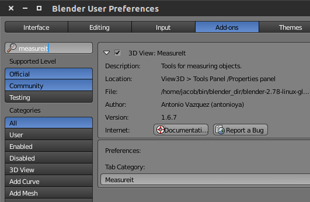
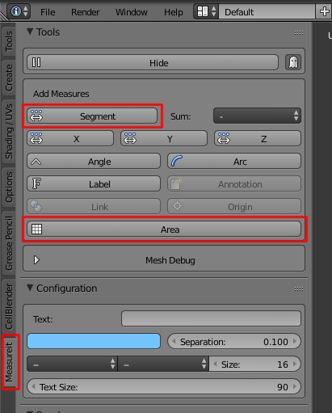

.. _mesh_analysis:

Mesh Analysis
=============================================

In this tutorial, we will show you how to analyse both whole meshes *and*
regions of meshes in your model. We will be using the Mesh Analysis portion of
CellBlender and a separate addon called MeasureIt. The Mesh Analysis tool will
be more useful when trying to ascertain properties of the entire mesh, whereas
MeasureIt will be more useful when dealing with a portion of a mesh.

.. note:: Some of these same issues are discussed in the :ref:`mesh_repair` and
    :ref:`gamer` tutorials.

Area, Volume, and Topology of Whole Meshes
----------------------------------------------

To find the area, volume, and topology of an entire mesh, we will use
CellBlender's Mesh Analysis tool. Expand the **Mesh Analysis** panel near the
top left of the screen.

.. image:: ./images/mesh_repair/mesh_analysis.png

Make sure that the object you're analyzing is triangulated first. Next, select
the object in **Object Mode** (right click on it) and hit **Analyze Mesh**.

The tool will only be able to report a volume if the object is a watertight
manifold mesh (i.e. there are no holes in your mesh and all surface normals are
consistent).  Additionally, you usually want your surface normals to be facing
outward. If they are facing inward, the volume reported will be negative.

Area and Length of Mesh Regions
----------------------------------------------

We will be using Blender's MeasureIt addon to measure regions of a mesh. This
addon is included with Blender but is not enabled by default.  To enable it, go
to **File>User Preferences**. Under the **Add-ons** tab, search for
**MeasureIt**.  Select the check box to enable it.

Near the main CellBlender tab, you should now see another tab called
**Measureit**. Click this now. Before you do anything else, make sure you hit
the **Show** button.  Otherwise, all of your measurements will be hidden. Next,
in **Edit Mode**, select two vertices and hit **Segment** to find the distance
between them. You can also find the area of one or more faces by selecting them
and hitting **Area**. Unlike the Mesh Analysis tool, these measurements will be
updated live if you happen to move or resize the elements (vertices and faces).

