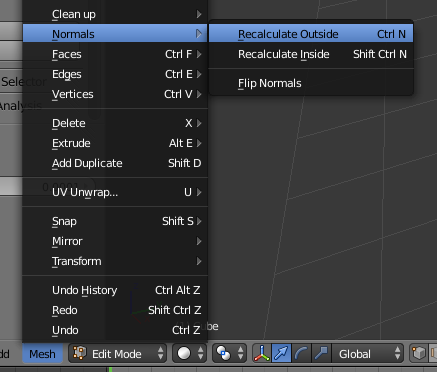
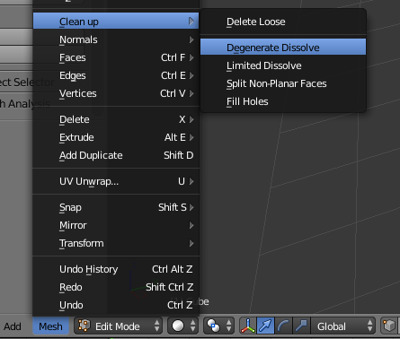
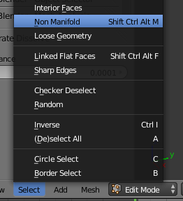
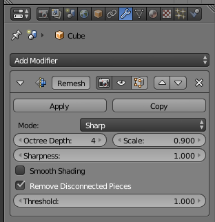

.. _mesh_repair:

Repairing Meshes
=============================================

There are a number of things that can go wrong when creating or importing a
mesh that can be difficult to troubleshoot simply by looking at the mesh.

You can check for some common problems by using CellBlender's **Mesh Analysis**
tool, which is found under the **Tool Shelf** (hit **t** in the **3D View
Window**).  Hit the **Analyze Mesh** button.

.. image:: ./images/mesh_repair/mesh_analysis.png

This will tell you if the mesh is triangulated, watertight (i.e. There are no
"holes" in it), manifold, and that it has outward facing normals. All of these
features are essential if you want to release volume molecules inside the mesh
in question.  If your mesh does not meet these criteria, here are a few
techniques for resolving these problems.

Inconsistent Normals
----------------------------------------------

You can force your normals to be consistent by selecting
**Mesh>Normals>Recalculate Outside** (or hit **Ctrl-n**) in **Edit Mode**. This
will make all the normals on a closed mesh point outward.

Degenerate Meshes
----------------------------------------------

While in **Edit Mode**, select **Mesh>Clean up>Degenerate Dissolve**. This
will remove edges with no length and faces with no area. Be aware that this can
introduce quads in your mesh, which you will need to convert to triangles
(**Ctrl-t**).

Non-Manifold Meshes
----------------------------------------------

Lastly, we need to clean up any non-manifold meshes. Of all the operations
listed here, this is the hardest to perform since it will likely require you to
actually edit the mesh by hand. In **Vertex Select Mode**, you can select all
non-manifold faces by using **Select>Non Manifold** (or hit
**Ctrl-Shift-Alt-m**).

If anything is selected after performing this operation, then you have to
remove the non-manifold portions. Don't simply delete everything it selects,
since you might introduce holes into your mesh. Normally an edge is only shared
with two faces. If your face shares an edge with more faces, then you will have
to delete one of the faces.

Remesh Modifier
----------------------------------------------

If none of the above issues help, you can consider using the **Remesh
Modifier**. To preserve the shape of the mesh, you may need to increase the
**Octree Depth**. Be careful about increasing it too much though as it can
increase the number of triangles considerably.

Be sure to **Apply** the modifer. After the modifier is applied, triangulate
your mesh (**Ctrl-t**).

The GAMer Addon
----------------------------------------------

Although slightly more complicated, you might want to consider using the GAMer
addon.  :ref:`gamer`

.. note::

    GAMer is currently only included in the Linux CellBlender 1.1 bundle.
    However, it will also be added to the OSX and Windows bundles in the
    future.
