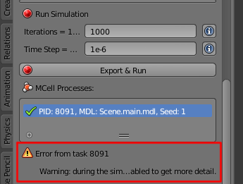
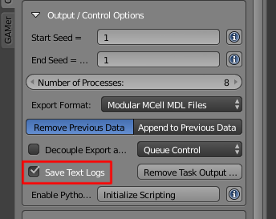
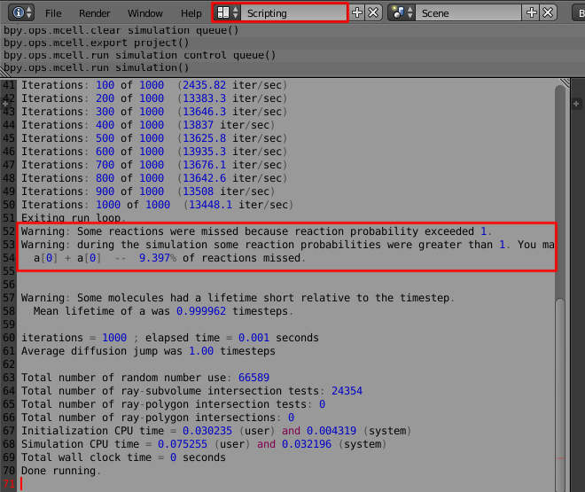
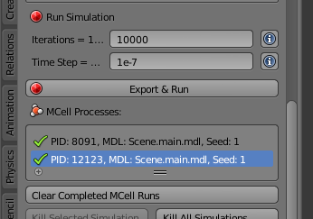
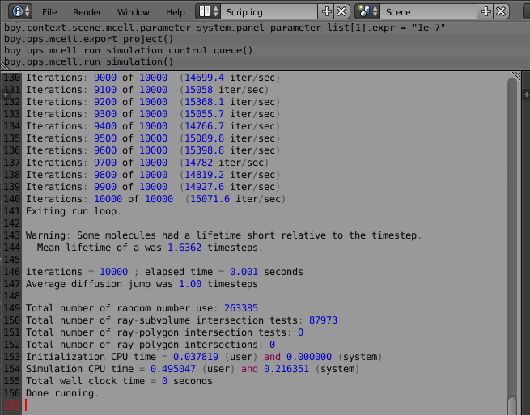
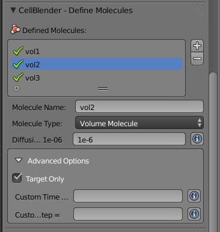
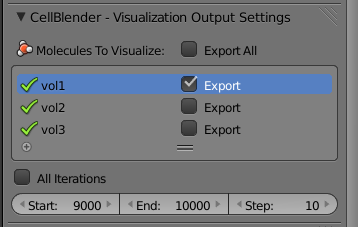

.. _optimize:

*********************************************
Optimizing Your Simulation
*********************************************

The simplistic simulations covered in these tutorials should not be overly
taxing on a relatively recent desktop machine. However, you may likely want to
develop simulations which have many more molecules possibly on large dense mesh
objects. There are a couple of strategies you can use to speed up your
simulations (and/or to save disk space). The following topics will
address some of these issues:

.. contents:: :local:

.. _increase_time_step:

Increase Time Step
---------------------------------------------

One of the easiest things you can do to speed up your simulations is to
increase your time step. Generally, you'll want to increase it as much as
possible while keeping the reaction probabilities below one. If any of the
reaction probabilities exceed one, you'll see the following message:

If you do, you should take a closer look at the logs. You can enable logs by
checking the **Save Text Logs** under the **Output/Control Options** panel:

When you re-run the simulation, you'll need to switch to the **Scripting**
layout:

Notice that it refers to the specific reaction or reactions at fault.

For this particular model, we can decrease the time step by an order of
magnitude (from **1e-6** to **1e-7**) to prevent the missed reactions:

Here's the new log:

There's still a warning about the lifetime being short relative to the time
step, but we are no longer missing any reactions. The simulation now has a time
step that is about as large as it can reasonably be.

.. _adding_partitions:

Adding Partitions
---------------------------------------------

Partitions are a simple but highly effective method of speeding up MCell
simulations. When MCell checks to see if a reaction occurs, partitions lower
the number of potential partners it must check against. However, care must be
taken not to use so many partitions that your computer begins to run out of
memory (ultimately slowing the simulation down).

Download and open the `partitions.blend`_ file. You will see a tilted **Cube**
object. If you look through the CellBlender settings, you will notice that we
are releasing two species of molecules (**vol1** and **vol2**) inside of the
**Cube**, and there are two sets of reactions::

        vol1 + vol2 -> vol1 + vol3
        vol1 + vol3 -> vol2 + vol3

.. _partitions.blend: https://www.mcell.psc.edu/tutorials/downloads/partitions.blend

Expand the **Define and Visualize Partitions** panel. Select **Include
Partitions**. Click **Show Boundaries**, and you will see a wireframe of a cube
that goes from -1.0 to 1.0 along each axis. These represent the boundaries of
the partitions. Now, hit **Automatically Generate Boundaries** and you should
see the partition boundaries grow to encompass the entire **Cube** object.
Change each **Step** value to **0.15**.

.. image:: ./images/optimize/partitions.png

So what is happening here exactly? We are creating arrays of planes along each
axis specified. The intersection of these planes creates subvolumes.
Specifically, it takes two XY, two XZ, and two YZ planes to create a single
subvolume. The length of these subvolumes should generally not be smaller than
the mean diffusion distance of the fastest molecules in your simulation.

Now, expand the **Run Simulation** panel and hit the **Run Simulation** button.
A green check mark will appear when the simulations have completed. Look at the
console (or log files if enabled in
**/home/user/mcell_tutorial/partitions/partitions_files/**). Notice the section
near the end, which should say something like this::

    ...
    Total wall clock time = 2 seconds
    Done running.

Now, disable the partitions and run it again. Check the newly created log file
and you will likely see the total simulation time increase (i.e. a decrease in
iterations/second) like this::

    ...
    Total wall clock time = 22 seconds
    Done running.

Your results will likely vary, as the speed improvement will depend on the
machine running the simulation. You may want to experiment with changing the
**Step** value. For example try decreasing it to **0.10**. If the wall clock
time increases (i.e. the simulation is running slower), try making the **Step**
value larger than the original value (e.g. set the **Step** value to **0.20**).
It may take a few tries to find an optimal value.

.. _target_only:

Target Only
---------------------------------------------

If you have a reaction between two molecules in which there are many of one
species and very few of another, you might want to consider using the **Target
Only** option when defining the species with the high concentration. Normally,
a diffusing molecule will check to see if there are any potential molecules to
react with. However, a molecule that is marked as **Target Only** can only be
the target of a reaction, and will not search for partners to react with.

Download and open the `target_only.blend`_ file. If you look through the
CellBlender settings, you will see that we are using the **Target Only** option
in the molecule definition of **vol2**:

Additionaly, you will notice that we are releasing two species (**vol1** and
**vol2**) inside of the **Cube** and that there is one reaction::

        vol1 + vol2 -> vol1 + vol3

.. _target_only.blend: https://www.mcell.psc.edu/tutorials/downloads/target_only.blend

This means that **vol1** reacts with **vol2** to create **vol3** and recreate
**vol1**. Without the **Target Only** command, every **vol2** molecule would
have to check to see if there were **vol1** molecules to react with and vice
versa. With this command, *only* **vol1** must search for reaction partners.
Given that there are 100 **vol1** and 50000 **vol2**, this second method is
much more efficient.

Now, expand the **Run Simulation** panel and hit the **Run Simulation** button.
A green check mark will appear when the simulations have completed. Try running
it again without **Target Only** selected for **vol2** and check the log files
for the two runs.

.. _only_export_needed:

Only Export What You Need
---------------------------------------------

Visualization data can be great if you are making a figure to accompany a
paper, or you are trying to troubleshoot a problem in your simulation, but
there's probably no need to export every molecule at every iteration. You could
either disable viz data entirely when you don't need it or only export the
molecules you need. Also, you can choose to export viz data for a subset of
your entire simulation (e.g. imagine your simulation runs for 10000 iterations,
but you only need every tenth iteration from 9000 to 10000). Both of these
solutions can speed up your simulation and save you disk space.

