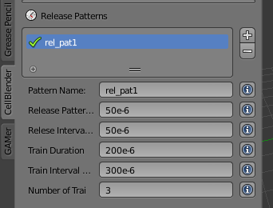
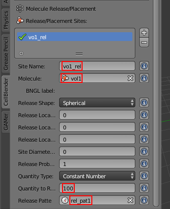
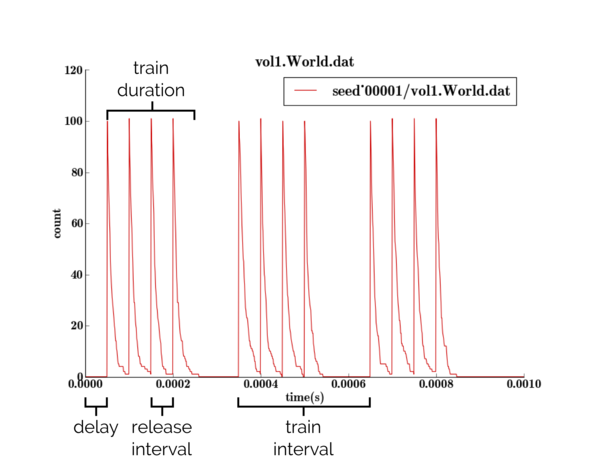

.. _rel_pattern:

*********************************************
Release Patterns
*********************************************

Release patterns allow you to release molecules at specified time intervals.
One thing this can be useful for is simulating a synaptic vesicle releasing
neurotransmitter.

Start New Project
---------------------------------------------

After you start Blender, save the file (and set the project directory) by
hitting **Ctrl-s**, typing **~/mcell_tutorial/rel_pattern** (or
**C:\\mcell_tutorial\\rel_pattern** on Windows) into the directory field,
**rel_pattern.blend** into the file name field, and hit the **Save As Blender
File** button.

Set Project Parameters
---------------------------------------------

Set the following parameters:

* Create a volume molecule called **vol1**.
* Set the diffusion constant of **1e-6**.
* Create a reaction with the following properties:

  * Set **Reactants** to **vol1**.
  * Set **Products** to **NULL**.
  * Set **Forward Rate** to **1e5**.

* Count all the **vol1** molecules in the **World**.

Create Release Pattern
---------------------------------------------

* Hit the **Release Pattern** button.
* Hit the **+** button to create a new release pattern.
* Set the **Site Name** to **rel_pat1**.
* Set the **Release Pattern Delay** to **50e-6**.
* Set the **Release Interval** to **50e-6**.
* Set the **Train Duration** to **200e-6**.
* Set the **Train Interval** to **300e-6**
* Set the **Number of Trains** to **3**

A release pattern consists of one or more "trains." Each train can last for a
certain period of time (**Train Duration**), and an interval between trains can
be set (**Train Interval**). Within a given train, you can release molecules at
specific intervals (**Release Interval**). And lastly, the **Delay** indicates
when the first train will start. This may sound more confusing than it really
is. Plotting the reaction data should help illustrate what's happening for this
specific release pattern.

Create Release Site
---------------------------------------------

Create a release site with the following properties:

  * Set the **Site Name** to **vol1_rel**.
  * Set the **Molecule** to **vol1**.
  * Set the **Release/Shape** to **Cubic**.
  * Set the **Quantity to Release** to **100**.
  * Set the **Release Pattern** to **rel_pat1**.

Running the Simulation and Visualizing the Results
--------------------------------------------------

* Save the Blender file (**Ctrl-s**).
* Hit the **Run Simulation** button.
* Lastly, hit the **Export & Run** button.

Once the simulation has finished running, hit **Reload Visualization Data**.
Hit **Alt-a** to play back the animation.

At the origin, you should see small bursts of molecules being created (due to
the actions of the release site and release pattern) and quickly decaying (from
the reaction). You may want to zoom in to get a better look.

Additionally, let's plot the reaction data using the plotting tool of your
choice.

As you can see, there are three distinct trains and within each train a release
event happens every 50 microseconds. Overlays have been added to point out the
effects that all the release pattern properties had on the creation of
**vol1**.
