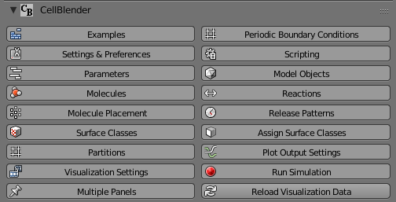
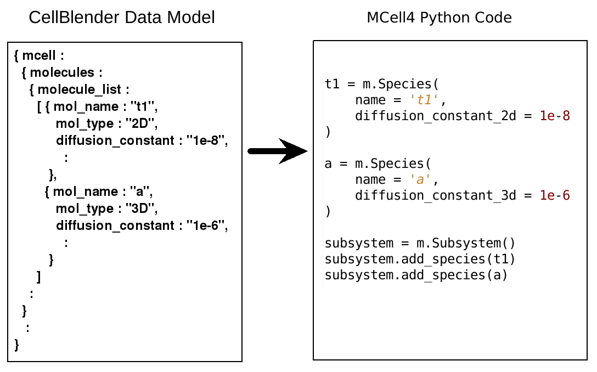
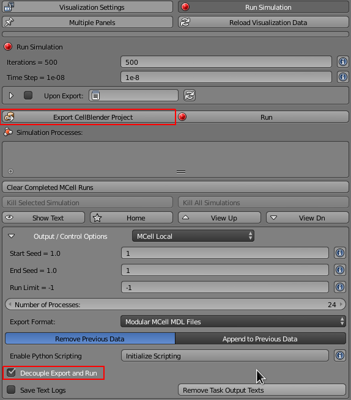
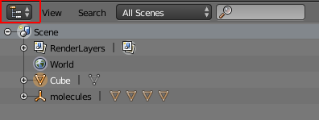
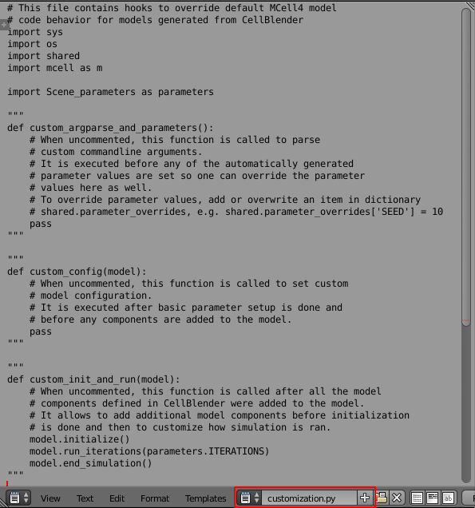
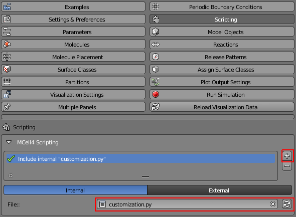
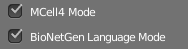

.. _customization:

***********************
Customization in MCell4
***********************

Overview
--------

Customization in MCell4 provides means to modify the default behavior of 
the Python code generated by CellBlender so that one can use the CellBlender GUI
for common tasks such as definition of molecule types and of geometry, 
but also to use the full power of the MCell4 Python API.  

In this tutorial section, we will first take a look at the  
MCell4 Python files generated by CellBlender and then we will introduce
a modification to the example Lotka-Voltera:Diffusion-Limited.  

Start Blender from a terminal (command line) because we will need to see the 
simulation output. by starting the "my_blender" script located in the instalation 
directory "Blender-2.79-CellBlender". 

.. code-block:: text

   # change the current directory to the CellBlender
   # installation directory, the path is shown for MacOs,
   # it will be different for Windows or Linux 
   cd /Applications/Blender-2.79-CellBlender
   
   # on MacOs or Linux
   ./my_blender
   
   # on Windows
   blender.exe

Data Model Representation of the CellBlender Model
--------------------------------------------------

In order to understand how scripting works, it's important to understand
a little bit about how CellBlender works and how it interacts with an MCell
simulation.

CellBlender is mostly a user interface that builds a model to be simulated.
The model defines things like geometry, molecule species, reactions, initial
conditions, etc. These are presented to the user through a series of Blender
panels. The top level CellBlender panel provides a number of subpanels and
it looks like this:

This panel (and each of the subpanels) are used to define the various aspects
of a CellBlender model. The CellBlender model appears as data values in these
various panels but it is also represented internally as a Python dictionary structure
known as a **"CellBlender Data Model"**. This relationship looks like this:

.. image:: ./images/CellBlender_Panels_Data_Model.png

Exporting Model into Python
---------------------------

When CellBlender runs a simulation, it translates the data from the Panels and
into the Data Model which is then transformed into a readable Python representation that uses 
the MCell4 Python API.

For example,
when CellBlender runs MCell, it translates the Panel / Data Model information into
multiple Python files, a part of sybsystem.py is shown here:

This translation process happens when a CellBlender model is "Exported" (or
"Exported and Run"). 

For this tutorial section, we will the *Lotka-Voltera: Diffusion-Limited* example that
we will use as a basis for our customization. 

First, let's import the example through **Examples** -> **Lotka-Voltera: Diffusion-Limited**.
Then save the model as customization.blend file. Remember the directory where you save your file.

Now export the model using the **Run Simulation** panel. 
Let's say that we do not want the model to be run, so select the **Decouple Export and Run** 
checkbox and then click on **Export CellBlender Project**.  

To find these exported files, navigate to the directory where you saves the customization.blend file.
In that directory, there will be a subdirectory "customization_files". 

Customization Template
----------------------

If there is no file "customization.py" in your model already, the MCell4 python generator 
creates an empty template for it upon model export.
The template is created in "customization_files/mcell/output_data/customization.py" and 
may look like this:

.. code-block:: python

   import sys
   import os
   import shared
   import mcell as m
   
   import Scene_parameters as parameters
   
   """
   def custom_argparse_and_parameters():
       # When uncommented, this function is called to parse 
       # custom commandline arguments.
       # It is executed before any of the automatically generated 
       # parameter values are set so one can override the parameter 
       # values here as well.
       # To override parameter values, add or overwrite an item in dictionary
       # shared.parameter_overrides, e.g. shared.parameter_overrides['SEED'] = 10
       pass
   """
   
   """
   def custom_config(model):
       # When uncommented, this function is called to set custom
       # model configuration.
       # It is executed after basic parameter setup is done and 
       # before any components are added to the model. 
       pass
   """
   
   """
   def custom_init_and_run(model):
       # When uncommented, this function is called after all the model
       # components defined in CellBlender were added to the model.
       # It allows to add additional model components before initialization 
       # is done and then to customize how simulation is ran.
       model.initialize()
       model.run_iterations(parameters.ITERATIONS)
       model.end_simulation()
   """

Notice that all the functions are commented out by default. 
The base code in "customization_files/mcell/output_data/Scene_model.py" check whether 
each function exists and if some of them do, it is called during an appropriate 
phase of the MCell4 model execution.

For instance, this is how the code in "Scene_model.py" checks for the existence
of function *custom_argparse_and_parameters*.

.. code-block:: python

   # process command-line arguments
   if customization and 'custom_argparse_and_parameters' in dir(customization):
       # custom argument processing and parameter setup
       customization.custom_argparse_and_parameters()
   else:
      ...
      
In our tutorial example, we are going to add a check for the minimal number of 
*predator* molecules in the Lotka Voltera model. 
The motivation for this is once all the predators in this model die out, 
*prey* will begin to multiply uncontrollably and this would cause simulation to become 
extremely slow. 

Adding a Scripting File in CellBlender
--------------------------------------

First, we will create an internal Blender file (such file will be 
stored inside of your .blend file). To do this, we will replace the default 
**Outliner** view with a **Text Editor View**. 

Then press on **+ New** at the bottom of the editor, 
paste the contents of our template file "customization_files/mcell/output_data/customization.py",
set the name to *customization.py*. Lets keep the function commented out for now.
       

The next step is to tell CellBlender to use this file.
Select the **Scripting** panel, press **+**, select the **Internal** choice,
refresh the list of scripts with the bytton with arrows and select 
the file *customization.py*.

When the model is exported, this *customization.py* will be used intead of the 
default template. To try this out, uncomment the function *custom_init_and_run*
by removing the triple quotes ``"""`` right in front of it and after. 
To try this out, select the **Run Simulation** panel and click on **Export CellBlender Project**. 
file "customization_files/mcell/output_data/customization.py" in the export directory will contain
the uncommented function *custom_init_and_run*.

Customizing Function custom_init_and_run
----------------------------------------

We want to add a check for the minimal number of *predator* molecules in the 
Lotka Voltera model. For this, we need to obtain the number of these molecules
using the MCell4 Python API. 
The default model export option in panel **Settings & Preferences** is 
**BioNetGen Language Mode** and this directs the exporter to 
generate everythin that can be represented with BNGL into a .bngl file. 

The file we need to look at is 
"customization_files/mcell/output_data/Scene_model.bngl" and we 
are interested in the *observables* section. 

.. code-block:: text
 
   begin observables
       Species prey_World prey
       Species predator_World predator
   end observables

The format of items in the *observables* section is: type of observable, 
observable/count name, pattern of what to count.
What we need here is the name *predator_World*. When this BNGL file is 
parsed in "customization_files/mcell/output_data/Scene_observables.py"
by this call:

.. code-block:: python

   observables.load_bngl_observables(
      os.path.join(MODEL_PATH, 'Scene_model.bngl'), 
      './react_data/seed_' + str(SEED).zfill(5) + '/', 
      shared.parameter_overrides)

Objects of class *Count* are created and they are added in 
"customization_files/mcell/output_data/Scene_model.py" to the *model* 
object. And this *model* object is passed to our customization function
*custom_init_and_run*:

.. code-block:: python
   
   model.add_observables(Scene_observables.observables)
   
   # ---- initialization and execution ----
   
   if customization and 'custom_init_and_run' in dir(customization):
       customization.custom_init_and_run(model)
   else:
      ...
    
At this point, we are ready to modify the file "customization.py"
using the Blender text editor. We need to udate the function 
*custom_init_and_run* with this implementation:

.. code-block:: python

   def custom_init_and_run(model):
       # When uncommented, this function is called after all the model
       # components defined in CellBlender were added to the model.
       # It allows to add additional model components before initialization 
       # is done and then to customize how simulation is ran.
       
       # find the count object constructed from the BNGL observable
       predator_count = model.find_count('predator_World')
       
       # make sure that it was found
       assert predator_count
       
       # initialize the model
       model.initialize()
       
       # instead of running the whole simulation in one call, let's
       # run it iteration by iteration
       for i in range(parameters.ITERATIONS):
           # run only one iteration
           model.run_iterations(1)
           
           # get count of predators
           p = predator_count.get_current_value()
           
           # to see that the counting works, we will print to 
           # to the terminal
           print("Predator count: " + str(p))
           
           # and here is the check for zero value
           if p == 0:
               # signalize that there was an error during simulation
               # and terminate with exit code 1
               sys.exit("Error: predator count is 0, terminating simulation")
           
       # and perform final simulation step
       model.end_simulation()

Save the CellBlender project now.
     
Trying out the Customized Code
------------------------------
      
We would like to export the model and run it at the same time
so in the panel **Run Simulation**, box **Output / Control Options**
unselect the checkbox **Decouple Export and Run**. 
Then click on button **Export & Run**.
Simulation starts and we can check the terminal (command line) from which we 
started CellBlender wen we started this section.
We should see a printout similar to this text:

.. code-block:: text
   
   ...   
   Predator count: 701.0
   Predator count: 697.0
   Predator count: 680.0
   Predator count: 679.0
   Predator count: 682.0
   Iteration 500, simulation finished successfully
   ...

Ok, the printout works correctly, so let's try the check for the 
count 0. We will change a reaction rate to achieve this.   
Open the **Reactions** panel, select the *predator -> NULL*
reaction and set the **Forward rate** from 5e6 to 3e7.
This means that the *predators* will faster starve-out.
Run the simulation again. 
It will fail now (if not, increate the forward rate even more)
and the simulation will end with this message:
 

 
You can also check the printouts on the terminal. 
(note: the error message may not be at the end because we are using 
error output for the error message and standard output for the counts).  

Congratulations, you just customized your first model! 

We used just a small part of the MCell4 Python API offers, 
if you will be interested the MCell4 API Reference describes the whole 
Python API and there is also a tutorial for this API. (TODO: links) 
