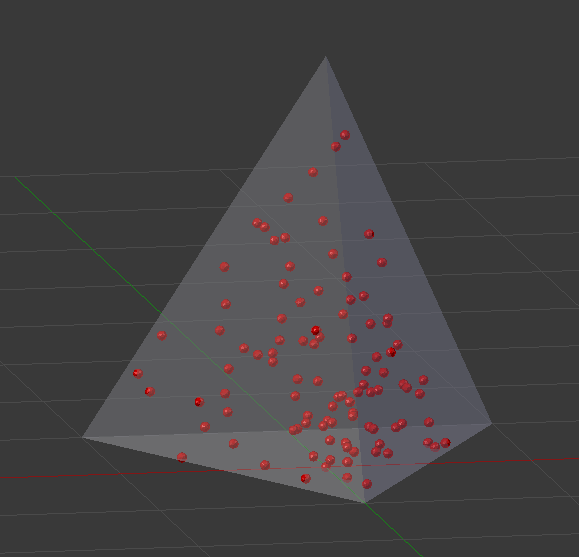
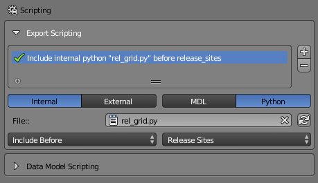
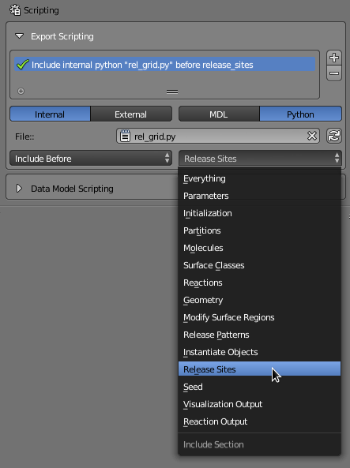
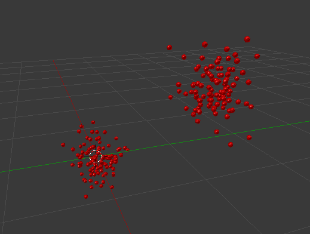
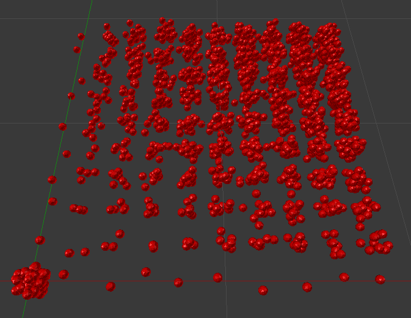

.. _export_scripting:

*************************
Export Scripting Tutorial
*************************

.. Git Repo SHA1 ID: 3520f8694d61c81424ff15ff9e7a432e42f0623f

Export scripting is accomplished by injecting desired **MCell Model Description Language** (MDL) code directly
into CellBlender's export stream as shown in this diagram:

.. image:: ./images/CellBlender_Insert_MDL_Script.png

The example above shows raw MDL being directly injected into the export stream, but a Python script can
also be run to accomplish the same task by writing MDL text to the export stream. In this tutorial, we'll
start with raw MDL scripting since it is easier to write. In later sections we'll replace the raw MDL with
Python code that writes MDL.

In either case (raw MDL or Python writing MDL), this tutorial will assume that the reader has some familiarity
with MCell's Model Description Language (MDL). Of course familiarity with Python programming will be helpful for
the Python sections.

General Structure of a CellBlender MDL Model
--------------------------------------------

When CellBlender runs a typical CellBlender model, it exports MDL with a predetermined ordering. It's important
to understand this ordering when determining where to inject custom MDL statements (either raw or via Python).

For example, a model that includes a simple pyramid object, releases one molecule type ("a") into that object,
and defines the molecule's diffusion constant with a parameter named "diff_const_for_mol_a" might produce a
simulation that looks like this:

The complete MDL output from that model (Scene.main.mdl) might look like this (with comments added at the
top of each section):

.. code-block:: mdl
    :linenos:

    /* DEFINE PARAMETERS */
    diff_const_for_mol_a = 1e-6

    /* INITIALIZATION SECTION */
    ITERATIONS = 1000
    TIME_STEP = 1e-6
    VACANCY_SEARCH_DISTANCE = 10

    SURFACE_GRID_DENSITY = 10000
    ACCURATE_3D_REACTIONS = TRUE
    CENTER_MOLECULES_ON_GRID = FALSE
    MICROSCOPIC_REVERSIBILITY = OFF

    NOTIFICATIONS
    {
       PROBABILITY_REPORT = ON
       DIFFUSION_CONSTANT_REPORT = BRIEF
       FILE_OUTPUT_REPORT = OFF
       FINAL_SUMMARY = ON
       ITERATION_REPORT = ON
       PARTITION_LOCATION_REPORT = OFF
       VARYING_PROBABILITY_REPORT = ON
       PROGRESS_REPORT = ON
       RELEASE_EVENT_REPORT = ON
       MOLECULE_COLLISION_REPORT = OFF
    }

    WARNINGS
    {
       DEGENERATE_POLYGONS = WARNING
       NEGATIVE_DIFFUSION_CONSTANT = WARNING
       MISSING_SURFACE_ORIENTATION = ERROR
       NEGATIVE_REACTION_RATE = WARNING
       USELESS_VOLUME_ORIENTATION = WARNING
       HIGH_REACTION_PROBABILITY = IGNORED
       LIFETIME_TOO_SHORT = WARNING
       LIFETIME_THRESHOLD = 50
       MISSED_REACTIONS = WARNING
       MISSED_REACTION_THRESHOLD = 0.00100000004749745
    }

    /* DEFINE MOLECULES SECTION */
    DEFINE_MOLECULES
    {
      a
      {
        DIFFUSION_CONSTANT_3D = diff_const_for_mol_a
      }
    }

    /* DEFINE GEOMETRY SECTION */
    Pyramid POLYGON_LIST
    {
      VERTEX_LIST
      {
        [ -1, -1, 0 ]
        [ 1, -1, 0 ]
        [ 0, 1, 0 ]
        [ 0, 0, 2 ]
      }
      ELEMENT_CONNECTIONS
      {
        [ 0, 2, 1 ]
        [ 1, 2, 3 ]
        [ 0, 1, 3 ]
        [ 2, 0, 3 ]
      }
    }

    /* INSTANTIATE OBJECTS SECTION */
    INSTANTIATE Scene OBJECT
    {
      Pyramid OBJECT Pyramid {}
      /* RELEASE SITES SECTION */
      Release_Site_1 RELEASE_SITE
      {
       SHAPE = Scene.Pyramid
       MOLECULE = a
       NUMBER_TO_RELEASE = 100
       RELEASE_PROBABILITY = 1
      }
    }

    /* SEED SECTION */
    sprintf(seed,"%05g",SEED)

    /* VISUALIZATION OUTPUT SECTION */
    VIZ_OUTPUT
    {
      MODE = CELLBLENDER
      FILENAME = "./viz_data/seed_" & seed & "/Scene"
      MOLECULES
      {
        NAME_LIST {ALL_MOLECULES}
        ITERATION_NUMBERS {ALL_DATA @ ALL_ITERATIONS}
      }
    }

.. note::

   These examples are exported with CellBlender's "**Single Unified MCell MDL File**" format selected (in the
   "Output / Control Options" panel). This produces a single MDL file rather than several MDL files linked together
   with MCell's "INCLUDE" directive. The two are conceptually the same, but it's easier to show a single file 
   for these smaller examples.

CellBlender's MDL Reference Locations
-------------------------------------

You'll note that the previous MDL file contains several sections highlighted by these comments:

.. code-block:: mdl
    :linenos:

    /* DEFINE PARAMETERS */
    /* INITIALIZATION SECTION */
    /* DEFINE MOLECULES SECTION */
    /* DEFINE GEOMETRY SECTION */
    /* INSTANTIATE OBJECTS SECTION */
    /* RELEASE SITES SECTION */
    /* SEED SECTION */
    /* VISUALIZATION OUTPUT SECTION */

These are some of the "reference locations" CellBlender can use to insert new MDL. The new MDL can be added either
before or after each of those sections as needed as long as the entire resulting stream produces a valid set of MDL files.

The choice of where to insert MDL (or Python) scripting is made through the Export Scripting panel:

In this example image, an "**Internal**" "**Python**" script named "**rel_grid.py**" is being included "**Before**"
the "**Release Sites**" section of the MDL file. Scripts can be included either "**Before**" or "**After**" each
section. There's also a "**Don't Include**" option to disable a particular file while not removing it from the list.

The full list of MDL sections where Scripts can be inserted is available in this selection list:

In addition to the documented MDL sections, there's also an "Everything" section allowing code to be inserted
either before everything or after everything.

This interface supports the inclusion of multiple scripts (either MDL or Python) at multiple locations during the export process.

Example 1: Adding a Single Comment
----------------------------------

Some of these early examples don't change the simulation results, but just insert MDL comments into the MDL stream.
This is very helpful when learning because it's very clear which parts of the MDL were generated by the script and
which parts were generated from the CellBlender model. Adding comments is also not likely to cause any problems, so
the orginal model should still run.

For this example, start with an empty CellBlender project (delete all objects from the 3D view). Then define a single
volume molecule type named "a" with a diffusion constant of 1e-6. Set the Display Options Scale Factor to 5. Release 100 of
these "a" molecules at the origin.

Then open the "Run Simulation" panel and the "Output/Control Options" sub-panel. Change from the default ("Modular MCell MDL Files")
to "Single Unified MCell MDL File". Save the .blend file as "export_script_ex1.blend". Run the simulation.

After the run completes, you should find a new directory wherever you saved your .blend file. It will have the
same name but with "_files" appended to the end. So in this example, the directory would be "**export_script_ex1_files**".
Inside that directory will be another directory named "**mcell**" containing yet another directory named "**output_data**".
The "output_data" directory should contain a text file named "**Scene.main.mdl**", and it should contain the following MDL:

.. code-block:: mdl
    :linenos:

    ITERATIONS = 1000
    TIME_STEP = 1e-6
    VACANCY_SEARCH_DISTANCE = 10

    SURFACE_GRID_DENSITY = 10000
    ACCURATE_3D_REACTIONS = TRUE
    CENTER_MOLECULES_ON_GRID = FALSE
    MICROSCOPIC_REVERSIBILITY = OFF

    NOTIFICATIONS
    {
       PROBABILITY_REPORT = ON
       DIFFUSION_CONSTANT_REPORT = BRIEF
       FILE_OUTPUT_REPORT = OFF
       FINAL_SUMMARY = ON
       ITERATION_REPORT = ON
       PARTITION_LOCATION_REPORT = OFF
       VARYING_PROBABILITY_REPORT = ON
       PROGRESS_REPORT = ON
       RELEASE_EVENT_REPORT = ON
       MOLECULE_COLLISION_REPORT = OFF
    }

    WARNINGS
    {
       DEGENERATE_POLYGONS = WARNING
       NEGATIVE_DIFFUSION_CONSTANT = WARNING
       MISSING_SURFACE_ORIENTATION = ERROR
       NEGATIVE_REACTION_RATE = WARNING
       USELESS_VOLUME_ORIENTATION = WARNING
       HIGH_REACTION_PROBABILITY = IGNORED
       LIFETIME_TOO_SHORT = WARNING
       LIFETIME_THRESHOLD = 50
       MISSED_REACTIONS = WARNING
       MISSED_REACTION_THRESHOLD = 0.00100000004749745
    }

    DEFINE_MOLECULES
    {
      a
      {
        DIFFUSION_CONSTANT_3D = 1e-6
      }
    }

    INSTANTIATE Scene OBJECT
    {
      Release_Site_1 RELEASE_SITE
      {
       SHAPE = SPHERICAL
       LOCATION = [0, 0, 0]
       SITE_DIAMETER = 0
       MOLECULE = a
       NUMBER_TO_RELEASE = 100
       RELEASE_PROBABILITY = 1
      }
    }

    sprintf(seed,"%05g",SEED)

    VIZ_OUTPUT
    {
      MODE = CELLBLENDER
      FILENAME = "./viz_data/seed_" & seed & "/Scene"
      MOLECULES
      {
        NAME_LIST {ALL_MOLECULES}
        ITERATION_NUMBERS {ALL_DATA @ ALL_ITERATIONS}
      }
    }

That is all the MDL that CellBlender generated from your CellBlender model. We're going to build on that model
by adding short sections of MDL that contain only comments. This will illustrate the insertion mechanism without
invalidating our model in any way.

Inside of Blender, change the "Properties" panel (on the right) to a "Text Editor" panel. The panel will likely be
empty, so use the "**+ New**" button near the bottom to make a new text file. The default name is usually "Text".
Change that name to be "**my_comments.mdl**". Then type the following text into the text editor itself:

.. code-block:: mdl
    :linenos:

    /* Comment inserted from "my_comments.mdl" */

This is legal MDL. It won't do anything, but it will show up in your Scene.main.mdl file wherever you ask CellBlender
to insert it. Let's do that next.

Open the "**Scripting**" panel and open the "**Export Scripting**" subpanel. Click the "**+**" button to add a new
**script insertion definition** line. The default will be set to:

..

    **Include internal mdl "" before initialization**

This is because the "**Internal**" and "**MDL**" options are already selected (by default), and the selectors are set
(also by default) to "**Include Before**"
and "**Initialization**". The only thing missing is the file to insert (the "**File**" field is blank). If you click in
the "File" field, it will bring up a list of options. The list may be empty and can be refreshed with the "Refresh" button
immediately to the right. After refreshing, you should be able to click on the "**File**" field and select the file named
"**my_comments.mdl**". This should complete the **script insertion definition** in the list to show:

..

    **Include internal mdl "my_comments.mdl" before initialization**

Now we can go back to the "**Run Simulation**" panel and run it again. It should run the same as before, but now the MDL
file will start with some inserted comments like this:

.. code-block:: mdl
    :linenos:

    /* Begin file my_comments.mdl */

    /* Comment inserted from "my_comments.mdl" */

    /* End file my_comments.mdl */

    ITERATIONS = 1000
    TIME_STEP = 1e-6
    VACANCY_SEARCH_DISTANCE = 10

    SURFACE_GRID_DENSITY = 10000
    ACCURATE_3D_REACTIONS = TRUE
    CENTER_MOLECULES_ON_GRID = FALSE
    MICROSCOPIC_REVERSIBILITY = OFF

You can see that CellBlender included its own comments noting the "Begin" and "End" of the inserted file. Between
those two comments is the full contents of the MDL file specified. This is the fundamental operation of **Export
Scripting**. You can insert your own code blocks into the MDL that CellBlender exports to MCell.

Example 2: Changing the Insertion Point
---------------------------------------

In the previous example, our comment file was inserted at the top of the file because we had chosen "before" "initialization".
Let's move it after the initialization section by changing "**Include Before**" to "**Include After**" (in the Scripting panel).
Save this blend file as export_scripting_ex2.blend and run again. Once again look at the MDL file. You should find the comment
section inserted after the "WARNINGS" section and before the "DEFINE_MOLECULES" section of the MDL:

.. code-block:: mdl
    :linenos:

    ITERATIONS = 1000
    TIME_STEP = 1e-6
    VACANCY_SEARCH_DISTANCE = 10

    SURFACE_GRID_DENSITY = 10000
    ACCURATE_3D_REACTIONS = TRUE
    CENTER_MOLECULES_ON_GRID = FALSE
    MICROSCOPIC_REVERSIBILITY = OFF

    NOTIFICATIONS
    {
       PROBABILITY_REPORT = ON
       DIFFUSION_CONSTANT_REPORT = BRIEF
       FILE_OUTPUT_REPORT = OFF
       FINAL_SUMMARY = ON
       ITERATION_REPORT = ON
       PARTITION_LOCATION_REPORT = OFF
       VARYING_PROBABILITY_REPORT = ON
       PROGRESS_REPORT = ON
       RELEASE_EVENT_REPORT = ON
       MOLECULE_COLLISION_REPORT = OFF
    }

    WARNINGS
    {
       DEGENERATE_POLYGONS = WARNING
       NEGATIVE_DIFFUSION_CONSTANT = WARNING
       MISSING_SURFACE_ORIENTATION = ERROR
       NEGATIVE_REACTION_RATE = WARNING
       USELESS_VOLUME_ORIENTATION = WARNING
       HIGH_REACTION_PROBABILITY = IGNORED
       LIFETIME_TOO_SHORT = WARNING
       LIFETIME_THRESHOLD = 50
       MISSED_REACTIONS = WARNING
       MISSED_REACTION_THRESHOLD = 0.00100000004749745
    }

    /* Begin file my_comments.mdl */

    /* Comment inserted from "my_comments.mdl" */

    /* End file my_comments.mdl */

    DEFINE_MOLECULES
    {
      a
      {
        DIFFUSION_CONSTANT_3D = 1e-6
      }
    }

    INSTANTIATE Scene OBJECT
    {
      Release_Site_1 RELEASE_SITE
      {
       SHAPE = SPHERICAL
       LOCATION = [0, 0, 0]
       SITE_DIAMETER = 0
       MOLECULE = a
       NUMBER_TO_RELEASE = 100
       RELEASE_PROBABILITY = 1
      }
    }

    sprintf(seed,"%05g",SEED)

    VIZ_OUTPUT
    {
      MODE = CELLBLENDER
      FILENAME = "./viz_data/seed_" & seed & "/Scene"
      MOLECULES
      {
        NAME_LIST {ALL_MOLECULES}
        ITERATION_NUMBERS {ALL_DATA @ ALL_ITERATIONS}
      }
    }

Now let's move it after the "Instantiate Objects" section. Again, open the Scripting panel, select the new
location ("**Instantiate Objects**"), and run it again. Reopen the MDL file and find that the comment is now
located between the "INSTANTIATE Scene OBJECT" section and the "sprintf(seed..." section as shown here:

.. code-block:: mdl
    :linenos:

    INSTANTIATE Scene OBJECT
    {
      Release_Site_1 RELEASE_SITE
      {
       SHAPE = SPHERICAL
       LOCATION = [0, 0, 0]
       SITE_DIAMETER = 0
       MOLECULE = a
       NUMBER_TO_RELEASE = 100
       RELEASE_PROBABILITY = 1
      }
    }

    /* Begin file my_comments.mdl */

    /* Comment inserted from "my_comments.mdl" */

    /* End file my_comments.mdl */

    sprintf(seed,"%05g",SEED)

    VIZ_OUTPUT
    {
      MODE = CELLBLENDER
      FILENAME = "./viz_data/seed_" & seed & "/Scene"
      MOLECULES
      {
        NAME_LIST {ALL_MOLECULES}
        ITERATION_NUMBERS {ALL_DATA @ ALL_ITERATIONS}
      }
    }

You can continue to change the location (Before/After/Section) to see where the comment is inserted in the MDL.

You can also insert the same MDL into multiple locations of a file (although this is not normally useful). Just
click the "**+**" button to add a new **script insertion definition**. Then select its location (Before/After/Section) 
and select the same comment file we've been using.

As an exercise, insert this comment file both before and after every single section in the file. Note that you
should also insert both before and after "**Everything**". The MDL file will contain lots of copies of that comment.

Example 3: Releasing Molecules
------------------------------

Adding comments (as shown in the previous sections) is a good way to get started with Export Scripting because it
shouldn't break anything. But we typically want to do more with scripting than just add comments. In this section
we'll add some MDL to create an additional release site.

Start with the previous example and save it as "export_script_ex3.blend". Then remove all of the script definition entries
from the Scripting panel using the "**-**" button. The list should start off empty. Now let's include our same comment
block **after** **Release Sites**. Run the simulation (results should be the same), and look at the resulting MDL file
(Scene.main.mdl). The "INSTANTIATE Scene OBJECT" section should look like this:

.. code-block:: mdl
    :linenos:

    INSTANTIATE Scene OBJECT
    {
      Release_Site_1 RELEASE_SITE
      {
       SHAPE = SPHERICAL
       LOCATION = [0, 0, 0]
       SITE_DIAMETER = 0
       MOLECULE = a
       NUMBER_TO_RELEASE = 100
       RELEASE_PROBABILITY = 1
      }

    /* Begin file my_comments.mdl */

    /* Comment inserted from "my_comments.mdl" */

    /* End file my_comments.mdl */

    }

Notice where our comment block was inserted. It was inserted before the closing "**INSTANTIATE Scene OBJECT**" brace and
after the closing "**Release_Site_1 RELEASE_SITE**" brace. This shows exactly where the new MDL would be inserted. And since
there's already an example release site there (Release_Site_1), we can copy that example and paste it into a new
MDL block (Blender text file) that we want to insert at that point. Let's do that.

Start by creating a new Text file inside Blender. You can do this by clicking the "**+**" button below the current
text file. Change the name to "**Release_More.mdl**". Now we're going to duplicate the release site code that CellBlender
had already generated from our previous release (see the last MDL file you've opened). We will change the site name
to "Release_More", and we'll change the location from [0,0,0] to [1,1,1]. This is the finished script:

.. code-block:: mdl
    :linenos:

    Release_More RELEASE_SITE
    {
     SHAPE = SPHERICAL
     LOCATION = [1, 1, 1]
     SITE_DIAMETER = 0
     MOLECULE = a
     NUMBER_TO_RELEASE = 100
     RELEASE_PROBABILITY = 1
    }

Now we need to tell CellBlender where to insert that MDL in the export process. Go back to the Export Scripting
panel and be sure all the old **script insertion definitions** are gone (use **-** button to delete them). Then add
a new **script insertion definition** with the **+** button. Refresh the file list, and then select the file just 
created (**Release_More.mdl**). Then set this insertion definition to "**Include After**" "**Release Sites**".

Run the simulation and reload the visualization data to verify that molecules have been released at two different
sites (one at the origin and the other at 1,1,1). It should look something like this:

At this point it's important to understand what we've done. If you open CellBlender's "**Molecule Placement**"
panel, you will still only see one release site (Release_Site_1). The CellBlender model itself has not changed.
The changes were applied during the export process when CellBlender was writing the MDL files. So MCell saw the
addtional release site, and MCell generated molecules at that release site. But that site has not become part of
CellBlender's own data model (other than as an Export Script). This has benefits (doesn't fill up CellBlender's
data model) and drawbacks (no GUI interface for the scripted items). Sometimes this is exactly what you want. When
it's not, then Data Model Scripting might be the better choice.

Example 4: Moving on to Python Scripting
----------------------------------------

The ability to insert raw MDL into CellBlender's export stream can be very helpful for generating specialized or
experimental MDL constructs that CellBlender doesn't support. It can also be helpful for experimenting with MDL
features without having to write an entire MDL model. But the real power of Export Scripting comes from the use
of Python scripts.

As in the MDL examples, we'll start with a simple script that just inserts comments into our MDL stream. But we'll
be using Python's "write" statement to write those comments directly into the stream. Here's our first Python script:

.. code-block:: python
    :linenos:

    mdl_file.write ( '/* Comment inserted from "my_comments.py" */\n' )

When this script starts running, it will already have an "mdl_file" object available. That is the open MDL stream
that CellBlender has been writing into before it called your script. It may already contain MDL from CellBlender or
from other MDL or Python scripts. Your script can write whatever it wants to that stream. In this case, we're just
going to write a comment.

Create a new text file within Blender's text editor, and name it "my_comments.py". Be sure to end your Python scripts
with ".py" and your MDL scripts with ".mdl" so CellBlender can make them available in the appropriate contexts. Also
copy the previous code from above (mdl_file.write...) into the file. Then go back to the Scripting panel and delete any
existing script definitions from the list (use the **-** button). Then add a new script definition entry with the **+** button.
Leave  "**Internal**" selected, and change "**MDL**" to "**Python**". Select your new file ("my_comments.py") and remember that
you might need to refresh the list if it's not there. Then include it before everything. Save it, run it, and reload the
visualization to be sure it all worked. Then check the Scene.main.mdl file that was generated. This time the file should
start with:

.. code-block:: mdl
    :linenos:

    /* Begin file my_comments.py */

    /* Before Executing Python my_comments.py */

    /* Comment inserted from "my_comments.py" */

    /* After Executing Python my_comments.py */

    /* End file my_comments.py */

    ITERATIONS = 1000
    TIME_STEP = 1e-6
    VACANCY_SEARCH_DISTANCE = 10

As before, CellBlender has added comments showing that it is including and executing your script. The "Comment inserted"
line was produced by the python script itself.

Before we move on from the safety of writing comments, let's exercise a little bit of Python's scripting power to write
a "multiplication table" inside our comments. Replace the code in your "my_comments.py" text file (in Blender) with this:

.. code-block:: python
    :linenos:

    mdl_file.write ( '/* Multiplication Table inserted from "my_comments.py" */\n' )

    mdl_file.write ( '/*' )
    for i in range(10):
        for j in range(10):
            mdl_file.write ( ' ' + str(i * j) )
        mdl_file.write ( '\n' )
    mdl_file.write ( '*/' )

This Python script first writes a complete comment line (as before). Then it writes a new opening comment.
Then it loops through the variable **i** from 0 to 9 (the first "range" call), and the variable **j** from
0 to 9 (the second "range" call). It writes the product of **i x j** for each cell and writes new lines ("\\n")
as needed to make the table.

As before, save the blend file as **export_script_ex4.blend**, run it, and inspect your MDL file. It should
start like this:

.. code-block:: mdl
    :linenos:

    /* Begin file my_comments.py */

    /* Before Executing Python my_comments.py */

    /* Multiplication Table inserted from "my_comments.py" */
    /* 0 0 0 0 0 0 0 0 0 0
     0 1 2 3 4 5 6 7 8 9
     0 2 4 6 8 10 12 14 16 18
     0 3 6 9 12 15 18 21 24 27
     0 4 8 12 16 20 24 28 32 36
     0 5 10 15 20 25 30 35 40 45
     0 6 12 18 24 30 36 42 48 54
     0 7 14 21 28 35 42 49 56 63
     0 8 16 24 32 40 48 56 64 72
     0 9 18 27 36 45 54 63 72 81
    */
    /* After Executing Python my_comments.py */

    /* End file my_comments.py */

    ITERATIONS = 1000
    TIME_STEP = 1e-6
    VACANCY_SEARCH_DISTANCE = 10

Aside from the odd space formatting, you'll see that it printed a neat multiplication table from 0 to 9.

Example 5: Grid of Release Sites with Python Scripting
------------------------------------------------------

Now we're going to move from writing comments in our MDL file to writing active MDL statements. Since we've
been working with release sites and multiplication tables, let's combine them. Let's write a script that
releases molecules on a 10x10 grid where we release 1+(x*y) molecules at each point in the grid.

Let's start by looking at our previous release code:

.. code-block:: mdl
    :linenos:

    Release_More RELEASE_SITE
    {
     SHAPE = SPHERICAL
     LOCATION = [1, 1, 1]
     SITE_DIAMETER = 0
     MOLECULE = a
     NUMBER_TO_RELEASE = 100
     RELEASE_PROBABILITY = 1
    }

We will want to add a block like that for each point in our 10x10 grid. But we'll need to give each release site
a unique name. If we remember our nested i,j loop, we can generate a unique integer for each site as:

.. code-block:: python
    :linenos:

    (i*10) + j

That will generate site numbers from 0 to 99.

We also want our molecules spaced out on a grid, but the integer numbers might be farther than we want. So we
can scale the placement as follows:

.. code-block:: python
    :linenos:

     0.2*i  # x location
     0.2*j  # y location

The number to release at each location (1+(x*y)) will become:

.. code-block:: python
    :linenos:

     1 + (i*j)

Finally, we can use Python's very handy triple-quoted-strings to store a single template that we'll re-use for
each release site. We just need to replace the values for the site name, location, and number to release for
each new site that we generate. We can do that with format specifiers (%d and %f) wherever we need to put the
values that change as we go through the loop. Here's the final script (named "rel_grid.py" in this example):

.. code-block:: python
    :linenos:

    rel_site_text = """
      Release_%d RELEASE_SITE
      {
        SHAPE = SPHERICAL
        LOCATION = [%f, %f, 0]
        SITE_DIAMETER = 0
        MOLECULE = a
        NUMBER_TO_RELEASE = %d
        RELEASE_PROBABILITY = 1
      }
      """

    for i in range(10):
        for j in range(10):
            #                       site_#      x       y      #Rel
            s = rel_site_text % (  (i*10)+j,  0.2*i,  0.2*j,  1+(i*j)  )
            mdl_file.write ( s )

As before, we just need to remove all other script definitions from the list and include that new Python script 
**after** "**Release Sites**", and run it. It will generate an MDL file containing a long list of release sites that look like this:

.. code-block:: mdl
    :linenos:

    /* Before Executing Python rel_grid.py */

    Release_0 RELEASE_SITE
    {
      SHAPE = SPHERICAL
      LOCATION = [0.000000, 0.000000, 0]
      SITE_DIAMETER = 0
      MOLECULE = a
      NUMBER_TO_RELEASE = 1
      RELEASE_PROBABILITY = 1
    }

    Release_1 RELEASE_SITE
    {
      SHAPE = SPHERICAL
      LOCATION = [0.000000, 0.200000, 0]
      SITE_DIAMETER = 0
      MOLECULE = a
      NUMBER_TO_RELEASE = 1
      RELEASE_PROBABILITY = 1
    }

    Release_2 RELEASE_SITE
    {
      SHAPE = SPHERICAL
      LOCATION = [0.000000, 0.400000, 0]
      SITE_DIAMETER = 0
      MOLECULE = a
      NUMBER_TO_RELEASE = 1
      RELEASE_PROBABILITY = 1
    }

     :
     :

    Release_99 RELEASE_SITE
    {
      SHAPE = SPHERICAL
      LOCATION = [1.800000, 1.800000, 0]
      SITE_DIAMETER = 0
      MOLECULE = a
      NUMBER_TO_RELEASE = 82
      RELEASE_PROBABILITY = 1
    }

    /* After Executing Python rel_grid.py */

The early results should look something like this:

Remember that the large clump of 100 molecules at the origin is from our CellBlender "Release_Site_1" while the others, of
course, come from the script. Both release sources end up in the MDL file that MCell eventually simulates.

Conclusion
----------

CellBlender's Export Scripting can be used to generate many model components that would be tedious to do by hand in Blender.
While this tutorial has focussed on release sites, there are many other applications of this technique (complex reaction
networks are a good example).
