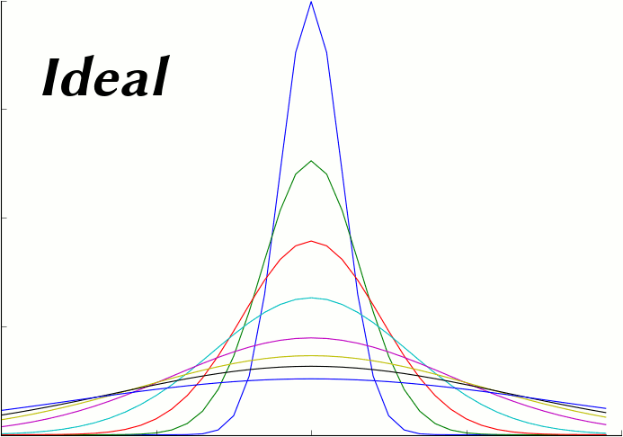

.. _ficks_law_scripting:

*********************************************
Fick's Law Data Model Scripting Example
*********************************************

.. Git Repo SHA1 ID: 3520f8694d61c81424ff15ff9e7a432e42f0623f

MCell and CellBlender can be used to demonstrate various aspects of Fick's 1st and 2nd laws.
The :ref:`advanced_models` section contains a tutorial on constructing such a model in 
CellBlender by hand. The following Data Model Script constructs an entire Fick's demonstration
model in Python.

As shown in the animation below, the script constructs a long semi-transparent blue box which will
contain the molecules in the simulation. It then constructs a series of tan counting boxes along the
length to count the molecules. It also constructs a series of light blue counting planes to measure
the flux. Molecules are released at the center of the box at t=0 and diffuse during the simulation.

.. image:: ./images/ficks/ficks_scripted.gif

Fick's Law Construction Script
---------------------------------------------

The following script builds the CellBlender model from scratch.

::

    # Import cellblender to get the data model and project directory functions

    import cellblender as cb

    # Get a copy of the data model and change directories to the project directory for any file I/O

    dm = cb.get_data_model(geometry=True)
    old_location = cb.cd_to_project()

    # Print some information about the data model

    print ( "###############################################################" )

    print ( "Data Model Top Level Keys = " + str(dm.keys()) )
    print ( "MCell Keys = " + str(dm['mcell'].keys()) )

    print ( "###############################################################" )

    # Define parameters and set default values (these will also be available as local variables in this script)
    #  The format for each parameter is:   Name, Value, Units, Description
    #    All values are given as strings!!!

    pars = [
      # These control the geometry of the model
      ['n',    "40",    '',     'Number of segments to sample along the x dimension'],
      ['lx',   "2.0",   'um',   'Length x = Total length of sample box in x dimension'],
      ['ly',   "0.2",   'um',   'Length y = Total length of sample box in y dimension'],
      ['lz',   "0.2",   'um',   'Length z = Total length of sample box in z dimension'],
      ['ext',  "0.02",  'um',   'Extended length for counting boxes and counting planes'],
      ['tol',  "0.995", 'um',   'Scale factor of sampling boxes to avoid coincident faces (0.995 works well)'],
      ['rtol', "0.001", 'um',   'Release plane tolerance - smaller is closer to ideal (0.001 works well)'],
      # These control the instrumentation of the model
      ['plot_segment_counts',   "1",  '',   'Plot count of vm molecules in each segment when non-zero'],
      ['plot_front_crossings',  "0",  '',   'Plot front crossings of vm molecules when non-zero'],
      # These describe the behavior of the model
      ['dc',    "5e-6",   'cm^2/sec',    'Diffusion Constant of Molecules'],
      ['nrel',  "1000",   'Count',       'Number of molecules to release'],
      # These control the simulation itself
      ['iters', "600",   '',      'Number of iterations to run'],
      ['seeds', "10",    '',      'Number of seeds to run'],
      ['dt',    "1e-6",  'sec',   'Time step for each iteration of the simulation'],
     ]

    # Update local parameter list values from the existing data model with user-modified settings BEFORE regenerating it

    dm_par_list = dm['mcell']['parameter_system']['model_parameters']
    for dm_par in dm_par_list:
        print ( "Data Model Parameter " + dm_par['par_name'] + " = " + dm_par['par_expression'] )
        for p in pars:
            if dm_par['par_name'] == p[0]:
                # Update the local expression based on the parameter found in the incoming data model
                p[1] = dm_par['par_expression']
                p[2] = dm_par['par_units']
                p[3] = dm_par['par_description']

    # Create the local variables from the updated values to use in this script
    for p in pars:
        locals()[p[0]] = eval(p[1])

    # Create the new mcell data model inside the existing data model (this deletes the previous mcell data model)

    dm['mcell'] = { 'data_model_version' : "DM_2014_10_24_1638" }

    # Restore the parameters that were either initialized from scratch or preserved from the previous data model

    dm['mcell']['parameter_system'] = { 'model_parameters':[] }   # Parameters are currently unversioned
    for p in pars:
        dm['mcell']['parameter_system']['model_parameters'].append ( { 'par_name':p[0], 'par_expression':p[1], 'par_units':p[2], 'par_description':p[3] } )

    # Define a function to make either a plane or a box from its center and lengths in each dimension (one zero dimension gives a plane)

    def make_obj ( center_x, center_y, center_z, len_x, len_y, len_z ):
        obj = {}
        obj['vertex_list'] = []
        obj['element_connections'] = []

        if len_x == 0:
          # Make a plane perpendicular to the x axis
          obj['vertex_list'].append ( [ center_x, center_y-(len_y/2.0), center_z-(len_z/2.0) ] )
          obj['vertex_list'].append ( [ center_x, center_y-(len_y/2.0), center_z+(len_z/2.0) ] )
          obj['vertex_list'].append ( [ center_x, center_y+(len_y/2.0), center_z+(len_z/2.0) ] )
          obj['vertex_list'].append ( [ center_x, center_y+(len_y/2.0), center_z-(len_z/2.0) ] )
          obj['element_connections'].append ( [ 0, 2, 1 ] )
          obj['element_connections'].append ( [ 0, 3, 2 ] )
        elif len_y == 0:
          # Make a plane perpendicular to the y axis
          obj['vertex_list'].append ( [ center_x-(len_x/2.0), center_y, center_z-(len_z/2.0) ] )
          obj['vertex_list'].append ( [ center_x-(len_x/2.0), center_y, center_z+(len_z/2.0) ] )
          obj['vertex_list'].append ( [ center_x+(len_x/2.0), center_y, center_z+(len_z/2.0) ] )
          obj['vertex_list'].append ( [ center_x+(len_x/2.0), center_y, center_z-(len_z/2.0) ] )
          obj['element_connections'].append ( [ 0, 2, 1 ] )
          obj['element_connections'].append ( [ 0, 3, 2 ] )
        elif len_z == 0:
          # Make a plane perpendicular to the z axis
          obj['vertex_list'].append ( [ center_x-(len_x/2.0), center_y-(len_y/2.0), center_z ] )
          obj['vertex_list'].append ( [ center_x-(len_x/2.0), center_y+(len_y/2.0), center_z ] )
          obj['vertex_list'].append ( [ center_x+(len_x/2.0), center_y+(len_y/2.0), center_z ] )
          obj['vertex_list'].append ( [ center_x+(len_x/2.0), center_y-(len_y/2.0), center_z ] )
          obj['element_connections'].append ( [ 0, 2, 1 ] )
          obj['element_connections'].append ( [ 0, 3, 2 ] )
        else:
          # Make a box
          obj['vertex_list'].append ( [ center_x+(len_x/2.0), center_y+(len_y/2.0), center_z-(len_z/2.0) ] )
          obj['vertex_list'].append ( [ center_x+(len_x/2.0), center_y-(len_y/2.0), center_z-(len_z/2.0) ] )
          obj['vertex_list'].append ( [ center_x-(len_x/2.0), center_y-(len_y/2.0), center_z-(len_z/2.0) ] )
          obj['vertex_list'].append ( [ center_x-(len_x/2.0), center_y+(len_y/2.0), center_z-(len_z/2.0) ] )
          obj['vertex_list'].append ( [ center_x+(len_x/2.0), center_y+(len_y/2.0), center_z+(len_z/2.0) ] )
          obj['vertex_list'].append ( [ center_x+(len_x/2.0), center_y-(len_y/2.0), center_z+(len_z/2.0) ] )
          obj['vertex_list'].append ( [ center_x-(len_x/2.0), center_y-(len_y/2.0), center_z+(len_z/2.0) ] )
          obj['vertex_list'].append ( [ center_x-(len_x/2.0), center_y+(len_y/2.0), center_z+(len_z/2.0) ] )
          obj['element_connections'].append ( [ 1, 2, 3 ] )
          obj['element_connections'].append ( [ 7, 6, 5 ] )
          obj['element_connections'].append ( [ 4, 5, 1 ] ) # Right end
          obj['element_connections'].append ( [ 5, 6, 2 ] )
          obj['element_connections'].append ( [ 2, 6, 7 ] ) # Left end
          obj['element_connections'].append ( [ 0, 3, 7 ] )
          obj['element_connections'].append ( [ 0, 1, 3 ] )
          obj['element_connections'].append ( [ 4, 7, 5 ] )
          obj['element_connections'].append ( [ 0, 4, 1 ] ) # Right end
          obj['element_connections'].append ( [ 1, 5, 2 ] )
          obj['element_connections'].append ( [ 3, 2, 7 ] ) # Left end
          obj['element_connections'].append ( [ 4, 0, 7 ] )

        return obj

    # Add materials for the objects

    dm['mcell']['materials'] = { 'material_dict' : {} }   # Materials are currently unversioned
    dm['mcell']['materials']['material_dict']['box_color']   = { 'diffuse_color' : {'a':0.3, 'r':0.2, 'g':0.4, 'b':1.0} }
    dm['mcell']['materials']['material_dict']['rel_color']   = { 'diffuse_color' : {'a':0.2, 'r':0.9, 'g':0.7, 'b':0.5} }
    dm['mcell']['materials']['material_dict']['vol_color']   = { 'diffuse_color' : {'a':0.1, 'r':0.9, 'g':0.7, 'b':0.5} }
    dm['mcell']['materials']['material_dict']['plane_color'] = { 'diffuse_color' : {'a':0.7, 'r':0.5, 'g':0.7, 'b':1.0} }

    # Create container objects for geometrical objects and model objects

    dm['mcell']['geometrical_objects'] = {}   # Geometrical objects are currently unversioned
    dm['mcell']['model_objects'] = { 'data_model_version':"DM_2014_10_24_1638" }

    # Each container also includes a list

    dm['mcell']['geometrical_objects']['object_list'] = []
    dm['mcell']['model_objects']['model_object_list'] = []

    # Add objects to the lists

    # Make the main box for diffusing the molecules

    box = make_obj ( 0, 0, 0, 10*lx, ly, lz ) # Make the box much longer to reduce boundary effects from absorptive ends
    box['name'] = 'box'
    box['material_names'] = [ 'box_color' ]

    # Make the thin box for releasing the molecules

    rel = make_obj ( 0, 0, 0, rtol, ly-rtol, lz-rtol )
    rel['name'] = 'rel'
    rel['material_names'] = [ 'rel_color' ]

    # Make the surface regions for the two absorptive ends to keep them from accumulating
    box['define_surface_regions'] = []
    box['define_surface_regions'].append ( { 'name':"left_end", 'include_elements':[ 4, 10 ] } )
    box['define_surface_regions'].append ( { 'name':"right_end", 'include_elements':[ 2, 8 ] } )

    # Add the box to the geometrical objects and the model objects
    dm['mcell']['geometrical_objects']['object_list'].append ( box )
    dm['mcell']['model_objects']['model_object_list'].append ( { 'name':box['name'] } )

    dm['mcell']['geometrical_objects']['object_list'].append ( rel )
    dm['mcell']['model_objects']['model_object_list'].append ( { 'name':rel['name'] } )

    # Make the counting boxes and planes as requested by the parameter flags
    for i in range(n):

        x = (i - ((n-1)/2.0)) / (n/lx)

        if plot_segment_counts != 0:
          box = make_obj ( x, 0, 0, tol*(lx/n), ly+ext, lz+ext )
          box['name'] = 'vol_%03d' % i
          box['material_names'] = [ 'vol_color' ]
          dm['mcell']['geometrical_objects']['object_list'].append ( box )
          dm['mcell']['model_objects']['model_object_list'].append ( { 'name':box['name'] } )

        if (plot_front_crossings != 0) and (i > 0):
          plane = make_obj ( x-(lx/(2*n)), 0, 0, 0.0, ly+ext+ext, lz+ext+ext )
          plane['name'] = 'plane_%03d' % i
          plane['material_names'] = [ 'plane_color' ]
          dm['mcell']['geometrical_objects']['object_list'].append ( plane )
          dm['mcell']['model_objects']['model_object_list'].append ( { 'name':plane['name'] } )

    # Create a molecule list and create a "vm" molecule along with its display properties in that list

    dm['mcell']['define_molecules'] = { 'data_model_version' : "DM_2014_10_24_1638" }
    mol = { 'mol_name':"vm", 'mol_type':"3D", 'diffusion_constant':"dc", 'data_model_version':"DM_2016_01_13_1930" }
    mol['display'] = {'color':[0.0,1.0,0.0], 'emit':1.0, 'glyph':"Cube", 'scale':0.5 }
    dm['mcell']['define_molecules']['molecule_list'] = [ mol ]

    # Create a release site

    rel_site = {
                  'name' : "center_rel",
                  'molecule' : "vm",
                  'quantity' : "nrel",
                  'quantity_type' : "NUMBER_TO_RELEASE",
                  'release_probability' : "1",
                  'shape' : "OBJECT",
                  'object_expr' : "rel",
                  'orient' : ";",
                  'pattern' : "",
                  'location_x' : "0",
                  'location_y' : "0",
                  'location_z' : "0",
                  'site_diameter' : "0",
                  'stddev' : "0",
                  'data_model_version' : "DM_2015_11_11_1717"
               }

    dm['mcell']['release_sites'] = { 'release_site_list':[ rel_site ], 'data_model_version':"DM_2014_10_24_1638" }

    # Define surface classes

    dm['mcell']['define_surface_classes'] = { 'surface_class_list':[], 'data_model_version':"DM_2014_10_24_1638" }

    # Use a table to construct the various classes with associated properties

    surf_classes = [
      [ 'transp', 'vm_transp', ';', "TRANSPARENT",         "0" ],
      [ 'absorb', 'vm_absorb', ';', "ABSORPTIVE",          "0" ] ]

    # Loop through the table and add each class to the data model

    for c in surf_classes:
      sc_prop = { 'data_model_version':"DM_2015_11_08_1756",
                  'name':c[1],
                  'affected_mols':"SINGLE",
                  'molecule':"vm",
                  'surf_class_orient':c[2],
                  'surf_class_type':c[3],
                  'clamp_value':c[4]
                }

      sc_entry = { 'data_model_version':"DM_2014_10_24_1638",
                   'name':c[0],
                   'surface_class_prop_list':[ sc_prop ]
                 }

      dm['mcell']['define_surface_classes']['surface_class_list'].append ( sc_entry )

    # Assign the surface classes with the "modify_surface_regions" key

    dm['mcell']['modify_surface_regions'] = { 'modify_surface_regions_list':[], 'data_model_version': "DM_2014_10_24_1638" }

    # Modify the left end to be absorptive

    dm['mcell']['modify_surface_regions']['modify_surface_regions_list'].append (
        {
          'name':"absorb left",
          'object_name':"box",
          'region_name':"left_end",
          'surf_class_name':"absorb",
          'region_selection':"SEL",
          'data_model_version':"DM_2015_11_06_1732"
        } )

    # Modify the right end to be absorptive

    dm['mcell']['modify_surface_regions']['modify_surface_regions_list'].append (
        {
          'name':"absorb right",
          'object_name':"box",
          'region_name':"right_end",
          'surf_class_name':"absorb",
          'region_selection':"SEL",
          'data_model_version':"DM_2015_11_06_1732" } )

    # Modify the release box, all counting boxes, and counting planes (if any) to be transparent

    dm['mcell']['modify_surface_regions']['modify_surface_regions_list'].append (
      {
        'name':"transp rel",
        'object_name':"rel",
        'region_name':"",
        'surf_class_name':"transp",
        'region_selection':"ALL",
        'data_model_version':"DM_2015_11_06_1732"
      } )

    for i in range(n):

        if plot_segment_counts != 0:
          name = 'vol_%03d' % i
          dm['mcell']['modify_surface_regions']['modify_surface_regions_list'].append (
            {
              'name':"transp "+name,
              'object_name':name,
              'region_name':"",
              'surf_class_name':"transp",
              'region_selection':"ALL",
              'data_model_version':"DM_2015_11_06_1732"
            } )

        if (plot_front_crossings != 0) and (i > 0):
          name = 'plane_%03d' % i
          dm['mcell']['modify_surface_regions']['modify_surface_regions_list'].append (
            {
              'name':"transp "+name,
              'object_name':name,
              'region_name':"",
              'surf_class_name':"transp",
              'region_selection':"ALL",
              'data_model_version':"DM_2015_11_06_1732"
            } )

    # Define the counting output

    dm['mcell']['reaction_data_output'] = {
        'data_model_version':"DM_2014_10_24_1638",
        'reaction_output_list':[],
        'rxn_step':"10*dt",
        'combine_seeds':False,
        'mol_colors':True,
        'plot_layout':" plot ",
        'plot_legend':"x",
        'mol_colors':False
        }

    dm['mcell']['reaction_data_output']['reaction_output_list'].append (
        {
          'data_model_version':"DM_2015_10_07_1500",
           'name':"vm in box",
           'rxn_or_mol':"Molecule",
           'mdl_string':"",
           'mdl_file_prefix':"",
           'count_location':"Object",
           'object_name':"box",
           'region_name':"",
           'reaction_name':"",
           'molecule_name':"vm"
        } )

    # Create the counting structures for the counting object as requested

    for i in range(n):
        if plot_segment_counts != 0:
            name = 'vol_%03d' % i
            if plot_segment_counts != 0:
              dm['mcell']['reaction_data_output']['reaction_output_list'].append (
                {
                  'data_model_version':"DM_2015_10_07_1500",
                  'name':"vm in "+name,
                  'rxn_or_mol':"Molecule",
                  'mdl_string':"",
                  'mdl_file_prefix':"",
                  'count_location':"Object",
                  'object_name':name,
                  'region_name':"",
                  'reaction_name':"",
                  'molecule_name':"vm"
                } )
        if (plot_front_crossings != 0) and (i > 0):
          name = 'plane_%03d' % i
          mdl_string = "COUNT[vm,Scene."+name+",FRONT_CROSSINGS]"
          dm['mcell']['reaction_data_output']['reaction_output_list'].append (
            {
              'data_model_version':"DM_2015_10_07_1500",
              'name':"MDL: "+mdl_string,
              'rxn_or_mol':"MDLString",
              'mdl_file_prefix':name+"_front_cross",
              'mdl_string':mdl_string,
              'count_location':"World",
              'object_name':"",
              'region_name':"",
              'reaction_name':"",
              'molecule_name':""
            } )

    # Set up the simulation running parameters

    dm['mcell']['initialization'] = { 'data_model_version':"DM_2014_10_24_1638" }
    dm['mcell']['initialization']['iterations'] = "iters"
    dm['mcell']['initialization']['time_step'] = "dt"

    dm['mcell']['simulation_control'] = { 'data_model_version': 'DM_2016_04_15_1430' }
    dm['mcell']['simulation_control']['start_seed'] = '1'
    dm['mcell']['simulation_control']['end_seed'] = 'seeds'

    # Return to the previous directory and replace the existing data model with this modified version

    cb.cd_to_location ( old_location )
    cb.replace_data_model ( dm, geometry=True )

Fick's Law Plotting Script
---------------------------------------------

The following plot series (animation) compares the average of 50 MCell runs (Start Seed=1, End Seed=50,
10,000 molecules released) at various points in time to plots of the expected theoretical results at
those same points in time.

This script generates the data needed for that plot. It reads and averages the data from the MCell
runs and generates a series of plot files from that output. It also generates a series of plot files
from the expected analytic solution with the same parameters as the MCell runs. Because this script
uses the same parameters used to generate the simulation, it will produce the correct plot even when
the simulation parameters are varied.

::

    import math
    import os
    from numpy import fromfile

    import cellblender as cb

    dm = cb.get_data_model()
    old_location = cb.cd_to_project()

    pars = [
      # These control the geometry of the model
      ['n',    "40",    '',     'Number of segments to sample along the x dimension'],
      ['lx',   "2.0",   'um',   'Length x = Total length of sample box in x dimension'],
      ['ly',   "0.2",   'um',   'Length y = Total length of sample box in y dimension'],
      ['lz',   "0.2",   'um',   'Length z = Total length of sample box in z dimension'],
      ['ext',  "0.02",  'um',   'Extended length for counting boxes and counting planes'],
      ['tol',  "0.995", 'um',   'Scale factor of sampling boxes to avoid coincident faces (0.995 works well)'],
      ['rtol', "0.001", 'um',   'Release plane tolerance - smaller is closer to ideal (0.001 works well)'],
      # These control the instrumentation of the model
      ['plot_segment_counts',   "1",  '',   'Plot count of vm molecules in each segment when non-zero'],
      ['plot_front_crossings',  "0",  '',   'Plot front crossings of vm molecules when non-zero'],
      # These describe the behavior of the model
      ['dc',    "5e-6",   'cm^2/sec',    'Diffusion Constant of Molecules'],
      ['nrel',  "1000",   'Count',       'Number of molecules to release'],
      # These control the simulation itself
      ['iters', "500",   '',      'Number of iterations to run'],
      ['seeds', "10",    '',      'Number of seeds to run'],
      ['dt',    "1e-6",  'sec',   'Time step for each iteration of the simulation'],
     ]

    # Update local parameter list values from the existing data model with user-modified settings BEFORE generating plot data

    dm_par_list = dm['mcell']['parameter_system']['model_parameters']
    for dm_par in dm_par_list:
        print ( "Data Model Parameter " + dm_par['par_name'] + " = " + dm_par['par_expression'] )
        for p in pars:
            if dm_par['par_name'] == p[0]:
                # Update the local expression based on the parameter found in the incoming data model
                p[1] = dm_par['par_expression']
                p[2] = dm_par['par_units']
                p[3] = dm_par['par_description']

    # Create the local variables from the updated values to use in this script
    for p in pars:
        locals()[p[0]] = eval(p[1])

    plot_iters = [ 10, 25, 50, 100, 200, 300, 400, 600 ]
    start_seed = 1
    end_seed = seeds
    start_vol = 0
    end_vol = n - 1
    num_vols = 1 + end_vol - start_vol

    # Note: Neither 'iterations' nor 'time_step' can use CellBlender parameters!!
    iters = eval(dm['mcell']['initialization']['iterations'])
    dt = eval(dm['mcell']['initialization']['time_step'])

    react_files_dir = "mcell" + os.sep + "react_data"
    react_files_seeds = os.listdir(react_files_dir)

    print ( "files: " + str(react_files_seeds) )

    parent_dir = os.getcwd().split(os.sep)[-1]

    # Remove all plots from the data model so they're not cumulative when this script is re-run

    dm['mcell']['reaction_data_output']['reaction_output_list'] = []  # Comment this line to NOT remove previous plots

    def make_file_plot ( file_name ):
      blender_relative_name = "//" + parent_dir + os.sep + fname
      reaction_out = { 'data_model_version':"DM_2016_03_15_1800" }
      reaction_out['rxn_or_mol'] = "File"
      reaction_out['molecule_name'] = ""
      reaction_out['reaction_name'] = ""
      reaction_out['object_name'] = ""
      reaction_out['region_name'] = ""
      reaction_out['mdl_file_prefix'] = ""
      reaction_out['mdl_string'] = ""
      reaction_out['count_location'] = "World"
      reaction_out['plotting_enabled'] = True
      reaction_out['data_file_name'] = blender_relative_name
      reaction_out['name'] = "FILE:" + blender_relative_name
      return reaction_out

    area = ly * lz

    # Generate the MCell plots

    for plot_iter in plot_iters:
      print ( "Generating concentration curve for " + str(plot_iter) )

      fname = "concentration_%d.txt" % plot_iter
      f = open ( fname, "w" )
      dm['mcell']['reaction_data_output']['reaction_output_list'].append ( make_file_plot(fname) )

      points = []
      for vol in range(start_vol,1+end_vol):

          count = 0.0
          sx0 = (1+end_vol-start_vol)/2
          sx = (vol - sx0)
          vx = sx * lx / n
          for seed in range(start_seed,1+end_seed):
              file_name = react_files_dir + os.sep + ("seed_%05d" % seed) + os.sep + ("vm.vol_%03d.dat" % vol)
              data = fromfile ( file_name, sep=' ' )
              x = data[0::2]
              y = data[1::2]
              count = count + y[plot_iter]
          averaged_count = count/(1+end_seed-start_seed)
          conc = averaged_count / (tol*lx/n)                    # This should be molecules per micron (length)

          f.write ( str(vx+(lx/(2.0*n))) + "  " + str(conc) + "\n" )
      f.close()

    # Generate the analytic plots

    for plot_iter in plot_iters:
      print ( "Generating analytic curve for " + str(plot_iter) )

      fname = "concentration_ideal_%d.txt" % plot_iter
      f = open ( fname, "w" )
      dm['mcell']['reaction_data_output']['reaction_output_list'].append ( make_file_plot(fname) )

      t = plot_iter * dt

      for vol in range(start_vol,1+end_vol):
          sx0 = (1+end_vol-start_vol)/2
          sx = (vol - sx0)
          x = sx * lx / n
          N = nrel * math.exp(-(x*x/(4*dc*1e8*t))) / (2 * math.sqrt(math.pi*dc*1e8*t))
          f.write ( str(x) + "  " + str(N) + "\n" )
      f.close()

    # Configure the plotter for one page / one plot (uses a single space):

    dm['mcell']['reaction_data_output']['plot_layout'] = ' '

    cb.cd_to_location ( old_location )
    cb.replace_data_model ( dm )

