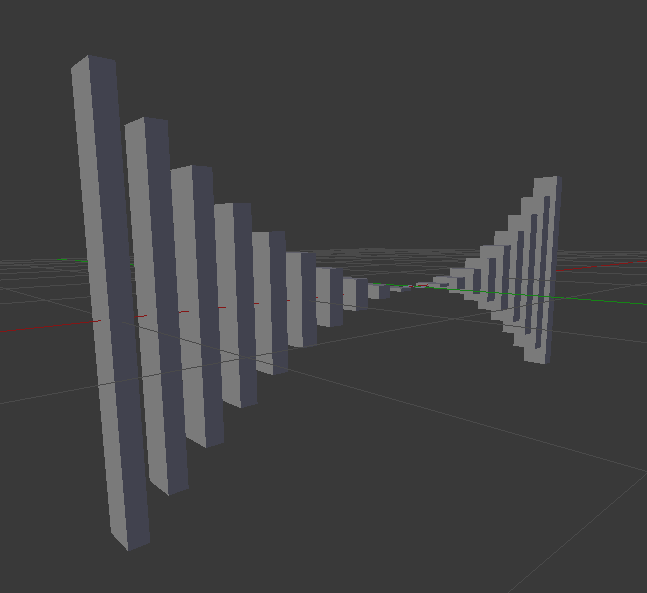
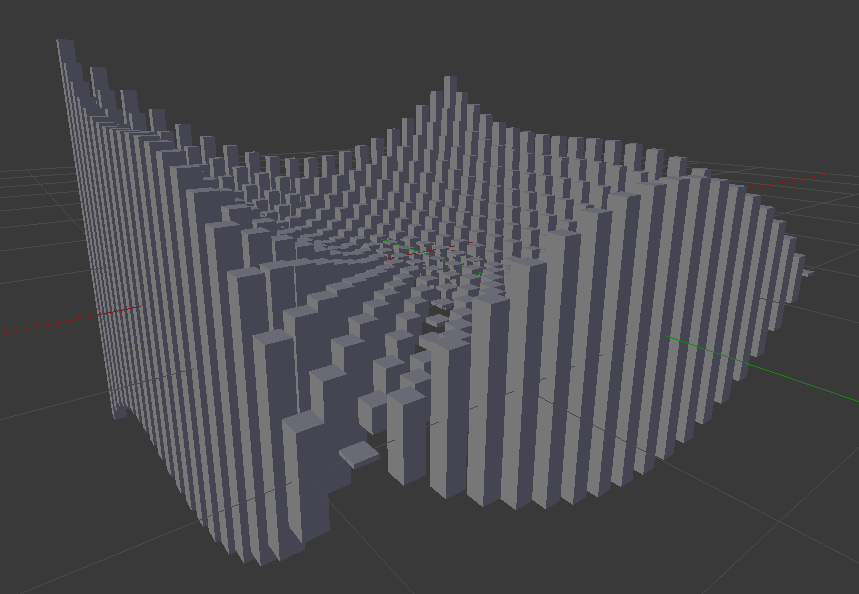

.. _simple_geometry_scripting:

*********************************************
Simple Geometry Scripting Example
*********************************************

.. Git Repo SHA1 ID: 3520f8694d61c81424ff15ff9e7a432e42f0623f

CellBlender's geometry (model objects) can be created a number of ways:

    * Manually inside CellBlender
    * Using Blender's native geometry commands in a script
    * Using CellBlender's data model in a script

This tutorial demonstrates the last of these options to construct a variable sized box.

Start with an empty scene (no objects, cameras, or lamps), and with CellBlender initialized.
Also open a text editor window and create a new text file named "box.py".

Then open the "Model Objects" panel in CellBlender and click the following:

    * "Center Cursor" - to center the 3D cursor at the origin
    * "Cube" - to create a cube of default size ( 2 x 2 x 2 )
    * "+" - to add the cube to CellBlender's model objects (also triangulates the object)

Open the "Scripting" panel in CellBlender and open the "Data Model Scripting" subpanel and
then the "Make Script" subpanel under that.

Click "Regenerate Data Model" to create a new interal data model from the cube that you
just added.

Check the "Include Geometry" box, and select "Geometrical Objects" from the list directly
below the "Include Geometry" box. Then click "Copy" to copy the data model representation
of your cube to the clipboard.

Click inside the text editor and paste the data model using either "Control-V" or the menu
combination of "Edit/Paste". You should see the following code pasted into the text editor:

::

    dm['mcell']['geometrical_objects'] = {
      'object_list' : [
        {
          'element_connections' : [
            [3, 0, 1],
            [7, 2, 3],
            [5, 6, 7],
            [1, 4, 5],
            [2, 4, 0],
            [7, 1, 5],
            [3, 2, 0],
            [7, 6, 2],
            [5, 4, 6],
            [1, 0, 4],
            [2, 6, 4],
            [7, 3, 1]
          ],
          'location' : [0.0, 0.0, 0.0],
          'name' : "Cube",
          'vertex_list' : [
            [-1.0, -1.0, -1.0],
            [-1.0, -1.0, 1.0],
            [-1.0, 1.0, -1.0],
            [-1.0, 1.0, 1.0],
            [1.0, -1.0, -1.0],
            [1.0, -1.0, 1.0],
            [1.0, 1.0, -1.0],
            [1.0, 1.0, 1.0]
          ]
        }
      ]
    }

That's how the data model represents the cube object. To run this as a data model script,
you'll need to add the following two lines to the top of the script:

::

    import cellblender as cb
    dm = cb.get_data_model()

and also add the following single line to the bottom of the script:

::

    cb.replace_data_model ( dm )

Your script should look like this:

::

    import cellblender as cb
    dm = cb.get_data_model()

    dm['mcell']['geometrical_objects'] = {
      'object_list' : [
        {
          'element_connections' : [
            [3, 0, 1],
            [7, 2, 3],
            [5, 6, 7],
            [1, 4, 5],
            [2, 4, 0],
            [7, 1, 5],
            [3, 2, 0],
            [7, 6, 2],
            [5, 4, 6],
            [1, 0, 4],
            [2, 6, 4],
            [7, 3, 1]
          ],
          'location' : [0.0, 0.0, 0.0],
          'name' : "Cube",
          'vertex_list' : [
            [-1.0, -1.0, -1.0],
            [-1.0, -1.0, 1.0],
            [-1.0, 1.0, -1.0],
            [-1.0, 1.0, 1.0],
            [1.0, -1.0, -1.0],
            [1.0, -1.0, 1.0],
            [1.0, 1.0, -1.0],
            [1.0, 1.0, 1.0]
          ]
        }
      ]
    }

    cb.replace_data_model ( dm )

Now you can run the script using either the "Run Script" button under the text editor or using
the "Run Script" button in the "Run Script" subpanel of CellBlender's Scripting panel.

You'll notice that when you click the "Run Script" button, nothing seems to happen. That's because
the script is deleting the existing cube and replacing it with the same exact cube of the same
exact size in the same exact location. You can prove this easily by changing the location field
in your script. It should currently show:

::

          'location' : [0.0, 0.0, 0.0],

Try changing the first zero to 2:

::

          'location' : [2.0, 0.0, 0.0],

and run the script again. You should see that the cube has moved along the x axis.

Set the location back to [0.0, 0.0, 0.0], and then change some of the 1's in the vertex list
to 2's. Here's an example:

::

      'vertex_list' : [
        [-1.0, -2.0, -1.0],
        [-1.0, -1.0, 1.0],
        [-1.0, 2.0, -1.0],
        [-1.0, 1.0, 1.0],
        [1.0, -2.0, -1.0],
        [1.0, -1.0, 1.0],
        [1.0, 1.0, -1.0],
        [1.0, 2.0, 1.0]
      ]

If you run that script, you'll see that the "cube" is distorted along the y axis. So in order
to change our cube into a resizable rectangle, all we need to do is substitute some variables
for the coordinates in the "vertex_list" structure. Let's do that by adding some size variables
named sx=1.0, sy=2.0, and sz=0.5 at the top. And then use those variables in the cube's vertex
list in place of the 1's and 2's. Be sure to keep the minus signs, and it helps to indent the
non-negative values so they line up nicely:

::

      'vertex_list' : [
        [-sx, -sy, -sz],
        [-sx, -sy,  sz],
        [-sx,  sy, -sz],
        [-sx,  sy,  sz],
        [ sx, -sy, -sz],
        [ sx, -sy,  sz],
        [ sx,  sy, -sz],
        [ sx,  sy,  sz]
      ]

Your full script should look something like this:

::

    import cellblender as cb
    dm = cb.get_data_model()

    sx = 1.0
    sy = 2.0
    sz = 0.5

    dm['mcell']['geometrical_objects'] = {
      'object_list' : [
        {
          'element_connections' : [
            [3, 0, 1],
            [7, 2, 3],
            [5, 6, 7],
            [1, 4, 5],
            [2, 4, 0],
            [7, 1, 5],
            [3, 2, 0],
            [7, 6, 2],
            [5, 4, 6],
            [1, 0, 4],
            [2, 6, 4],
            [7, 3, 1]
          ],
          'location' : [0.0, 0.0, 0.0],
          'name' : "Cube",
          'vertex_list' : [
            [-sx, -sy, -sz],
            [-sx, -sy,  sz],
            [-sx,  sy, -sz],
            [-sx,  sy,  sz],
            [ sx, -sy, -sz],
            [ sx, -sy,  sz],
            [ sx,  sy, -sz],
            [ sx,  sy,  sz]
          ]
        }
      ]
    }

    cb.replace_data_model ( dm )

Now run it, and you should see a "shoebox" sized object created that's 2x4x1 units. This
is twice each of the dimensions in the script because each dimension uses the "size" value
in both the positive and negative directions. You can change the values of sx, sy, and sz
in your script and run it again to get any sized box you like.

Making a Geometry Creation Function
---------------------------------------------

So far the use of scripting hasn't been much more helpful than just creating boxes by hand
and then changing their dimensions through Blender's own interface. This next step will turn
this simple script into a function that we can use to create dozens of boxes very quickly.

Turning a portion of this Python code into a function is fairly easy. We just create a new
function definition ("def") near the top of our code and have it accept a name along with
the three components of the location (x, y, z) and the three different size values (sx, sy, sz)
as parameters. We return the dictionary that contains the same element connections, and
vertex list with our new name, location, and size values. Here's the current version of
the script:

::

    import cellblender as cb
    dm = cb.get_data_model()

    def make_box ( name, x, y, z, sx, sy, sz ):
        box = {
          'element_connections' : [
            [3, 0, 1],
            [7, 2, 3],
            [5, 6, 7],
            [1, 4, 5],
            [2, 4, 0],
            [7, 1, 5],
            [3, 2, 0],
            [7, 6, 2],
            [5, 4, 6],
            [1, 0, 4],
            [2, 6, 4],
            [7, 3, 1]
          ],
          'location' : [x, y, z],
          'name' : name,
          'vertex_list' : [
            [-sx, -sy, -sz],
            [-sx, -sy,  sz],
            [-sx,  sy, -sz],
            [-sx,  sy,  sz],
            [ sx, -sy, -sz],
            [ sx, -sy,  sz],
            [ sx,  sy, -sz],
            [ sx,  sy,  sz]
          ]
        }
        return box

    dm['mcell']['geometrical_objects'] = {
      'object_list' : [
        make_box ( "Cube", 0.0, 0.0, 0.0, 1.0, 2.0, 0.5 )
      ]
    }

    cb.replace_data_model ( dm )

If you run that script, you won't see any difference because it's creating the same
sized box as before. To verify that it's really working, try changing the make_box
parameters line to something like this:

::

    make_box ( "Cube", 0.5, 0.5, 0.0, 0.1, 0.1, 3.0 )

You should see a tall thin box located at x=0.5 and y=0.5 as might be predicted.

Using a Function to Generate Complex Geometry
---------------------------------------------

Now it's time to have some fun with our little script. We'll start by creating
an empty geometrical object list along with a convenience variable named "objlist"
to use to fill it with our objects:

::

    dm['mcell']['geometrical_objects'] = {
      'object_list' : []
    }

    objlist = dm['mcell']['geometrical_objects']['object_list']

Then we can create any kind of loop to add new boxes to that list. Let's try this:

::

    for i in range(40):
      x = (i-20) / 10.0
      sz = x * x / 4
      objlist.append ( make_box ( "Cube"+str(i), x, 0.0, 0.0, 0.02, 0.1, sz ) )

The full script should look like this:

::

    import cellblender as cb
    dm = cb.get_data_model()

    def make_box ( name, x, y, z, sx, sy, sz ):
        box = {
          'element_connections' : [
            [3, 0, 1],
            [7, 2, 3],
            [5, 6, 7],
            [1, 4, 5],
            [2, 4, 0],
            [7, 1, 5],
            [3, 2, 0],
            [7, 6, 2],
            [5, 4, 6],
            [1, 0, 4],
            [2, 6, 4],
            [7, 3, 1]
          ],
          'location' : [x, y, z],
          'name' : name,
          'vertex_list' : [
            [-sx, -sy, -sz],
            [-sx, -sy,  sz],
            [-sx,  sy, -sz],
            [-sx,  sy,  sz],
            [ sx, -sy, -sz],
            [ sx, -sy,  sz],
            [ sx,  sy, -sz],
            [ sx,  sy,  sz]
          ]
        }
        return box

    dm['mcell']['geometrical_objects'] = {
      'object_list' : []
    }

    objlist = dm['mcell']['geometrical_objects']['object_list']

    for i in range(40):
      x = (i-20) / 10.0
      sz = x * x / 4
      objlist.append ( make_box ( "Cube"+str(i), x, 0.0, 0.0, 0.02, 0.1, sz ) )

    cb.replace_data_model ( dm )

That should produce a geometry that looks like this:

With just a few more lines of code we can include variation in both x and y:

::

    for i in range(40):
      x = (i-20) / 10.0
      for j in range(40):
        y = (j-20) / 10.0
        sz = (x * x / 4) + (y * y * y / 10.0)
        name = "Cube_"+str(i)+"_"+str(j)
        objlist.append ( make_box ( name, x, y, 0.0, 0.02, 0.02, sz ) )

That should produce a geometry that looks like this:

At this point, it should be clear that virtually any geometry can be created
using Data Model Scripting. Geometry could be created purely from algorithms
(as we've done here) or by reading from a file containing geometric objects,
or by a combination of both.

