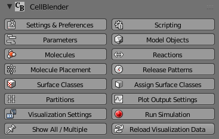
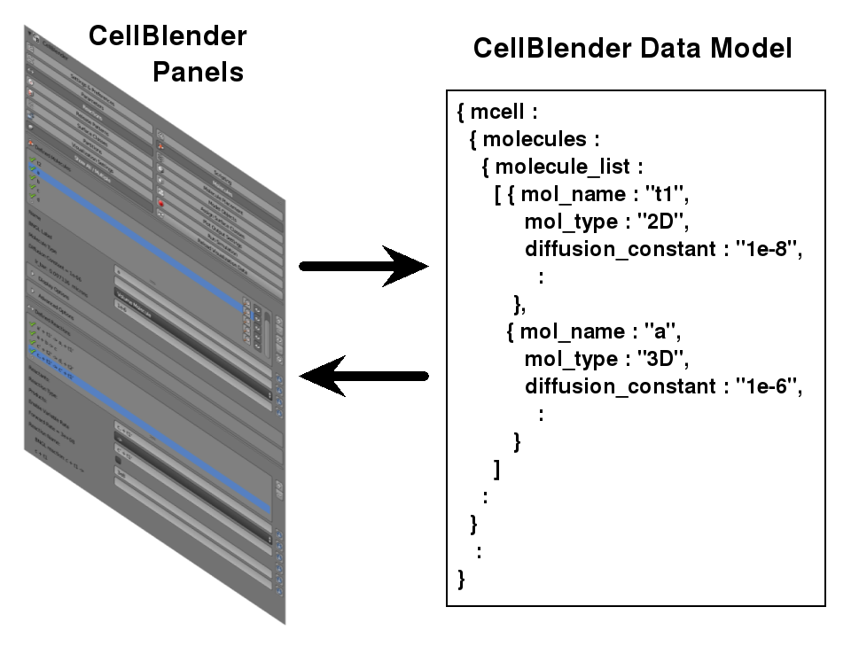
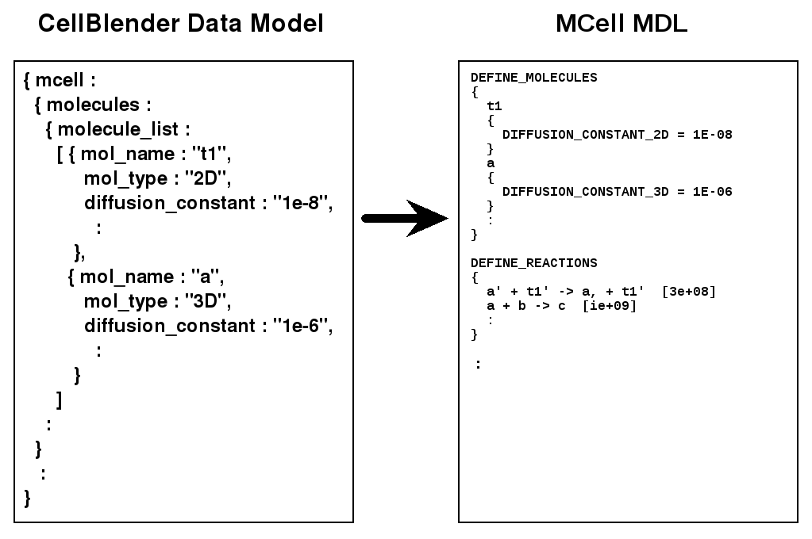
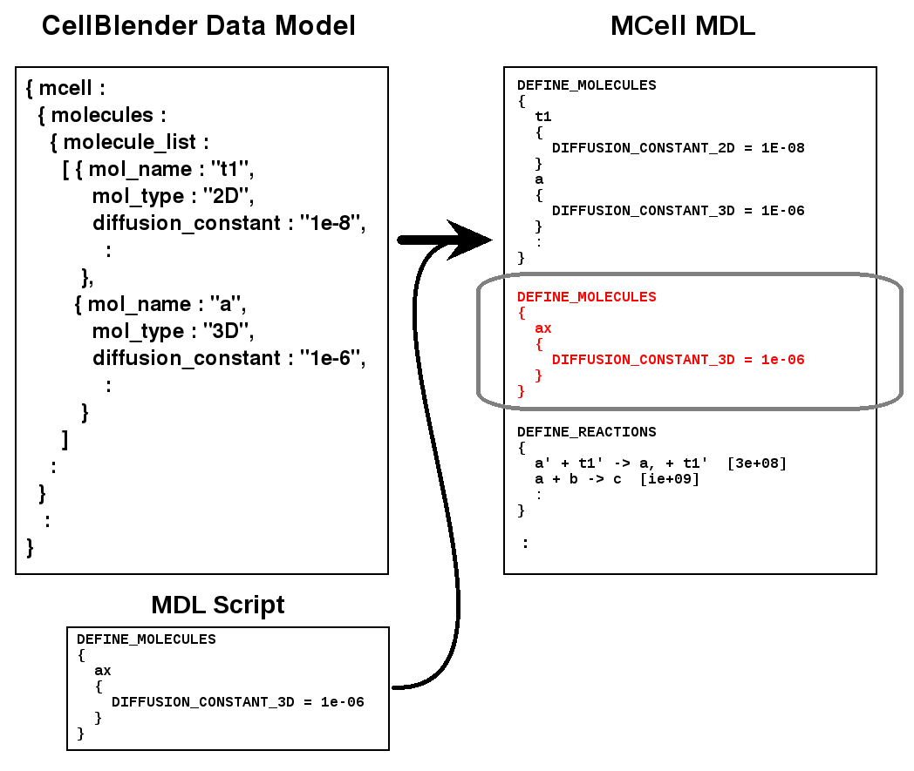
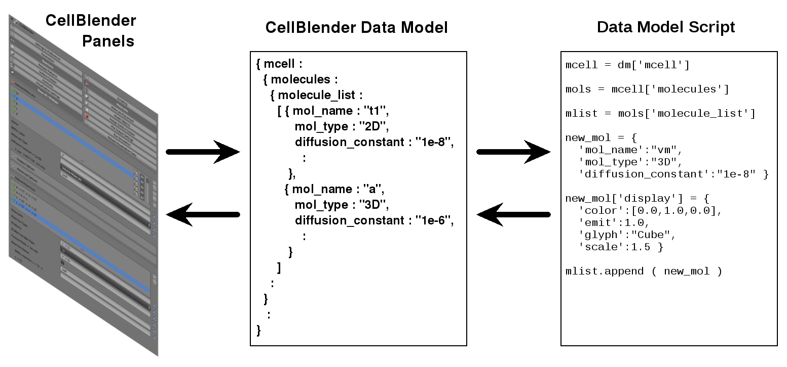

.. _scripting_overview:

*********************************************
Scripting
*********************************************

.. Git Repo SHA1 ID: 3520f8694d61c81424ff15ff9e7a432e42f0623f

.. warning::

   The scripting interface is very new and subject to change.

Scripting Overview
---------------------------------------------

The scripting interface allows CellBlender users to do the following:

    * Insert hand-written MDL at various points in the MDL export stream
    * Run Python scripts which insert MDL at various points in the MDL export stream
    * Run Python scripts that modify the CellBlender Data Model used by CellBlender

In order to understand how scripting works, it's important to understand
a little bit about how CellBlender works and how it interacts with an MCell
Simulation.

CellBlender is mostly a user interface that builds a model to be simulated.
The model defines things like geometry, molecule species, reactions, initial
conditions, etc. These are presented to the user through a series of Blender
panels. The top level CellBlender panel provides a number of subpanels and
it looks like this:

This panel (and each of the subpanels) are used to define the various aspects
of a CellBlender model. The CellBlender model appears as data values in these
various panels but it is also represented internally as a Python dictionary structure
known as a **"CellBlender Data Model"**. This relationship looks like this:

Export Scripting
---------------------------------------------

When CellBlender runs a simulation, it translates the data from the Panels and
the Data Model into a form that the simulation software needs to run. For example,
when CellBlender runs MCell, it translates the Panel / Data Model information into
one or more MCell MDL (Model Description Language) files:

This translation process happens when a CellBlender model is "Exported" (or
"Exported and Run"). The first two types of scripting listed above operate
during this export translation process. For example, an MDL script to add a 
new molecule type named "ax" might look like this:

In other words, the MDL Script is *merged* into the normal CellBlender output
when generating the MDL to run the simulation. The same merging process is
used when running Python scripts, except that the Python script writes the
MDL to a pre-opened file handle known locally as "mdl_file":

.. image:: ./images/CellBlender_Insert_Python_Script.png

The trivial example shown above (printing a list of MDL) doesn't make much
use of Python's power and might be better implemented as an MDL script. However,
if you needed to insert 100 different molecules of differing diffusion constants,
the power of Python becomes clear:

::

    mdl_file.write ( "DEFINE_MOLECULES\n" )
    mdl_file.write ( "{\n" )
    for i in range(100):
        mdl_file.write ( "  a" + str(i) + "\n" )
        mdl_file.write ( "  {\n" )
        mdl_file.write ( "    DIFFUSION_CONSTANT_3D = " + str(i*1e-6) + "\n" )
        mdl_file.write ( "  }\n" )
    mdl_file.write ( "}\n" )

That script would end up generating 100 different molecule species each with
a different molecule name (a0, a1, a2, ...) and each with a different diffusion
constant (0, 1e-6, 2e-6, 3e-6, ...).

This kind of scripting is currently called "Export Scripting" and it is enabled
via the "Export Scripting" portion of the Scripting Panel:

.. image:: ./images/CellBlender_Export_Scripting_Panel.png

Each Export Script item is specified in the top list. The green check mark in
this example shows one such Export Script item. As the item describes, this
item will include an internal MDL script named "add_ax_mols.mdl" after the
molecules section of the MDL to be generated. The details of the scripting
item are set by the controls below it. These include:

  * Internal / External - Location of the script (in the .blend file or not)
  * MDL / Python - Type of script being included
  * File - Name of the script (file name or text name inside Blender)
  * Where to include the script (Before, After, or not at all) relative to:
  * The MDL section referenced by the Before and After locations

So the example panel above shows that the MDL script named "add_ax_mols.mdl"
is an internal file (a text document inside Blender) and it will be included
after the Molecules definition section of the MDL generated by CellBlender.
This corresponds with the example shown in the earlier figure where the raw
MDL was inserted (in red) at the end of the "DEFINE_MOLECULES" section and
before the "DEFINE_REACTIONS" section.

Export scripting is powerful, and it changes the MDL that is used to run
MCell. Export scripts can define new molecules, new reactions, new geometry,
and almost anything else. However, those changes are NOT reflected inside of
CellBlender. Sometimes that is exactly what's desired. Maybe the model to be
generated is much larger than wanted inside of CellBlender, or maybe the new
features (molecules, reactions, etc) are desired as variations on the original
model and aren't intended to change the original model. Those are good reasons
to explicitly use Export Scripting. But when those features are not wanted,
it can be advantageous to use "Data Model Scripting" as described next.

Data Model Scripting
---------------------------------------------

Data Model Scripts are scripts which modify the internal CellBlender Data
Model. They can completely define or redefine an entire CellBlender model.
Data Model Scripts are passed a copy of the current Data Model and may
change it in any way they see fit. They can add or remove geometry, molecule
species, reactions, plotting specifications, and almost everything else in
the simulation. The modified Data Model is then (typically) reflected in all
of the CellBlender panels as shown in the following diagram:

This example shows an actual script that adds a molecule type named "vm"
according to this program:

::

    import cellblender as cb

    dm = cb.get_data_model()

    mcell = dm['mcell']
    mols = mcell['define_molecules']
    mlist = mols['molecule_list']
    new_mol = {
      'mol_name':"vm",
      'mol_type':"3D",
      'diffusion_constant':"1e-8" }
      'display':{
        'color':[0.0,1.0,0.0],
        'emit':1.0,
        'glyph':"Cube",
        'scale':1.5 }
    mlist.append ( new_mol )

    cb.replace_data_model ( dm )

While Export Scripts are run every time the simulation is exported, Data
Model Scripts are only run when the "Run Script"
button is pressed. This makes sense because the script is actually changing
the data model, and those changes would be cumulative if run again and again
every time the model was exported. For example, if the previous script were
run repeatedly, it would define multiple "vm" molecules which would result in
an error. If it's desired that the script be run multiple times, then it should
address the problem of a "vm" molecule already existing in the molecule list
prior to adding a new one.

Data Model Scripting is extremely powerful, and it can use anything it needs
from the existing data model to control its operation. For example, a data
model script could look for certain parameter names in the data model and
use those values to control the geometry that it might generate. If the
parameter values it looks for don't exist, it could create them so the
user can then modify them to regenerate the geometry based on new values.
It could analyze the geometry and add surface regions to portions that
meet a desired metric. It could even read data from a file to generate
new geometry or add geometrical objects to an existing model.

Follow the :ref:`data_model_scripting` tutorial for more information
on using Data Model Scripting.

