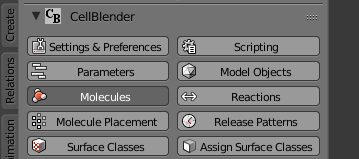
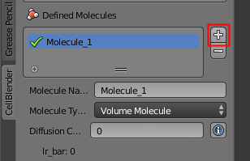
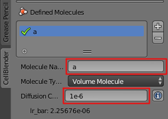
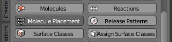
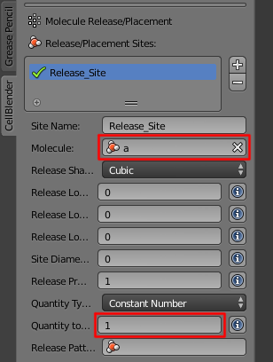
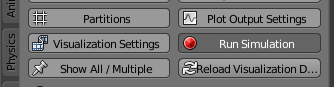
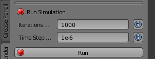
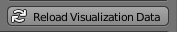
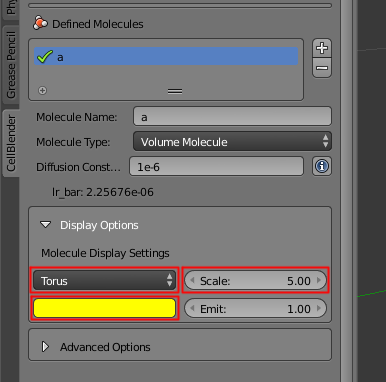
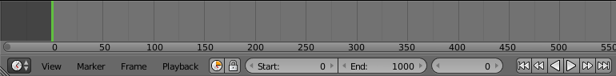

.. _single_molecule_diffusion: 

*********************************************************
Single Molecule Diffusion
*********************************************************

Required software
=================

This tutorial is designed to be used with the CellBlender 1.1 bundle (linux_,
windows_). If using OSX, please install CellBlender from scratch
(:ref:`cellblender_install`, *note: install Blender first*).

.. _linux: http://mcell.org/download/files/cellblender1.1_bundle_linux.zip
.. _osx: http://mcell.org/download/files/cellblender1.1_bundle_osx.zip
.. _windows: http://mcell.org/download/files/cellblender1.1_bundle_windows.zip

.. note:: Other versions may work as well.

Tutorial Overview
=================

This tutorial will define a single molecule and show its diffusion.

Initial Configuration
=====================

Install the CellBlender 1.1 bundle if you haven't already done so.

Save the File with a New Name in Your Working Directory
---------------------------------------------------------------

* Start Blender
* Select all objects (press the **a** key until all objects are orange)
* Delete all objects (press the **x** key and click the "**Delete**" pop up button)
* Select **File** > **Save As...**
* Change **untitled.blend** to **single_molecule.blend**
* Click **Save As Blender File** button

Define a Molecule "species"
-----------------------------------

* Click the **Molecules** button

* Click the "plus" sign (**+**) to the right of the **Defined Molecules** box

* Click in the **Name** field, type the letter **a** and press the Enter key
* The new molecule **a** should have a green check mark in the **Defined Molecules** box
* Click in the **Diffusion Constant** box, type **1e-6** and press the Enter key

Release a Single Molecule into the Simulation
-----------------------------------------------------

* Click the **Molecule Placement** button

* Click the "plus" sign (**+**) to the right of the **Release/Placement Sites** box
* Click in the **Molecule** field and select the **a** molecules
* Click in the **Quantity to Release** field and set it to **1**

Simulate the Model
--------------------------

* Click the **Run Simulation** button

* Click the **Export & Run** button

* A green check mark will appear in the list of **MCell Processes** when the
  simulation is complete
* Press the **Reload Visualization Data** button to load the results of the
  simulation

* Zoom in (mouse scroll wheel) to see molecule(s) at the origin
Change Settings to See Results
--------------------------------------

* Hide the "Manipulator" near the bottom middle of the screen

.. image:: ./images/single_molecule/manipulater_location.png

.. image:: ./images/single_molecule/hide_manipulator.png

* Click the **Molecules** button

* Open the **Display Options** subpanel
* Change the **Sphere_1** to **Torus**
* Change the **Scale** to **5**
* Change the color to a bright yellow

.. note:: You'll notice that there are actually two torus objects. One of them
   should be moving as the simulation is played, and the other should be
   stationary at the origin.  The torus at the origin is really a "template"
   molecule used by Blender. There will always be a template molecule at the
   origin for every molecule species you define.

Use the Time Line
-------------------------

* Press the "Play" (|play|) button below the time line
* Use the mouse scroll wheel to zoom in or out until you can see the moving torus

.. image:: ./images/single_molecule/single_diffusing_molec.png

* Stop the simulation by clicking the "Pause" (|pause|) button below the time
  line
* Click at various locations on the time line to see the molecule state at that
  time
* Click and drag in the time line to "scrub" the simulation through time

.. |pause| image:: ./images/single_molecule/pause.png
.. |play| image:: ./images/single_molecule/play.png

Save Your File
-------------------------

* **File** > **Save**
