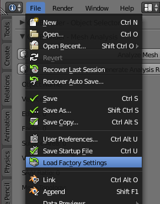
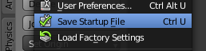
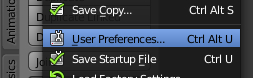
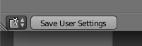

.. _clean_slate: 

************************
Start with a Clean Slate
************************

This procedure will reset Blender to its default state, delete all objects, and
install and initialize CellBlender. It will also save this "Clean Slate"
configuration to the startup file. You can perform this procedure whenever you
would like to start from a "Clean Slate".

.. note::

    Once these steps are completed, they will initialize the "startup" file so
    that creating a new file (File>New) will start with this configuration.

Restore Blender Defaults
--------------------------------

.. note::

    If this is your first time running Blender, you can skip to
    :ref:`install_init_cellblender`

* Start Blender
* Select **File** > **Load Factory Settings**

* Confirm **Load Factory Settings**

* **File** > **Save Startup File**

* Confirm **Save Startup File**

* **File** > **User Preferences...**

* **Save User Settings** at bottom of window

* Close **Blender User Preferences** window

.. _install_init_cellblender:

Install and Initialize CellBlender
------------------------------------------

Follow the :ref:`cellblender_install` instructions and then return here.

.. _delete_all_clean_slate:

Delete All Objects to Start Clean
-----------------------------------------

* Hover mouse over **3D View** window
* Pressing the **a** key will toggle the selection of all objects
* Hit **a** until all the objects are selected (highlighted in orange)
* Press **x** key to delete and confirm by clicking **Delete** in popup window

.. image:: ./images/clean_slate/delete_all.png

.. _set_mcell_path:

Set the Path to the MCell Executable File
-------------------------------------------------

* Click the **Preferences** button in the upper left corner
* Click the **Set Path to MCell Binary** button
* Use the file navigator to find your MCell executable (binary) file
* Select the MCell executable and click **Set MCell Binary** button in upper right
* Click the **Preferences** button in the upper left corner again to close the
  panel

Save the Startup File
-------------------------------------------------

* **File** > **Save Startup File**
* Confirm **Save Startup File**
