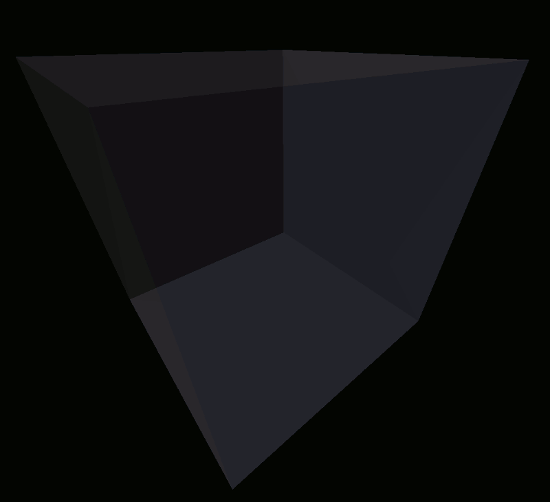
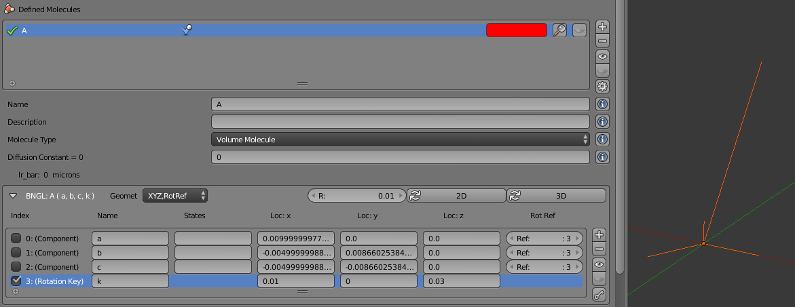
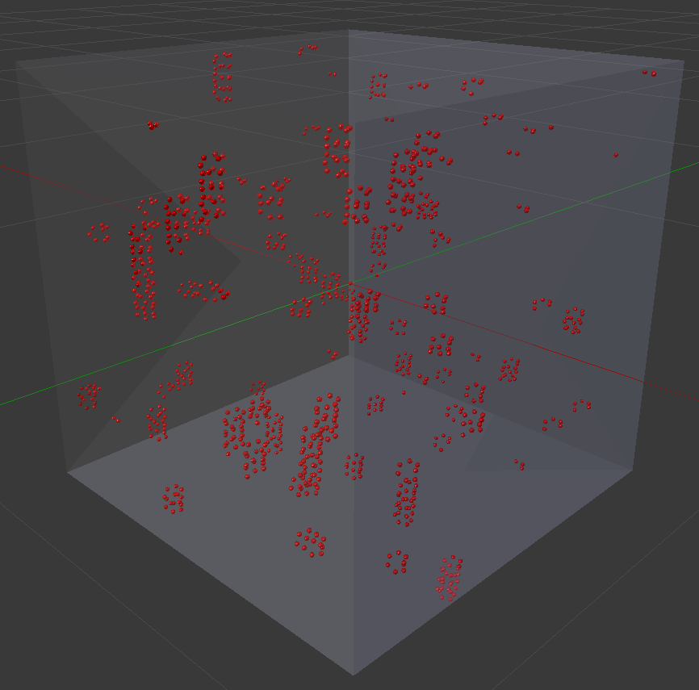

.. _intro:

*********************************************
Spatially Structured Tutorial (Simulation)
*********************************************

.. Git Repo SHA1 ID: 3520f8694d61c81424ff15ff9e7a432e42f0623f

.. warning::

   The spatially structured molecule interface is relatively new and subject to change.

This tutorial will walk you through the steps of setting up a simulation
using spatially structured molecules to be run with MCellR. This tutorial
assumes that you're fairly familiar with Blender and CellBlender. It will
use brief instructions based on that assumption.

This model will define a single molecule with components arranged such
that the molecules will assemble into the shape of a coil. These will
be the same molecules used in the earlier tutorial as shown here:

.. image:: ./images/AAAAA_2.png

Start with Blender open. Enable CellBlender and Initialize CellBlender.
Start a new project and save it to a ".blend" file. Then remove all
objects from the scene.

Open the CellBlender "Settings & Preferences" panel, and enable the
"BioNetGen Language Mode" option. The BioNetGen mode allows molecules
to have components which are the binding points for building spatially
structured complexes.

Then open the CellBlender "Molecules" panel and add a molecule named "A".
Be sure to give it a non-zero diffusion constant. For this simulation, a
value of 1e-5 works well. Then open the BNGL subpanel within the Molecules
panel. Ensure that the panel is wide enough to see the Geometry drop down
options. Then select the "XYZ,RotRef" Geometry option to begin building
3D Molecules.

Add a total of 4 components ("+" button), and name them "a", "b", "c", and "k"
(in that specific order). We will be binding the "a" and "c" components to
form the spiral. We'll leave the "b" component unbound, and the "k" component
will be the rotation key. Check the far left check box on the "k" component
to turn it into a key. Set the location of the rotation key to be "Loc:x=0.01"
and "Loc:z=0.03". Then click the "3D" button to have CellBlender arrange the
remaining 3 components as corners of an equilateral triangle in the x-y plane.
Finally, click the "key" button to automatically assign the key index (3) to
all the other components. You can visually preview the geometry with the "eye"
button. The final panel and structure should look like this (this may require
zooming in, temporarily hiding the molecules, and viewing in orthographic mode):

At this point, you might use the "Molecule Structure Tool" to build some
trial complexes as in the previous tutorial, but this tutorial will
focus on designing an MCellR model that will build these molecules
automatically during the simulation. That will require the definition
of reactions to bind the "A" molecules into complexes.

When you're done working with the Molecule Structure Tool, be sure to
show (unhide) the "A" molecules with the "eye" visibility button if you
had hidden them. It can be frustrating to run a model and not see any
molecules because they had been hidden earlier.

Open the "Reactions" panel and define a new reaction with the "+" button.
Set the "Reactants" field to:

    A(a)+A(c)

This specifies that two "A" molecules with unbound "a" and "c" components
can react. Set the "Products" field to:

    A(a!1).A(c!1)

This defines a complex of two "A" molecules bound at their "a" and "c"
components respectively. Set the reaction rate ("Forward Rate") to "1e9"
to build the complexes fairly rapidly.

We will put the molecules in a confined region so they will continue
to interact throughout the simulation. Open the "Model Objects" panel,
and center the 3D cursor (click the second button from the left). Then click
the "Cube" button to add a cube object at the cursor location (you may need
to zoom back out to see the entire cube). The default cube should be named
"Cube" and it will be 2x2x2. For this simulation, we'll use a unit cube so
scale it by a factor of 0.5 (3D view: "s", "0.5", "Enter").
Then add it to the simulation with the "+" button, set its "Membrane Name"
to "M", and set its view options to be non-opaque (use either 
"Maximum draw type" of "Bounds" or define a partially transparent material).

MCell has generally defaulted to all objects being "reflective" of all
molecules. However, MCellR currently requires defining an explicit surface
class to reflect molecules from surfaces. Open the "Surface Classes" panel,
and add a new class (with the "+" button) and name it "reflect". Add a new
property (with the other "+" button) and define it to apply to "All Molecules",
to "Ignore" orientation, and to be of type "Reflective". Then open the 
"Assign Surface Classes" panel and assign the Surface Class name of "reflect"
to all surfaces of the object named "Cube" (the default name of the cube we
added earlier).

Similarly, MCell generally does not require any observables to run, but
the current version of MCellR will fail without observables defined. So
open the "Plot Output Settings" panel and define a new output item with
the "+" button. Click the "MDLString" option and fill in the following fields:

  MDL String: COUNT[A(a,b,c), WORLD]

  MDL File Prefix: Mol

The last step will be the placement of some initial molecules into the
simulation. Open the "Molecule Placement" panel and add a new Release Site
with the "+" button. Set the "Molecule" field to:

  A(a,b,c)@Cube

Set the "Release Shape" to:

  Object/Region

Set the "Object/Region" field to:

  Cube[ALL]

Set the "Quantity to Release" field to:

  1000

Now the simulation is ready to run. Open the "Run Simulation" panel and the
number of iterations to 5000, and be sure to save the project file to a location
where the simulation will run. Then  click the "Export & Run" button.

As the simulation runs, you can click the "Reload Visualization Data" button
to load more data. You'll notice the time line growing each time you reload
as MCell generates more frames of the simulation. You can scroll through the
frames that have been completed while MCell runs. Eventually when MCell
completes, you should be able to play the simulation and watch the spatially
structured molecules be assembled by MCell.

