.. _intro:

*********************************************
Spatially Structured Tutorial
*********************************************

.. Git Repo SHA1 ID: 3520f8694d61c81424ff15ff9e7a432e42f0623f

.. warning::

   The spatially structured molecule interface is relatively new and subject to change.

Spatially Structured Molecule Overview
---------------------------------------------

Spatially Structured Molecules can be:

    * Defined in CellBlender
    * Combined as examples in CellBlender
    * Exported for use by various versions of MCell

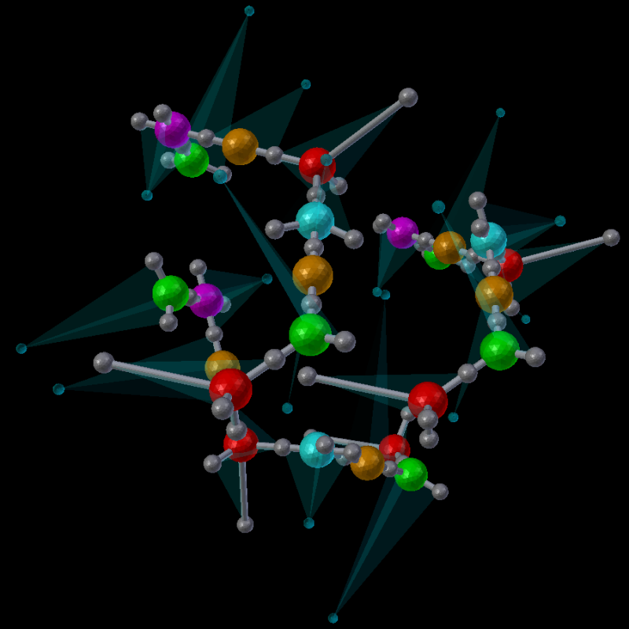

Molecules and Components
---------------------------------------------

Using CellBlender's Spatially Structured Molecules, the geometry within
a molecule is specified relative to the molecule's "center". The "center"
is an arbitrary location within a simple molecule and has traditionally
been represented with a "glyph" of some sort:

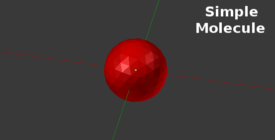

With Spatially Structured Molecules, this "center" is augmented with a
number of component locations that act as binding sites for other molecules:

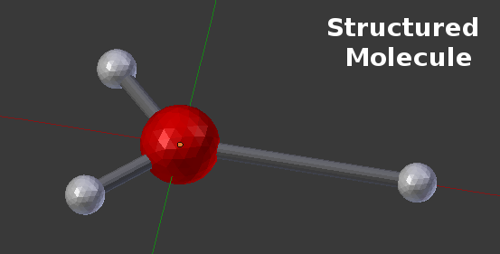

This example shows a "center" molecule surrounded by 3 different
"components" (also known as binding sites). This particular Molecule was
defined in CellBlender with the "Molecule Structure" panel as shown here:

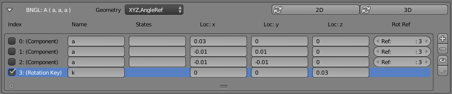

As you can see from the panel, this molecule contains three items listed as
"Components" and one item listed as a "Rotation Key". The 3 components (all
named "a") are the standard BNGL components and they are given spatial positions
in the table ("Loc:x", "Loc:y", "Loc:z"). You'll notice that the first component
in the list shows a "Loc:x" value of 0.03 compared to -0.01 for the other "Loc:x"
values. That's the component (smaller white sphere) to the far right in the picture.
Similarly, the other two components (indexes 1 and 2) show negative x values and y
values of opposite sign. Those are the two components (white spheres) to the left
in the picture. The last component (Index=3, Name="k") isn't shown in this simple
picture, and it's not a true "binding component". It's used as a reference "key"
for the rotation axes of other binding components. This is shown more clearly in
this picture:

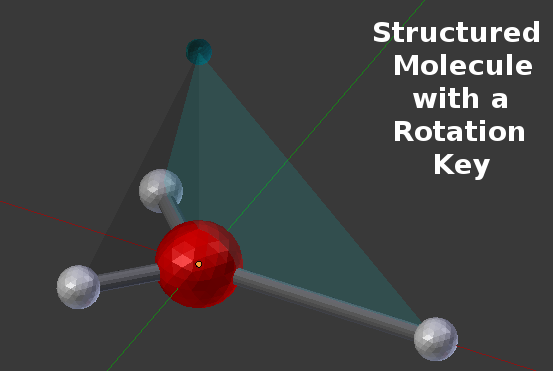

This picture shows the 4th item (a "Rotation Key") along with the three Rotation Alignment
Planes that it creates with each binding component. You'll notice that the "Rot Ref" column
of the previous table shows a "Ref: 3" for the first three items. That means that they are
each using the "Rotation Key" at index 3 to define their rotational orientation with respect
to any binding molecules. That rotation key is at a coordinate location of (0,0,0.03) which
places it directly above the origin along the Z axis. This is a particularly convenient rotation
key to use for molecules that are laid out in the X-Y plane (as in this example).

Binding of Molecules via Components
---------------------------------------------

The following picture shows one example of how two of these molecules might be joined to form
the BNGL product of A(a!1).A(a!1):

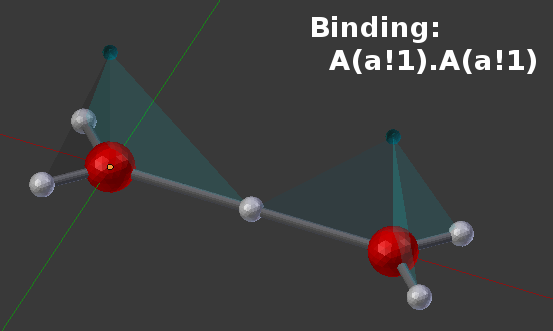

Note that because all of the components are named "a", there are a number of physical
configurations that might represent that same BNGL product:

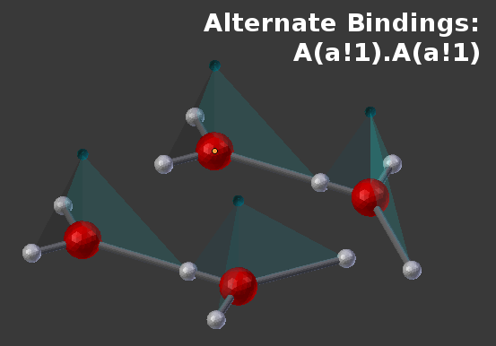

In cases like this (where different components have different physical locations), it may
be desirable to give those components different names so they can be used differently in the
rules that define the products.

Binding Angles and Rotation Reference Keys
---------------------------------------------

While every component that is intended for binding should have a reference plane, the following
picture shows the earlier A(a!1).A(a!1) complex with only the bound reference planes showing:

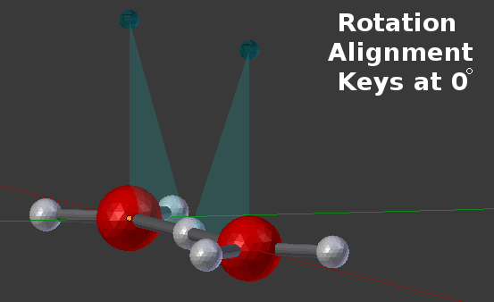

In that example, the two reference planes are lined up at 0 degrees of rotation. However,
bonds can also be made at arbitrary angles between the reference planes as shown in this
example where the bonding is specified to be at a 45 degree angle:

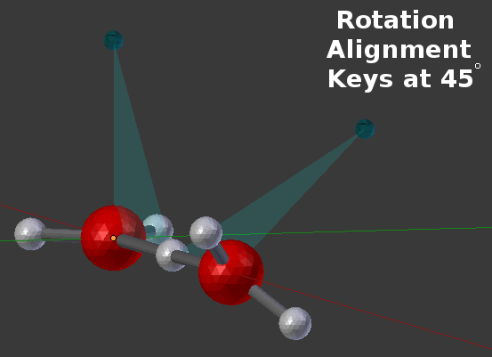

Reference keys (as shown above) can be very handy and are sometimes the simplest
way to show how Rotation Alignment Planes can be defined. But many times, there's
no need to specify a special "rotation angle key" because one or more of the other
components can easily fill that role. In that case, each component can simply
reference another existing component to use as its rotation reference key. That's
shown in the following CellBlender panel where the "Rot Ref" column specifies other
existing BNGL components:

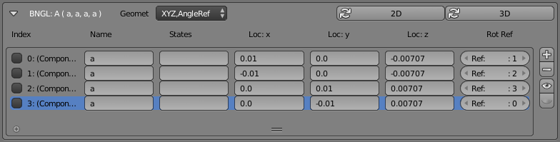

This panel still shows 4 items, but all 4 are real components. In this case, all of the
components have been arranged as the vertices of a tetrahedron, and each component simply
references another component as its binding key. Here's an example built from two of those
"A" molecules:

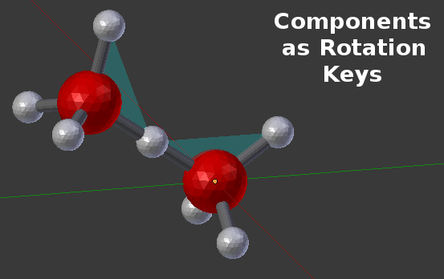

Other Features
---------------------------------------------

CellBlender's Molecule tools contain a number of helpful features for defining spatially
structured molecules. For example, there are tools to automatically place components in
either a 2D or 3D distribution around a molecule:

.. image:: ./images/Automated_2D_3D.png

There are other tools to quickly visualize the locations of components on either single
molecules or bonded molecules in a complex. The following CellBlender Molecule subpanel
was used to construct all of the examples in this tutorial:

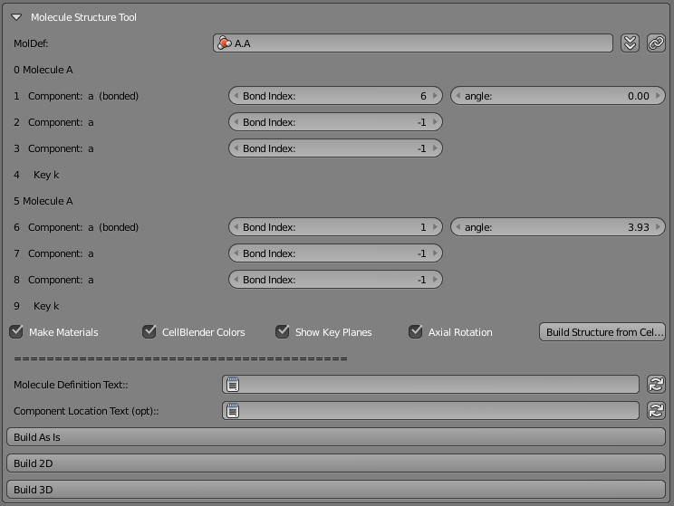

Conclusion
---------------------------------------------

CellBlender's Spatially Structured Molecule tools support flexible spatial structuring
of complex molecules defined through the BioNetGen Language (BNGL) syntax.
