.. _intro:

*********************************************
Spatially Structured Tutorial
*********************************************

.. Git Repo SHA1 ID: 3520f8694d61c81424ff15ff9e7a432e42f0623f

.. warning::

   The spatially structured molecule interface is relatively new and subject to change.

Spatially Structured Molecule Tutorial
---------------------------------------------

This tutorial will walk you through the steps of creating spatially
structured molecules and binding them together to form spatially
structured complexes. This tutorial assumes that you're fairly
familiar with Blender and CellBlender. It will use fairly brief
instructions based on that assumption.

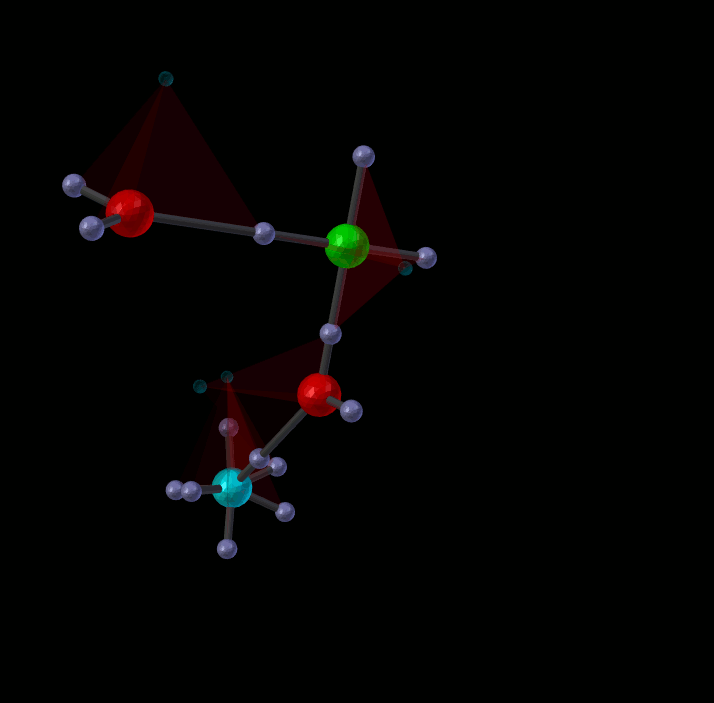

Start with Blender open. Enable CellBlender and Initialize CellBlender.
Start a new project and save it to a ".blend" file. Then remove all
objects from the scene.

Open the CellBlender "Settings & Preferences" panel, and enable the
"BioNetGen Language Mode" option. The BioNetGen mode allows molecules
to have components which are the binding points for building spatially
structured complexes.

Then open the CellBlender "Molecules" panel and add a molecule named "A".
Then open the BNGL subpanel within the Molecules panel. Ensure that the
panel is wide enough to see the Geometry drop down options. Then select
the "XYZ,AngleRef" Geometry option to begin building 3D Molecules.

We will start with a few single molecules with components and then work
our way up to some interesting complexes.

Start by clicking the "+" button 4 times to add 4 components. The new components
will each typically have default names like "C#". These will be fine for now.
Each component will also have an index number associated with it (in the "Index"
column on the far left). In this tutorial, we will generally refer to each
component using this index number.

Click the checkbox to the left of the last component (index number 3). This
will change its type from being a "Component" to being a "Rotation Key". We
will want each of our other 3 components to use this as its rotation key, so enter
the number "3" in the "Rot Ref" column for each of the other components (the
column to the far right).

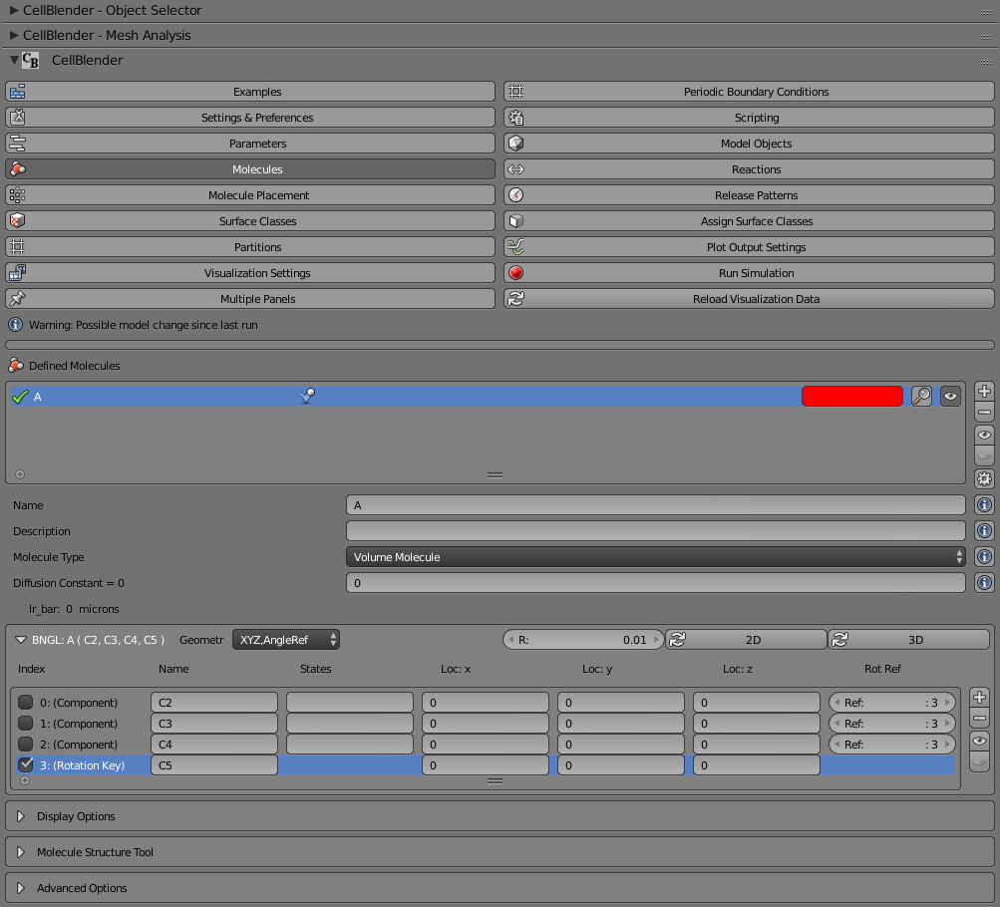

At this point, we have an "A" molecule with 3 components and 1 rotation reference
key. This molecule could be used in a simulation, but all of its components are
still at the coordinate (0,0,0) with respect to the molecule itself. If we knew
the actual coordinates of these components, we could enter them in the "Loc"
columns for x, y, and z. We could also start with some pre-defined locations
using some of the built in tools.

For this example, let's start by clicking the "2D" button. This will arrange
our components equally around a radius "R" (specified just to the left of the
"2D" button). you'll notice that numbers are placed in both the x and y columns,
but not in the z column. That's appropriate for a 2D molecule. Note that it did
not make any changes to the Rotation Key (component 3). You'll have to set that
yourself. For a 2D molecule, the z axis makes an ideal rotation reference key,
so enter the number "0.03" in the "Loc: z" column of the last component.

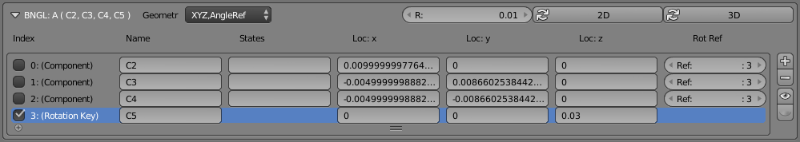

To get a quick view of this arrangement, start by hiding all of your regular
CellBlender molecules. Use the "grayed eye" button to the right of the molecule
definition area (NOT the component definition area). Once all the molecules
are hidden, click the "eye" button to the right of the component definitions.
Then zoom in to see the 4 "sticks" that show the layout of these components
at Blender's origin. It's helpful to hide the manipulator and move the 3D
cursor to see it better.

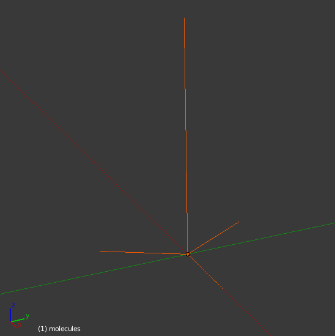

You should see 4 orange lines radiating out from the origin. Three of these
(in the x-y plane) are actual components. The fourth (vertical) line is the
rotation reference key that we defined along the z axis. Now we can start
experimenting.

Click the "+" button in the component section again to add another component.
It will appear below the rotation key, and will have its "Rot Ref" column set
to the default of -1. Change that rotation reference to "3" just like the other
actual components. Again click the "2D" button to assign location to all of the
components, and again click the "eye" button in the components subpanel to show
the new arrangement. It should show four "stick" lines in the x-y plane and one
rotation reference "stick" along the "z" axis.

Now click the "3D" button to assign 3D locations to the components. You will
see non-zero values in every row of the "Loc: z" column. Click the "eye" button
to see the arrangement. You should see the points arranged to form a tetrahedron
(2 in the x-z plane and 2 in the y-z plane). You'll also see the vertical rotation
reference along the "z" axis.

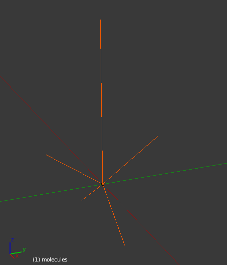

Add another component with the "+" button, and again set its "Rot Ref" column to
"3" to use our existing rotation reference. Click the "3D" button, and click the
"eye" to see the new distribution. In this case, there will be 3 sticks arranged
in the x-y plane, and one in the negative "z" axis, and one in the positive "z"
axis. You won't see the positive "z" component because it's hidden by the reference.
To prove that it's really there (and provide a nice spiral effect later), change the
"Loc x" value of the Rotation Key (item 3) to be 0.01. That will move it slightly
off the "z" axis. Then click the "eye" to show the new configuration.

.. image:: ./images/Stick_View_3.png

Let's add 5 more components (click the "+" button 5 times). Change each of the new
"Rot Ref" fields to "3" as we did with the other components. Click the "3D" button
to assign them values, and then click the "eye" button to see the result. You should
see 10 component lines and one rotation reference line.

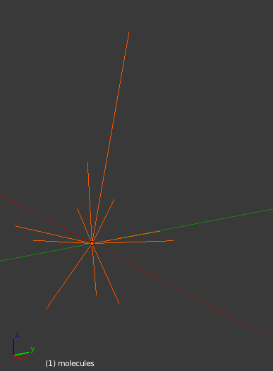

You can change the radius of
these component locations with the "R" field at the top of the box. It's normally
defaulted to 0.01, but you can change it and click the "3D" button to assign the
new values, and then click the "eye" button to see the result. Change it back to
0.01 when you're done. Also hide the "sticks" with the "grayed eye" button.

So far, we've just been using the "quick preview" feature of the molecule panel.
To see a more proper 3D version of our molecule, open the "Molecule Structure Tool"
panel. The top row will show an empty "MolDef" field. That's where you can type in
a single molecule name or a complex. Start with just the molecule name of "A". Then
click the "down arrow chevrons" to the right. That will fill out the panel with
entries for each component available in your complex. Since this is just a single
molecule, you'll see "Molecule A" in entry "0" followed by all of its components
and keys.

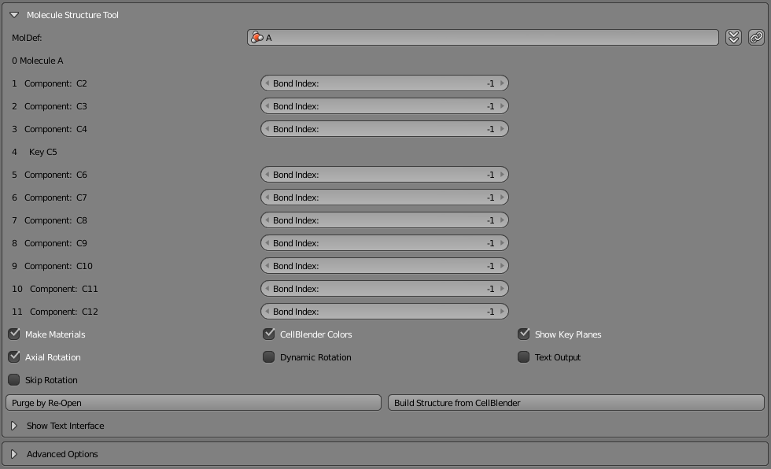

We'll discuss this panel further when we begin to build complexes. For now, just
click the "Build Structure from CellBlender" button at the lower right of the panel.
You should see a nice rendering of your 10-component molecule along with the rotation
key and semi-transparent rotation key planes between each component and its rotation
key. Zoom in and look around to get an understanding of what's there.

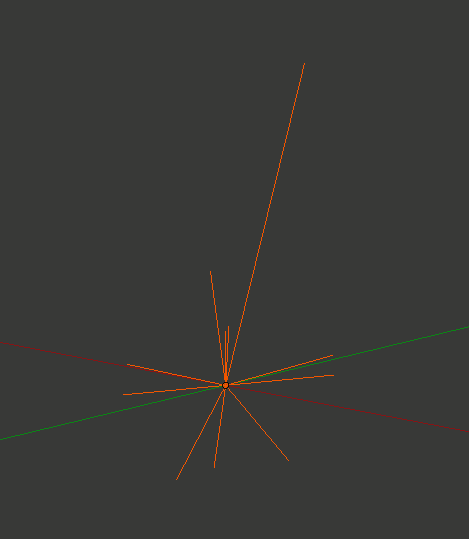

At this time, the Molecule Structure tool generally doesn't delete what it makes
(except in "Dynamic Rotation" mode). This allows you to drag your creations off to
the side or hide them and make others. For this tutorial, we're generally going to
delete everything after we've made it, so go ahead and use your favorite method
to delete everything from the scene (the "a" and "x" keys are a good choice).

Now go back to the "MolDef" entry and replace the single "A" with "A.A". As before,
click the "down chevrons" to fill the panel with the components of this new complex.
If you click the "Build Structure from CellBlender" button, you'll still only see a
single molecule. But in reality, there will be two molecules there on top of one
another (if you're familiar with Blender, you can go into edit mode and start
disassembling it to convince yourself that there are two of everything in that mesh).
To get the molecules to form a structure, we'll have to create bonds between some
of the components.

Start by deleting everything from the scene. Then go to the Molecule Structure Tool
and click the "chain" button at the right of the top row. 

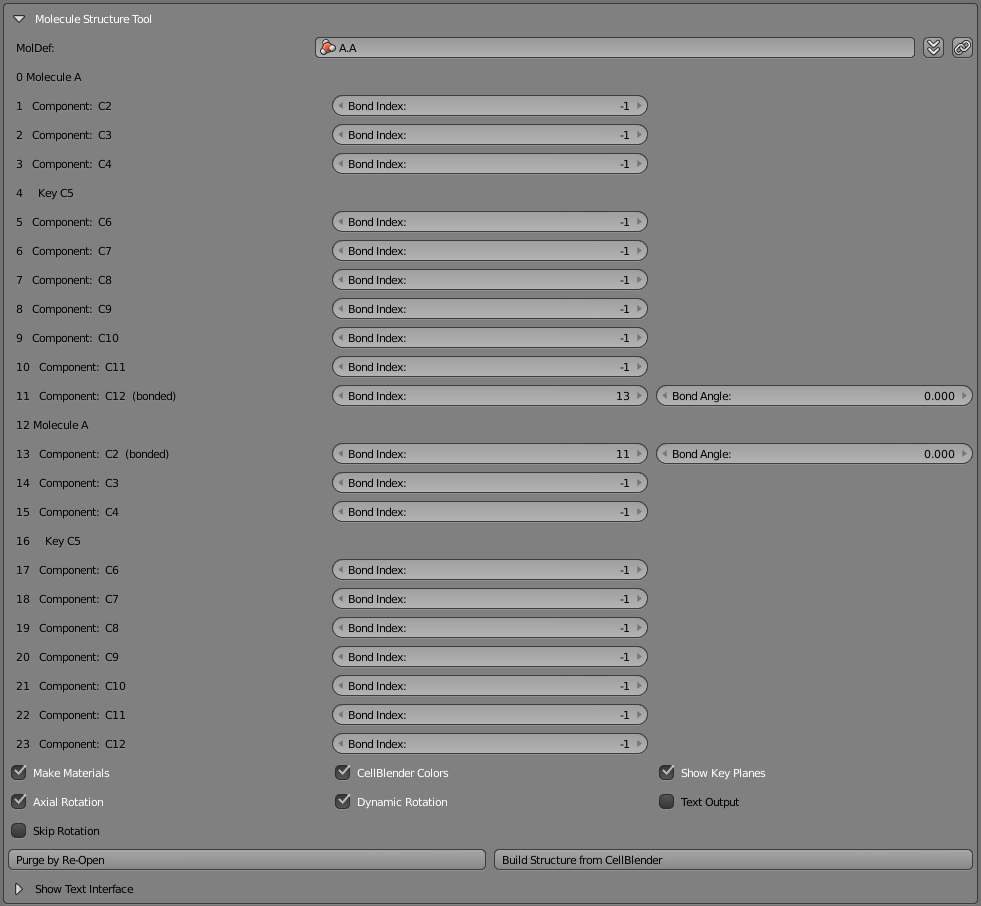

You'll notice that two
"Bond Angle" entries show up attached to the last component of the first molecule
and the first component of the second molecule. You'll also notice that the "Bond
Index" values for those two components reference each other while all the other
"Bond Index" values are -1. That's how this tool knows that two components are
connected. They reference each other. Now click the "Build Structure from CellBlender"
button and you should see two of these new molecules bonded together. If your "A"
molecule has 10 components, you'll find that component index 11 is connected to
component index 13 and component index 13 is connected to componenent index 11.
Both of these will show a Bond Angle of 0.

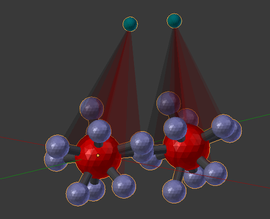

Let's rotate the second molecule with respect to the first. If you somewhat line up
the two molecules in Blender's 3D view, you'll notice that their rotation references
will also line up (small blue-green spheres). Click the "Dynamic Rotation" check box,
and then change the first "Bond Angle" to 0.3.

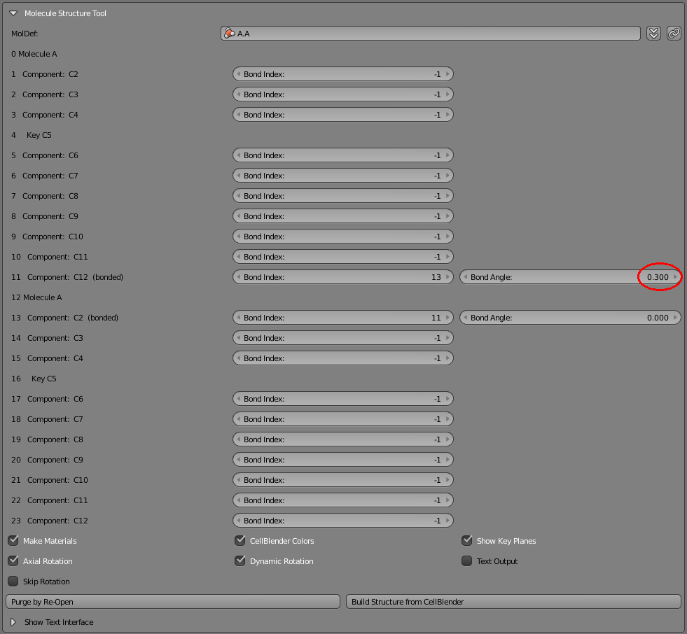

You should notice that the second
molecule you added is rotated 0.3 radians. Now try 3.14, and the second molecule will
be rotated 180 degrees from the first. You can also click and drag within that same
"Bond Angle" entry field to dynamically rotate the second molecule by holding down
your mouse button and sliding to the left and right.

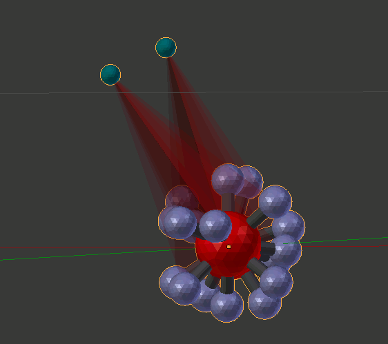

Note that after a short while, the animation might begin to slow down. This is an
unresolved problem caused by accumulating lots of copies that are not automatically
purged. If the animation slows down too much, just click the "Purge by Re-Open" button
in the lower left of the panel. That will speed it up until you again accumulate too
many frames of data with lots of dragging.

Now we can begin to make larger complexes. Delete everything in the scene, turn off
the "Dynamic Rotation", and then enter "A.A.A.A.A" (5 A's) into the MolDef field.
Click the "down chevron" to fill out the panel, and then click the "chain" to bond
them all end-to-end. Build the actual complex with the "Build Structure from CellBlender"
button as before. You should see 5 molecules all strung together. It just so happens
that the first and last component of each of these molecules is about 180 degrees apart
from each other, so the binding sites tends to create a long slightly curved chain.

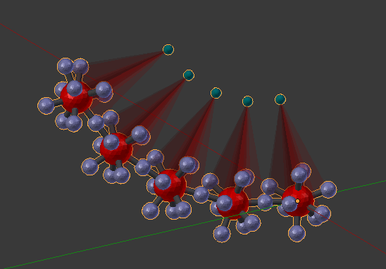

We can edit the structure of this complex by breaking and creating bonds. But this
model is a bit too complex for a first model. So let's start over with a set of
simpler molecules. Delete everything in the scene, and go back to the original
"Defined Molecules" panel. Let's peel off some of those compoents from the "A"
molecule by clicking the "-" button when the last component is highlighted. Remove
all components except 0,1,2,3. Then click the "3D" button to recalculate coordinates
for the components. Go back down to the Molecule Structure Tool and repopulate the
panel with the "chevron" button, and chain them all together with the "chain" button.
Click the "Build Structure from CellBlender" button again, and you'll find that you've
got 5 molecules in part of a spiral screw shape.

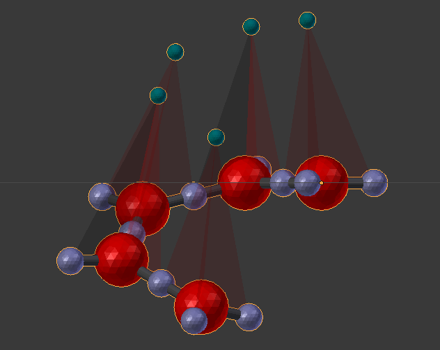

The circular aspect of this shape obviously comes from the 120 degree angles between
the components in each of these simpler molecules. The spiral "screw" shape comes from
the slight tilt (x=0.01) that we gave to our Rotation Reference Key when we defined the
"A" molecule. If we had placed that Rotation Reference Key on the "z" axis, then the
partial ring of molecules would be flat.

Let's add 3 more "A" molecules to our complex with "A.A.A.A.A.A.A.A" for a total of 8.
Remember to delete the current molecule(s) from the 3D view and then repeat the process
of clicking the "chevron" to fill out the panel, the "chain" to bind them together, and
finally, the "Build Structure from CellBlender" to build the actual complex. As expected,
you should see a similar spiral with just a few more parts.

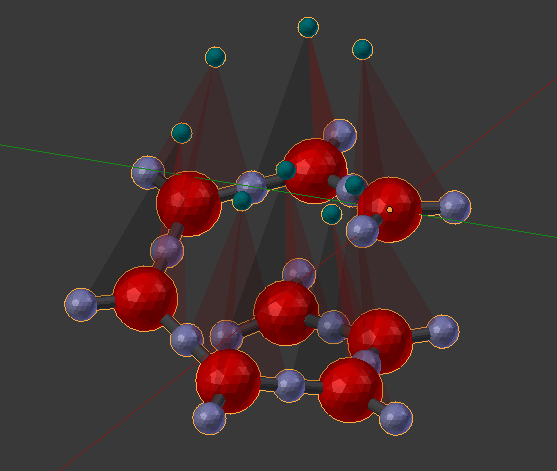

If you continued to add "A" molecules, the structure could grow indefinitely. Here's an
example with 32 "A" molecules (don't do this now):

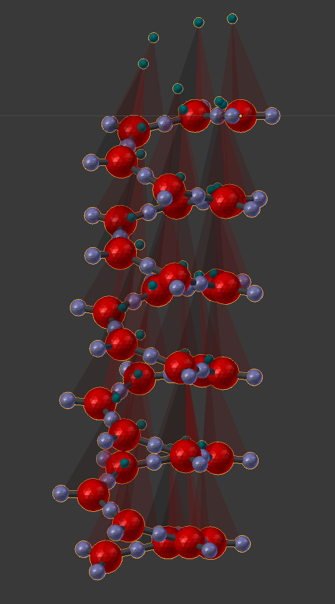

Now we're going to disconnect part of our 8 molecule chain and re-attach it at a different
location. Let's start by breaking the molecule in the middle. The two halves are joined by
the bonds at 18 and 21 which reference each other. Here's what they look like before breaking:

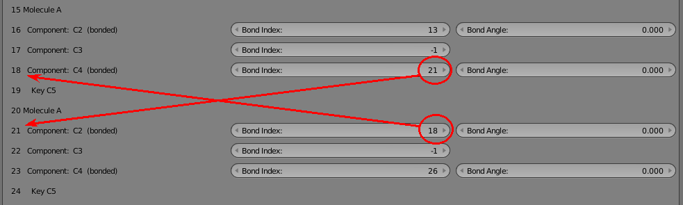

Change them both to -1 to indicate that they are
not bound. You'll notice that a component with a broken bond shows up as red. This is very
helpful when trying to reconfigure bonds in this tool.

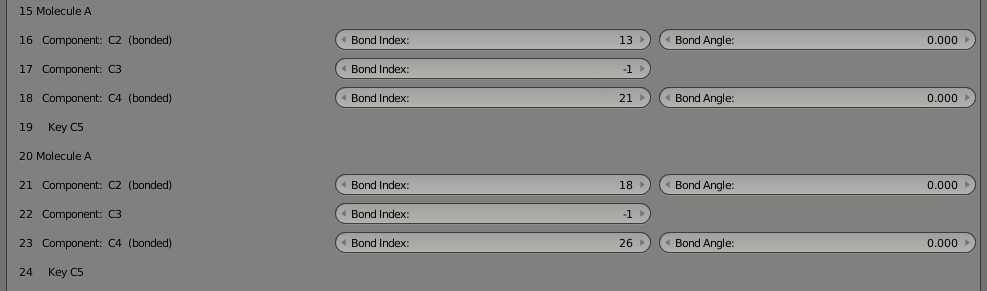

With the bonds broken, you can directly click the "Build Structure from CellBlender" button
to show the two parts. Be sure NOT to click the chevron or the chain because that will either
break all the bonds or reconnect the full chain. You'll notice that the two parts only show
up as one. As before, if you disassemble this molecule in Blender's "Edit Mode" you'll find
that there are duplicates of everything because both parts are positioned on top of each
other.

To rejoin the two parts, we need to decide which unbound components can be used to rebind
the complex. We could pick any unbound components, but let's choose 12 and 27 since they're
more toward the middle of our 4 molecule segments. So put "12" into the "Bond Index" field
for 27, and put "27" in the "Bond Index" field for 12. You'll notice the red warning letting
you know the bond isn't completed. It should go away when the bond is correct.

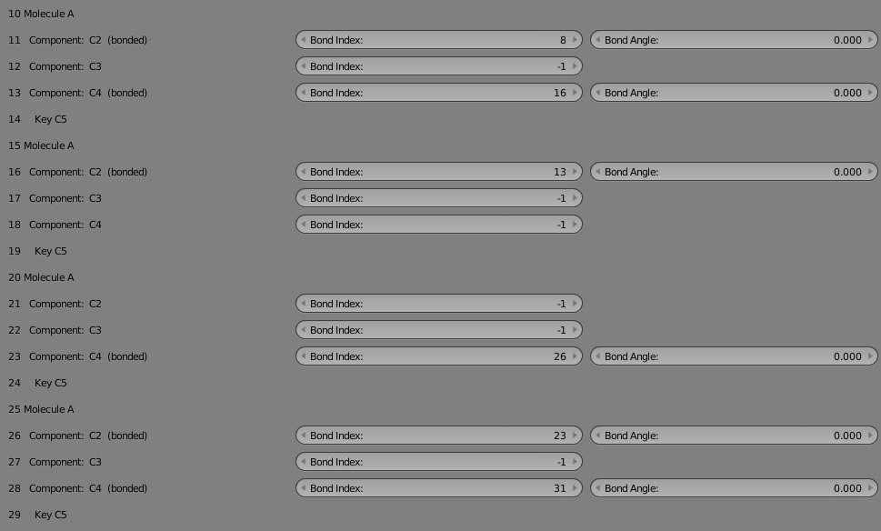

As usual, delete the molecule in the 3D view and then click "Build Structure from CellBlender"
to see the result. Take some time to look at the complex. Notice how the two parts are now
joined.

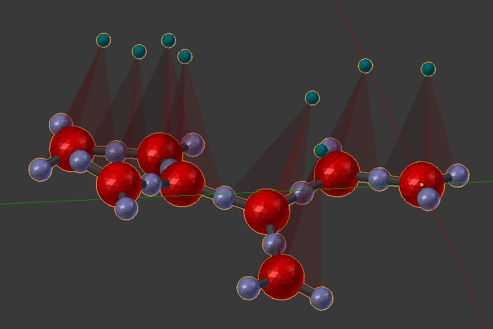

Also notice the Rotation Key Planes at the joint. You should see that the two planes
are aligned with each other (a rotation angle of 0). Enable "Dynamic Rotation" with the check
box, and begin to rotate the angle on component 27. Rotate it to a value of about 2.0 which
will make the two sections somewhat perpendicular to each other.

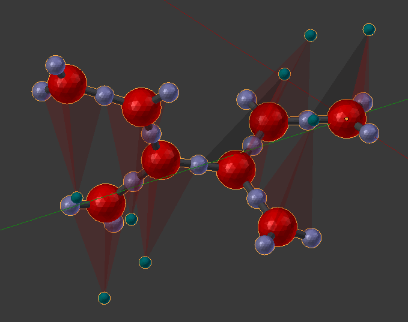

When you're done, disable
the "Dynamic Rotation" check box, and click the "Purge by Re-Open" button to remove any stale
data. At this point, the Rotation Angle "Key" planes are just in the way, so disable that
check box ("Show Key Planes") as well. Then delete the object and build it again with the
same "Build" button we've been using ("Build Structure from CellBlender"). You should see
a nice clean version of your complex without the alignment planes in the way.

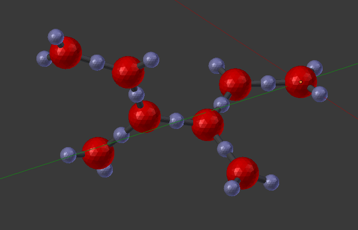

There are a number of other tools available in this panel. One easy one to try is disabling
the 3D rotation. For this example, don't delete the previous complex. Instead, click on it
and drag it away from the center up the "z" axis. This is easily done with the "g" hot key
followed by the "z" hot key. That will constrain your mouse to drag it only along the "z"
axis. Drag it up about as high as it is wide. Then click the "Axial Rotation" check box to
turn it off. Then build the molecule again ("Build Structure from CellBlender"). This will
build the same molecule, but without axial rotation, all of the bonds will be flat. That's
a side effect of the fact that our 3 component molecules are already flat (in a plane). With
planar molecules and no axial rotations, the result will also be in a plane.

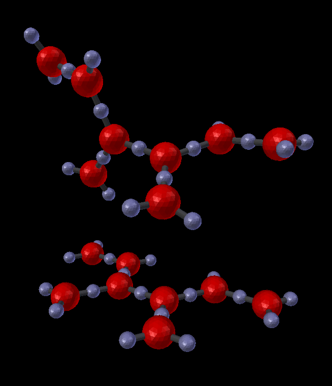

Another handy option is the "Average Coincident" switch. The current binding model specifies
that when two components bind, they occupy the same point in space. In other words, component
locations are the joining points for molecules. This model works naturally when there are no
loops, and all molecules and components end up wherever their geometry dictates. However, when
there are loops, there is normally no guarantee that the closing points of a loop are actually
coincident in space. For example, if a molecule were designed as a square (four molecules each
binding to each other with components at 90 degrees), then the geometry would dictate that
the closing points would be coincident. But if the angles were specified (incorrectly) as 91
degrees rather than 90, then the "closing" components would not actually join. This could be
considered as either a fundamental error in the model or as a minor round off error. While that
decision is up to the designer, the current tool does provide a simple method to "fix" any such
"round off" errors using the "Average Coincident" option. The "Average Coincident" option performs
one final step after building the molecule. It sets the location of each partner of a binding pair
to be the average location of the two binding partners. For small rounding errors, this simply
brings the points into exact coincidence. However, for gross errors (such as forming an equilateral
triangle with right angles), it will drastically change the geometry. The decision to use
this feature (or not) is up to the model's designer. This effect can be seen in the following
image where the geometry was intentionally distorted to misalign the closing bond:

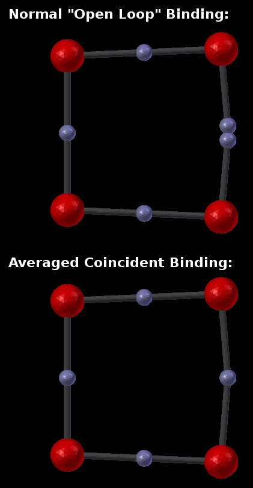

As seen in this example, the "Average Coincident" option forces the two components to be at
the same point in space. Note that this does not correct any other deficiencies of the model
(such as the misalignment across the bond). Note also that this is a purely spatial effect.
The actual binding of a molecule is specified in the structure of its BNGL definition. That
definition is inherently non-spatial. So even though the components may not "close" properly,
if the componets are bonded, then they will behave as such.

Conclusion
---------------------------------------------

This tutorial has covered the basics of creating spatially structured molecules and complexes
in CellBlender. Using these tools, almost any shape can be approximated. Note that we use the
word "approximated" because the molecules built in CellBlender are only intended to provide
approximate structure. But this approximate structure is useful for simulating many of the
spatial aspects of such molecules within stochastic simulators like MCell. It's also important
to note that while rudimentary complexes may be built by hand (as in this tutorial), the real
power behind spatially structured molecules arises from rule based simulations which can build
these emergent structures automatically.

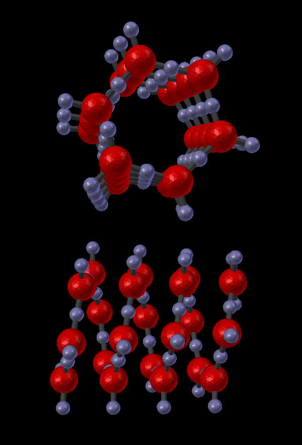

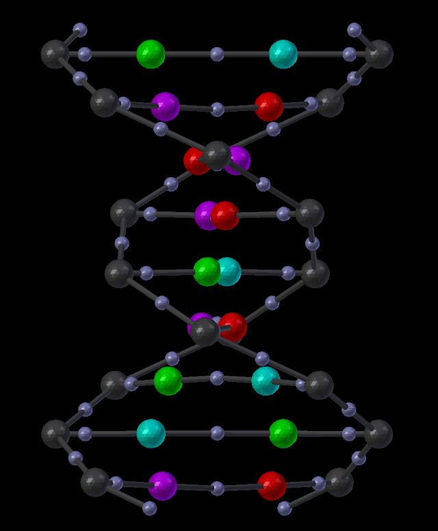

Appendix - Source code for Double Helix model
---------------------------------------------

The Double Helix model shown above was constructed from a Python script that modifies
CellBlender's internal properties directly. This is not generally a good practice, and
the preferred scripting method is to modify a CellBlender data model. However, at this
stage of development, the direct CellBlender method was easier and is presented here.

To use this code, open a blender "Text" window and create a new file. Name the file
"Double_Helix.py", and copy the following code into it. Be sure that all of the
requirements are satisfied (A,C,G,T,S molecules as specified in the comments), and
then click the "Run Script" button in the "Text" window. That should populate the
"Molecule Structure Tool" with all the values needed for this model. Then, in the
"Molecule Structure Tool" panel, click the "Build Structure from CellBlender" button.
It may take a few seconds to do all the calculations. Eventually, the double helix
molecule should appear in the 3D view window.

::

    # Double Helix Construction Script

    # This script works directly with CellBlender's internal data
    # structures to build a double helix molecule similar to DNA.
    # This script relies on the following CellBlender Definitions:
    #
    # Parameter "r" = 0.0225
    #
    # Molecules and Components:
    #
    #  Molecules "A", "C", "G", and "T" are all defined with:
    #    c0:  x=r  y=0 z=0       Ref=2
    #    c1:  x=-r y=0 z=0       Ref=2
    #    c2:  x=0  y=0 z=0.008   (Reference Key)
    #
    #  Molecule "S" is defined with:
    #    c0:  x=-0.02  y=0.0084 z=0       Ref=3
    #    c1:  x=0      y=0.01   z=0       Ref=3
    #    c2:  x=0.02   y=0.0084 z=0       Ref=3
    #    c3:  x=-0.001 y=0      z=0.008   (Reference Key)
    #
    # This script can be run with the "Run Script" button in the editor.
    # It will overwrite the values in the "Molecule Structure Tool".
    # After running this script, press the "Build Structure from CellBlender" button.
    #

    # The half strand of the sequence can be changed arbitrarily:
    half_strand = 'CATTGACGA'
    half_strand = 'AAAAATTTTTCCCCCGGGGG'

    # This angle is specified in radians
    end_cap_angle = 0.3

    # This is the number of segments between base pairs (use 1 for now)
    back_bone_segments_per_base_pair = 1

    # These are used to look up partners (don't normally change)
    nucleotide_partner = {'G':'C', 'C':'G', 'A':'T', 'T':'A'}

    import bpy

    # Import and assign the Blender and CellBlender data
    mcell = bpy.context.scene.mcell
    molmaker = mcell.molmaker
    molcomp_list = mcell.molmaker.molcomp_items

    # Create a "dotted" specification that includes both base pairs for the molecule definition
    molmaker.molecule_definition = '.'.join ( [ c + '.' + nucleotide_partner[c] + '.S.S' for c in half_strand ] )

    # Clear out the old molcomp_list
    while(len(molcomp_list) > 0):
        molcomp_list.remove(0)

    # Build the Double Helix base pairs from the half strand data
    cur_mol_index = 0

    # Start with just the first pair (treating it as the base)

    for i in range(1):
        print ( "Building first base pair for " + half_strand[0] )

        # Make a pair of Nucleotides
        for n in range(2):
            nucleotide_name = half_strand[i]
            if n > 0:
                nucleotide_name = nucleotide_partner[nucleotide_name]
            # Make this Double Helix Nucleotide
            new_mol = molcomp_list.add()
            new_mol.name = nucleotide_name
            new_mol.field_type = 'm'
            new_mol.alert_string = ''
            new_mol.peer_list = ''
            new_mol.peer_list = str(cur_mol_index+1)+','+str(cur_mol_index+2)+','+str(cur_mol_index+3)

            # Add Binding Components
            for j in range(2):
                new_comp = molcomp_list.add()
                new_comp.name = nucleotide_name + 'c' + str(j+1)
                new_comp.field_type = 'c'
                new_comp.alert_string = ''
                new_comp.peer_list = str(cur_mol_index)

            # Add an Alignment Key
            new_key = molcomp_list.add()
            new_key.name = nucleotide_name + 'k'
            new_key.field_type = 'k'
            new_key.alert_string = ''
            new_key.peer_list = str(cur_mol_index)

            cur_mol_index += 1 + 2 + 1
            
        # Join the two together
        molcomp_list[cur_mol_index-3].bond_index = cur_mol_index-6
        molcomp_list[cur_mol_index-6].bond_index = cur_mol_index-3

        # Make the first end cap
        new_mol = molcomp_list.add()
        new_mol.name = 'S'
        new_mol.field_type = 'm'
        new_mol.alert_string = ''
        new_mol.peer_list = ''
        new_mol.peer_list = str(cur_mol_index+1)+','+str(cur_mol_index+2)+','+str(cur_mol_index+3)+','+str(cur_mol_index+4)

        # Add Binding Components
        for j in range(3):
            new_comp = molcomp_list.add()
            new_comp.name = 'Sc' + str(j+1)
            new_comp.field_type = 'c'
            new_comp.alert_string = ''
            new_comp.peer_list = str(cur_mol_index)

        # Add an Alignment Key
        new_key = molcomp_list.add()
        new_key.name = 'Sk'
        new_key.field_type = 'k'
        new_key.alert_string = ''
        new_key.peer_list = str(cur_mol_index)

        cur_mol_index += 1 + 3 + 1

        # Make the second end cap
        new_mol = molcomp_list.add()
        new_mol.name = 'S'
        new_mol.field_type = 'm'
        new_mol.alert_string = ''
        new_mol.peer_list = ''
        new_mol.peer_list = str(cur_mol_index+1)+','+str(cur_mol_index+2)+','+str(cur_mol_index+3)+','+str(cur_mol_index+4)

        # Add Binding Components
        for j in range(3):
            new_comp = molcomp_list.add()
            new_comp.name = 'Sc' + str(j+1)
            new_comp.field_type = 'c'
            new_comp.alert_string = ''
            new_comp.peer_list = str(cur_mol_index)

        # Add an Alignment Key
        new_key = molcomp_list.add()
        new_key.name = 'Sk'
        new_key.field_type = 'k'
        new_key.alert_string = ''
        new_key.peer_list = str(cur_mol_index)

        cur_mol_index += 1 + 3 + 1

        # Join the first end cap to first nucleotide
        molcomp_list[cur_mol_index-17].bond_index = cur_mol_index-8
        molcomp_list[cur_mol_index-8].bond_index = cur_mol_index-17
        molcomp_list[cur_mol_index-8].angle = end_cap_angle

        # Join the second end cap to second nucleotide
        molcomp_list[cur_mol_index-3].bond_index = cur_mol_index-12
        molcomp_list[cur_mol_index-12].bond_index = cur_mol_index-3
        molcomp_list[cur_mol_index-12].angle = end_cap_angle

    # Now build the rest as separate strands (not joined)

    next_base_pair_index = 1
    last_backbone_1_index = 11
    last_backbone_2_index = 16
    i = 0
    while next_base_pair_index < len(half_strand):
        print ( "Building next base pair for " + half_strand[next_base_pair_index] )
        
        # Add to the backbone

        for back_bone in range(back_bone_segments_per_base_pair):
            # Make the first end cap
            new_mol = molcomp_list.add()
            new_mol.name = 'S'
            new_mol.field_type = 'm'
            new_mol.alert_string = ''
            new_mol.peer_list = ''
            new_mol.peer_list = str(cur_mol_index+1)+','+str(cur_mol_index+2)+','+str(cur_mol_index+3)+','+str(cur_mol_index+4)

            # Add Binding Components
            for j in range(3):
                new_comp = molcomp_list.add()
                new_comp.name = 'Sc' + str(j+1)
                new_comp.field_type = 'c'
                new_comp.alert_string = ''
                new_comp.peer_list = str(cur_mol_index)

            # Add an Alignment Key
            new_key = molcomp_list.add()
            new_key.name = 'Sk'
            new_key.field_type = 'k'
            new_key.alert_string = ''
            new_key.peer_list = str(cur_mol_index)

            cur_mol_index += 1 + 3 + 1

            # Make the second end cap
            new_mol = molcomp_list.add()
            new_mol.name = 'S'
            new_mol.field_type = 'm'
            new_mol.alert_string = ''
            new_mol.peer_list = ''
            new_mol.peer_list = str(cur_mol_index+1)+','+str(cur_mol_index+2)+','+str(cur_mol_index+3)+','+str(cur_mol_index+4)

            # Add Binding Components
            for j in range(3):
                new_comp = molcomp_list.add()
                new_comp.name = 'Sc' + str(j+1)
                new_comp.field_type = 'c'
                new_comp.alert_string = ''
                new_comp.peer_list = str(cur_mol_index)

            # Add an Alignment Key
            new_key = molcomp_list.add()
            new_key.name = 'Sk'
            new_key.field_type = 'k'
            new_key.alert_string = ''
            new_key.peer_list = str(cur_mol_index)

            cur_mol_index += 1 + 3 + 1
            
            print ( "Ready to join backbone with cur_mol_index = " + str(cur_mol_index) )
            print ( "  Last BB1 = " + str(last_backbone_1_index) )
            print ( "  Last BB2 = " + str(last_backbone_2_index) )
            print ( "    Should connect " + str(last_backbone_1_index) + " and " + str(cur_mol_index-9) )
            print ( "    Should connect " + str(last_backbone_2_index) + " and " + str(cur_mol_index-4) )

            # Join the first end cap to the previous first nucleotide
            molcomp_list[last_backbone_1_index].bond_index = cur_mol_index-9
            molcomp_list[cur_mol_index-9].bond_index = last_backbone_1_index
            molcomp_list[cur_mol_index-9].angle = end_cap_angle
            last_backbone_1_index = cur_mol_index-7

            # Join the second end cap to second nucleotide
            molcomp_list[cur_mol_index-4].bond_index = last_backbone_2_index
            molcomp_list[last_backbone_2_index].bond_index = cur_mol_index-4
            molcomp_list[cur_mol_index-4].angle = end_cap_angle
            last_backbone_2_index = cur_mol_index-2

        # Add another pair of Nucleotides

        for n in range(2):

            nucleotide_name = half_strand[next_base_pair_index]
            if n > 0:
                nucleotide_name = nucleotide_partner[nucleotide_name]
            # Make this Double Helix Nucleotide
            new_mol = molcomp_list.add()
            new_mol.name = nucleotide_name
            new_mol.field_type = 'm'
            new_mol.alert_string = ''
            new_mol.peer_list = ''
            new_mol.peer_list = str(cur_mol_index+1)+','+str(cur_mol_index+2)+','+str(cur_mol_index+3)

            # Add Binding Components
            for j in range(2):
                new_comp = molcomp_list.add()
                new_comp.name = nucleotide_name + 'c' + str(j+1)
                new_comp.field_type = 'c'
                new_comp.alert_string = ''
                new_comp.peer_list = str(cur_mol_index)

            # Add an Alignment Key
            new_key = molcomp_list.add()
            new_key.name = nucleotide_name + 'k'
            new_key.field_type = 'k'
            new_key.alert_string = ''
            new_key.peer_list = str(cur_mol_index)

            cur_mol_index += 1 + 2 + 1
            
        print ( "Ready to join base pair with cur_mol_index = " + str(cur_mol_index) )

        # Join the two to the backbone
        molcomp_list[cur_mol_index-7].bond_index = cur_mol_index-16
        molcomp_list[cur_mol_index-16].bond_index = cur_mol_index-7

        molcomp_list[cur_mol_index-3].bond_index = cur_mol_index-11
        molcomp_list[cur_mol_index-11].bond_index = cur_mol_index-3

        # Join the two together
        #molcomp_list[cur_mol_index-3].bond_index = cur_mol_index-6
        #molcomp_list[cur_mol_index-6].bond_index = cur_mol_index-3

        next_base_pair_index += 1

        i += 1

    # At this point, all of the locations shoud be determined.
    # However, the cross-linking between the base pairs (across
    # the center of the molecule) has not been done.
    #
    # This last step searches for base pairs (2 component molecules)
    # and links them according to a known pattern of +4 and -4 from
    # the bound end. This pattern was found just by examining the
    # structure built up to this point, so any changes to the building
    # up to this point should prompt a re-examination of the following
    # code.

    # Join the base pairs across the middle

    first_broken = True
    for i in range ( len(molcomp_list) ):
        m = molcomp_list[i]
        if m.field_type == 'm':
            pl = [ int(p) for p in m.peer_list.split(',') ]
            print ( "Peer list = " + str(pl) )
            if len(pl) == 3:
                # This is potentially one of the half-linked base pairs
                if molcomp_list[i+2].bond_index < 0:
                    broken_index = i+2
                    print ( "Found a broken bond for index " + str(broken_index) )
                    if first_broken:
                        print ( "  First broken: add 5" )
                        molcomp_list[broken_index].bond_index = broken_index + 4
                        first_broken = False
                    else:
                        print ( "  Second broken: add 14" )
                        molcomp_list[broken_index].bond_index = broken_index - 4
                        first_broken = True

