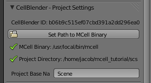
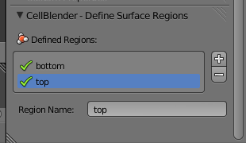
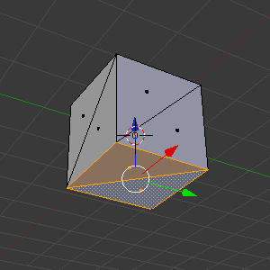
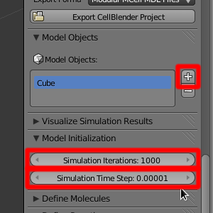
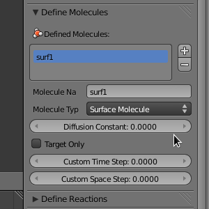
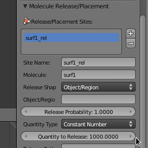
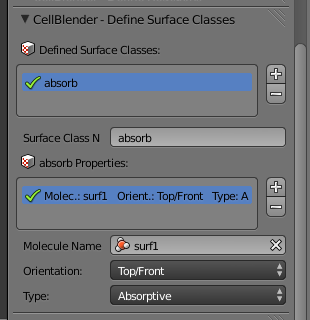
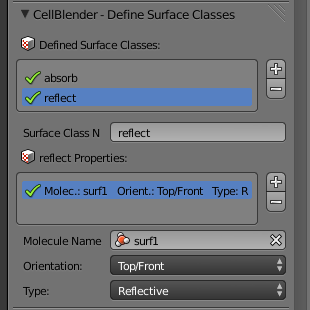

.. _surf_class_surf_mol:

*********************************************
Surface Classes and Surface Molecules
*********************************************

We have already discussed surface classes at length, but we haven't touched on
how they can affect the diffusion of surface molecules. Their effects are
manifested at the boundaries of the surface regions that they are applied to.
For example, if a surface is **REFLECTIVE** to **surf1**, then any **surf1**
can't get in or out of that that surface region. It acts as a fence of sorts
corralling the molecules in one region. The **ABSORPTIVE** surface class also
acts somewhat like a fence, but, instead of molecules harmlessly "bouncing" off
of it, they are destroyed whenever they touch it. **TRANSPARENT** surface
classes don't affect surface molecules, so we can ignore them in this context.

Since our current MDL is beginning to get a little complicated, we will start
fresh with this next example. First, we need to create the mesh and export the
MDL. Then, we will modify the MDL.

.. contents:: :local:

.. _surf_class_sm_mesh:

Set Project Directory
---------------------------------------------

Start Blender. Hit the **Scene** button in the **Properties Editor**. 

.. image:: ./images/scene_button.png

Let's set the project directory by saving the blend file right now by hitting
**Ctrl-s**, typing **/home/user/mcell_tutorial/scsm** (where **user** is your
user name) into the directory field, **scsm.blend** into the file name field,
and hit the **Save As Blender File** button.

Creating the Mesh
---------------------------------------------

..
  comment out video until updated. 
  Let's look at an example. First we need to create the model in Blender. To do
  this, either watch the following video tutorial or follow along with the
  instructions below.
  
  .. raw:: html
  
      <video id="my_video_1" class="video-js vjs-default-skin" controls
        preload="metadata" width="960" height="540" 
        data-setup='{"example_option":true}'>
        <source src="http://www.mcell.psc.edu/tutorials/videos/main/sc_sm.ogg" type='video/ogg'/>
      </video>

Hit the **Object** button in the **Properties Editor**.

.. image:: ./images/object_button.png

Scroll to the bottom of the Editor. Hit **+** twice so that you have two new
surface regions. 

Click on the first one and change its name in the text field to **top**. Next,
click on the second entry and change its name to **bottom**.

.. image:: ./images/gs_triangulate.png

Move your cursor to the **3D View** window and hit **Tab** to switch into
**Edit Mode**.  Hit **Ctrl-T** to triangulate the faces.

.. image:: ./images/gs_ctrl_tab.png

.. image:: ./images/gs_select_top.png

Then hit **Ctrl-Tab** and select **Face**. Right click on the top faces, select
the **top** surface region, and click **Assign**.

Next move your mouse back to the **3D View** window and hold the middle mouse
button down and drag upward so that the bottom face is shown. Right click on
the bottom faces, select **bottom** from the list of materials, and click
**Assign**.

Expand the **Model Objects** panel. Hit the **+** button and **Cube** will
appear in the list. Next, expand the **Model Initialization** panel. Change
**Simulation Iterations** to **1000**. Change **Simulation Time Step** to
**1e-5**.

Expand the **Define Molecules** panel and hit the **+** button. Change the
**Molecule Name** to **surf1**, the **Molecule Type** to **Surface Molecule**,
and the **Diffusion Constant** to **1e-7**.

Expand the **Molecule Release/Placement** panel and hit the **+** button.
Change **Site Name** to **surf1_rel**. Change **Molecule** to **surf1'**.
Change **Release Shape** to **Object/Region**. Change **Object/Region** to
**Cube**. Change **Quantity to Release** to **1000**.

.. _scsm_add_surf_class:

Add the Surface Class
---------------------------------------------

Expand the **Define Surface Classes** panel. Then, hit the **+** button to
create a new surface class called **Surface_Class**. Rename it to
**absorb**.

Hit the **+** button beside the empty **absorb_vol2 Properties** list. Select
**surf1** from the **Molecule Name** field. Leave **Orientation** set to
**Top/Front** and leave **Type** set to **Absorptive**. 

Repeat this process, except call the surface class **reflect** and change the
**Type** to **Reflective**.

.. _scsm_mod_surf_reg:

Modify the Surface Regions
---------------------------------------------

Now that we have created our surface class, we need to assign it to our mesh.
Expand the **Modify Surface Regions** panel. Hit the **+** to begin modifying a
surface region. In the **Surface Class Name** field, select **absorb**.
Under object name, select the newly created **Cube** object. For **Region
Name**, select **top**.

.. image:: ./images/scsm_assign_absorb.png

Repeat this process, except select **reflect** for the **Surface Class Name**
and **bottom** for the region. 

.. image:: ./images/scsm_assign_reflect.png

In this example, we have two surface classes, **absorb** and **reflect**.
**absorb** is applied to **top** and **reflect** is applied to **bottom**. The
faces in the middle do not have a surface region assigned to them. **surf1**
molecules are released all over the **Cube**, not just one surface region. The
effect of the **absorb** class is that all the **surf1** molecules are
destroyed when they hit the boundary between the **top** region and the
undefined middle section. The effect of the **reflect** class is that molecules
cannot pass the boundary between the **bottom** region and the undefined middle
section. Therefore, all the **surf1** molecules that start inside of the
**bottom** region never escape and the **surf1** molecules starting in the
middle section and **top** region will ultimately be destroyed.

.. _scsm_run_vis:

Run the Simulation and Visualize the Results
---------------------------------------------

Save the Blender file (**Ctrl-s**) and hit the **Run Simulation** button under
the **Run Simulation** panel.

Once the simulation has finished running, hit **Read Viz Data** under the
**Visualize Simulation Results** panel. See if you can notice the **surf1**
molecules being destroyed by the absorptive surface boundary.
