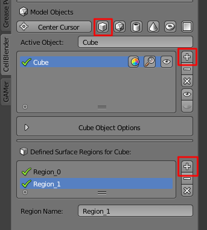
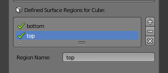
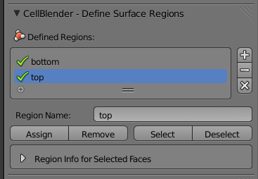
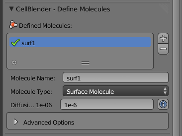
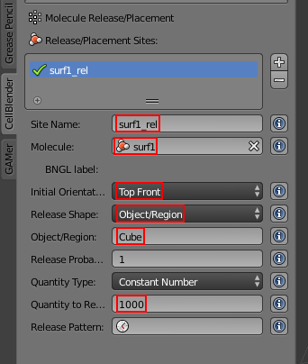
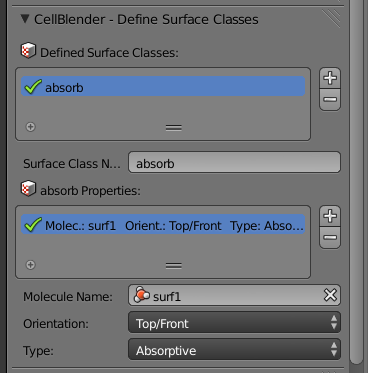
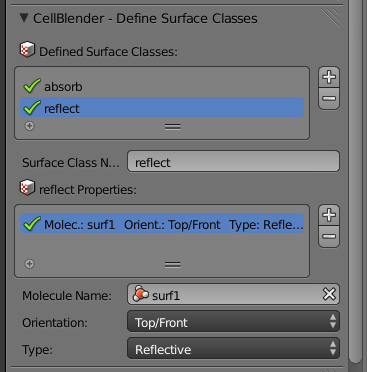
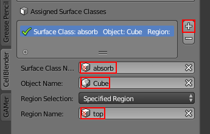
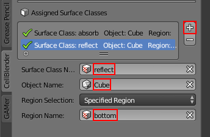
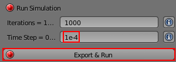

.. _surf_class_surf_mol:

*********************************************
Surface Classes and Surface Molecules
*********************************************

We have already discussed surface classes at length, but we haven't touched on
how they can affect the diffusion of surface molecules. Their effects are
manifested at the boundaries of the surface regions that they are applied to.
For example, if a surface is **Reflective** to **surf1**, then any **surf1**
can't get in or out of that that surface region. It acts as a fence of sorts
corralling the molecules in one region. The **Absorptive** surface class also
acts somewhat like a fence, but, instead of molecules harmlessly "bouncing" off
of it, they are destroyed whenever they touch it. **Transparent** surface
classes don't affect surface molecules, so we can ignore them in this context.

.. contents:: :local:

.. _surf_class_sm_mesh:

Set Project Directory
---------------------------------------------

After you start Blender, save the file (and set the project directory) by
hitting **Ctrl-s**, typing **~/mcell_tutorial/sc_sm** (or
**C:\\mcell_tutorial\\sc_sm** on Windows) into the directory field,
**sc_sm.blend** into the file name field, and hit the **Save As Blender File**
button.

Creating and Assigning Surface Regions
---------------------------------------------

* Hit the **Model Objects** button.
* Hit the Cube button.
* Hit the **+** button to add the cube to the **Model Objects** list.
* Under the **Defined Surface Regions for Cube** panel, hit the **+** twice so
  that you have two new surface regions.

Click on **Region_1** and change its name in the text field to **top**. Next,
click on **Region_0** and change its name to **bottom**.

Move your cursor to the **3D View** window and hit **Tab** to switch into
**Edit Mode**.

.. image:: ./images/triangulate.png

Then hit **Ctrl-Tab** and select **Face**.

.. image:: ./images/ctrl_tab.png

Hold **Shift** and **right click** on the top faces

.. image:: ./images/select_top.png

Select the **top** surface region from the list and click **Assign**.

Next move your mouse back to the **3D View** window and hold the middle mouse
button down and drag upward so that the bottom faces are shown. Make sure
everything is deselected (Hit **a** until all the faces are gray). Then hold
**Shift** and **right click** on the bottom faces, select **bottom** from the
list of regions, and click **Assign**.

Define a Surface Molecule
---------------------------------------------

* Hit the **Molecules** button.
* Hit the **+** button.
* Change the **Name** to **surf1**.
* Change the **Molecule Type** to **Surface Molecule**.
* Change the **Diffusion Constant** to **1e-6**.

Define a Release Site
---------------------------------------------

* Hit the **Molecule Placement** button.
* Hit the **+** button.
* Change **Site Name** to **surf1_rel**.
* Change **Molecule** to **surf1**.
* Leave **Initial Orientation** set to **Top Front**.
* Leave **Release Shape** set to **Object/Region**.
* Change **Object/Region** to **Cube**.
* Change **Quantity to Release** to **1000**.

.. _scsm_add_surf_class:

Add the Surface Class
---------------------------------------------

* Hit the **Surface Classes** button.
* Hit the **+** button to create a new surface class called **Surface_Class**.
* Rename it to **absorb**.
* Hit the **+** button beside the empty **absorb Properties** list.
* Leave **Molecules** set to **All Molecules**.
* Select **surf1** from the **Molecule Name** field.
* Set **Orientation** set to **Top/Front**.
* Set **Type** set to **Absorptive**.

Repeat this process, except call the surface class **reflect** and change the
**Type** to **Reflective**.

.. _scsm_mod_surf_reg:

Assign the Surface Classes
---------------------------------------------

Now that we have created our surface class, we need to assign it to our mesh.

* Hit the **Assign Surface Classes** button.
* Hit the **+** to begin assigning a surface class.
* In the **Surface Class Name** field, select **absorb**.
* Under **Object Name**, select the newly created **Cube** object.
* Change **Region Selection** to **Specified Region**.
* For **Region Name**, select **top**.

Repeat this process, except select **reflect** for the **Surface Class Name**
and **bottom** for the region. 

In this example, we have two surface classes, **absorb** and **reflect**.
**absorb** is applied to **top** and **reflect** is applied to **bottom**. The
faces in the middle do not have a surface region assigned to them. **surf1**
molecules are released all over the **Cube**, not just one surface region.

The effect of the **absorb** class is that all the **surf1** molecules are
destroyed when they hit the boundary between the **top** region and the
undefined middle section. The effect of the **reflect** class is that molecules
cannot pass the boundary between the **bottom** region and the undefined middle
section. Therefore, all the **surf1** molecules that start inside of the
**bottom** region never escape and the **surf1** molecules starting in the
middle section and **top** region will ultimately be destroyed.

.. _scsm_run_vis:

Run the Simulation and Visualize the Results
---------------------------------------------

* Save the Blender file (**Ctrl-s**).
* Hit the **Run Simulation** button*
* Change the **Time Step** to **1e-4**
* Lastly, hit the **Export & Run** button.

Once the simulation has finished running, hit **Reload Visualization Data**.
Hit **Alt-a** to play back the animation. You should notice the **surf1**
molecules being destroyed by the absorptive surface boundary.
