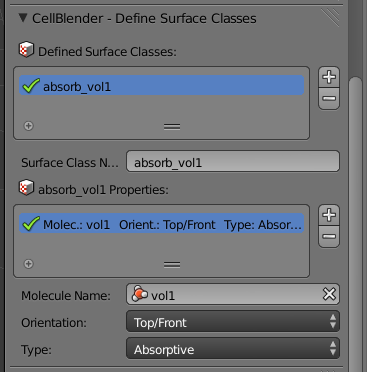
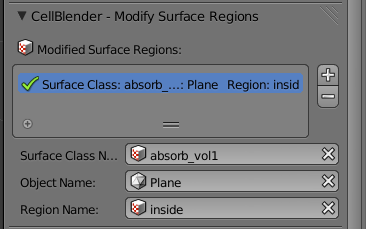
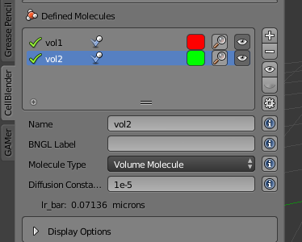
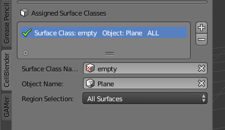
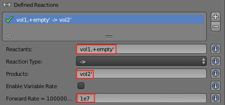

.. _surface_classes:

*********************************************
Introduction to Surface Classes
*********************************************

.. Git Repo SHA1 ID: 3520f8694d61c81424ff15ff9e7a432e42f0623f

Surface classes allow various properties (e.g. **Absorptive**, **Transparent**)
to be applied to surfaces, which can affect specified molecules. Later, in the
:ref:`surf_class_rxns` section, we will also see how surface classes can also
be used to specify absolute orientation in reactions.

.. _surf_class_vol_mol:

Surface Classes and Volume Molecules
=============================================

In this section, we will create a **Plane** object that sits inside a **Cube**
object. The **Cube** object will be filled with **vol1** molecules. The
**Plane** object will have a surface class that is **Absorptive** to **vol1**
molecules.

.. _surf_class_new_proj:

Create a New Project
---------------------------------------------

The project directory is set to be wherever the current blend file is saved.
Let's save the file right now by hitting **Ctrl-s**, typing
**~/mcell_tutorial/sc** (or **C:\\mcell_tutorial\\sc** on Windows) into the
directory field, **sc.blend** into the file name field, and hit the **Save As
Blender File** button.

.. image:: ./images/surf_class/save_blend.png

.. _surf_class_add_cube:

Add Cube to Model Objects list
---------------------------------------------

* Hit the **Model Objects** button.
* Hit the Cube button and then hit the **+** button to add it to the 
  **Model Objects** list.
* Under the **Cube Object Options** panel, select **Wire** from the drop-down
  menu.

.. image:: ./images/surf_class/add_cube.png

.. _surf_class_add_vol_mol:

Add a Volume Molecule and Release Site.
---------------------------------------------

* Add a volume molecule named **vol1** with a diffusion constant of **1e-5**.
* Create a release site with the following properties:

  * Set the **Site Name** to **vol1_rel**.
  * Set the **Release Shape** to **Object/Region**.
  * Set the **Object/Region** to **Cube**.
  * Set the **Quantity to Release** to **2000**.

.. _surf_class_add_geom:

Add a Plane
---------------------------------------------

* Hit the **Model Objects** button and then the Plane button. You should now
  have a plane going through the middle of your cube.
* With the cursor in the 3D View Window, hit **s**, then **1.1** to specify the
  scaling factor, and **Enter** to confirm.
* Hit the **+** button to actually add it to the Model Objects list.

.. image:: ./images/surf_class/add_plane.png
.. image:: ./images/surf_class/plane_in_cube.png

.. _surf_class_add_sc:

Add the Surface Class
---------------------------------------------

* Hit the **Surface Classes** button. 
* Hit the **+** button to create a new surface class called **Surface_Class**.

.. image:: ./images/surf_class/default_surface_class.png

* Rename **Surface_Class** to **absorb_vol1**.
* Hit the **+** button beside the empty **absorb_vol1 Properties** list.
* Select **Single Molecule** from the **Molecules** field.
* Select **vol1** from the **Molecule Name** field.
* Set the **Orientation** to **Top/Front**.
* Set the **Type** to **Absorptive**. 

This causes any **vol1** molecules that touch the **FRONT** of a surface with
the **absorb_vol1** surface class to be destroyed.

.. _surf_class_mod_surf_reg:

Assign the Surface Class
---------------------------------------------

Now that we have created our surface class, we need to assign it to our mesh.

* Hit the **Assign Surface Classes** button.
* Hit the **+** to begin modifying a surface region.
* In the **Surface Class Name** field, select **absorb_vol1**.
* Under **Object Name**, select the newly created **Plane** object.
* Leave **Region Selection** set to **All Surfaces**.

**absorb_vol1** is now assigned to all of the **Plane** object. In this
example, we are assigning the surface class to every face of **Plane**, but
that is not always the case.

.. _surf_class_run_vis:

Run the Simulation and Visualize the Results
---------------------------------------------

Save the Blender file (**Ctrl-s**). Hit the **Run Simulation** button and then
the **Export & Run** button.

Once the simulation has finished running, hit **Reload Visualization Data**
button. See if you can notice the **vol1** molecules being destroyed by the
absorptive surface.

.. _surf_class_examine_mdl:

Examine the Surface Class MDL (Optional)
---------------------------------------------

This next section isn't necessary, but you can follow along with it if you want
to learn more about MDL syntax. Open the file called
**Scene.surface_classes.mdl** and you should see the following text:

.. code-block:: mdl

    DEFINE_SURFACE_CLASSES
    {
      absorb_vol1
      {
        ABSORPTIVE = vol1'
      }
    }

To reiterate what was said previously, the command above creates a surface
class called **absorb_vol1**. Since **vol1** is the value set to the
**ABSORPTIVE** command, this means that any **vol1** molecules that touch the
**FRONT** of a surface that has the **absorb_vol1** surface class will be
destroyed.

Now open the file named **Scene.mod_surf_regions.mdl**:

.. code-block:: mdl

    MODIFY_SURFACE_REGIONS
    {
      Plane[ALL]
      {
        SURFACE_CLASS = absorb_vol1
      }
    }

Once again, to reiterate, this assigns **absorb_vol1** to all of the **Plane**.

That's all there is to it. The other two surface class commands are
**REFLECTIVE** (the default state for surfaces) and **TRANSPARENT** (allows
molecules to freely pass through). Feel free to try these out on your own.

.. _surf_class_rxns:

Surface Classes and Reactions
=============================================

In the :ref:`surf_class_vol_mol` section, we learned that surface classes can
be used to give meshes special properties. Surface classes can also be used to
provide extra specificity over how reactions occur.

.. _surf_class_rxns_mesh:

Create a New Project
---------------------------------------------

We'll pick up right where we left off at the end of
:ref:`surf_class_mod_surf_reg`. In fact, the instructions will be very similar,
aside from a few minor changes.

First, we will create a new project based off of the existing **sc.blend**
project. From the **File** menu, select the **Save As** option.

.. image:: ./images/save_as.png

Change the directory field to **/home/user/mcell_tutorial/sc_rxn** where
**user** is your user name. Click to confirm when it asks if you want to create
a new directory. Change the blend file name to **sc_rxn.blend** and click
**Save As Blender File**.

Define a New Molecule
---------------------------------------------

* Hit the **Molecules** button. 
* Hit the **+** button.
* Change the **Name** to **vol2**.
* Change the **Molecule Type** to **Volume Molecule**
* Change the **Diffusion Constant** to **1e-6**.

Modify the Existing Surface Class
---------------------------------------------

* Hit the **Surface Classes** button.
* Hit the **-** button under **absorb_vol1 Properties** to remove the existing properties. 
* Rename **absorb_vol** to **empty**.

This modified surface class, **empty**, is the simplest case you can have for a
surface class. By itself, it's not very useful, but we can use it in reactions
to specify absolute directionality.

.. image:: ./images/surf_class/empty.png

Modify the Surface Regions
---------------------------------------------

Now that we have modified our surface class, we need to reassign it to our
mesh.

* Hit the **Assign Surface Classes** button.
* Under the **Name** field, select **empty**.

You should be able to leave everything else as is.

Define the Reaction
---------------------------------------------

* Hit the **Reactions** button.
* Hit the **+** button.
* Change **Reactants** to **vol1, @ empty'**.
* Change **Products** to **vol2'**.
* Change **Forward Rate** to **1e7**.

.. _surf_class_rxns_mdl:

Run the Simulation and Visualize the Results
---------------------------------------------

Save the Blender file (**Ctrl-s**). Hit the **Run Simulation** button and then
the **Export & Run** button.

Once the simulation has finished running, hit the **Reload Visualization
Data**. Hit **Alt-a** to begin playing back the animation. You may need to
change the color of **vol2**, so you can tell it apart from **vol1**.

Once you have done that, you should notice that there are **vol2** molecules
being created inside the box, but only in the upper portion of it, despite the
fact that the **vol1** molecules exist on both sides of the plane. The reason
for this is because only the **vol1**  on the **BACK** of the **empty** surface
class are considered possible reactants.
