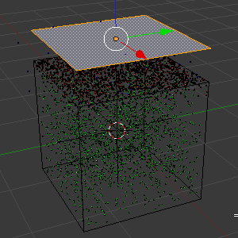
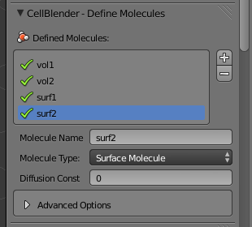
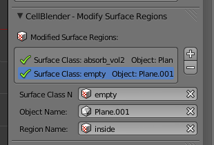

.. _surface_classes:

*********************************************
Introduction to Surface Classes
*********************************************

.. CellBlender Source ID = 55f468aa7b71e044b3b199786f5af1d83bb3cab8
   Git Repo SHA1 ID: 76c4b2c18c851facefad7398f3f9c86a0abb8cdc

.. note::
    The simulations and visualizations in this tutorial were generated using
    Blender 2.67 and CellBlender 0.1.57. It may or may not work with other
    versions.

Surface classes allow various properties (e.g. **ABSORPTIVE**, **TRANSPARENT**)
to be applied to surfaces, which can affect specified molecules. Later, we will
also see how they can be used in reactions.

.. _surf_class_vol_mol:

Surface Classes and Volume Molecules
=============================================

In this section, we will create a **Plane** object that sits above our **Cube**
object. This **Plane** object will have an **ABSORPTIVE** surface class. At the
**top** of the **Cube** object, **vol2** molecules are being created and
diffusing toward the **Plane**. Any of the **vol2** molecules that touch the
**Plane** will be absorbed by it.

.. _surf_class_mod_mesh:

Create a New Project
---------------------------------------------

We'll pick up where we left off at the end of the :ref:`examine_output`
section. If you have closed **intro.blend** for any reason, re-open it at this
time (Select **File>Open** in Blender).

Now, we will create a new project based off of the existing **intro.blend**
project. From the **File** menu, select the **Save As** option.

.. image:: ./images/save_as.png

Change the directory field to **/home/user/mcell_tutorial/sc** where **user**
is your user name. Click to confirm when it asks if you want to create a new
directory. Change the blend file name to **sc.blend** and click **Save As
Blender File**.

.. image:: ./images/sc_save_blend.png

.. _surf_class_add_geom:

Add a New Mesh and Surface Region
---------------------------------------------

..
  comment out video until updated
  Watch the following video tutorial or follow along with the instructions below.
  
  .. raw:: html
  
      <video id="my_video_1" class="video-js vjs-default-skin" controls
        preload="metadata" width="960" height="540" 
        data-setup='{"example_option":true}'>
        <source src="http://www.mcell.psc.edu/tutorials/videos/main/surf_reg_above.ogg" type='video/ogg'/>
      </video>
  
  If you watched the previous video tutorial, you can skip ahead to :ref:`surf_class_vm_mod_mdl`.

Move your cursor to the **3D View Editor**, hit **Shift-a**, and select
**Plane**. Hit **g** to "grab" the plane, **z** to constrain the movement to
the z-axis, **1.2** to move it 1.2 units, and **Enter** to confirm. You should
now have a plane above your cube.

We will now create a surface region for the new plane. Begin by hitting the
**Object** button on the **Properties** Editor.

.. image:: ./images/object_button.png

Under the **Surface Regions** panel, hit **+**. Change the default name to
**above**.

.. image:: ./images/sc_above.png

Change into **Edit Mode** by hitting **Tab** in the **3D View Editor**. With
the face of the plane selected, hit **Ctrl-t** to triangulate it.

.. image:: ./images/sc_above_triangulated.png

Then, click **Assign** under **Define Surface Regions**.

.. image:: ./images/sc_assign.png

Change back into **Object Mode** by hitting **Tab**. Hit the **Scene** button
on the **Properties** Editor.

.. image:: ./images/scene_button.png

With the **Plane** selected, hit **+** under the **Model Objects** panel.

.. image:: ./images/sc_model_objects.png

.. _surf_class_add_sc:

Add the Surface Class
---------------------------------------------

Expand the **Define Surface Classes** panel. Then, hit the **+** button to
create a new surface class called **Surface_Class**. Rename it to
**absorb_vol2**.

.. image:: ./images/sc_define.png

.. image:: ./images/sc_absorb_vol2.png

Hit the **+** button beside the empty **absorb_vol2 Properties** list. Select
**vol2** from the **Molecule Name** field.  Change the **Orientation**
drop-down box to **Ignore**. Leave **Type** set to **Absorptive**. 

.. image:: ./images/sc_props.png

This causes any **vol2** molecules that touch a surface with the
**absorb_vol2** surface class to be destroyed.

.. _surf_class_mod_surf_reg:

Modify the Surface Regions
---------------------------------------------

Now that we have created our surface class, we need to assign it to our mesh.
Expand the **Modify Surface Regions** panel. Hit the **+** to begin modifying a
surface region. In the **Surface Class Name** field, select **absorb_vol2**.
Under object name, select the newly created **Plane** object. For **Region
Name**, select **above**.

.. image:: ./images/sc_mod_surf_reg.png

**absorb_vol2** is now assigned to the surface region called **above** on the
**Plane** object. In this example, **above** happens to include every face of
**Plane**, but that is not always the case.

.. _surf_class_run_vis:

Run the Simulation and Visualize the Results
---------------------------------------------

Save the Blender file (**Ctrl-s**) and hit the **Run Simulation** button under
the **Run Simulation** panel.

Once the simulation has finished running, hit **Read Viz Data** under the
**Visualize Simulation Results** panel. See if you can notice the **vol2**
molecules being destroyed by the absorptive surface.

.. _surf_class_examine_mdl:

Examine the Surface Class MDL
---------------------------------------------

This next section isn't necessary, but you can follow along with it if you want
to learn more about MDL syntax. Open the file called **sc.surface_classes.mdl**
and you should see the following text::

    DEFINE_SURFACE_CLASSES
    {
      absorb_vol2
      {
        ABSORPTIVE = vol2;
      }
    }

To reiterate what was said previously, the command above creates a surface
class called **absorb_vol2**. Since **vol2** is the value set to the
**ABSORPTIVE** command, this means that any **vol2** molecules that touch a
surface that has the **absorb_vol2** surface class will be destroyed.

Now open the file named **sc.mod_surf_regions.mdl**::

    MODIFY_SURFACE_REGIONS
    {
      Plane[above]
      {
        SURFACE_CLASS = absorb_vol2
      }
    }

Once again, to reiterate, this assigns **absorb_vol2** to the **above** region
of **Plane**.

That's all there is to it. The other two surface class commands are
**REFLECTIVE** (the default state for surfaces) and **TRANSPARENT** (allows
molecules to freely pass through). Feel free to try these out on your own.

.. _surf_class_rxns:

Surface Classes and Reactions
=============================================

In the :ref:`surf_class_vol_mol` section, we learned that surface classes can
be used to give parts of meshes special properties. Surface classes can also be
used to provide extra specificity over how reactions occur.

.. _surf_class_rxns_mesh:

..
  comment out video until updated
  Watch the following video tutorial or follow along with the instructions below.
  
  .. raw:: html
  
      <video id="my_video_1" class="video-js vjs-default-skin" controls
        preload="metadata" width="960" height="540" 
        data-setup='{"example_option":true}'>
        <source src="http://www.mcell.psc.edu/tutorials/videos/main/surf_reg_inside.ogg" type='video/ogg'/>
      </video>
  
  If you watched the previous video tutorial, you can skip ahead to
  :ref:`surf_class_rxns_mdl`.

Create a New Project
---------------------------------------------

We're pick up right where we left off at the end of
:ref:`surf_class_mod_surf_reg`. In fact, the instructions will be very similar,
aside from a few minor changes.

First, we will create a new project based off of the existing **sc.blend**
project. From the **File** menu, select the **Save As** option.

.. image:: ./images/save_as.png

Change the directory field to **/home/user/mcell_tutorial/sc_rxn** where
**user** is your user name. Click to confirm when it asks if you want to create
a new directory. Change the blend file name to **sc_rxn.blend** and click
**Save As Blender File**.

Add a New Mesh and Surface Region
---------------------------------------------

While in **Object Mode**, hit **Shift-a**, select **Plane**, and **Enter** to
confirm. You should see a **Plane** object inside of the **Cube**.

Now, let's create a new surface region. First, hit the **Object** button on the
**Properties** Editor.

.. image:: ./images/object_button.png

Under the **Surface Regions** panel, hit **+**. Change the newly created
surface region text field from **Region** to **inside**.

.. image:: ./images/sc_inside.png

Change into **Edit Mode** by hitting **Tab**. With the face of the plane
selected, hit **Ctrl-t** to triangulate it. Under **Define Surface Regions**,
click **Assign**. 

.. image:: ./images/sc_inside_triangulated.png

Change back into **Object Mode** by hitting **Tab**.

With **Plane.001** selected, hit **+** under the **Model Objects** panel.

.. image:: ./images/sc_model_objects2.png

Define a New Molecule
---------------------------------------------

Expand the **Define Molecules** panel and hit the **+** button. Left click
**Molecule**. Change the **Molecule Name** to **surf2**, the **Molecule Type**
to **Surface Molecule**, and the **Diffusion Constant** to **0**.

Add the Surface Class
---------------------------------------------

Expand the **Define Surface Classes** panel. Then, hit the **+** button to
create a new surface class called **Surface_Class**. Rename it to **empty**.
This new surface class, **empty**, is the simplest case you can have for a
surface class. By itself, it's not very useful, but we can use it in reactions
to specify absolute directionality.

.. image:: ./images/sc_empty.png

Modify the Surface Regions
---------------------------------------------

Now that we have created our surface class, we need to assign it to our mesh.
Under the **Modify Surface Regions** panel, hit the **+** to begin modifying a
surface region. In the **Surface Class Name** field, select **empty**.
Under object name, select the newly created **Plane.001** object. For **Region
Name**, select **inside**.

Define the Reaction
---------------------------------------------

Expand the **Define Reactions** panel and hit the **+** button. Change
**Reactants** to **vol1, + surf2' @ empty'**. Change **Products** to **surf2' +
vol2'**. Change **Forward Rate** to **1e8**.

.. image:: ./images/sc_rxn.png

Add the Release Site
---------------------------------------------

Under the **Molecule Release/Placement** panel, hit the **+** button. Select
**New Release Site** from the list, and change **Site Name** to **surf2_rel**.
Change **Molecule** to **surf2**. Change **Initial Orientation** to **Mixed**.
**Release Shape** should be set to **Object/Region**. Change **Object/Region**
to **Plane.001[inside]**. Change **Quantity to Release** to **2000**.

.. image:: ./images/sc_surf2_release.png

.. _surf_class_rxns_mdl:

Run the Simulation and Visualize the Results
---------------------------------------------

Save the Blender file (**Ctrl-s**) and hit the **Run Simulation** button under
the **Run Simulation** panel.

Once the simulation has finished running, hit **Read Viz Data** under the
**Visualize Simulation Results** panel. You should notice that there are
**vol2** molecules being created inside the box, but only in the upper portion
of it, despite the fact that the **surf2** molecules are facing both up *and*
down. The reason for this is because the reaction is only taking place at the
**BACK** of the **empty** surface class with the **BOTTOM** of **surf2**.
