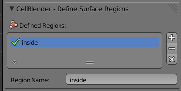
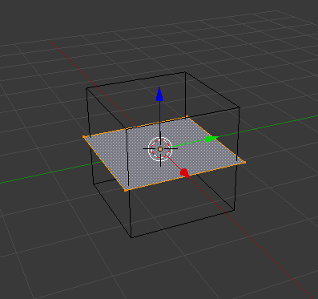
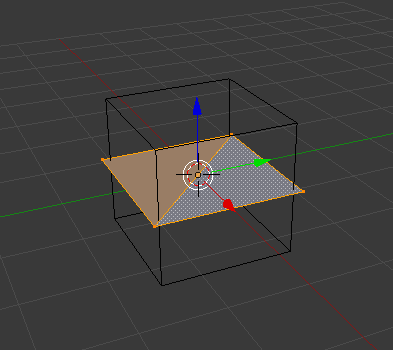
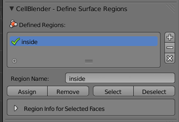
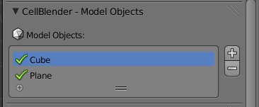

.. _surface_classes:

*********************************************
Introduction to Surface Classes
*********************************************

.. Git Repo SHA1 ID: 3520f8694d61c81424ff15ff9e7a432e42f0623f

.. note::

    The simulations and visualizations in this tutorial were generated using
    Blender 2.70a and CellBlender 1.0. It may or may not work with other
    versions.

Surface classes allow various properties (e.g. **Absorptive**, **Transparent**)
to be applied to surfaces, which can affect specified molecules. Later, in the
:ref:`surf_class_rxns` section, we will also see how surface classes can also
be used to specify absolute orientation in reactions.

.. _surf_class_vol_mol:

Surface Classes and Volume Molecules
=============================================

In this section, we will create a **Plane** object that sits inside a **Cube**
object. The **Cube** object will be filled with **vol1** molecules. The
**Plane** object will have a surface class that is **Absorptive** to **vol1**
molecules.

.. _surf_class_new_proj:

Create a New Project
---------------------------------------------

The project directory is set to be wherever the current blend file is saved.
Let's save the file right now by hitting **Ctrl-s**, typing
**~/mcell_tutorial/sc** (or **C:\\mcell_tutorial\\sc** on Windows) into the
directory field, **sc.blend** into the file name field, and hit the **Save As
Blender File** button.

.. image:: ./images/surf_class/save_blend.png

.. _surf_class_model_init:

Set Model Initialization Settings
---------------------------------------------

.. note:: 
   
   See the :ref:`getting_started` tutorial if you have forgotten how to do the
   instructions in the next several steps.

Under **Model Initialization**, set the **Iterations** to **1000** and the
**Time Step** to **1e-6**. Normally, we would set these under **General
Parameters**, but we will skip that step to save time.

.. _surf_class_add_cube:

Add Cube to Model Objects list
---------------------------------------------

With the default **Cube** selected, change into **Edit Mode** by hitting
**Tab** in the **3D View Editor**. Make sure all the faces of the **Cube** are
selected and hit **Ctrl-t** to triangulate it. Change back into **Object
Mode**.

In the **Object** Context, under the **Display** panel, set the **Maximum Draw
Type** to **Wire**.

Then add the **Cube** to the **Model Objects** list.

.. _surf_class_add_vol_mol:

Add a Volume Molecule and Release Site.
---------------------------------------------

* Add a volume molecule named **vol1** with a diffusion constant of **1e-5**.
* Create a release site with the following properties:

  * Set the name to **vol1_rel**.
  * Set the **Shape** to **Object/Region**.
  * Set the **Object/Region** to **Cube**.
  * Set the number to release to **2000**.

.. _surf_class_add_geom:

Add a Plane and Surface Region
---------------------------------------------

Move your cursor to the **3D View Editor**, hit **Shift-a**, and select
**Plane**. Hit **s** to scale the plane, **1.1** to specify the scaling factor,
and **Enter** to confirm. You should now have a plane going through the middle
of  your cube.

.. image:: ./images/surf_class/plane_in_cube.png

We will now create a surface region for the new plane. Begin by hitting the
**Object** button on the **Properties** Editor.

.. image:: ./images/object_button.png

Under the **Surface Regions** panel, hit **+**. Change the default name to
**inside**.

Change into **Edit Mode** by hitting **Tab** in the **3D View Editor**.
 

With the face of the plane selected, hit **Ctrl-t** to triangulate it.

Then, click **Assign** under **Define Surface Regions**.

Change back into **Object Mode** by hitting **Tab**. Hit the **Scene** button
on the **Properties** Editor.

.. image:: ./images/scene_button.png

With the **Plane** selected, hit **+** under the **Model Objects** panel.

.. _surf_class_add_sc:

Add the Surface Class
---------------------------------------------

Expand the **Define Surface Classes** panel. Then, hit the **+** button to
create a new surface class called **Surface_Class**. Rename it to
**absorb_vol1**.

.. image:: ./images/surf_class/default_surface_class.png

Hit the **+** button beside the empty **absorb_vol1 Properties** list.

* Select **vol1** from the **Molecule Name** field.
* Leave the **Orientation** set to **Top/Front**.
* Leave **Type** set to **Absorptive**. 

.. image:: ./images/surf_class/absorb_vol1.png

This causes any **vol1** molecules that touch the **FRONT** of a surface with
the **absorb_vol1** surface class to be destroyed.

.. _surf_class_mod_surf_reg:

Modify the Surface Regions
---------------------------------------------

Now that we have created our surface class, we need to assign it to our mesh.
Expand the **Modify Surface Regions** panel. Hit the **+** to begin modifying a
surface region.

* In the **Surface Class Name** field, select **absorb_vol1**.
* Under **Object Name**, select the newly created **Plane** object.
* For **Region Name**, select **inside**.

.. image:: ./images/surf_class/mod_surf_reg.png

**absorb_vol1** is now assigned to the surface region called **inside** on the
**Plane** object. In this example, **inside** happens to include every face of
**Plane**, but that is not always the case.

.. _surf_class_run_vis:

Run the Simulation and Visualize the Results
---------------------------------------------

Under **Visualization Output Settings**, select **Export All**.

Save the Blender file (**Ctrl-s**) and hit the **Run Simulation** button under
the **Run Simulation** panel.

Once the simulation has finished running, hit **Read Viz Data** under the
**Visualize Simulation Results** panel. See if you can notice the **vol1**
molecules being destroyed by the absorptive surface.

.. _surf_class_examine_mdl:

Examine the Surface Class MDL (Optional)
---------------------------------------------

This next section isn't necessary, but you can follow along with it if you want
to learn more about MDL syntax. Open the file called **sc.surface_classes.mdl**
and you should see the following text:

.. code-block:: mdl

    DEFINE_SURFACE_CLASSES
    {
      absorb_vol1
      {
        ABSORPTIVE = vol1'
      }
    }

To reiterate what was said previously, the command above creates a surface
class called **absorb_vol1**. Since **vol1** is the value set to the
**ABSORPTIVE** command, this means that any **vol1** molecules that touch the
**FRONT** of a surface that has the **absorb_vol1** surface class will be
destroyed.

Now open the file named **sc.mod_surf_regions.mdl**:

.. code-block:: mdl

    MODIFY_SURFACE_REGIONS
    {
      Plane[inside]
      {
        SURFACE_CLASS = absorb_vol1
      }
    }

Once again, to reiterate, this assigns **absorb_vol1** to the **inside** region
of **Plane**.

That's all there is to it. The other two surface class commands are
**REFLECTIVE** (the default state for surfaces) and **TRANSPARENT** (allows
molecules to freely pass through). Feel free to try these out on your own.

.. _surf_class_rxns:

Surface Classes and Reactions
=============================================

In the :ref:`surf_class_vol_mol` section, we learned that surface classes can
be used to give regions of meshes special properties. Surface classes can also
be used to provide extra specificity over how reactions occur.

.. _surf_class_rxns_mesh:

Create a New Project
---------------------------------------------

We'll pick up right where we left off at the end of
:ref:`surf_class_mod_surf_reg`. In fact, the instructions will be very similar,
aside from a few minor changes.

First, we will create a new project based off of the existing **sc.blend**
project. From the **File** menu, select the **Save As** option.

.. image:: ./images/save_as.png

Change the directory field to **/home/user/mcell_tutorial/sc_rxn** where
**user** is your user name. Click to confirm when it asks if you want to create
a new directory. Change the blend file name to **sc_rxn.blend** and click
**Save As Blender File**.

Define a New Molecule
---------------------------------------------

Expand the **Define Molecules** panel and hit the **+** button. Left click
**Molecule**. Change the **Molecule Name** to **vol2**, the **Molecule Type**
to **Volume Molecule**, and the **Diffusion Constant** to **1e-6**.

.. image:: ./images/surf_class/vol2.png

Modify the Existing Surface Class
---------------------------------------------

Expand the **Define Surface Classes** panel. Then, hit the **-** button under
**absorb_vol1 Properties** to remove the existing properties. Then rename
**absorb_vol** to **empty**. This modified surface class, **empty**, is the
simplest case you can have for a surface class. By itself, it's not very
useful, but we can use it in reactions to specify absolute directionality.

.. image:: ./images/surf_class/empty.png

Modify the Surface Regions
---------------------------------------------

Now that we have modified our surface class, we need to reassign it to our
mesh. Under the **Modify Surface Regions** panel, in the **Surface Class Name**
field, select **empty**. You should be able to leave everything else as is.

.. image:: ./images/surf_class/assign_empty.png

Define the Reaction
---------------------------------------------

Expand the **Define Reactions** panel and hit the **+** button. Change
**Reactants** to **vol1, @ empty'**. Change **Products** to **vol2'**. Change
**Forward Rate** to **1e7**.

.. image:: ./images/surf_class/reaction.png

.. _surf_class_rxns_mdl:

Run the Simulation and Visualize the Results
---------------------------------------------

Save the Blender file (**Ctrl-s**) and hit the **Run Simulation** button under
the **Run Simulation** panel.

Once the simulation has finished running, hit **Read Viz Data** under the
**Visualize Simulation Results** panel. Hit **Alt-a** to begin playing back the
animation. You may need to change the color of **vol2**, so you can tell it
apart from **vol1**.

Once you have done that, you should notice that there are **vol2** molecules
being created inside the box, but only in the upper portion of it, despite the
fact that the **vol1** molecules exist on both sides of the plane. The reason
for this is because only the **vol1**  on the **BACK** of the **empty** surface
class are considered possible reactants.
