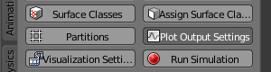

.. _unimol_reactions: 

*********************************************************
Unimolecular Reactions
*********************************************************

Tutorial Overview
=================

This tutorial will define a single unimolecular reaction.

Initial Configuration
=====================

This tutorial builds upon what was done in :ref:`single_molecule_diffusion`.
Either complete that tutorial yourself or use the `single_molecule.blend`_ file
to get started.

.. _single_molecule.blend: ./blends/single_molecule.blend

Save the File with a New Name in Your Working Directory
---------------------------------------------------------------

* Select **File** > **Save As...**
* Change **single_molecule.blend** to **unimol_reactions.blend**
* Click **Save As Blender File** button

Define a Reaction
-----------------------------------

* Click the **Reactions** button.

.. image:: ./images/unimol_reactions/reactions_button.png

* Click the "plus" sign (**+**) to the right of the **Defined Reactions** box
* Type **a** in the **Reactants** text field
* Type **NULL** in the **Products** text field
* Type **5e3** in the **Forward Rates** text field

.. image:: ./images/unimol_reactions/define_reactions1.png

Release More Molecules
-----------------------------------

* Click the **Molecule Placement** button
* Change the **Quantity to Release** to **1000**

.. image:: ./images/unimol_reactions/release_1000.png

Create Reaction Data
-----------------------------------

* Click the **Plot Output Settings** button

* Click the "plus" sign (**+**) to the right of the **Reaction Data Output** box
* Select **a** from the **Molecule** selector.

.. image:: ./images/unimol_reactions/plot1.png

Simulate the Model
--------------------------

* Click the **Run Simulation** button

.. image:: ./images/single_molecule/run_sim_button.png

* Click the **Run** button

.. image:: ./images/single_molecule/run_sim.png

* Wait for the simulation to complete
* Press the "Reload Visualization Data" button to load the results of the
  simulation.

.. image:: ./images/single_molecule/reload_viz_data.png

Use the Time Line
-------------------------

* Press the "Play" (|play|) button below the time line

.. |play| image:: ./images/single_molecule/play.png

.. image:: ./images/unimol_reactions/150_iters.png

.. image:: ./images/unimol_reactions/750_iters.png

* Stop the simulation by clicking the "Pause" (|pause|) button below the time line

.. |pause| image:: ./images/single_molecule/pause.png

Plot the Reaction Data
-------------------------

* Click the **Plot Output Settings** button
* Click the **MatPlotLib Plotter** button if it's available.

.. image:: ./images/unimol_reactions/plot2.png

.. image:: ./images/unimol_reactions/plot3.png

Save Your File
-------------------------

* **File** > **Save**
