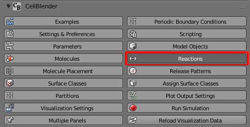
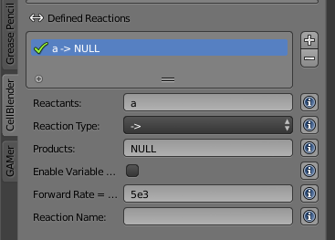
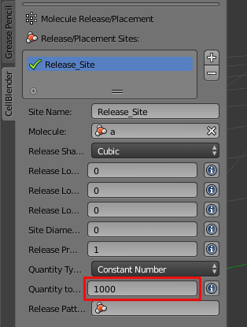
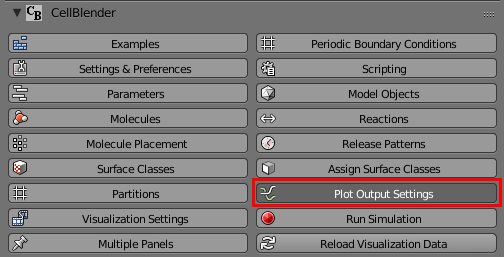
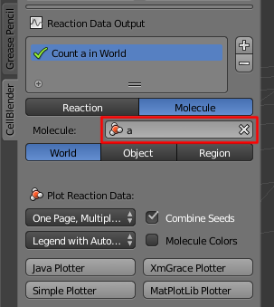
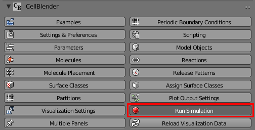
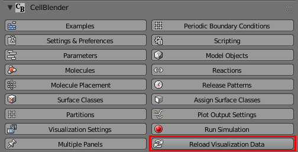
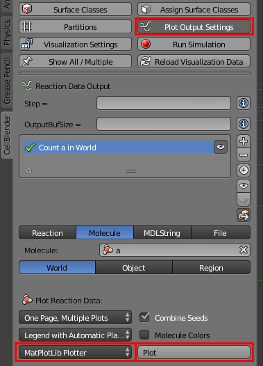

.. _unimol_reactions: 

*********************************************************
Unimolecular Reactions
*********************************************************

Tutorial Overview
=================

This tutorial will define a single unimolecular reaction.

Initial Configuration
=====================

This tutorial builds upon what was done in :ref:`add_meshgeom`.
Either complete that tutorial yourself or use the `add_meshgeom.blend`_ file
to get started.

.. _add_meshgeom.blend: ../../blends/add_meshgeom.blend

Save the File with a New Name in Your Working Directory
---------------------------------------------------------------

* Select **File** > **Save As...**
* Change **single_molecule.blend** to **unimol_reactions.blend**
* Click **Save As Blender File** button

Define a Reaction
-----------------------------------

* Click the **Reactions** button.

* Click the "plus" sign (**+**) to the right of the **Defined Reactions** box
* Type **a** in the **Reactants** text field
* Type **NULL** (all upper case) in the **Products** text field
* Type **5e3** in the **Forward Rate** text field

Release More Molecules
-----------------------------------

* Click the **Molecule Placement** button
* Change the **Quantity to Release** to **1000**

Define Reaction Data to be Saved for Plotting
------------------------------------------------

* Click the **Plot Output Settings** button

* Click the "plus" sign (**+**) to the right of the **Reaction Data Output** box
* Ignore the error which indicates an incomplete definition at this time
* Select **a** from the **Molecule** selector (should clear the error)

* Note the descriptive item "**Count a in World**" in the list

Simulate the Model
--------------------------

* Click the **Run Simulation** button to return to the Run Simulation panel

* Click the **Export & Run** button

.. image:: ./images/single_molecule/run_sim.png

* Wait for the simulation to complete
* Press the "**Reload Visualization Data**" button to load the results of the
  simulation.

Use the Time Line
-------------------------

* Press the "**Play**" (|play|) button below the time line

.. |play| image:: ./images/single_molecule/play.png

.. image:: ./images/unimol_reactions/150_iters.png

.. image:: ./images/unimol_reactions/750_iters.png

* Stop the simulation by clicking the "Pause" (|pause|) button below the time line

.. |pause| image:: ./images/single_molecule/pause.png

* Click (or Click-and-Drag) in the time line to view the simulation at different points in time

Plot the Reaction Data
-------------------------

* Click the **Plot Output Settings** button
* Select **MatPlotLib Plotter** from the plotter drop-down list if it's
  available.
* Click the **Plot** button.

.. image:: ./images/unimol_reactions/plot3.png

Save Your File
-------------------------

* **File** > **Save**
