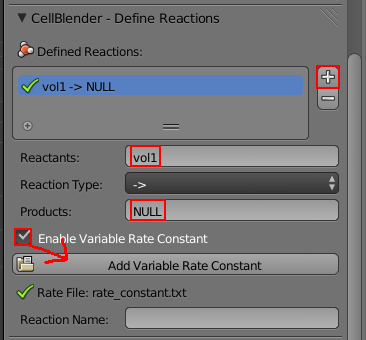

.. _variable_rxn_rates:

*********************************************
Variable Rate Constants
*********************************************

In this tutorial, you will learn how to use a rate constant that varies with
respect to time.

Create Variable Rate Constant Text File
---------------------------------------------

Using any text editor, create a new file called **rate_constant.txt**. Add the
following text in the file::

    0      0
    5E-4   1E4

The first column is the time (seconds), and the second column is the rate
constant at that time. The units for the reaction rate are the same as used
earlier in the :ref:`reactions` section. 

The example shown above is a very simple case where the reaction only changes
once. You could just as well have it change every time step, like this::

    0      0
    1E-6   1.0E5
    2E-6   1.1E5
    3E-6   1.2E5
    ...

Save the file and quit.

Set Project Directory
---------------------------------------------

After you start Blender, save the file (and set the project directory) by
hitting **Ctrl-s**, typing **~/mcell_tutorial/var_rate_constant** (or
**C:\\mcell_tutorial\\var_rate_constant** on Windows) into the directory field,
**var_rate_constant.blend** into the file name field, and hit the **Save As
Blender File** button.

Set Project Parameters
---------------------------------------------

Set the following parameters:

* Create a Cube and add it to the **Model Objects** list.
* Create a volume molecule called **vol1** with a diffusion constant of
  **1e-6**.
* Create a release site with the following properties:

  * Set the **Site Name** to **vol1_rel**.
  * Set the **Molecule** to **vol1**.
  * Set the **Release/Shape** to **Object/Region**.
  * Set the **Object/Region** to **Cube**.
  * Set the **Quantity to Release** to **1000**.

Create Reaction with Variable Rate Constant
---------------------------------------------

* Hit the **Reactions** button.
* Hit the **+** button.
* Set **Reactants** to **vol1**.
* Set **Products** to **NULL**.
* Click the **Enable Variable Rate Constant** check box.
* Hit the **Add Variable Rate Constant** button.
* Navigate to the **rate_constant.txt** file and select it.

A green check mark should appear next to the file name if everything worked
correctly.

Run and Visualize the Simulation
---------------------------------------------

* Save the Blender file (**Ctrl-s**).
* Hit the **Run Simulation** button.
* Lastly, hit the **Export & Run** button.

Once the simulation has finished running, hit **Reload Visualization Data**.
Hit **Alt-a** to play back the animation.

For the first 500 iterations of the simulation, the molecules will diffuse
around in the box undisturbed. After that point, they will begin to disappear.
By the end of the simulation, almost all of them will be gone.
