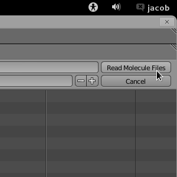
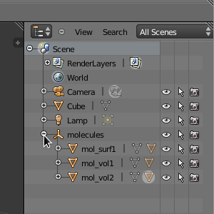
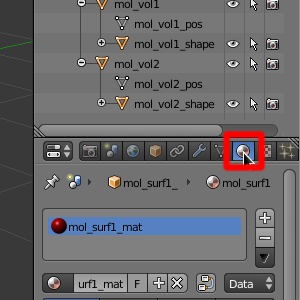
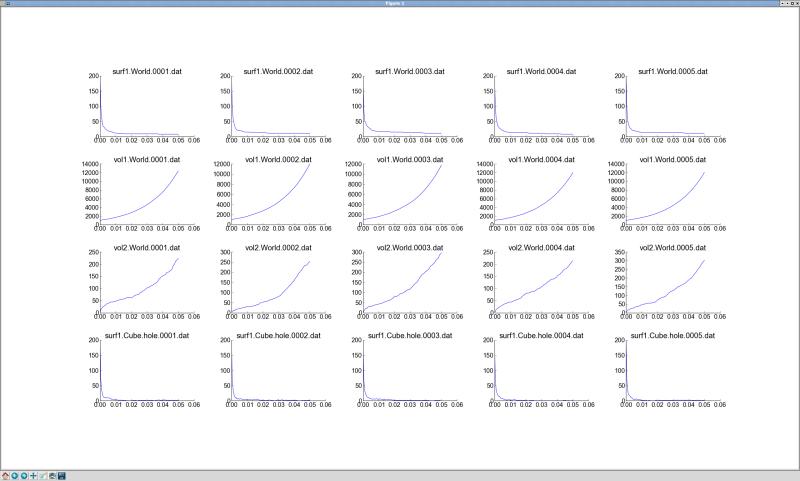
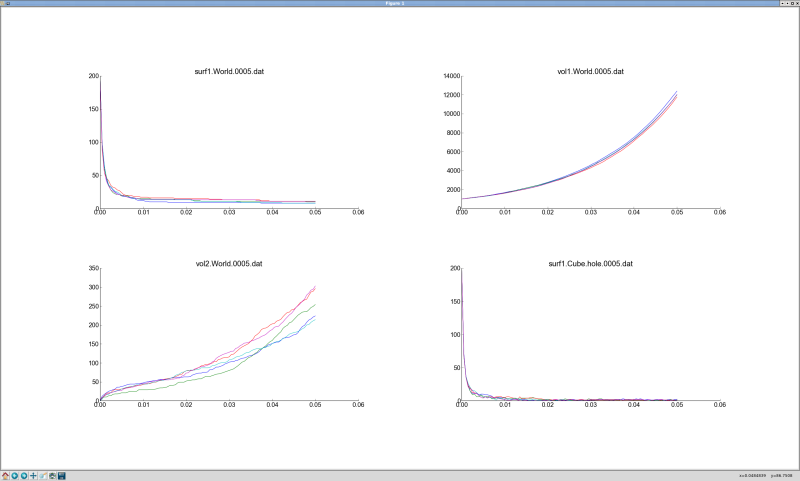
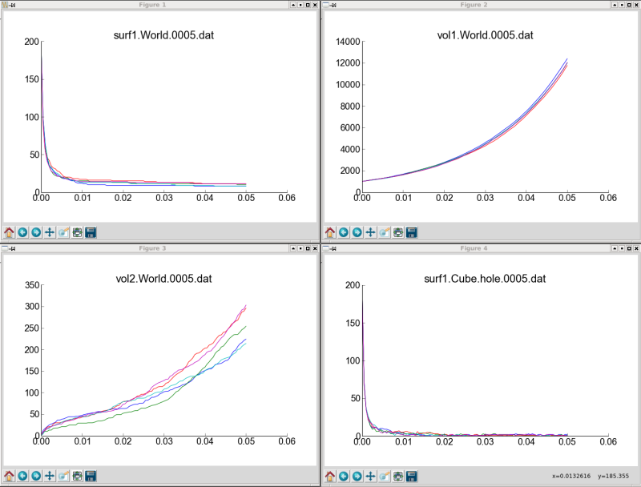

.. _examine_output:

*********************************************
Visualize and Plot the Output
*********************************************

At the end of the last section, we ran MCell with the MDL file that we annotated. This
generated visualization and reaction data (i.e. molecule counts), which we will
now examine using CellBlender and some plotting software. 

.. _visualize_molecules:

Visualize the Molecules
=============================================

Visualize molecules with CellBlender in this video tutorial.

.. raw:: html

    <video id="my_video_1" class="video-js vjs-default-skin" controls
      preload="metadata" width="960" height="540" 
      data-setup='{"example_option":true}'>
      <source src="http://www.mcell.psc.edu/tutorials/videos/main/viz_data.ogg" type='video/ogg'/>
    </video>

Skip to the :ref:`graph_rxn_data` section if you just watched the video
tutorial.

Begin by opening Blender. Then click the **Scene** button in the **Properties
Editor**. Expand the **Visualize Simulation Results** panel, and click the
**Set Molecule Viz Directory** button.

.. image:: ./images/vp_set_molec_viz_dir.png

Navigate to ``/home/user/mcell_tutorial/intro/viz_data/`` and click **Read
Molecule Files**.

You should now see a number of molecules populating the surface of the
**Cube**.

Let's change the **Cube** to a wireframe view so we can see inside of it.
First, be sure that the cube is selected (orange outline). Then click the
**Object** button on the **Properties Editor**.  Under the **Display** panel,
change **Type** to **Wire**.

.. image:: ./images/vp_wireframe.png

Drag the green bar on the **Timeline Editor** back and forth to scrub through
the simulation. You can see the molecules diffusion in and on surface of the
cube, and new molecules being created outside the cube.

.. _custom_glyphs:

Customize Molecule Glyphs
=============================================

Learn how to use custom glyphs for molecules using CellBlender in this video
tutorial.

By default, every molecule just shows up as a sphere. This might be fine for
volume molecules, but you might want to be able to tell the orientation of your
surface molecules, which we can do by using an asymmetrical glyph.

Expand **molecules** in the **Outliner** by clicking the small **+** sign
beside it. This expands to reveal **mol_surf1**, **mol_vol1**, and
**mol_vol2**. These correspond to the molecules we created in our simulation:
**surf1**, **vol1**, and **vol2**. 

If you click the plus beside each of these, you will see **mol_surf1_shape**,
**mol_vol1_shape**, and **mol_vol2_shape**. These are the actual glyph objects
that get mapped onto the molecule locations. Select **mol_surf1_shape** in the
**Outliner**.

.. image:: ./images/vp_outliner2.png

Then click the **Material** button and navigate down to **Molecule Shape**.

The shape should be set to **Cone** in the **Molecule Shape** drop down box. Click
**Set Molecule Shape** to apply the selection. All of the **surf1** molecule
glyphs should now be changed to cones. You may want to zoom in to get a better
view of them.

.. image:: ./images/vp_set_molecule_shape.png

.. _graph_rxn_data:

Graph the Reaction Data outside Blender
=============================================

Change into the **react_data** directory by typing::

    cd react_data 

and enter the command::

    ls

You should see two files, **vol1.dat**, and **vol2.dat**.

Plot **vol1.dat** and **vol2.dat** with the graphing software of your choice.
For something as simple as this, xmgrace or gnuplot will suffice. Although we
don't need all the power (and complexity) of numpy and matplotlib right now,
we'll introduce it here anyways, since we will be using it for some more
advanced tasks later. First create a file called **plot.py** and put the
following text into it::

    #!/usr/bin/env python

    import numpy as np
    import matplotlib.pyplot as plt 

    x1 = np.genfromtxt("./react_data/vol1.dat", dtype=float)[:, 0]
    y1 = np.genfromtxt("./react_data/vol1.dat", dtype=float)[:, 1]
    x2 = np.genfromtxt("./react_data/vol2.dat", dtype=float)[:, 0]
    y2 = np.genfromtxt("./react_data/vol2.dat", dtype=float)[:, 1]
    plt.plot(x1,y1)
    plt.plot(x2,y2)
    plt.show()

Run the file by entering the command::

    python plot.py

You should notice that **vol1.dat** is decreasing and **vol2.dat** is
increasing as expected. This can be a quick way to verify that our simulation
is working as expected.

Graph the Reaction Data inside Blender
=============================================

Newer versions of CellBlender (beyond April 24th, 2013) have the ability to plot
files from within Blender itself. This requires the installation of optional
plug-ins. You can see which plug-ins are currently installed by checking the
**CellBlender - Reaction Output Settings** panel shown here:

.. image:: ./images/plot_reaction_output_panel.png

In the lower half of that panel you will find buttons for each of the plotting
plug-ins that CellBlender has found (see "Installing Plotting Plug-Ins" for
information on installing new plug-ins). In the panel above, it shows 4 plotting
plug-ins:

* Java Plotter
* Simple Plotter
* MatPlotLib Plotter
* XmGrace Plotter

Each of those will attempt to plot all of your reaction output data files according
to the specification options set above the buttons. In this example, the plot layout
setting is "One Page, Multiple Plots" so the data files will all be plotted on one
single page, but each data file will be in its own plot within that page. Because
the "Combine Seeds" option is checked, all files of the same name but with different
seeds will be combined on the same plot.

Note that each plotting plug-in may have its own user interface for working with the
plots after they have been created. Some plug-ins may be able to re-read the files if
they are changed, and others may require you to push the plotting button to relaunch
the plug-in when your data changes.

At the bottom of the **CellBlender - Reaction Output Settings** panel, there may be
an "Execute Custom Plot Command" button along with a text entry field where you may
enter any command to plot the files using your own software.

Plotting Modes
=============================================

The CellBlender plotting interface currently supports three modes:

* One Page, One Plot
* One Page, Multiple Plots
* Separate Page for each Plot

Additionally, the current interface includes a option to Combine Seeds.

Note that each plotting plug-in is responsible for interpreting the meaning of
these modes and options. Some plug-ins may choose to honor a subset or even none
of these options.

Examples:
----------------

One Page, One Plot mode with Combined Seeds unchecked:
~~~~~~~~~~~~~~~~~~~~~~~~~~~~~~~~~~~~~~~~~~~~~~~~~~~

One Page, One Plot mode with Combined Seeds checked:
~~~~~~~~~~~~~~~~~~~~~~~~~~~~~~~~~~~~~~~~~~~~~~~~~~~

Separate Page for each Plot mode with Combined Seeds checked:
~~~~~~~~~~~~~~~~~~~~~~~~~~~~~~~~~~~~~~~~~~~~~~~~~~~~~~~~~~~~~~~

Installing Plotting Plug-Ins
=============================================

CellBlender supports a variety of plotting plug-ins that may be installed in the
"data_plotters" folder under the cellblender addon folder (typically something like: 
*~/.config/blender/2.66/scripts/addons/cellblender/data_plotters*). Each plotting
plug-in will have its own folder in that directory, and within that folder must
(at least) be a file named **__init__.py**. As an example, the xmgrace plug-in will
be found at *~/.config/blender/2.66/scripts/addons/cellblender/data_plotters/xmgrace*.
There may be other files required in that folder. For example, the Java Plotter
requires the file "PlotData.jar" to be there, and the MatPlotLib plotter requires
the files mpl_plot.py and mpl_defaults.py.

Installing a new plotting plug-in only requires the creation of a new directory
in the data_plotters directory (the name can be whatever you feel is appropriate),
and the installation of the associated files (which must include an "__init__.py" file.

Here's an example of a simple plotting plug-in for xmgrace::

    import os
    import subprocess

    def find_in_path(program_name):
        for path in os.environ.get('PATH','').split(os.pathsep):
            full_name = os.path.join(path,program_name)
            if os.path.exists(full_name) and not os.path.isdir(full_name):
                return full_name
        return None

    def get_name():
        return ( "XmGrace Plotter" )

    def requirements_met():
        path = find_in_path ( "xmgrace" )
        if path == None:
            print ( "Required program \"xmgrace\" was not found" )
            return False
        else:
            return True

    def plot ( data_path, plot_spec ):
        program_path = os.path.dirname(__file__)
        
        # XmGrace expects plain file names so translate:
        
        plot_cmd = find_in_path ( "xmgrace" )
        
        for plot_param in plot_spec.split():
            if plot_param[0:2] == "f=":
                plot_cmd = plot_cmd + " " + plot_param[2:]
        
        pid = subprocess.Popen ( plot_cmd.split(), cwd=data_path )

**NOTE THAT THIS PLOTTING API IS STILL BEING DEVELOPED AND CHANGES ARE EXPECTED!!**

